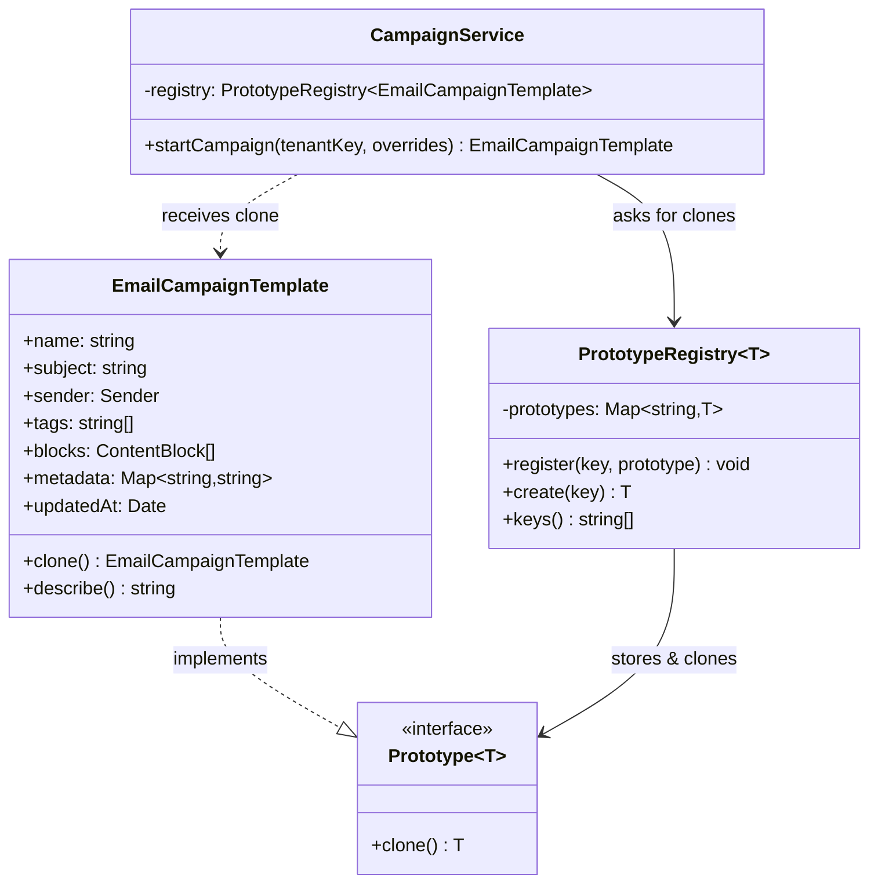
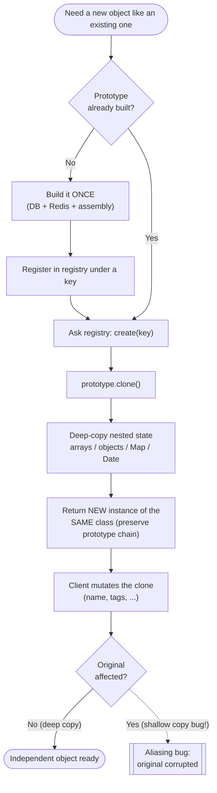

# Prototype Pattern

## Intent

Create new objects by **cloning an existing, fully-configured instance** (the *prototype*) instead of constructing them from scratch, so that expensive or complicated setup is paid once and copied cheaply — without your code depending on the object's concrete class.

## Real Life Analogy

Think about how a bakery makes a hundred identical wedding cakes. The head baker does not re-invent the recipe, re-test the flavour balance, and re-design the decoration for every single cake. That first-time design work is slow and expensive. Instead, they perfect **one master cake** — the prototype — and then produce every subsequent cake as a *copy* of that master, changing only the couple's names piped on top.

Cloning the master is fast and reliable. The expensive thinking happened exactly once. And crucially, when you write "Alice & Bob" on one cake, it does not magically appear on all the others — each cake is a **separate** cake.

The Prototype pattern is this master cake for objects. You build one object correctly and completely, then stamp out independent copies of it, tweaking only the small parts that differ.

## Problem

### What engineering problem exists?

In real backend systems, some objects are **expensive or awkward to create**:

- A campaign/document/report template that must be assembled from several database rows, a Redis lookup for feature flags, and a set of brand defaults.
- A pre-warmed request context or configuration object that took real work to populate.
- A game/simulation entity, or a large in-memory data structure, that you need in *many near-identical copies* differing only slightly.

You often need **lots of objects that are almost the same** as a known-good template, differing only in a few fields. Rebuilding each one from first principles — re-running the DB queries, re-reading config, re-wiring defaults — is wasteful and error-prone.

There is a second, subtler problem: sometimes you want to copy an object **whose exact class you do not know at that point in the code**. You have a reference typed as some interface, and you just need "another one like this." Constructing it directly would force you to know and name its concrete class.

> **Term: Instantiation.** Creating a brand-new object, e.g. `new EmailCampaignTemplate(...)`. It runs the constructor and any setup logic every time.
>
> **Term: Cloning.** Producing a *copy* of an already-built object, reusing its current state, without re-running the expensive setup.

### Why is this problem difficult?

- **Expensive construction repeats.** If building the object touches the DB or network, doing it per-request adds latency and load exactly where you can least afford it.
- **You may not know the concrete class.** Code holding an interface reference cannot call the right `new X()` without a big `switch` on the type — which couples it to every class.
- **Copying by hand is fragile and leaks encapsulation.** Reading every field into a new object breaks the moment a field is `private`, and it silently rots when someone adds a new field and forgets to copy it.
- **Copying is deceptively hard to get *correct*.** The single biggest trap: a naive copy shares the *same nested objects* as the original (a **shallow copy**), so mutating the copy secretly corrupts the original.

### What happens if we ignore it?

- **Latency and cost.** Repeated expensive construction shows up as slow endpoints and needless DB/Redis traffic.
- **A parallel hierarchy of factories.** Without Prototype you often end up writing one factory (or subclass) per configuration variant, just to bake in different defaults — a maintenance burden that grows forever.
- **Aliasing bugs — the classic.** Two objects unintentionally share a nested array/object/`Map`. Editing "the copy" mutates "the original." These bugs are intermittent, hard to reproduce, and terrifying in production (imagine two tenants' campaigns sharing one `tags` array).

## Why Not Other Solutions?

**"Just call `new` with the right arguments every time."**
Fine when construction is cheap and the class is known. But when construction is expensive (DB/network/heavy assembly), you pay that cost on every creation. And if you only hold an interface reference, you cannot call the correct `new` without switching on the concrete type — recoupling your code to every class.

**"Write a Factory / subclass per variant."**
This is the alternative Prototype was explicitly designed to avoid. If you need a "newsletter template," a "promo template," and a "receipt template," the factory approach spawns three factory classes (or three subclasses) whose *only* difference is which defaults they bake in. That is a **parallel class hierarchy** that grows with every new variant. Prototype replaces all of them with *one* configured instance per variant that you clone.

> **Term: Parallel hierarchy.** When adding a variant of one class forces you to add a matching variant of another class (e.g. every `Shape` subclass needs a matching `ShapeFactory` subclass). It doubles your maintenance surface.

**"Copy fields by hand into a new object."**
Breaks on `private` fields (you cannot read them from outside). Rots silently: add a field, forget to copy it, get a half-populated object with no error. And it scatters copy logic across the codebase. The class itself should own the knowledge of how to copy itself — that is exactly what `clone()` is.

**"Use `JSON.parse(JSON.stringify(obj))` for a quick deep copy."**
Tempting, but **lossy and unsafe**: it silently drops functions and `undefined`, turns `Date` into a plain string, turns `Map`/`Set` into `{}`, and **throws** on circular references. It also returns a plain object — the copy is no longer an instance of your class, so `instanceof` fails and its methods are gone. Great for a throwaway snapshot of pure JSON data; wrong for cloning real domain objects.

**"Use `Object.assign` / spread `{...obj}`."**
This is a **shallow copy** — it copies top-level fields but *shares every nested reference*. The copy's `tags` array is literally the same array as the original's. Mutating one mutates both. This is the number-one Prototype bug.

**Tradeoff summary:** All the naive options either repeat expensive work, force a parallel factory hierarchy, break encapsulation, or produce subtly-shared (or type-stripped) copies. Prototype puts a correct, deep, type-preserving `clone()` inside the class that owns the data.

## Solution

The core idea: **give objects the ability to copy themselves, and create new objects by asking an existing one to `clone()`.**

You define a small `Prototype` interface with a single method, `clone()`. Each class that wants to be copyable implements `clone()` to return a **deep, independent copy of itself that is still an instance of the correct class**. Client code then creates new objects by calling `existing.clone()` rather than `new SomeClass(...)`.

The thinking behind it:

1. **Pay expensive setup once.** Build the fully-configured object a single time (the prototype). Every subsequent object is a cheap in-memory copy, not a fresh DB/network assembly.
2. **The object owns its own copy logic.** Only the class knows about its private fields and which nested structures need deep copying. So `clone()` lives *inside* the class, where that knowledge is.
3. **Decouple creation from concrete types.** Client code holding a `Prototype` reference can produce "another one like this" via `clone()` without naming or knowing the concrete class.
4. **Optionally, a registry.** Store named, pre-built prototypes in a **registry** (a `Map` of key → prototype). Clients ask the registry for "a fresh copy of `acme`," and it returns a clone. This centralises where prototypes are built and keeps the stored master safe from mutation.

You do **not** re-run construction logic per object. You do **not** copy fields from outside the class. You build once and clone.

## Architecture

The participants:

1. **Prototype (interface):** Declares the `clone()` method. This is the contract that says "I can copy myself." In our code it is `Prototype<T>` with `clone(): T`.

2. **ConcretePrototype:** A class that implements `clone()`. It knows how to produce a **deep, independent, correctly-typed** copy of itself, including deep-copying nested objects, arrays, `Map`s, and `Date`s. In our code this is `EmailCampaignTemplate`.

3. **Client:** Code that needs new objects. It creates them by calling `clone()` on a prototype (often via a registry), then applies small per-instance tweaks. It never re-runs the expensive construction. In our code this is `CampaignService`.

4. **Prototype Registry / Manager (optional):** A store of pre-built prototypes keyed by name. On request it returns a *clone* (never the stored master). In our code this is `PrototypeRegistry<T>`.

Responsibilities in one line each:
- **Prototype:** declares "I can copy myself" (`clone()`).
- **ConcretePrototype:** implements a correct deep, type-preserving copy.
- **Client:** builds new objects by cloning, then customises.
- **Registry:** holds named masters and hands out clones.

## Execution Flow

1. **At startup**, build a fully-configured prototype *once*. In production this is where you pay the expensive cost — read the brand row from PostgreSQL, feature flags from Redis, assemble default content blocks.
2. **Register** the prototype in the registry under a key (e.g. `"acme"`).
3. Later, a request arrives to create a new object (e.g. "start a new campaign").
4. The client asks the registry: `registry.create("acme")`.
5. The registry looks up the stored prototype and calls `prototype.clone()` on it.
6. `clone()` **deep-copies** all nested state (arrays, nested objects, `Map`, `Date`) and returns a **new instance of the same class**.
7. The registry returns that fresh clone to the client — the stored master is untouched.
8. The client **mutates the clone freely** (set the campaign name, push extra tags), knowing it shares nothing with the master or with any other clone.
9. Steps 3–8 repeat per request, each producing an independent object, with **no DB/network cost** on this hot path.

## Class Diagram



**How to read it:** `..|>` = *implements* — `EmailCampaignTemplate` implements the `Prototype` contract. `-->` = *holds a reference*. The `CampaignService` (Client) never calls `new EmailCampaignTemplate(...)` directly; it asks the `PrototypeRegistry`, which returns clones.

## Sequence Diagram

```mermaid
sequenceDiagram
    autonumber
    participant Root as Composition Root
    participant Reg as PrototypeRegistry
    participant P as EmailCampaignTemplate (prototype)
    participant Svc as CampaignService (Client)

    Note over Root,P: Startup — build the master ONCE (DB + Redis cost paid here)
    Root->>P: new EmailCampaignTemplate({...brand defaults...})
    Root->>Reg: register("acme", prototype)

    Note over Svc,P: Runtime — create a new campaign (pure memory, no DB)
    Svc->>Reg: create("acme")
    activate Reg
    Reg->>P: clone()
    activate P
    Note over P: deep-copy tags, blocks, metadata(Map), updatedAt(Date)<br/>return a NEW EmailCampaignTemplate
    P-->>Reg: fresh independent clone
    deactivate P
    Reg-->>Svc: clone
    deactivate Reg

    Note over Svc: mutate the clone safely
    Svc->>Svc: campaign.name = "Summer Sale"; campaign.tags.push("summer")
    Note over P: prototype is UNTOUCHED — clone shares nothing with it
```

**How to read it:** the expensive construction happens once at the top. Every runtime creation is just `clone()` — a deep copy in memory. Because the clone is deep and independent, the client mutating it (bottom) never affects the stored prototype.

## Flow Diagram



**Key idea:** the branch that matters is at the bottom. A correct **deep** `clone()` leads to an independent object. A **shallow** copy leads to the aliasing bug (dotted path) where mutating the clone corrupts the original.

## Implementation

The implementation strategy in TypeScript:

1. **Define a tiny `Prototype<T>` interface** with `clone(): T`. Using a generic return type keeps clones strongly typed as their concrete class.

2. **Implement `clone()` inside each concrete class.** Two non-negotiable responsibilities:
   - **Deep-copy all mutable nested state** so the clone shares nothing with the original.
   - **Preserve class identity** — return a real `new EmailCampaignTemplate(...)`, so `instanceof` holds and the clone still has its methods (including `clone()`).

3. **Choose the right deep-copy tool.** Use the modern built-in `structuredClone()` for the *data* — it correctly handles `Date`, `Map`, `Set`, typed arrays, and circular references. Then rebuild the class instance to restore the prototype chain (because `structuredClone` returns a plain object). Avoid `JSON.parse(JSON.stringify(...))` (lossy) and bare `Object.assign`/spread (shallow) for anything with nested state.

4. **Add a `PrototypeRegistry`** when you have several named masters. It stores prototypes and always returns clones, protecting the masters from mutation.

5. **Wire it at a composition root.** Build and register prototypes once at startup; hand the registry to the client via constructor injection.

We demonstrate this with a realistic scenario: a multi-tenant marketing platform that clones a pre-configured `EmailCampaignTemplate` for every new campaign, and we deliberately show the shallow-copy and JSON-copy failure modes side by side.

## Code Walkthrough

See [code.ts](code.ts) for the full runnable implementation. Here is what each part does and why it exists.

**`deepCopyData<T>()` (helper).**
A thin wrapper over `structuredClone()`. It exists to centralise the deep-copy decision and to document *why* we do not use `JSON.parse(JSON.stringify())` (lossy on `Date`/`Map`/functions, throws on cycles). It deep-copies *data* correctly but returns a plain object — so it is used *inside* `clone()`, which then rebuilds the class.

**`Prototype<T>` (Prototype interface).**
One method: `clone(): T`. This is the whole contract — "I can produce a copy of myself." The generic `T` lets `EmailCampaignTemplate.clone()` return `EmailCampaignTemplate`, not a vague `Prototype`, so callers stay type-safe.

**`Sender` / `ContentBlock` (nested value types).**
Deliberately chosen to include a **nested object** (`sender`), an **array of objects** (`blocks`), plus the class also holds a **`Map`** (`metadata`) and a **`Date`** (`updatedAt`). These are exactly the shapes that naive copies mishandle, so they make the deep-copy requirement concrete.

**`EmailCampaignTemplate` (ConcretePrototype).**
Holds the full campaign state and implements `clone()`. Its `clone()` deep-copies every reference-typed field via `deepCopyData` and feeds the results back through the constructor — restoring the class prototype so the copy is a genuine `EmailCampaignTemplate` that can itself be cloned again. This class exists to show a *correct* clone: deep AND type-preserving.

**`PrototypeRegistry<T>` (Registry).**
A `Map` of key → prototype. `register()` stores a master; `create(key)` returns `prototype.clone()` — never the master itself. It exists so clients can say "give me a fresh `acme`" without knowing how `acme` was built, and so the stored master is never accidentally mutated.

**`CampaignService` (Client).**
Depends only on the registry. `startCampaign()` clones the tenant's prototype, then applies the small per-campaign overrides (name, subject, extra tags). It never rebuilds brand defaults and never touches the DB on this path. It proves the payoff: cheap, independent objects created by cloning.

**`buildRegistry()` (Composition Root).**
Builds the fully-configured `acme` prototype once (imagine it assembled from DB rows + a Redis lookup) and registers it. This is the single place the expensive cost is paid.

**`demonstrateShallowVsDeep()` (teaching harness).**
Runs three copies side by side: a shallow `Object.assign` copy (which corrupts the original when you push to its shared `tags` array), a `JSON` round-trip (which loses the `Map`, turns the `Date` into a string, and is no longer an `instanceof` the class), and the proper `clone()` (deep, independent, class-preserving). This exists because seeing the failure modes once is what makes the lesson stick.

**Interactions.**
Composition root builds + registers a prototype once. At runtime the client asks the registry, the registry calls `clone()`, and the client customises the returned independent copy. To add a new tenant template you register another prototype — no new classes, no factory subclass.

## Advantages

- **Cheap creation of expensive objects.** Setup cost (DB/network/assembly) is paid once; every clone is a fast in-memory copy.
- **Avoids a parallel factory/subclass hierarchy.** One configured instance per variant replaces one factory class per variant.
- **The class owns its copy logic.** `clone()` can access private fields and knows exactly which nested structures need deep copying — encapsulation preserved.
- **Decouples creation from concrete classes.** Code holding a `Prototype` reference can produce "another like this" without naming the class.
- **Add/remove configurations at runtime.** Registering a new prototype is data, not code — you can even build prototypes from user input.
- **Great for "known-good baseline + small diffs".** Templates, default configs, seed data, test fixtures.

## Disadvantages

- **Deep copying is hard to get right.** Nested objects, `Map`/`Set`/`Date`, and especially **circular references** all need care. A wrong `clone()` produces aliasing bugs.
- **Cloning cost is not zero.** A deep copy of a large object graph costs CPU and memory; for huge graphs it can be significant.
- **Every cloneable class must maintain its `clone()`.** Add a field and forget to copy it → a subtly incomplete clone with no compiler error.
- **Class-identity trap.** Built-in deep-copy tools (`structuredClone`, `JSON`) return plain objects; forgetting to rebuild the class breaks `instanceof` and loses methods.
- **Can hide real construction rules.** If an object has invariants normally enforced in its constructor, cloning around the constructor can bypass them.

## Tradeoffs

**What we gain:** fast creation of costly objects, freedom from a parallel factory hierarchy, encapsulated copy logic, runtime-configurable object creation, and a clean way to say "another one like this."

**What we lose:** simplicity and safety of plain `new`. We take on the ongoing responsibility of a *correct* deep-copy implementation per class, we pay a (usually small) copy cost, and we risk silent incompleteness if `clone()` drifts from the class's fields. The pattern's entire value hinges on `clone()` being correct — a buggy clone is worse than no pattern, because the aliasing bugs it causes are intermittent and hard to trace.

## Complexity

**Code Complexity:** Low for the pattern skeleton (one method), but the deep-copy logic can be moderate to high depending on how nested/cyclic the object graph is.

**Maintenance Complexity:** Moderate. Every new field on a cloneable class must be reflected in `clone()`. This coupling is easy to forget; a test that clones and deep-compares helps.

**Scalability:** Excellent on the creation hot path — cloning avoids repeated DB/network work, which is often the real bottleneck. Watch memory if you keep many large clones alive at once.

**Flexibility:** High. Prototypes are data; you can register, replace, and compose them at runtime, even from user-provided configuration.

**Testability:** High. Prototypes make excellent, isolated test fixtures — clone a known-good baseline per test so tests never share mutable state. Testing `clone()` itself (mutate the clone, assert the original is unchanged) is straightforward.

## Performance Considerations

**Memory:** Each clone is a full independent copy of the object graph — deep copies use more memory than shared references. For large graphs cloned at high volume, this can add up; measure before assuming it is free.

**CPU:** A deep copy walks the entire object graph. `structuredClone` is implemented natively and is fast, but O(size of graph). Cloning a huge nested structure per request can become a hot spot.

**Network:** The whole point is to *remove* network/DB work from the creation path — build the prototype once (paying the network cost then), clone in memory afterwards. This is where Prototype earns its keep in backend systems.

**Database:** Same as network: assemble the prototype from DB rows once at startup or on first use (optionally cache it in Redis), then serve every subsequent object as a clone with zero further queries.

**Object creation:** Cloning skips constructor-side expensive work (validation against external systems, default lookups). Confirm your `clone()` does not accidentally re-trigger that work.

**Runtime:** For most backend workloads the deep-copy cost is negligible next to the I/O it replaces. The exception is large object graphs or extreme throughput — profile those. Consider **copy-on-write** or shallow-share-immutable-parts if deep copies dominate.

## Common Mistakes

- **Shallow copy mistaken for a clone.** Using `Object.assign(new X(), src)` or `{...src}` copies top-level fields but *shares* nested arrays/objects. Mutating the clone corrupts the original. *Why it happens:* spread/assign look like "copy." *Avoid:* deep-copy every reference-typed field.

- **`JSON.parse(JSON.stringify(obj))` for real domain objects.** Silently drops functions/`undefined`, stringifies `Date`, empties `Map`/`Set`, throws on cycles, and returns a non-`instanceof` plain object. *Why:* it is the famous one-liner. *Avoid:* use `structuredClone` for data and rebuild the class; reserve the JSON trick for pure-JSON snapshots.

- **Losing class identity.** Returning the raw result of `structuredClone`/`JSON` means the clone is a plain object — `instanceof` fails, methods are gone. *Why:* those tools do not restore prototypes. *Avoid:* construct a real instance in `clone()`.

- **Forgetting a field in `clone()`.** Add a field, forget to copy it → incomplete clone, no error. *Why:* `clone()` is decoupled from the field list. *Avoid:* a clone-then-deep-compare test; or drive `clone()` off a single serialised state object.

- **Circular references crash the clone.** A hand-rolled recursive deep copy, or `JSON`, blows up on cycles. *Why:* naive recursion never terminates. *Avoid:* use `structuredClone` (handles cycles) or track visited nodes.

- **Cloning bypasses constructor invariants.** If the constructor enforces rules, cloning around it can create invalid objects. *Avoid:* route clone data back through the constructor (as our example does).

- **Confusing JavaScript's prototypes with the Prototype pattern.** See below — same name, different thing.

## When To Use

- **Object creation is expensive** (DB/network/heavy assembly) and you need many objects that are mostly the same.
- You need **many near-identical objects** differing in a few fields (templates, seed/default configs, test fixtures, game/simulation entities).
- You want to **avoid a factory/subclass explosion** whose only difference is baked-in defaults.
- You must create objects **without knowing their concrete class** at that point (you hold an interface reference and just need "another like this").
- You want **runtime-configurable creation** — register/replace prototypes as data, even from user input.
- You need a **known-good baseline** to copy and tweak (e.g. a default document/invoice/campaign template).

## When NOT To Use

- **Construction is already cheap and the class is known.** Plain `new X(...)` is simpler and clearer — do not add cloning ceremony.
- **Objects are immutable or effectively stateless.** If they never change, share one instance instead of copying (cloning immutable data is wasted work).
- **The object graph is huge and cloned at high volume**, and deep-copy cost outweighs the construction it replaces — profile; consider copy-on-write or structural sharing.
- **You need step-by-step assembly with many optional parts** — that is Builder's job.
- **You need a *family* of related objects created together** — that is Abstract Factory.
- **You are only snapshotting state to restore later** — that is Memento (encapsulated snapshot), not Prototype (a live, independent new object).

## Real Production Examples

- **Node.js:** `structuredClone()` is now a global — the standard deep-copy primitive underneath many clone implementations. Object pooling / pre-warmed context objects that get copied per request use the same idea.
- **NestJS:** Custom providers with factory functions often clone a base configuration for per-request or per-module setup. Testing modules clone a base `TestingModule` config to isolate test state.
- **Express:** Middleware that clones a base request/response context or a default options object before per-request mutation, so requests never share mutable config.
- **Java Spring:** Bean scope `prototype` returns a **new instance per lookup**. `Object.clone()` and the `Cloneable` interface are the language-level embodiment of this pattern (with the same shallow-copy caveat).
- **.NET:** `ICloneable.Clone()` is the framework's Prototype hook; `MemberwiseClone()` performs a shallow copy that developers deepen manually.
- **AWS:** Infrastructure templates cloned and parameterised (e.g. a base CloudFormation/CDK construct copied and tweaked per environment). Launch templates cloned to spin up near-identical resources.
- **Azure / Google Cloud:** ARM/Bicep and Deployment Manager templates copied and parameterised per environment — clone-and-tweak of a known-good baseline.
- **React (if applicable):** Immutable state updates clone-then-modify (`{...state, x}`) — a deliberately *shallow* clone at each level, which is the copy-on-write cousin of Prototype. `structuredClone` is used for deep form/state snapshots.
- **Databases:** Seed/fixture data cloned from a template row; ORMs producing detached copies of entities; "duplicate this record" features (clone an invoice/order and let the user edit).
- **AI Systems:** Cloning a base prompt/agent configuration and tweaking parameters per request; copying a pre-built conversation/context object so parallel runs do not share mutable history.

## Where I Can Use This

Five realistic ideas for your own backend projects:

1. **Document/invoice templates.** Build a default invoice per tenant (logo, tax rate, legal footer) once; clone it for each new invoice and fill in the customer-specific parts — no per-invoice DB assembly.
2. **Notification/email campaign templates.** Exactly the `code.ts` example: a `PrototypeRegistry` of brand templates, cloned per campaign.
3. **Test fixtures.** A `makeUser()` prototype cloned per test so tests get a known-good, isolated object and never share mutable state (kills flaky cross-test contamination).
4. **Default configuration objects.** A base service/feature config assembled from env + Redis flags once at startup, cloned and lightly overridden per request or per tenant.
5. **"Duplicate this" features.** Let users clone an existing entity (a workflow, a dashboard, a saved report) as the starting point for a new one — clone the domain object, reset its id/timestamps, and hand it back.

## Similar Patterns

- **Factory Method / Abstract Factory:** Both *construct fresh* objects (via `new`), choosing which class to instantiate. Prototype *copies an existing* configured instance. Use a factory when you want to hide *which class* to build; use Prototype when building is expensive or you want "another like this one."
- **Builder:** Assembles a complex object *step by step* through many method calls, useful when there are many optional parts and construction order matters. Prototype skips assembly entirely by copying a finished object. Builder = construct piece by piece; Prototype = duplicate a finished piece.
- **Memento:** Also captures object state, but to **snapshot and later restore** the *same* object (undo/redo). Prototype uses a copy to **spawn a new, independent** object. Memento's snapshot is usually opaque and internal; Prototype's clone is a first-class live object.
- **Singleton:** The opposite intent — ensure exactly *one* instance. Prototype is about producing *many* copies.

| Pattern          | How it creates             | Knows concrete class? | Best when                                   | Result                          |
|------------------|----------------------------|-----------------------|---------------------------------------------|---------------------------------|
| **Prototype**    | Copies an existing instance | No (clones itself)    | Creation is costly; need many near-copies   | New independent object          |
| Factory Method   | `new` in a subclass method  | Subclass decides      | Defer which class to instantiate            | New fresh object                |
| Abstract Factory | `new` across a family       | Yes (per family)      | Create related object families consistently | New fresh family of objects     |
| Builder          | Step-by-step assembly       | Yes                   | Many optional parts / complex construction  | New fresh, fully-assembled object |
| Memento          | Snapshot of state           | N/A                   | Undo/redo, save & restore same object       | Stored state to restore later   |

## Interview Discussion

Experienced engineers discuss Prototype less as "the `clone()` pattern" and more as **the deep-vs-shallow copy problem in disguise** — because that is where all the real bugs live. The interesting conversation is not "what is Prototype," but "how do you copy a complex object graph *correctly and efficiently* in a language with reference semantics."

Common follow-up questions:
- *"Shallow vs deep copy — what breaks?"* Shallow shares nested references; mutating the copy mutates the original. Deep copies everything; costs more CPU/memory. Know both and when each is acceptable.
- *"How do you deep-copy in modern JS?"* `structuredClone` (handles `Date`/`Map`/`Set`/cycles) for data; rebuild the class to keep identity. Know why `JSON.parse(JSON.stringify())` is lossy and unsafe.
- *"How do you preserve the class type when cloning?"* Construct a real instance in `clone()`; do not return the raw `structuredClone`/JSON result.
- *"Circular references?"* `structuredClone` handles them; a naive recursive copy or JSON does not.
- *"Isn't JavaScript already prototype-based?"* Yes — but that is the *language's inheritance mechanism* (`Object.create`, `[[Prototype]]`, the prototype chain). The GoF *Prototype pattern* is about a `clone()` method that copies an instance. Same word, different concept — a favourite trap.

Common misconceptions:
- "`{...obj}` clones the object." It shallow-copies one level; nested state is shared.
- "Prototype pattern = JS prototypes." No — language feature vs design pattern.
- "Cloning is always cheaper than constructing." Not for huge graphs — deep copy can be the more expensive operation.
- "Prototype and Memento are the same because both copy state." Different intent: new independent object vs restore the same object.

## Summary

- Prototype creates new objects by **cloning a configured instance** instead of constructing from scratch.
- It pays expensive setup **once** and produces cheap in-memory copies afterwards.
- It **avoids a parallel factory/subclass hierarchy** whose only difference is baked-in defaults.
- The class owns `clone()`, which must be **deep** (no shared nested references) and **class-preserving** (`instanceof` still holds).
- Use `structuredClone` for the data and rebuild the class; avoid shallow `Object.assign`/spread and the lossy `JSON` trick for real domain objects.
- A **PrototypeRegistry** stores named masters and always hands out clones.
- The number-one risk is **incorrect deep copying** (aliasing bugs); the number-one confusion is with **JavaScript's own prototype mechanism**.

## Key Takeaways

1. Prototype = build one good object, then create the rest by cloning it.
2. Its purpose is cheap creation of expensive objects and avoiding factory/subclass explosions.
3. `clone()` lives inside the class because only the class knows its private fields and nested structures.
4. A correct clone must be **deep** (independent) and **type-preserving** (still an instance of the class).
5. `Object.assign`/spread are **shallow** — nested references are shared: the classic aliasing bug.
6. `JSON.parse(JSON.stringify())` is lossy (Date/Map/functions) and throws on cycles — do not use it for domain objects.
7. `structuredClone` is the modern deep-copy primitive; rebuild the class afterwards to keep identity.
8. A registry centralises where prototypes are built and protects masters by only returning clones.
9. Prototype (a `clone()` pattern) is NOT the same as JavaScript's prototype-based inheritance.
10. Distinguish it from Factory (construct fresh), Builder (step-by-step), and Memento (snapshot/restore).

---

## Further Reading

**Books**
- *Design Patterns: Elements of Reusable Object-Oriented Software* — Gamma, Helm, Johnson, Vlissides (the "Gang of Four"), the original Prototype definition.
- *Head First Design Patterns* — Freeman & Robson (approachable treatment of creational patterns).
- *Effective Java* — Joshua Bloch (Item on `clone()` and why copy constructors/factories are often better — essential nuance).
- *Refactoring* — Martin Fowler (state handling and duplication concerns behind cloning).

**Open Source Projects / GitHub Repositories**
- Node.js `structuredClone` (the platform deep-copy primitive) — https://nodejs.org/api/globals.html#structuredclone
- Lodash `cloneDeep` — a widely-used deep-copy implementation to study — https://github.com/lodash/lodash
- Spring Framework `prototype` bean scope — https://github.com/spring-projects/spring-framework

**Official Documentation**
- Refactoring.Guru — Prototype — https://refactoring.guru/design-patterns/prototype
- MDN — `structuredClone()` — https://developer.mozilla.org/en-US/docs/Web/API/structuredClone
- MDN — Object prototypes (the *language* feature, to contrast) — https://developer.mozilla.org/en-US/docs/Learn/JavaScript/Objects/Object_prototypes

**Blog Articles**
- Refactoring.Guru — Prototype in TypeScript — https://refactoring.guru/design-patterns/prototype/typescript/example
- "Deep copy vs shallow copy in JavaScript" (MDN glossary) — https://developer.mozilla.org/en-US/docs/Glossary/Deep_copy
