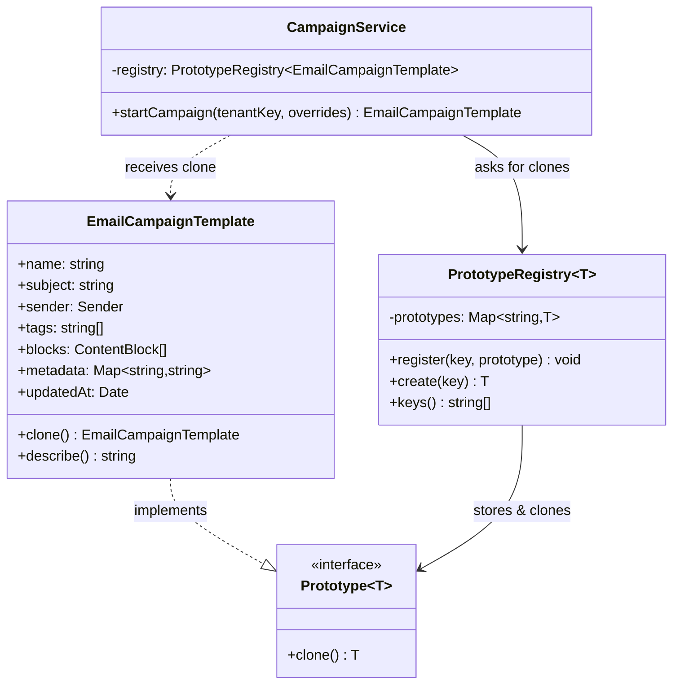

# Prototype Pattern — Class Diagram

Shows the four participants and their relationships. The `EmailCampaignTemplate`
(ConcretePrototype) *implements* the `Prototype` contract. The `PrototypeRegistry`
stores masters and hands out clones; the `CampaignService` (Client) creates new
objects only by cloning — never by calling `new` on the concrete class.

**How to read it**
- `..|>` (dashed, hollow triangle) = *implements interface* — `EmailCampaignTemplate` implements the `Prototype` contract.
- `-->` = *association / holds a reference*. The `PrototypeRegistry` holds prototypes; the `CampaignService` holds the registry.
- `..>` (dashed) = *depends on / uses* — the `CampaignService` receives a clone typed as `EmailCampaignTemplate`.
- The Client (`CampaignService`) never calls `new EmailCampaignTemplate(...)` directly; it asks the `PrototypeRegistry`, which returns clones. That is the whole point: creation is decoupled from the concrete class.
