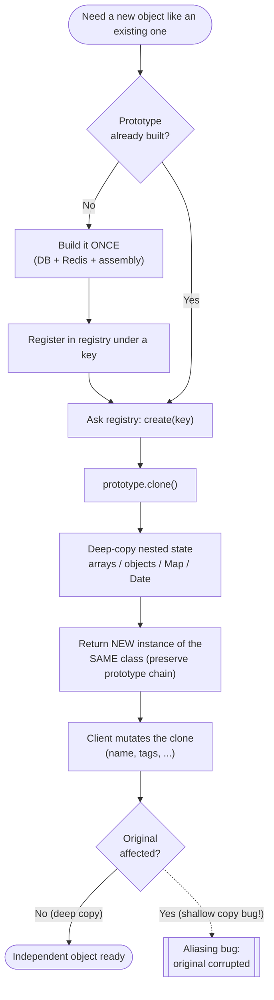

# Prototype Pattern — Flow Diagram

Step-by-step control flow of creating a new object from a prototype, plus the
deep-vs-shallow branch that decides whether you get an independent object or a bug.

**Key idea:** the branch that matters is at the bottom. A correct **deep** `clone()`
leads to an independent object (solid path). A **shallow** copy shares nested
references and leads to the aliasing bug (dotted path), where mutating the clone
silently corrupts the original. Everything above the branch — build once, register,
clone, preserve class identity — exists to make that deep, independent copy possible.
