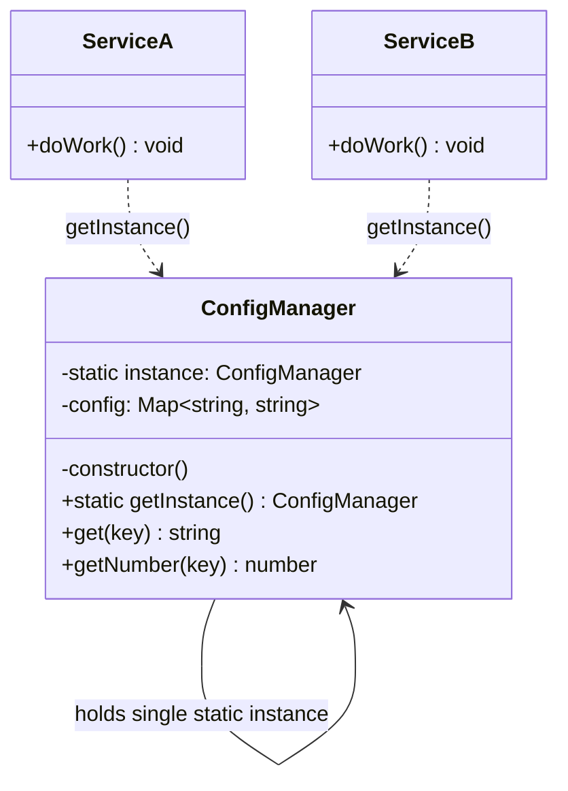
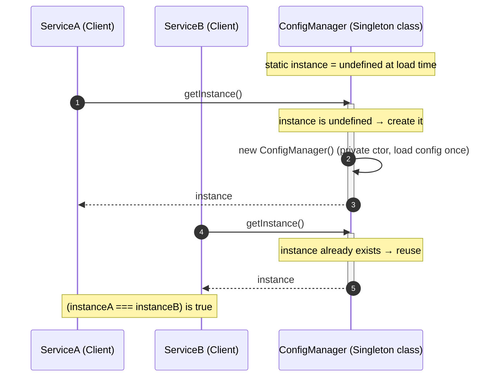
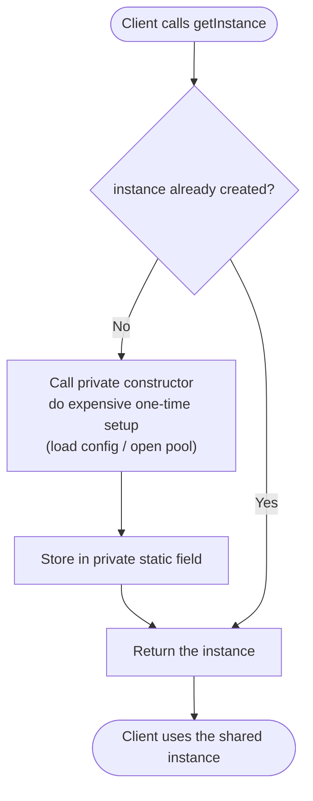

# Singleton Pattern

## Intent

Ensure a class has exactly **one** instance for the lifetime of a process, and provide a single, well-known point of access to that instance.

## Real Life Analogy

Think of the **government of a country**. There are many citizens, many officials, many buildings — but there is exactly *one* sitting government at any moment. Everyone refers to "the government" without ambiguity; there is no risk of two rival governments issuing contradictory laws at the same time. When you say "the government decided X," nobody asks *which* government you mean.

Another everyday one: the **printer spooler** in an office. Fifty people can send documents to print, but there is one spooler coordinating the queue. If every application spun up its own private spooler, they would fight over the same physical printer and the pages would interleave into garbage. One coordinator, shared by all, keeps order.

The Singleton is that single coordinator in code. Many parts of your program need it, they all reach for the *same* one, and the class itself guarantees a second one can never be created.

## Problem

### What engineering problem exists?

In a backend service, some resources are **inherently shared and expensive**, and having more than one of them is either wasteful or outright dangerous:

- A **database connection pool**. Opening a TCP connection to PostgreSQL, authenticating, and negotiating is expensive (tens of milliseconds). You want a *fixed pool* of, say, 10 connections shared by the whole process. If every request or every module created its own pool, you would blow past `max_connections` on the database and crash it.
- A **configuration object** loaded once from environment variables and secrets at startup. Every module needs the same config; re-reading and re-parsing it everywhere is wasteful and risks drift.
- A **logger** that writes to a file or ships to a log aggregator. You want one writer coordinating the output stream, not fifty writers interleaving lines.
- An **in-memory cache** or a **metrics registry** (Prometheus counters) that must accumulate state in one place.

> **Term: Instance.** In object-oriented programming, a *class* is a blueprint and an *instance* is a concrete object built from that blueprint with `new ClassName()`. Normally you can make as many instances as you like. The Singleton deliberately restricts a class to a single instance.

The problem: how do you guarantee that *everyone in the process shares the same object*, and that a second one can never accidentally be created?

### Why is this problem difficult?

- **`new` is available everywhere.** By default any file can write `new ConnectionPool()`. Nothing stops a teammate — or a future you at 2 a.m. — from creating a second pool by accident.
- **Modules load in unpredictable order.** In a large app you cannot easily guarantee "create the pool first, then hand it to everyone." Passing one object down through dozens of layers by hand (called *prop drilling* or manual threading) is tedious and error-prone.
- **You want lazy creation but only once.** Often you do not want to pay the startup cost until the resource is first needed, yet you must ensure that "first needed" happens exactly once even if two code paths ask for it nearly simultaneously.

> **Term: Global point of access.** A single, stable name that any part of the codebase can use to reach the shared object — e.g. `ConfigManager.getInstance()`. It is "global" in the sense of *reachable from anywhere*, which is both the pattern's convenience and its biggest danger.

### What happens if we ignore it?

- **Resource exhaustion.** Multiple connection pools open too many sockets; the database refuses new connections and the whole service goes down.
- **Inconsistent state.** Two config objects drift — one module thinks the feature flag is on, another thinks it is off, and you get bugs that only reproduce under specific load.
- **Wasted memory and CPU.** Re-parsing config, re-building caches, re-opening files repeatedly.
- **Interleaved / corrupted output.** Multiple loggers writing to the same file without coordination.

## Why Not Other Solutions?

**"Just use a plain global variable."**
`globalThis.pool = new Pool()` works until it does not. There is *nothing stopping* anyone from reassigning it, no lazy initialization, no encapsulation, and no guarantee it was ever created. Globals are also invisible dependencies: a function that secretly reads a global is impossible to understand or test in isolation. A Singleton at least *encapsulates* creation and access behind a class.

**"Pass the one object explicitly to everyone (manual dependency threading)."**
This is actually the *correct* instinct — it is the seed of Dependency Injection (see below). But doing it *by hand* through every constructor and function in a large codebase is painful: adding one new shared dependency means editing dozens of signatures. Teams give up and reach for a Singleton instead. The real fix is a **DI container** that automates the threading — not a global.

**"Make every method `static` so there is no instance at all."**
A class of only static methods (`Config.get('key')`) is essentially a Singleton with worse ergonomics: it cannot implement an interface, cannot be swapped for a fake in tests, and cannot hold cleanly-scoped state. It is the least testable option of all.

**"Create the object once in `main()` and hope everyone uses that copy."**
Discipline is not a mechanism. Nothing *enforces* singleness, so eventually someone creates a second one. If singleness matters, encode it in the type system or the container, not in a code-review convention.

**Tradeoff summary:** Every alternative either fails to *enforce* singleness, hides dependencies, or hurts testability. The classic Singleton enforces singleness but reintroduces global access (its own downside). The *modern* answer — a DI container that manages a single instance — keeps singleness **and** testability. That tension is the heart of this whole module.

## Solution

The classic idea has three moving parts:

1. **Make the constructor private.** If `constructor()` is `private`, no outside code can write `new ConnectionPool()`. Only the class itself can create an instance.
2. **Hold the one instance in a private static field.** `private static instance: ConnectionPool` belongs to the *class*, not to any object, so there is exactly one slot for it.
3. **Expose a public static accessor.** `static getInstance()` returns the existing instance, creating it on first call. Everyone calls `getInstance()`; nobody calls `new`.

> **Term: `static` member.** A field or method that belongs to the *class itself* rather than to individual instances. `ConnectionPool.getInstance()` is called on the class; you never need an object to call it. The single stored instance lives in a static field so all callers share it.

**Lazy vs eager initialization** — a key design choice:

- **Lazy:** create the instance the *first time* `getInstance()` is called. Saves startup cost if the resource might never be used; adds a tiny check on every access.
- **Eager:** create the instance immediately when the class is loaded (`private static instance = new ConnectionPool()`). Simpler, no first-call branch, but you pay the cost at startup whether or not you use it, and any error surfaces at import time.

The thinking behind it:

- **Singleness should be enforced by the mechanism, not by convention.** A private constructor makes a second instance a *compile error*, not a code-review comment.
- **Prefer to inject the single instance rather than reach for it globally.** The most important lesson: in modern backends (especially NestJS), you rarely write `getInstance()` yourself. You let the **DI container** create one instance and *inject* it wherever needed. You get "one instance" without the "global access" downside.

> **Term: Dependency Injection (DI).** Instead of a class fetching its own collaborators (`Config.getInstance()`), the collaborators are *handed to it* from outside, usually through its constructor. A **DI container** is a framework component that knows how to build each object and, by default, builds shared ones **once** and reuses them — effectively a managed Singleton that you can still replace with a fake in tests.

We will build the classic version first (so you understand the mechanism), then show the three ways this actually appears in Node/TypeScript — classic `getInstance()`, Node's module-cache singleton, and the NestJS DI-managed singleton — and argue strongly for the last one in production.

## Architecture

The classic Singleton has a deliberately small cast — the class plays every role itself:

1. **Singleton class:** the class being restricted to one instance (e.g. `ConfigManager`). It owns three things:
   - a **private constructor** so nobody outside can instantiate it;
   - a **private static field** holding the single instance;
   - a **public static `getInstance()`** method that returns (and lazily creates) that instance.

2. **Client(s):** any code that needs the shared object. Instead of `new ConfigManager()`, a client calls `ConfigManager.getInstance()`. Every client receives the identical object reference.

Responsibilities in one line each:
- **Singleton class:** guarantees only one instance exists and hands it out.
- **Client:** asks the class for the instance and uses it, never constructing its own.

In the **DI-managed** variant the cast shifts:
- **Provider class** (`@Injectable()` in NestJS): an ordinary class with a normal constructor — no private constructor, no static field.
- **DI container:** creates it **once** (default `singleton`/`DEFAULT` scope) and injects the same instance everywhere it is requested.
- **Consumers:** receive the instance through their constructor; they neither create it nor fetch it globally.

The DI container has *taken over* the "ensure one instance" responsibility, which is why the class itself no longer needs the Singleton machinery.

## Execution Flow

Classic lazy Singleton, step by step:

1. The class is loaded (imported). Its private static `instance` field starts as `undefined`. No instance exists yet.
2. Somewhere in the app, a client calls `ConfigManager.getInstance()` for the **first** time.
3. `getInstance()` checks the static field: is `instance` already set? It is not.
4. `getInstance()` calls the private constructor, builds the one instance (loads config, opens resources), and stores it in the static field.
5. `getInstance()` returns that instance to the client.
6. Later, another client (anywhere in the process) calls `ConfigManager.getInstance()` again.
7. This time the static field is already set, so the check short-circuits and the **same** instance is returned immediately — no new object is created.
8. Every subsequent call returns that identical reference. `a === b` is `true` for any two results of `getInstance()`.
9. When the process exits, the instance is garbage-collected along with everything else. (A Singleton lives for the whole process; there is no "destroy" in the classic pattern.)

Important consequence for step 9: the instance is **per-process**. A Node cluster with 4 workers, or a Kubernetes deployment with 3 pods, has **one Singleton per worker/pod** — *not* one shared across all of them. More on this misconception below.

## Class Diagram

**How to read it:** `ConfigManager` references *itself* (the static `instance` field), which is the visual signature of a Singleton. Both services depend on it via the static `getInstance()` accessor (dashed `..>` = "uses"), and both receive the identical object. The private constructor (leading `-`) is what makes `new ConfigManager()` illegal outside the class.

## Sequence Diagram

**How to read it:** the first `getInstance()` triggers construction (the expensive work happens exactly once). Every later call — from any client — skips construction and returns the already-built instance. The final note captures the guarantee: both clients hold the same reference.

## Flow Diagram

**Key idea:** the diamond is the whole pattern. On the very first call we take the left branch (create + store); on every subsequent call we take the right branch (reuse). The expensive setup box runs exactly once per process.

## Implementation

The strategy in TypeScript, in order of what production code should actually prefer:

1. **Classic `getInstance()` (learn the mechanism):** private constructor, private static field, public static accessor with a lazy `if (!instance)` check. Understand it because you will read it in existing code and interviews — but treat it as the *fallback*, not the default.

2. **Node module-cache singleton (idiomatic, lightweight):** Node caches every module the first time it is `require`d/`import`ed. So if a module does `export const config = new ConfigManager()` (or `export default new ConfigManager()`), **every importer gets the same instance for free** — the module system *is* the Singleton mechanism. No private constructor needed. This is the most common "singleton" in real Node code and is perfectly fine for stateless/config objects.

3. **NestJS DI-managed singleton (production default):** mark the class `@Injectable()`. Nest's default provider scope is `DEFAULT` (singleton): the container instantiates it **once per application** and injects the same instance everywhere. You get singleness *and* testability — in a test you provide a mock instead of the real one, with zero changes to consumers. **This is what you should reach for in a NestJS backend.**

> **Term: Module caching.** Node keeps a cache (`require.cache` for CommonJS; the ES module registry for ESM) keyed by the resolved file path. The first import executes the module and stores its exports; later imports return the cached exports without re-executing. That is why a top-level `new X()` runs exactly once.

The code file demonstrates all three, plus a realistic **`ConfigManager`** and a **`PgConnectionPool`** so you can see both a stateless-config Singleton (safe) and a resource-holding Singleton (needs care around lifecycle and tests).

## Code Walkthrough

See [code.ts](code.ts) for the full runnable implementation. Here is what each part does and why it exists.

**`ConfigManager` (classic lazy Singleton).**
It has a `private constructor()` that loads and validates configuration exactly once (reading `process.env`, applying defaults, coercing types). The `private static instance` field holds the one object. `static getInstance()` performs the lazy `if (!ConfigManager.instance)` check, creating on first call and reusing thereafter. Public methods (`get`, `getNumber`, `getBoolean`) are read-only accessors. It exists to show the canonical mechanism *and* to model a genuinely legitimate Singleton use: immutable, process-wide configuration.

**`PgConnectionPool` (resource-holding Singleton, with lifecycle).**
This models a database connection pool — the textbook justification for a Singleton, because you want exactly one pool per process. Beyond `getInstance()` it adds an `async query()` and a `close()` method. `close()` matters: resource Singletons need explicit shutdown (drain the pool on `SIGTERM`) — something the naive pattern forgets. It also demonstrates a `reset()` hook (test-only) so shared state does not leak between tests, directly addressing the pattern's biggest weakness.

**`configSingleton` (Node module-cache singleton).**
A single exported `const configSingleton = ConfigManager.getInstance()` — but the teaching point is the alternative `export default new SomethingSimple()` idiom: because the module is cached, every importer shares this object *without any Singleton boilerplate*. This is the idiomatic Node way for simple shared objects.

**`AppConfigService` (NestJS DI-managed singleton — the recommended path).**
An ordinary `@Injectable()` class with a *normal public constructor*. There is no static field and no `getInstance()`. A comment explains that Nest's default `DEFAULT` scope makes the container create it once and inject the same instance everywhere. A companion `createTestModule`-style snippet shows swapping it for a fake in tests — the thing classic Singletons make painful.

**`ReportService` (consumer).**
Depends on the config via constructor injection (`constructor(private readonly config: AppConfigService)`). It never calls `getInstance()` and never imports a global. This class exists to prove the payoff: it is trivially unit-testable because you hand it a fake config in tests.

**Interactions.**
Classic clients call `ConfigManager.getInstance()` and share the returned reference. The module-cache export is shared by every importer automatically. In the NestJS path, the container wires the single `AppConfigService` into `ReportService`. The `main()` demo asserts `getInstance() === getInstance()`, shows the pool serving queries, and shows graceful `close()` on shutdown — the full lifecycle a production Singleton needs.

## Advantages

- **Guaranteed single instance.** The private constructor makes a second instance impossible, protecting scarce resources (connection pools, file handles) from duplication.
- **Controlled, lazy initialization.** Expensive setup happens exactly once, and (in the lazy form) only when first needed.
- **Single source of truth for shared state.** Config, feature flags, caches, and metrics live in one authoritative place, avoiding drift.
- **Global reachability without a raw global.** Access is encapsulated behind a method, so creation logic and invariants are protected.
- **Saves resources.** One pool, one cache, one logger — less memory, fewer sockets, no repeated parsing.
- **(DI variant) singleness *and* testability.** A container-managed singleton keeps all the above while remaining swappable for a mock — the best of both worlds.

## Disadvantages

- **It is global mutable state.** Any code anywhere can reach in and change shared state, creating spooky action-at-a-distance bugs that are hard to trace.
- **Hidden dependencies.** A class that calls `Config.getInstance()` internally does not *declare* that it depends on config. Its constructor lies about what it needs, making the system harder to understand.
- **Hurts testability.** Tests share one instance, so state leaks between them; test order starts to matter; you cannot easily inject a fake. This is the number-one practical pain.
- **Tight coupling.** Callers are bound to a concrete class and its `getInstance()`, not to an interface — violating the Dependency Inversion Principle.
- **Concurrency edge cases in other runtimes.** In multi-threaded languages the lazy check needs locking (double-checked locking). Node's single-threaded event loop mostly saves you here, but `async` initialization can still race (two callers awaiting first-time async setup).
- **Lifecycle is awkward.** The classic pattern has no clean shutdown; resource Singletons need a bolted-on `close()`.
- **Per-process, not per-cluster.** Developers wrongly assume it is shared across workers/pods (see Common Mistakes).

## Tradeoffs

**What we gain:** a guaranteed single instance, one-time lazy initialization, a single source of truth for shared resources, and reduced resource usage.

**What we lose:** the classic form trades away testability, explicit dependencies, and loose coupling — it smuggles global state back into a codebase that OOP was trying to tame. That is why Singleton is frequently called an **anti-pattern**: not because "one instance" is bad, but because the *classic global-access mechanism* is bad.

The resolution most senior engineers reach: **keep the goal (one instance), drop the mechanism (global `getInstance()`), and let a DI container own the singleton.** You then pay a little framework ceremony in exchange for testability and explicit dependencies — almost always the right trade in a production backend.

> **Term: Anti-pattern.** A solution that looks helpful and is widely used but tends to cause more problems than it solves. Singleton earns the label when used as a global-access shortcut; it is legitimate when it genuinely models a single shared resource *and* is injected rather than globally fetched.

## Complexity

**Code Complexity:** Very low. A handful of lines (private ctor, static field, accessor). The DI variant is even simpler at the class level — just `@Injectable()`.

**Maintenance Complexity:** Deceptively high for the classic form. Because dependencies are hidden and state is global, changes ripple in non-obvious ways and bugs are hard to localize. The DI-managed form is low-maintenance because dependencies are explicit.

**Scalability:** The pattern is orthogonal to horizontal scaling. A Singleton is per-process, so scaling out to more pods gives you more Singletons, not a shared one. For truly shared cross-process state you need an external store (Redis, the database) — a Singleton cannot provide it.

**Flexibility:** Low in the classic form (coupled to a concrete class, cannot swap implementations). High in the DI form (swap the provider, mock in tests, change scope).

**Testability:** Poor in the classic form (shared state leaks; hard to inject fakes; often needs a `reset()` escape hatch). Excellent in the DI form (inject a mock per test).

## Performance Considerations

**Memory:** One instance instead of many — usually a *win*. The risk is the opposite: a Singleton that accumulates unbounded state (an ever-growing in-memory cache or log array) becomes a permanent memory leak, because it is never garbage-collected while the process lives.

**CPU:** The lazy `if (!instance)` check is a single branch — negligible. One-time construction cost is paid once. No per-call overhead beyond the branch.

**Network:** Not directly affected — but a connection-pool Singleton *controls* network resources. Sizing the pool wrong (too small → queueing; too large → exhausting DB connections) is a real performance lever hidden inside the Singleton.

**Database:** The classic use case. One pool with a bounded connection count protects PostgreSQL from connection storms. Remember the pool is per-process: 4 pods × 10 connections = 40 real DB connections. Size pools with total pod count in mind so you stay under `max_connections`.

**Object creation:** Essentially free after the first call — that is the point. Contrast with accidentally creating a new pool per request, which would be catastrophic.

**Runtime:** In Node's single-threaded model there is no locking cost for the sync lazy check. The subtle cost is **async initialization races**: if `getInstance()` returns a promise for first-time setup and two callers hit it simultaneously, you can start the setup twice. Guard by caching the *promise*, not just the result.

## Common Mistakes

- **Assuming a Singleton is shared across cluster workers / pods.** It is **per-process**. With Node `cluster`, PM2 in cluster mode, or multiple Kubernetes replicas, each process has its own instance. In-memory Singleton state (rate-limit counters, sessions, caches) is *not* consistent across them. *Why it happens:* "singleton" sounds global. *Avoid:* for truly shared state use **Redis** or the database; keep the Singleton for per-process resources like the local pool.

- **Using Singleton as a dumping ground for global mutable state.** A `GlobalState.getInstance()` that everyone reads and writes recreates all the problems of global variables. *Why:* it is convenient. *Avoid:* keep Singletons small and ideally immutable (config); model shared *mutable* domain state explicitly, and prefer DI.

- **Calling `getInstance()` deep inside business logic.** This hides the dependency and destroys unit-testability. *Why:* no need to plumb it through constructors. *Avoid:* inject the dependency (DI) so the class *declares* what it needs.

- **Forgetting shutdown/cleanup.** Resource Singletons (pools, file streams) leak connections if never closed. *Why:* the classic pattern has no destroy step. *Avoid:* add `close()` and call it on `SIGTERM`/`SIGINT`.

- **State leaking between tests.** Because the instance persists across test cases, one test's mutations poison the next. *Why:* the static field survives the whole test run. *Avoid:* prefer DI (fresh instance per test module), or expose a `reset()` for test setup — a smell that itself argues for DI.

- **Async init race.** Two callers trigger first-time async construction simultaneously and you initialize twice (e.g. open two pools). *Avoid:* cache the initialization *promise* so concurrent callers await the same one.

- **Making everything a Singleton "to be safe."** Stateless services do not need it; over-using Singletons couples your whole app to concrete classes. *Avoid:* default to normal DI-scoped providers; reserve Singleton semantics for genuinely single resources.

## When To Use

- **Database connection pools / clients** — one bounded pool per process (`pg.Pool`, the MongoDB driver, an ORM `DataSource`).
- **Application configuration** loaded once at startup — immutable, read everywhere.
- **Loggers** — a single writer coordinating output to a file or aggregator.
- **In-process caches / metrics registries** — one place to accumulate counters or cached values within a process.
- **Clients to external services** that are expensive to construct and safe to share (a configured HTTP client, an SDK client, a Redis client instance).
- **Anywhere you already use a DI container** and want a shared instance — this is the normal, healthy case (NestJS default scope).

## When NOT To Use

- **For per-request or per-user state.** Request context, the current user, a transaction — these must *not* be Singletons; use request-scoped providers or pass them explicitly. A Singleton holding request state is a serious data-leak bug across concurrent requests.
- **For state that must be shared across processes/pods.** A Singleton cannot do this; use Redis or the database.
- **Just to get "global access" to something.** If the real need is "reach this object from anywhere," that is a design smell — inject it instead.
- **For stateless helpers.** Pure functions or plain modules are simpler; no instance control needed.
- **When it makes testing hard and DI is available.** In NestJS/most modern setups, a DI-scoped provider gives you the single instance without the downsides — prefer it.
- **When you find yourself adding `reset()` just for tests.** That is the pattern telling you it wants to be injected.

## Real Production Examples

- **Node.js:** `require`/import module caching makes any top-level `new X()` a de-facto Singleton. The built-in `process` object and a single `pg.Pool` shared across a service are common examples.
- **NestJS:** Providers are **singletons by default** (`DEFAULT`/`Scope.DEFAULT`). `ConfigService`, `TypeOrmModule`'s `DataSource`, and most `@Injectable()` services are one-per-application instances managed by the container — Singleton done the testable way.
- **Express:** The `app` instance is typically a single shared object; database clients and config modules are exported once and reused via module caching.
- **Java Spring:** The default bean scope is **singleton** — the `ApplicationContext` creates one bean instance per container. This is the archetypal DI-managed Singleton.
- **.NET:** `services.AddSingleton<T>()` in the built-in DI container registers a single instance for the app's lifetime (contrast with `AddScoped`/`AddTransient`).
- **AWS:** SDK best practice is to **reuse a single client** (e.g. one `DynamoDBClient`) across invocations; in Lambda, clients created outside the handler persist across warm invocations — a container-lifetime Singleton.
- **Azure:** Guidance to use a **single `HttpClient`/`CosmosClient`** per app to avoid socket exhaustion — a Singleton in all but name.
- **Google Cloud:** `@google-cloud/*` clients are meant to be instantiated once and shared.
- **React (if applicable):** A Redux store or a React Context provider often holds a single shared instance at the app root — same "one instance, many consumers" idea, injected via context rather than fetched globally.
- **Databases:** ORMs expose a single `DataSource`/`Prisma` client; connection pools (`pg.Pool`, HikariCP in Java) are single-per-process by design.
- **AI Systems:** A single configured LLM client (one `Anthropic` client with pooled connections and shared rate-limit accounting) reused across requests, rather than constructing a new client per call.

## Where I Can Use This

Five realistic ideas for your own backend projects:

1. **`ConfigService` (NestJS):** load and validate env/secret config once at startup; inject it everywhere as a singleton provider. Never re-read `process.env` scattered across files.
2. **`PgPoolProvider`:** wrap a single `pg.Pool` as an injectable singleton with a `onModuleDestroy()` that drains the pool on shutdown — correct lifecycle out of the box.
3. **`RedisClientProvider`:** one shared `ioredis` client injected app-wide; use it (not an in-memory Singleton) for anything that must be consistent across pods, like rate-limit counters.
4. **`Logger`:** a single structured logger (pino/winston) shared across the app, coordinating output and enriching every line with request context via async local storage.
5. **`MetricsRegistry`:** one Prometheus registry accumulating counters/histograms per process, scraped by your metrics endpoint — a legitimate per-process Singleton.

## Similar Patterns

- **Factory / Factory Method:** *creates* objects, potentially many, hiding construction details. Singleton *restricts* creation to one. A Factory can even be implemented to always return the same instance — blurring into Singleton. Intent differs: Factory is about *how* you create; Singleton is about *how many*.
- **Monostate (Borg):** every instance shares the same *state* via static fields, so you can `new` it freely but all copies behave as one. Same effect (shared state), different mechanism (many instances, one state) — sometimes easier to test but more surprising to readers.
- **DI-container-managed singleton:** the container guarantees one instance and injects it. Same "one instance" guarantee, but access is *injected* not *global*, restoring testability. This is the modern replacement for classic Singleton.
- **Multiton:** a keyed registry of singletons — one instance *per key* (e.g. one pool per tenant/region). A generalization of Singleton.
- **Object Pool:** manages a *fixed set* of reusable instances (like a connection pool's connections). The *pool itself* is often a Singleton, but it hands out many pooled objects.

| Pattern | How many instances? | Access style | Primary intent | Testability |
|---------|--------------------|--------------|----------------|-------------|
| Singleton (classic) | Exactly one | Global `getInstance()` | Enforce single instance | Poor |
| DI-managed singleton | Exactly one (per container) | Injected | Single instance, cleanly wired | Excellent |
| Factory | Many | Called to create | Encapsulate creation | Good |
| Monostate | Many objects, one state | Normal `new` | Shared state, transparent | Medium |
| Multiton | One per key | Global registry | Keyed singletons | Poor–Medium |
| Object Pool | Fixed set, reused | Borrow/return | Reuse expensive objects | Medium |

## Interview Discussion

Experienced engineers do not debate *how* to write `getInstance()` — that is trivial. They debate **whether you should**, and they expect you to reach the nuanced answer: "one instance" is a legitimate need, but the classic global-access mechanism is an anti-pattern, and in a modern stack you satisfy the need with a **DI-managed singleton** instead.

Common follow-up questions:
- *"Why is Singleton considered an anti-pattern?"* Because it is global mutable state with hidden dependencies that hurt testability — not because one instance is inherently bad.
- *"How does DI solve those problems?"* The container guarantees one instance while access is injected, so you can substitute a mock and dependencies are explicit in the constructor.
- *"Is a Node module-level `export default new X()` a Singleton?"* Yes — module caching makes it one per process. Fine for stateless/config objects; risky for mutable state and hard to mock.
- *"Is a Singleton shared across your Kubernetes pods?"* No — it is per-process. Cross-process shared state needs Redis or the DB. This question separates people who have run things in production from those who have not.
- *"Lazy vs eager, and thread safety?"* Lazy defers cost but needs a first-call guard; in multi-threaded languages the guard needs locking (double-checked locking). Node's single thread avoids sync races but not *async* init races.
- *"How do you handle shutdown?"* Add explicit `close()`/`onModuleDestroy()` and hook `SIGTERM` to drain resources.

Common misconceptions:
- "Singleton means thread-safe." It does not; you must make it so where threads exist.
- "Singleton state is global to the whole cluster." It is per-process.
- "Static-method utility classes are cleaner than a Singleton." They are the *least* testable variant.
- "Singleton and global variable are the same." The Singleton at least encapsulates creation; the *better* distinction is Singleton-via-DI, which is neither global nor a raw variable.

## Summary

- Singleton ensures exactly **one instance** per process and gives a global access point to it.
- Classic mechanism: **private constructor + private static field + public static `getInstance()`**, with lazy or eager initialization.
- In Node, **module caching** already makes `export default new X()` a de-facto Singleton.
- The classic global-access form is widely considered an **anti-pattern**: global mutable state, hidden dependencies, poor testability.
- The modern, production answer is a **DI-managed singleton** (NestJS default scope, Spring default bean scope): one instance, injected, testable.
- A Singleton is **per-process**, not per-cluster — use Redis/DB for truly shared state.
- Legitimate uses: config, connection pools, loggers, metrics — ideally injected, with explicit lifecycle/shutdown.

## Key Takeaways

1. Singleton = one instance for the whole process + a single point of access to it.
2. The mechanism is private constructor + static field + `getInstance()`; choose lazy or eager init.
3. Node's module cache makes an exported instance a de-facto singleton with no boilerplate.
4. Prefer **DI-managed singletons** (NestJS/Spring default scope) — same guarantee, far better testability.
5. The classic form is an anti-pattern when used as a global: hidden deps, shared mutable state, brittle tests.
6. Legitimate targets: stateless config, connection pools, loggers, metrics registries.
7. A Singleton is **per-process** — not shared across cluster workers or pods; use Redis/DB for that.
8. Give resource Singletons an explicit `close()`/shutdown; they have no lifecycle otherwise.
9. Watch for async initialization races — cache the promise, not just the result.
10. If you need a `reset()` only to make tests pass, that is the pattern begging to be injected.

---

## Further Reading

**Books**
- *Design Patterns: Elements of Reusable Object-Oriented Software* — Gamma, Helm, Johnson, Vlissides (the "Gang of Four"), the original Singleton definition.
- *Head First Design Patterns* — Freeman & Robson (approachable Singleton chapter, including thread-safety discussion).
- *Dependency Injection Principles, Practices, and Patterns* — Mark Seemann & Steven van Deursen (why DI-managed singletons beat classic ones).
- *Clean Code* / *Clean Architecture* — Robert C. Martin (dependency inversion, why global state hurts).
- *Effective Java* — Joshua Bloch (enum-based Singleton and its guarantees, for the JVM perspective).

**Open Source Projects / GitHub Repositories**
- NestJS injector / provider scopes — https://github.com/nestjs/nest
- `node-postgres` (`pg.Pool`, the canonical shared pool) — https://github.com/brianc/node-postgres
- `ioredis` (single shared Redis client) — https://github.com/redis/ioredis

**Official Documentation**
- Refactoring.Guru — Singleton — https://refactoring.guru/design-patterns/singleton
- NestJS Docs — Injection scopes — https://docs.nestjs.com/fundamentals/injection-scopes
- Node.js Docs — Modules and the module cache — https://nodejs.org/api/modules.html#caching
- Spring Framework — Bean scopes (singleton default) — https://docs.spring.io/spring-framework/reference/core/beans/factory-scopes.html

**Blog Articles**
- Refactoring.Guru — Singleton in TypeScript — https://refactoring.guru/design-patterns/singleton/typescript/example
- Martin Fowler — "Inversion of Control Containers and the Dependency Injection pattern" — https://martinfowler.com/articles/injection.html
- Miško Hevery — "Singletons are Pathological Liars" — http://misko.hevery.com/2008/08/17/singletons-are-pathological-liars/
