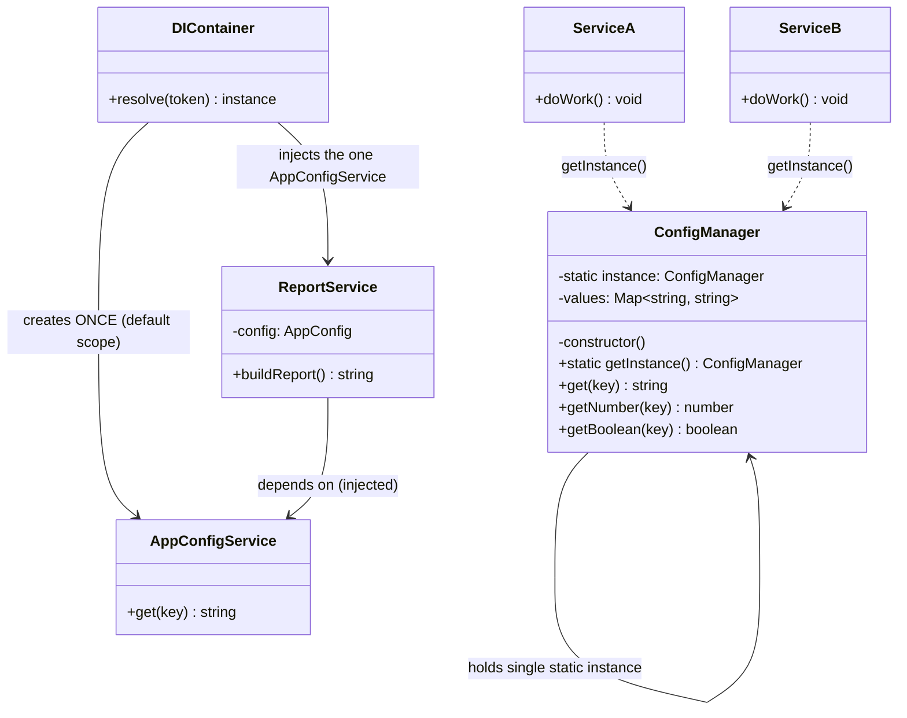

# Singleton Pattern — Class Diagram

Shows the classic Singleton structure and, for contrast, the DI-managed variant.
The Singleton class references *itself* (it holds its own single static instance) —
that self-reference is the visual signature of the pattern.

**How to read it**
- Top block = **classic Singleton**. `-constructor()` (private) blocks external `new`; `-static instance` is the single slot; `+static getInstance()` is the global accessor. `ServiceA`/`ServiceB` reach it via the dashed `..>` ("uses `getInstance()`").
- The `ConfigManager --> ConfigManager` self-association is the tell-tale sign: the class stores its own instance.
- Bottom block = **DI-managed singleton**. Note `AppConfigService` has **no** private ctor and **no** static field — it is a normal class. The **container** guarantees one instance and *injects* it into `ReportService`. Access is injected, not global, which is what restores testability.
