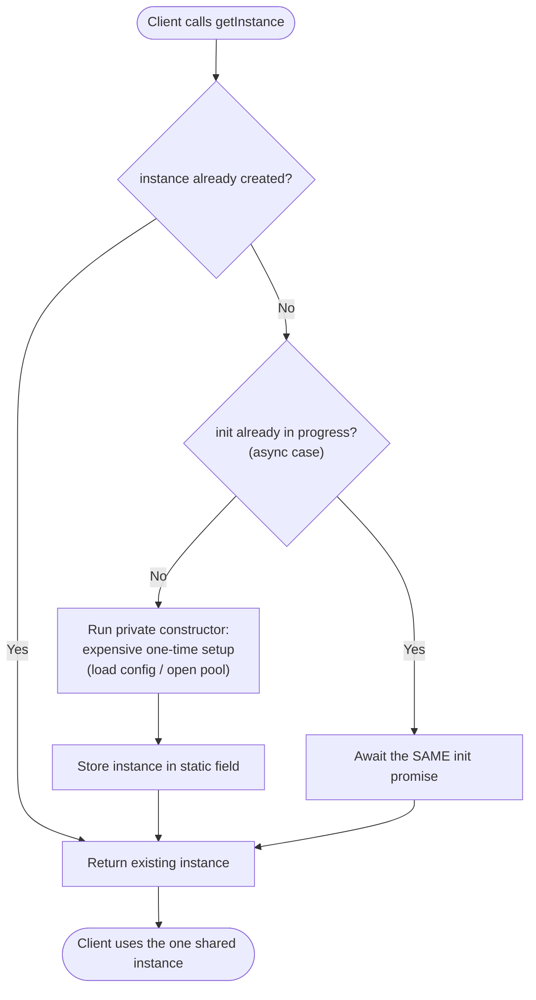

# Singleton Pattern — Flow Diagram

Control flow of a `getInstance()` call, including the lazy first-time branch and
the async-init race guard used by a resource-holding singleton (the pool).

**Key idea:** the first diamond is the core of the pattern (create-once vs reuse).
The second diamond is the production hardening for **async** initialization: by
caching the initialization *promise* (not just the resolved instance), two
concurrent first-time callers await the same setup and you never open two pools.
The expensive constructor box runs **exactly once per process** — remember, that
is per pod/worker, not per cluster.
