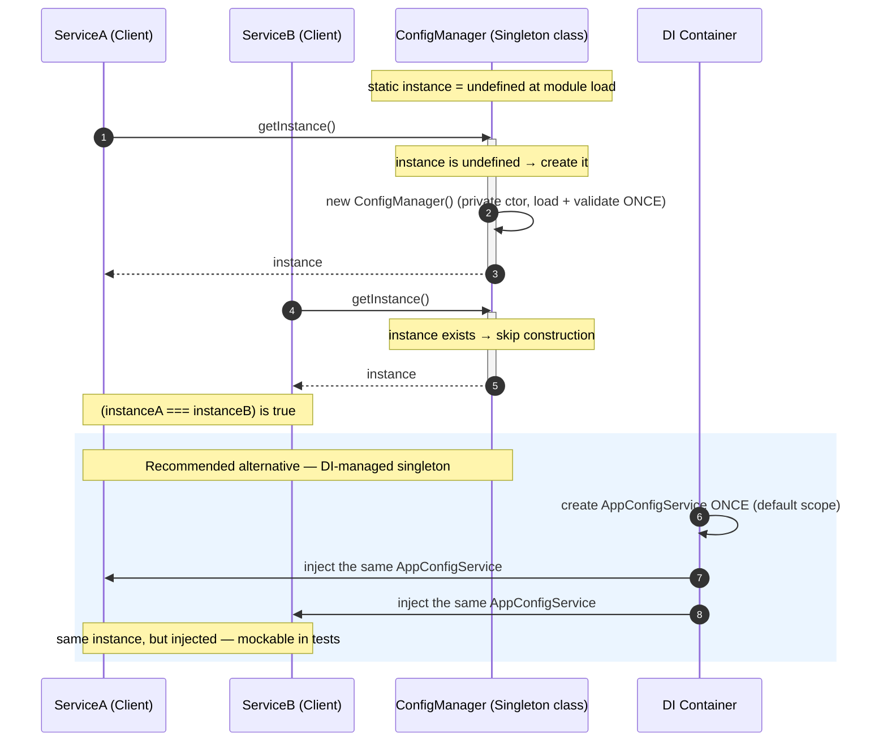

# Singleton Pattern — Sequence Diagram

Runtime message exchange showing that construction happens once and every later
lookup returns the same reference, plus the DI-managed alternative and the
per-process reality across pods.

**How to read it**
- The **first** `getInstance()` triggers the private constructor — the expensive load/validate runs exactly once.
- Every **later** call, from any client, skips construction and returns the already-built reference; the equality note captures the guarantee.
- The highlighted block shows the production-preferred path: the **DI container** creates one instance and *injects* it, so both services still share one object — but it can be replaced with a fake in tests, unlike the global `getInstance()`.
- Reality check (not drawn, but remember): run this in **3 pods** and you get **3** separate `ConfigManager` instances — one per process. Cross-process shared state belongs in Redis or the database.
