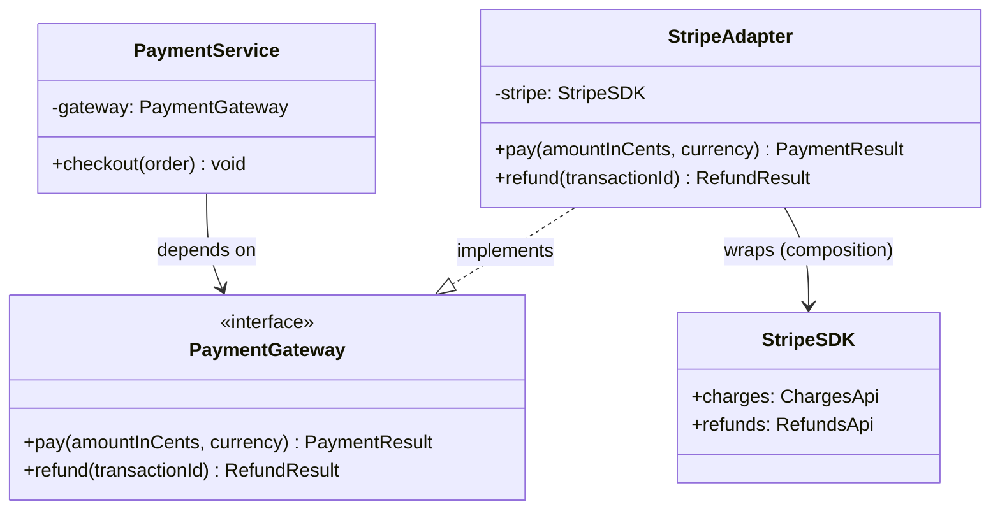
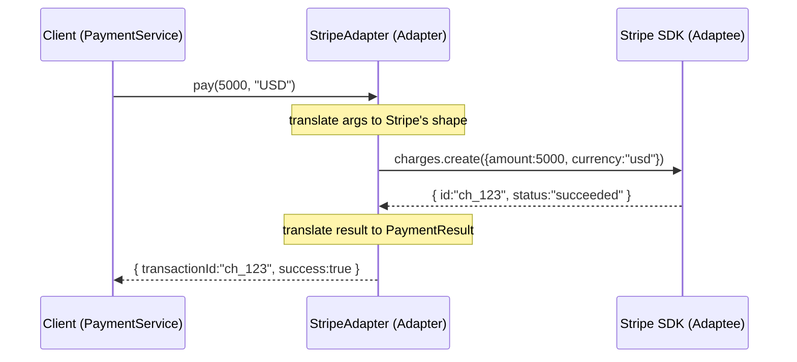
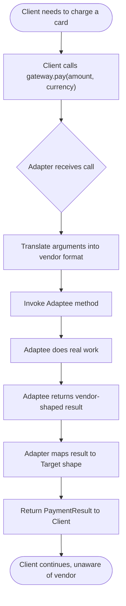

# Adapter Pattern

## Intent

Convert the interface of a class into another interface that a client expects, so that classes with incompatible interfaces can work together without changing their source code.

## Real Life Analogy

Imagine you travel from India to the United States with your laptop charger. Your charger has a round two-pin plug, but the wall socket in the US has flat pins. The electricity is the same underneath — it is just the *shape of the connection* that is incompatible.

You do not rewire your charger, and you certainly do not rewire the hotel wall. You buy a **travel plug adapter**. On one side it fits your Indian plug, on the other side it fits the US socket. It sits in the middle and translates one shape into another.

The Adapter Pattern is exactly this travel adapter, but for code. Your code (the charger) expects one interface. Some library or legacy class (the wall socket) offers a different interface. Instead of changing either side, you write a small object in the middle that translates between them.

## Problem

### What engineering problem exists?

In real backend systems you constantly integrate code you did not write and cannot change:

- A third-party payment SDK (Stripe, Razorpay, PayPal) each with its own method names and data shapes.
- A legacy module inside your own company that returns XML while your new service speaks JSON.
- An npm package whose function signature does not match the interface your application already depends on.
- A cloud SDK (AWS S3) whose API you want to hide behind your own `FileStorage` abstraction so you can later swap it for Google Cloud Storage.

Your application code was written against a specific interface — a *contract* it expects every collaborator to honor. When a new component does not honor that contract, the two cannot talk to each other directly.

> **Term: Interface / Contract.** An interface is the set of method names, their parameters, and their return types that a class promises to provide. Code that depends on an interface only cares about *what* methods exist, not *how* they are implemented. A "contract" is the informal name for this promise.

### Why is this problem difficult?

- **You often cannot change the incompatible class.** It lives in `node_modules`, or it is owned by another team, or it is compiled and shipped. Editing it is impossible or forbidden.
- **You should not change your client code either.** Your business logic already works and is tested. Rewriting it every time a new vendor appears is expensive and risky.
- **Naive integration leaks vendor details everywhere.** If you sprinkle `stripe.charges.create(...)` calls across 40 files, then switching to Razorpay means touching 40 files — and every one is a chance to introduce a bug.

### What happens if we ignore it?

- **Tight coupling to a vendor.** Your codebase becomes married to one library. Migration later can take months.
- **Duplicated translation logic.** The same "convert our request into their format" code gets copy-pasted in many places, and the copies drift apart.
- **Hard-to-test code.** Business logic that directly instantiates a concrete SDK cannot be unit-tested without hitting the real network or mocking deep internals.
- **Shotgun surgery.** A single vendor change forces edits scattered across the whole codebase — the opposite of maintainable design.

## Why Not Other Solutions?

**"Just edit the third-party class to match my interface."**
You usually cannot — it is in `node_modules` and will be overwritten on the next `npm install`. Even when you own the code, editing a widely-used class to please one caller breaks every other caller and violates the Open/Closed Principle.

**"Rewrite my client code to call the vendor directly everywhere."**
This couples your entire application to one vendor's API. It also duplicates the same low-level calls across many files, and makes swapping vendors a massive, error-prone migration.

**"Use inheritance — extend the vendor class."**
Sometimes viable (this is the *class adapter* variant), but JavaScript/TypeScript only allows single inheritance, and inheriting from a concrete vendor class inherits its bugs and its whole surface area. It also breaks if the vendor is `final`/sealed or is not a class at all (many SDKs export plain functions or objects). Composition (the *object adapter*) is more flexible and is the idiomatic choice.

**"Add a bunch of `if (vendor === 'stripe')` branches in the business logic."**
This is the worst option. Every new vendor grows the conditional, business logic gets tangled with integration details, and testing explodes combinatorially. The Adapter isolates each vendor into its own class instead.

**Tradeoff summary:** All alternatives either couple you to the vendor, duplicate translation logic, or force you to modify code you should leave alone. The Adapter localizes the translation into one small, replaceable, independently-testable class.

## Solution

The core idea: **introduce a translator object that sits between your client code and the incompatible class.**

Your client code depends only on a **Target interface** — the clean contract *you* designed and control. The incompatible class is called the **Adaptee**. You write an **Adapter** class that *implements the Target interface* and *internally holds a reference to the Adaptee*. Every time the client calls a Target method, the Adapter translates that call into one or more Adaptee calls, converts the data formats as needed, and translates the result back.

The thinking behind it:

1. **Depend on abstractions, not concretions.** Your business logic should never mention `Stripe` or `AWS` directly. It should mention `PaymentGateway` or `FileStorage` — interfaces you own.
2. **Isolate change.** All the knowledge about "how vendor X actually works" is confined to one adapter class. When the vendor changes, only that class changes.
3. **Make substitution trivial.** Because every adapter implements the same Target interface, you can inject any of them interchangeably (this is the Liskov Substitution Principle at work).

You do **not** modify the client. You do **not** modify the Adaptee. You add a new class between them.

## Architecture

There are four participants:

1. **Target (interface):** The interface your client expects and depends on. This is *your* contract, e.g. `PaymentGateway` with a method `pay(amountInCents, currency)`. It is the "shape" the rest of your system understands.

2. **Client:** Your application/business code. It holds a reference typed as the Target and calls Target methods. It has *no idea* an adapter or a vendor exists behind the interface.

3. **Adaptee:** The existing, incompatible class or library you want to reuse — e.g. the Stripe SDK. It has useful functionality but the "wrong" interface (different method names, different parameters, different data shapes). You cannot or will not change it.

4. **Adapter:** The bridge. It **implements the Target interface** (so the client accepts it) and **wraps an instance of the Adaptee** (so it can delegate the real work). Its responsibility is pure translation: convert Target-shaped calls and data into Adaptee-shaped calls and data, and convert results back.

Responsibilities in one line each:
- **Target:** defines what the client needs.
- **Client:** uses the Target, unaware of the Adaptee.
- **Adaptee:** does the real work, wrong shape.
- **Adapter:** makes the Adaptee look like a Target.

## Execution Flow

1. At application startup (composition root / DI container), you create an instance of the concrete **Adaptee** (e.g. the Stripe client).
2. You wrap it in an **Adapter** instance, passing the Adaptee into the Adapter's constructor.
3. You inject the Adapter into the **Client**, but the Client's variable is typed as the **Target** interface — it never sees the concrete adapter type.
4. The Client calls a Target method, e.g. `gateway.pay(5000, "USD")`.
5. The Adapter receives that call. It translates the arguments into whatever the Adaptee expects (e.g. builds an object `{ amount: 5000, currency: "usd", source: ... }`).
6. The Adapter calls the corresponding Adaptee method(s), e.g. `stripe.charges.create(...)`.
7. The Adaptee performs the real work and returns a vendor-shaped result.
8. The Adapter translates that vendor result back into the Target's expected return shape (e.g. maps `{ id, status }` into your `PaymentResult`).
9. The Adapter returns the translated result to the Client.
10. The Client continues, still believing it only ever talked to a Target — completely unaware of the vendor underneath.

## Class Diagram

## Sequence Diagram

## Flow Diagram

## Implementation

The implementation strategy in TypeScript:

1. **Define the Target interface first.** This is the most important step. Design it around *your application's needs*, not around any vendor's API. Keep it small and expressive.

2. **Treat the Adaptee as given.** It has its own quirky methods and data shapes. You will not touch it.

3. **Write the Adapter as a class that `implements` the Target and takes the Adaptee via constructor injection.** Constructor injection keeps the adapter testable — in tests you pass a fake Adaptee.

4. **Do all translation inside the adapter methods.** Argument mapping, data-shape conversion, error translation (turn vendor-specific errors into your own domain errors), and unit conversions all live here.

5. **Wire everything at the composition root.** The client should be handed a Target; it never constructs the adapter or the adaptee itself.

We will demonstrate this with a realistic scenario: a `PaymentService` that must work with two payment providers (Stripe and Razorpay) that have completely different SDKs. We also show a second, smaller example (a logging adapter) to reinforce the pattern.

## Code Walkthrough

See [code.ts](code.ts) for the full runnable implementation. Here is what each part does and why it exists.

**`PaymentGateway` (Target interface).**
This is the contract our application designed. It exposes `pay()` and `refund()` with clean, vendor-neutral parameters (amount in cents, ISO currency string) and returns our own `PaymentResult` type. It exists so that the rest of the application can depend on *this* and never on a vendor. Every method is expressed in the language of *our* domain, not the vendor's.

**`PaymentService` (Client).**
This holds a `PaymentGateway` (the Target) injected through its constructor. Its `checkout()` method contains business logic: validate the order, call `pay()`, record the result. It never mentions Stripe or Razorpay. This class exists to prove the point — swapping vendors requires *zero* changes here.

**`StripeSDK` and `RazorpaySDK` (Adaptees).**
These simulate real third-party SDKs. Notice how different they are: Stripe uses `charges.create({ amount, currency, source })` and returns `{ id, status }`; Razorpay uses `createPayment(paise, "INR", token)` and returns `{ payment_id, captured }`. They exist to represent the messy reality of incompatible external code we cannot change.

**`StripeAdapter` (Adapter).**
Implements `PaymentGateway`, wraps a `StripeSDK` instance. In `pay()` it converts our arguments into Stripe's object shape, calls `stripe.charges.create(...)`, then maps Stripe's `{ id, status }` into our `PaymentResult`. It also translates Stripe's thrown errors into our own `PaymentError`. This class exists to make Stripe *look like* a `PaymentGateway`.

**`RazorpayAdapter` (Adapter).**
Same idea, different translation. It converts our cents into paise, calls `createPayment(...)`, and maps Razorpay's `{ payment_id, captured }` into our `PaymentResult`. This second adapter demonstrates the real payoff: two wildly different SDKs now present the *identical* interface to our client.

**Interactions.**
The composition root creates an SDK, wraps it in the matching adapter, and injects the adapter into `PaymentService`. At runtime the client calls Target methods; the adapter translates each call to the adaptee and translates results back. To switch vendors you change *one line* at the composition root — construct a `RazorpayAdapter` instead of a `StripeAdapter`. Nothing else moves.

## Advantages

- **Reuse existing/incompatible code without modifying it.** You leverage a battle-tested SDK while keeping your own clean interface.
- **Decoupling from vendors.** Business logic depends on your Target, so vendor lock-in is confined to adapters.
- **Single Responsibility Principle.** Translation logic lives in one dedicated class, separate from business logic.
- **Open/Closed Principle.** You add support for a new vendor by writing a new adapter — you do not modify existing client code.
- **Easy substitution and testing.** Because every adapter implements the same interface, you can inject a fake/stub adapter in unit tests and swap vendors in production trivially.
- **Localized change.** When a vendor changes its API, only its adapter changes.

## Disadvantages

- **Extra layer of indirection.** One more class to write, name, and understand. For a single trivial call this can feel like ceremony.
- **More code and files.** Each vendor needs its own adapter; the codebase grows.
- **Potential for a "fat" adapter.** If the Target and Adaptee are wildly different, the translation logic can become complex and hard to follow.
- **Slight performance cost.** Every call passes through an extra method and possibly extra object allocations for data mapping (usually negligible).
- **Can hide capability mismatches.** If the Adaptee simply cannot do something the Target promises, the adapter has to fake it, throw, or degrade — which can surprise callers.

## Tradeoffs

**What we gain:** loose coupling, vendor independence, testability, adherence to SRP and OCP, and a single place to change when a vendor changes.

**What we lose:** some simplicity and directness. We introduce an abstraction and at least one extra class per adaptee. We accept a tiny runtime overhead and the ongoing responsibility of keeping the Target interface well-designed. If the Target is poorly designed (too vendor-specific or too broad), adapters become painful — the pattern's value depends entirely on a good Target interface.

## Complexity

**Code Complexity:** Low to moderate. The pattern itself is simple — one interface, one wrapping class. Complexity grows only when the Adaptee's shape is very far from the Target's.

**Maintenance Complexity:** Low. Changes are localized to individual adapters. Adding a vendor does not touch existing code.

**Scalability:** Excellent for *organizational* scalability — many vendors, many teams, each owning an adapter. Runtime scalability is unaffected; the adapter adds no meaningful bottleneck.

**Flexibility:** High. Adapters are hot-swappable behind the interface. Enables strategy-like vendor switching, feature flags, and A/B testing of providers.

**Testability:** High. The Target interface is trivial to mock. Adapters can be unit-tested against fake adaptees; clients can be unit-tested against fake targets.

## Performance Considerations

**Memory:** Each adapter instance holds a reference to one adaptee — negligible. Data-mapping methods may allocate small intermediate objects per call; in extreme hot paths, avoid unnecessary object churn.

**CPU:** One extra function call and some field remapping per operation. Immeasurable in almost all backend workloads (network/DB time dominates).

**Network:** The adapter does not add network calls — but be careful: if the Target promises something the Adaptee needs multiple round-trips to satisfy, the adapter may fan one call into several. Document such cases.

**Database:** Not directly relevant, but a common use is adapting different database drivers/ORMs behind a repository interface; ensure the adapter does not accidentally issue N+1 queries while "translating."

**Object creation:** Adapters are usually created once at startup (singletons in a DI container). Do not create a new adapter per request unless it must hold per-request state.

**Runtime:** Overhead is a constant, tiny per-call cost. The pattern is chosen for maintainability, not speed; its runtime impact is effectively zero in I/O-bound backend systems.

## Common Mistakes

- **Designing the Target around one vendor.** Beginners copy Stripe's method names into the "interface," so the abstraction leaks and the next vendor does not fit. *Why it happens:* they design the interface after looking at only one SDK. *Avoid:* design the Target from your application's needs first, before looking at any SDK.

- **Putting business logic inside the adapter.** The adapter should only translate. *Why:* it is tempting to "just add" a validation or a discount calculation while you are there. *Avoid:* keep adapters thin; business rules belong in the service/domain layer.

- **Adapter that also constructs its own adaptee.** `new StripeSDK()` inside the adapter makes it untestable and hardwires configuration. *Why:* convenience. *Avoid:* inject the adaptee via the constructor.

- **Confusing Adapter with Facade or Decorator.** Adapter *changes* an interface; Facade *simplifies* a subsystem; Decorator *adds behavior to the same* interface. *Why:* all three wrap something. *Avoid:* ask "am I changing the interface (Adapter), simplifying many classes (Facade), or keeping the same interface but adding behavior (Decorator)?"

- **Leaking vendor types through the Target.** If a Target method returns `Stripe.Charge`, you have not decoupled anything. *Avoid:* return your own domain types only.

- **One giant adapter for many adaptees.** Merging several vendors into one class with `if` branches recreates the coupling you were avoiding. *Avoid:* one adapter per adaptee.

## When To Use

- Integrating a **third-party library or SDK** whose interface does not match what your code expects (payment gateways, SMS/email providers, cloud storage, geocoding APIs).
- Wrapping a **legacy module** so new code can use it through a modern interface without a rewrite.
- Building a **provider-agnostic abstraction** where you anticipate swapping implementations (e.g. `FileStorage` backed by S3 today, GCS tomorrow).
- Making **two independently-developed subsystems** work together when neither can be changed.
- Standardizing **several similar-but-different APIs** behind one uniform interface for your application.

## When NOT To Use

- **When you control both sides and can simply change one.** If you own the "incompatible" class and nobody else depends on it, just fix its interface — an adapter would be needless indirection.
- **When there is only one implementation and no realistic prospect of a second.** Adding an interface + adapter "just in case" is speculative generality (YAGNI).
- **When the interfaces already match.** No translation needed, no adapter needed.
- **When you actually need to *simplify* a complex subsystem** — that is a Facade, not an Adapter.
- **When you need to *add behavior* while keeping the same interface** — that is a Decorator.
- **In ultra-hot, latency-critical inner loops** where even a virtual call matters (rare in backend I/O-bound systems, but relevant in tight numeric code).

## Real Production Examples

- **Node.js:** The `Readable`/`Writable` stream ecosystem often wraps foreign sources in stream adapters. Libraries like `keyv` adapt many storage backends (Redis, Mongo, SQLite) behind one key-value interface.
- **NestJS:** The framework is platform-agnostic via **platform adapters** — `@nestjs/platform-express` and `@nestjs/platform-fastify` both implement an internal `HttpServer`/`AbstractHttpAdapter` so your controllers run unchanged on either engine. This is a textbook Adapter.
- **Express:** Middleware that wraps other frameworks' handlers (e.g. adapting a Koa-style or serverless handler into Express `(req, res, next)` signature).
- **Java Spring:** `HandlerAdapter` in Spring MVC adapts different handler types to a uniform invocation interface. `@ControllerAdvice` and the JPA `Dialect` classes adapt database-specific SQL.
- **.NET:** `TextReader`/`StreamReader` adapt raw streams; ADO.NET `DbDataAdapter` adapts a data source to a `DataSet`. `ILogger` providers adapt many logging backends.
- **AWS:** The AWS SDK is frequently wrapped in application-level adapters so business code depends on `FileStorage`/`MessageQueue` rather than `S3Client`/`SQSClient` directly.
- **Azure:** `BlobServiceClient` is commonly adapted behind a storage abstraction; Azure Functions bindings adapt many triggers into a uniform handler signature.
- **Google Cloud:** `@google-cloud/storage` wrapped behind the same `FileStorage` interface used for S3 — swapping clouds becomes a one-adapter change.
- **React (if applicable):** Data-fetching adapters that normalize different API response shapes into a single view-model the components consume; adapting a third-party charting library's props to your design-system component's props.
- **Databases:** ORMs like TypeORM/Prisma provide **driver adapters** so one query API works across PostgreSQL, MySQL, and SQLite. `Sequelize` dialects are adapters.
- **AI Systems:** Provider abstractions (e.g. wrapping Anthropic, OpenAI, and a local model behind one `LLMClient` interface). LangChain's model wrappers are adapters that normalize different LLM APIs into a common `invoke()` interface.

## Where I Can Use This

Five realistic ideas for your own backend projects:

1. **Unified payment layer.** Build a `PaymentGateway` interface and adapters for Razorpay, Stripe, and PayPal so your NestJS service can switch providers per region via config.
2. **Notification abstraction.** A `Notifier` interface with adapters for SMTP email, Twilio SMS, and FCM push — your code calls `notifier.send(...)` regardless of channel.
3. **File storage abstraction.** A `FileStorage` interface with `LocalDiskAdapter` (for dev), `S3Adapter`, and `GcsAdapter` (for prod), selected by environment.
4. **Cache abstraction.** A `Cache` interface adapted over Redis in production and an in-memory Map in tests, so unit tests need no Redis.
5. **LLM provider abstraction.** An `LLMClient` interface with adapters for Claude, OpenAI, and a local Ollama model, letting you benchmark providers without touching business logic.

## Similar Patterns

- **Facade:** Simplifies access to a *complex subsystem* by exposing a smaller, higher-level interface. Adapter *changes* an interface to match an expected one; Facade *invents* a simpler one. Facade wraps many classes; Adapter usually wraps one.
- **Decorator:** Wraps an object to *add responsibilities* while keeping the *same* interface. Adapter changes the interface; Decorator preserves it.
- **Proxy:** Provides a *placeholder* with the *same* interface to control access (lazy loading, caching, access control). Same interface as Adapter's opposite — Proxy keeps the interface, Adapter changes it.
- **Bridge:** *Separates* an abstraction from its implementation so both can vary independently, designed *up front*. Adapter is usually applied *after the fact* to make existing, unrelated things cooperate.
- **Strategy:** Swaps interchangeable *algorithms* behind one interface. Adapters can look like strategies when you have many, but the intent differs: Strategy is about choosing behavior; Adapter is about interface compatibility.

| Pattern    | Changes interface? | Adds behavior? | Intent                                  | Wraps          |
|------------|--------------------|----------------|-----------------------------------------|----------------|
| Adapter    | Yes                | No             | Make incompatible interfaces work       | One adaptee    |
| Facade     | Yes (simplifies)   | No             | Simplify a complex subsystem            | Many classes   |
| Decorator  | No                 | Yes            | Add responsibilities dynamically        | One component  |
| Proxy      | No                 | Controls access| Placeholder / access control            | One subject    |
| Bridge     | No (designed)      | No             | Decouple abstraction from implementation| Implementation |
| Strategy   | No                 | No             | Swap interchangeable algorithms         | An algorithm   |

## Interview Discussion

Experienced engineers rarely discuss the Adapter as an isolated toy. They discuss it as a **boundary-management tool** — how you keep third-party and legacy code from contaminating your core domain (this connects to Hexagonal/Ports-and-Adapters architecture, where the "ports" are your Target interfaces and the "adapters" implement them for specific technologies).

Common follow-up questions:
- *"Object adapter vs class adapter — which and why?"* Object adapter (composition) is preferred in TS/JS and generally, because it avoids single-inheritance limits and does not inherit the adaptee's whole surface.
- *"How does this relate to Hexagonal / Clean Architecture?"* Adapters are literally the outer ring that talks to the world; your domain depends only on ports (interfaces).
- *"How do you test an adapter?"* Inject a fake adaptee, assert the translation is correct in both directions, including error mapping.
- *"What about two-way adapters?"* An adapter can implement both interfaces if calls flow both directions.
- *"Where does error/unit conversion belong?"* In the adapter — translating vendor errors and units is part of interface translation.

Common misconceptions:
- "Adapter and Facade are the same." They are not — different intent (compatibility vs simplification).
- "Adapter adds functionality." It should not; it only translates. Adding behavior is Decorator's job.
- "You need an adapter for every integration." Only when interfaces are actually incompatible and you value decoupling.

## Summary

- The Adapter converts one interface into another so incompatible classes can collaborate.
- Four participants: Target (your interface), Client (uses Target), Adaptee (incompatible existing code), Adapter (the translator).
- Prefer **object adapters** (composition) over class adapters (inheritance) in TypeScript.
- Design the **Target interface from your needs**, never from a vendor's API.
- Keep adapters **thin**: translate only, no business logic.
- It is the backbone of **Ports-and-Adapters / Hexagonal architecture** and of vendor-agnostic backend design.

## Key Takeaways

1. Adapter = a translator between an interface you have and an interface you want.
2. It lets you reuse incompatible/legacy/third-party code without modifying it.
3. It decouples business logic from specific vendors, confining lock-in to one class.
4. Composition (object adapter) beats inheritance (class adapter) for flexibility.
5. Design the Target around your domain; keep vendor types out of it.
6. Adapters must stay thin — translation only, never business rules.
7. Inject the adaptee into the adapter for testability.
8. It upholds SRP and OCP: add vendors by adding adapters, not editing clients.
9. Do not confuse it with Facade (simplify), Decorator (add behavior), or Proxy (control access).
10. It is the practical foundation of Hexagonal architecture and clean integration boundaries.

---

## Further Reading

**Books**
- *Design Patterns: Elements of Reusable Object-Oriented Software* — Gamma, Helm, Johnson, Vlissides (the "Gang of Four"), the original Adapter definition.
- *Head First Design Patterns* — Freeman & Robson (highly approachable, great Adapter chapter).
- *Patterns of Enterprise Application Architecture* — Martin Fowler.
- *Clean Architecture* — Robert C. Martin (ports and adapters, dependency rule).
- *Get Your Hands Dirty on Clean Architecture* — Tom Hombergs (hands-on Hexagonal in practice).

**Open Source Projects / GitHub Repositories**
- NestJS `AbstractHttpAdapter` and `@nestjs/platform-express` / `@nestjs/platform-fastify` — https://github.com/nestjs/nest
- `keyv` — one interface over many storage backends — https://github.com/jaredwray/keyv
- TypeORM driver directory (per-database adapters) — https://github.com/typeorm/typeorm

**Official Documentation**
- Refactoring.Guru — Adapter — https://refactoring.guru/design-patterns/adapter
- NestJS Docs — HTTP adapter — https://docs.nestjs.com/faq/http-adapter

**Blog Articles**
- Martin Fowler — "Hexagonal Architecture" / Ports and Adapters — https://martinfowler.com/bliki/HexagonalArchitecture.html (see also Alistair Cockburn's original).
- Refactoring.Guru — Adapter in TypeScript — https://refactoring.guru/design-patterns/adapter/typescript/example

**Research / Foundational**
- Alistair Cockburn — "Hexagonal Architecture (Ports and Adapters)" — https://alistair.cockburn.us/hexagonal-architecture/
