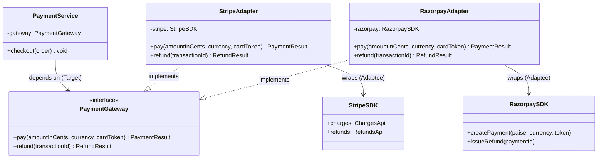

# Adapter Pattern — Class Diagram

Shows the four participants and their relationships. The Client depends only on the
Target interface. Each Adapter *implements* the Target and *wraps* (composition) a
concrete Adaptee.

**How to read it**
- `..|>` (dashed, hollow triangle) = *implements interface*. Both adapters implement `PaymentGateway`.
- `-->` = *association / holds a reference*. `PaymentService` holds a `PaymentGateway`; each adapter holds its SDK.
- The Client (`PaymentService`) has **no arrow to any SDK** — that is the whole point: it is decoupled from every vendor.
