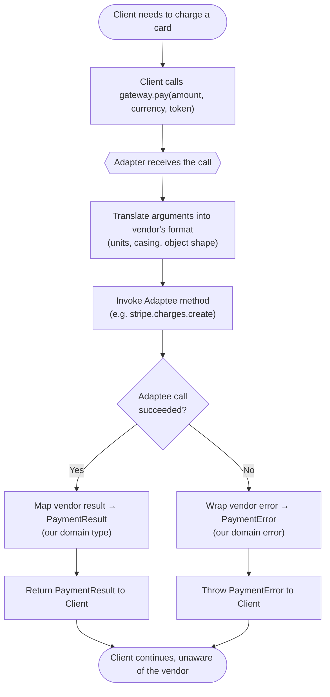

# Adapter Pattern — Flow Diagram

Step-by-step control flow of a single `pay()` call through the adapter, plus the
error-translation branch.

**Key idea:** every box between "Adapter receives the call" and "Return/Throw" is
*translation only*. No business rules live here — they stay in the Client. Swapping
the vendor changes only what happens inside `Translate` / `Invoke` / `MapBack`.
