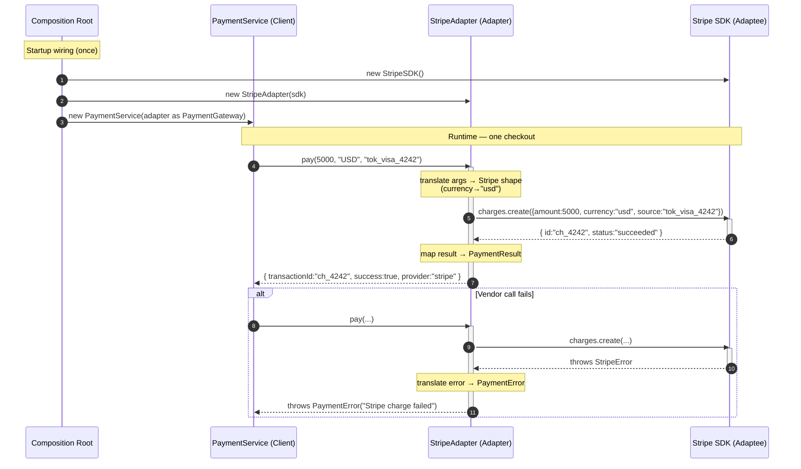

# Adapter Pattern — Sequence Diagram

Shows the runtime message exchange for one payment, including the composition-root
wiring and both success and error paths.

**How to read it**
- The **Composition Root** creates the Adaptee, wraps it in the Adapter, and injects the Adapter into the Client *as the Target type* — done once at startup.
- At runtime the Client only ever talks to the **Adapter**; it never references the SDK.
- The Adapter is the only participant that knows Stripe's method names, casing rules, data shapes, and error types.
- The `alt` block shows error translation: vendor exceptions become our own `PaymentError` before reaching the Client.
