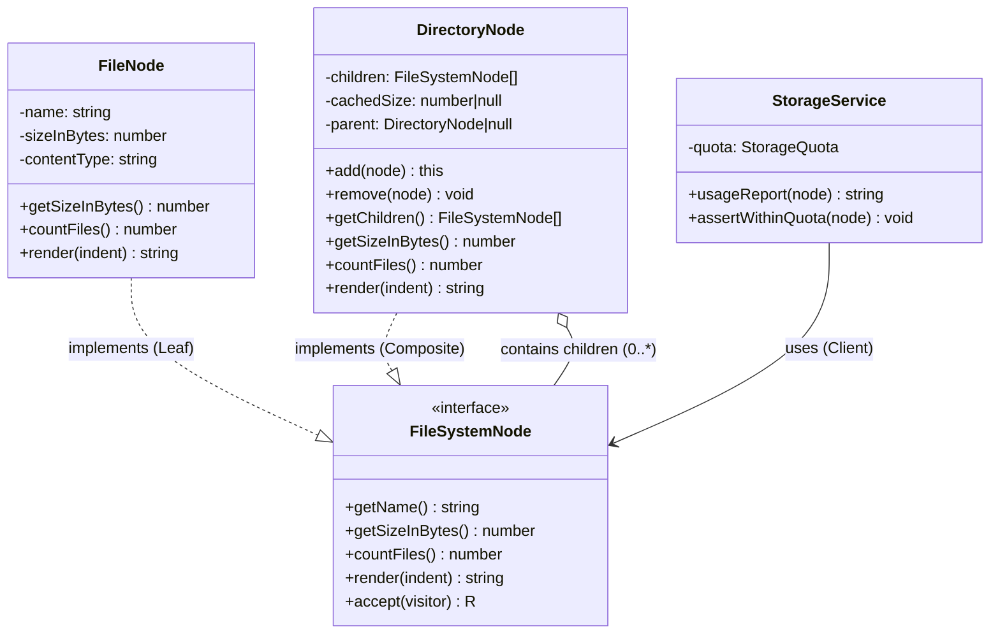
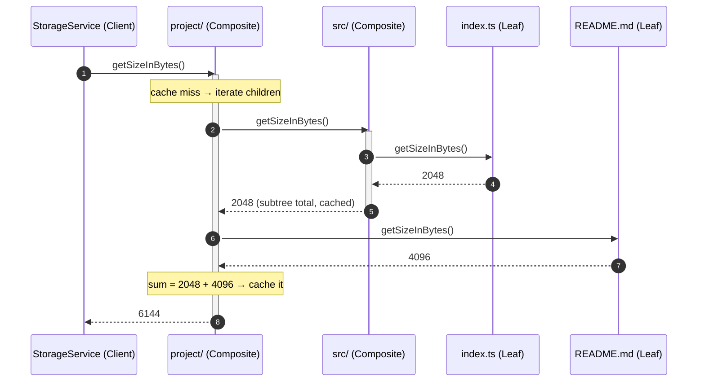

# Composite Pattern

## Intent

Compose objects into tree structures to represent part-whole hierarchies, and let clients treat individual objects (leaves) and groups of objects (composites) **uniformly** through a single interface.

## Real Life Analogy

Think about a company's org chart, or better, a set of Russian nesting dolls — but the clearest one is a **file explorer on your computer**.

You right-click a folder and choose "Properties → Size". The operating system reports something like "4.2 GB". But a folder does not *have* a size of its own; it is just a container. What actually happened is: the folder asked each thing inside it "how big are you?", and each of those things answered. A plain file answers with its own byte count. A sub-folder, being a container too, asks *its* children the same question, and so on, all the way down, until it hits plain files that just return a number. The folder adds everything up and reports the total.

Here is the beautiful part: when you asked "how big are you?", **you did not need to know or care** whether you clicked on a single file or a folder containing ten thousand files. You asked the same question the same way. The thing you clicked figured out the rest.

The Composite Pattern is exactly this. A "folder" and a "file" both understand the same command (`getSize()`). The folder implements it by delegating to its children; the file implements it by answering directly. The client (you, right-clicking) treats both identically.

## Problem

### What engineering problem exists?

Backend systems are full of **tree-shaped data** — structures where a thing can contain more things of the same kind, nested to any depth:

- A **file/object storage** tree: directories contain files and other directories (S3 prefixes, a Docker image's layers, a Git tree object).
- An **organization hierarchy**: a company contains divisions, which contain teams, which contain employees.
- A **permission / access-control tree**: a role grants permissions, and a role can inherit from other roles.
- A **UI or menu structure**: a page contains panels, panels contain widgets, widgets contain more widgets.
- A **bill of materials (BOM)**: a product is made of sub-assemblies, which are made of parts.
- A **category tree** in e-commerce: "Electronics → Phones → Android" nested arbitrarily.

On every one of these, you need to run operations that must **walk the whole subtree**: total size, total price, total headcount, "render this", "delete everything under here", "does anyone in this subtree have permission X?".

> **Term: Part-whole hierarchy.** A structure where a "whole" (the composite) is built out of "parts", and some of those parts are themselves "wholes" made of smaller parts. A directory (whole) is made of files and directories (parts), and those directories are wholes too. Composite is the pattern designed specifically for part-whole hierarchies.

> **Term: Leaf vs Composite.** A **leaf** is an object at the end of the tree with no children (a file, an employee, a single menu item). A **composite** is an object that contains children (a directory, a department, a submenu). Both are **nodes** in the tree.

### Why is this problem difficult?

- **Leaves and composites are genuinely different.** A file has a size; a directory does not — it has children whose sizes must be summed. If you model them as unrelated types, the client must constantly ask "which one is this?" before it can do anything.
- **The nesting depth is unknown and unbounded.** You cannot write `for each directory { for each subdirectory { ... } }` because you do not know how deep it goes. The structure is recursive by nature, so the code must be too.
- **Operations must be consistent across both types.** "Total size" of a file and "total size" of a directory should be callable the same way, or the client code explodes into special cases.

### What happens if we ignore it?

Without a unifying pattern, client code degenerates into type-checking spaghetti:

```ts
function totalSize(node: File | Directory): number {
  if (node instanceof File) {
    return node.size;
  } else if (node instanceof Directory) {
    let sum = 0;
    for (const child of node.children) {
      sum += totalSize(child); // caller re-implements the recursion
    }
    return sum;
  }
  throw new Error("unknown node type");
}
```

Now imagine you need five such operations (`totalSize`, `countFiles`, `render`, `delete`, `checkPermission`). Each one repeats the same `instanceof` ladder and re-implements the traversal. Then you add a third node type (a `SymbolicLink`). You must now find and edit **every one** of those functions — the definition of shotgun surgery, and a direct violation of the Open/Closed Principle. The knowledge of "how to walk the tree" is scattered across the client instead of living inside the tree itself.

## Why Not Other Solutions?

**"Just use `if / instanceof` checks in the client (as above)."**
This is the anti-pattern Composite exists to kill. The client becomes responsible for knowing every node type and re-implementing traversal for every operation. Adding a node type or an operation means editing many places. It does not scale and it is error-prone.

**"Model directories and files as completely separate classes with no shared interface."**
Then you cannot hold a mixed list (`children: (File | Directory)[]`) without union types leaking everywhere, and you cannot call one method uniformly. Every collaborator must branch on the concrete type. You have coupled the client to the entire type hierarchy.

**"Flatten the tree into a single table/array with `parentId` and just query it."**
This is a legitimate *storage* strategy (adjacency list in PostgreSQL) and is often correct at the database layer. But it does not solve the *in-memory behavior* problem: once you load the rows, you still need objects that can compute recursive aggregates and be treated uniformly. Composite is about behavior and object modeling; adjacency lists / nested sets / materialized paths are about persistence. They are complementary, not competitors. (More on this in *Performance Considerations*.)

**"Put every possible operation as a giant method on one 'Node' class with a `type` field and a `switch`."**
This is the "God object" version of the `instanceof` ladder. Every new operation grows the switch; the class knows too much; testing is painful. It violates Single Responsibility and Open/Closed.

**Tradeoff summary:** Every alternative either forces the client to understand the whole type hierarchy, scatters traversal logic, or grows unboundedly with each new operation/type. Composite pushes the "am I a leaf or a whole?" decision *into the objects themselves* and gives the client one uniform interface.

## Solution

The core idea: **define one common interface (the Component) that both leaves and composites implement, and make the composite delegate operations to its children.**

You define a **Component** interface with the operations the client cares about (`getSizeInBytes()`, `countFiles()`, `render()`). Then:

- A **Leaf** implements each operation directly. `getSizeInBytes()` on a file just returns its own byte count. Leaves are the **base case** of the recursion.
- A **Composite** implements each operation by **iterating over its children and delegating the same call to each**, then combining the results. `getSizeInBytes()` on a directory loops over its children, calls `child.getSizeInBytes()` on each (not knowing or caring if the child is a file or another directory), and sums the answers. This is the **recursive step**.

The client holds a reference typed as the **Component** and calls the operation. The tree does the rest.

The thinking behind it:

1. **Uniformity through a shared contract.** If a file and a directory both satisfy `FileSystemNode`, the client can treat any node the same way. The leaf/composite distinction disappears from the client's point of view.
2. **Recursion lives in the structure, not the client.** The composite *is* the loop-and-delegate logic. The client never writes traversal code; it just calls one method and the tree recurses through itself.
3. **Open for extension.** Add a new leaf type (a `SymbolicLink`) and it just works everywhere, because it too satisfies the Component interface. No client changes.

You do **not** ask "what type is this node?". You call the method and let polymorphism route it to the right implementation.

## Architecture

There are four participants:

1. **Component (interface):** The common contract that both leaves and composites honor — e.g. `FileSystemNode` with `getSizeInBytes()`, `countFiles()`, `render()`. This is what makes leaves and composites interchangeable from the client's view. It declares the operations that make sense for *every* node.

2. **Leaf:** A node with **no children** — the end of a branch (`FileNode`). It implements every Component operation directly. It is the **base case** that terminates recursion. A leaf does not know it is part of a tree; it just answers questions about itself.

3. **Composite:** A node that **holds children** (`DirectoryNode`). It also implements every Component operation, but does so by **delegating to its children and aggregating** the results. Crucially, it holds its children *typed as the Component interface*, so it can contain any mix of leaves and other composites. It also owns child-management methods (`add`, `remove`).

4. **Client:** Your business/application code (`StorageService`). It holds a reference typed as the **Component** and calls Component operations. It never checks whether a node is a leaf or composite, and never writes traversal logic itself.

Responsibilities in one line each:
- **Component:** declares the uniform operations every node supports.
- **Leaf:** does the real work for a single object; stops the recursion.
- **Composite:** delegates to children and aggregates; drives the recursion.
- **Client:** calls one uniform method; stays ignorant of the tree's shape.

> **Design axis — Transparency vs Safety.** Where do the child-management methods (`add`, `remove`, `getChild`) live?
> - **Transparent** approach: declare them on the **Component** interface, so leaves and composites look *identical*. The cost: a `FileNode.add(...)` call must be defined but is meaningless — you either no-op or throw at runtime. Maximum uniformity, minimum type safety.
> - **Safe** approach: declare them **only on the Composite**. A leaf physically cannot be asked to add a child (it is a compile error). The cost: the client sometimes needs to know it holds a composite before adding. Maximum type safety, slightly less uniformity.
>
> Our `code.ts` chooses the **safe** approach (add/remove live only on `DirectoryNode`), which is the idiomatic choice in a statically typed language like TypeScript. The Gang of Four's original book leaned transparent for maximum uniformity. Know both; pick per language and use case.

## Execution Flow

Walking through a `getSizeInBytes()` call on a directory tree:

1. The client holds a node typed as `FileSystemNode` (it happens to be the root directory, but the client does not know that) and calls `node.getSizeInBytes()`.
2. Polymorphism dispatches the call to `DirectoryNode.getSizeInBytes()`.
3. The directory checks its size cache. If a valid cached value exists, it returns it immediately (O(1)) and the flow stops here.
4. On a cache miss, the directory initializes a running total to `0` and begins iterating over its children.
5. For the first child, it calls `child.getSizeInBytes()` — **without checking the child's type**.
6. If that child is a `FileNode` (a leaf), the call dispatches to `FileNode.getSizeInBytes()`, which returns the file's own byte count directly. **Base case reached** — no further recursion on this branch.
7. If that child is another `DirectoryNode` (a composite), the call dispatches back to `DirectoryNode.getSizeInBytes()`, and steps 3–8 repeat for *that* subtree. **Recursive step.**
8. Each child's returned size is added to the running total.
9. After all children are processed, the directory stores the total in its cache and returns it to its caller (which may be a parent directory mid-recursion, or the original client).
10. The client receives a single number — the fully-aggregated size of the entire subtree — having called exactly one method and written zero traversal code.

## Class Diagram



## Sequence Diagram



## Flow Diagram

```mermaid
flowchart TD
    Start([Client calls node.getSizeInBytes]) --> Type{Is node a<br/>Leaf or Composite?}
    Type -- "Leaf (File)" --> LeafReturn[Return own byte count<br/>BASE CASE: no recursion]
    Type -- "Composite (Directory)" --> Cache{Valid cached<br/>size?}
    Cache -- Yes --> ReturnCached[Return cached value O(1)]
    Cache -- No --> Init[total = 0]
    Init --> Loop{More children?}
    Loop -- Yes --> Delegate["child.getSizeInBytes()<br/>RECURSIVE STEP"]
    Delegate --> Add[total += child result]
    Add --> Loop
    Loop -- No --> Store[Store total in cache]
    Store --> ReturnSum[Return total to caller]
    LeafReturn --> End([Caller receives a number])
    ReturnCached --> End
    ReturnSum --> End
```

## Implementation

The implementation strategy in TypeScript:

1. **Define the Component interface first.** List only the operations that make sense for *every* node — a file and a directory must both be able to answer them. `getSizeInBytes()`, `countFiles()`, `render()` all qualify. Put anything that only makes sense for a container (`add`, `remove`) on the Composite, not here (the safety choice).

2. **Write the Leaf.** Implement each operation to answer directly about itself. The Leaf is where recursion *stops*, so it must never delegate.

3. **Write the Composite.** Hold the children in a private array typed as the **Component interface** (`FileSystemNode[]`, not `(FileNode | DirectoryNode)[]`) — this is what lets a directory contain any mix of files and directories. Implement each operation by looping over children, calling the *same* method on each, and combining results.

4. **Consider caching aggregates.** Recursive aggregates like size are read far more often than the tree is mutated (UI refreshes, quota checks, billing). Memoize the result and invalidate the cache — propagating *up* to ancestors — whenever a child is added or removed.

5. **Consider depth safety.** Deep recursion can overflow the call stack (~10k+ frames in Node). For potentially deep or untrusted trees, provide an **iterative** traversal using an explicit stack, and/or a **Visitor** so new operations do not each re-implement the walk.

6. **Keep the Client dependent only on the Component.** The client should hold `FileSystemNode`, never a concrete `FileNode`/`DirectoryNode`, and should contain zero `instanceof` checks.

We demonstrate this with a realistic scenario: the backend of a cloud file browser that computes storage usage, counts files, renders trees, finds large files (via a Visitor), and enforces quotas — all through one uniform interface.

## Code Walkthrough

See [code.ts](code.ts) for the full runnable implementation. Here is what each part does and why it exists.

**`FileSystemNode` (Component interface).**
The uniform contract every node honors: `getName()`, `getSizeInBytes()`, `countFiles()`, `render()`, and `accept()` (for the Visitor). It deliberately does **not** include `add`/`remove` — those live only on the composite (the safety variant). This interface exists so the client can treat any node identically; it is the single source of "what every node can do".

**`FileNode` (Leaf).**
An individual file with a name, a byte size, and a content type. Every operation answers directly: `getSizeInBytes()` returns its own size, `countFiles()` returns `1`. It is the **base case** — it never delegates, so recursion terminates here. It validates its own invariant (no negative size) in the constructor.

**`DirectoryNode` (Composite).**
The heart of the pattern. It holds a private `children: FileSystemNode[]`. Its operations *delegate and aggregate*: `getSizeInBytes()` sums `child.getSizeInBytes()` over all children; `countFiles()` sums `child.countFiles()`; `render()` recursively renders each child indented one level deeper. It owns `add()`/`remove()` (with a fluent `this` return for ergonomic tree-building). It memoizes size in `cachedSize` and invalidates that cache **up the parent chain** via `invalidateSizeCache()` on every mutation — solving cache-invalidation correctly and locally. `getChildren()` returns a `readonly` view so callers cannot mutate the internal array behind the directory's back.

**`FileSystemVisitor<R>` and `LargeFileFinder` (Visitor).**
Composite and Visitor are natural partners. `accept()` on each node calls back the matching visitor method (`visitFile` / `visitDirectory`) — this is **double dispatch**. `LargeFileFinder` collects all files above a size threshold. The point: we added a brand-new whole-tree operation **without editing `FileNode` or `DirectoryNode`** — the Open/Closed Principle in action.

**`walkIterative()` (depth-safe traversal).**
A generator that walks the tree using an explicit heap-allocated stack instead of the call stack, so a pathologically deep tree cannot cause a stack overflow. It also streams nodes lazily, which matters for huge trees.

**`StorageService` (Client).**
Business logic: `usageReport()` and `assertWithinQuota()`. Notice there is **not a single `instanceof` check** — it calls `node.getSizeInBytes()` and `node.countFiles()` on whatever it is handed. The demo proves it: `usageReport()` is called once on the root directory and once on a lone file, with identical code.

**`formatBytes()` and the composition root.**
`formatBytes()` is a pure helper for human-readable sizes. `buildSampleTree()` constructs a nested tree using the fluent `add()` API, and `main()` exercises every capability: rendering, usage on a directory vs a single file, the Visitor, the iterative walk, and cache invalidation after a mutation.

**Interactions.**
The client calls one Component method; the composite loops and delegates the same method to each child; leaves answer directly and stop the recursion; composites bubble aggregated results back up. Adding a file deep in the tree invalidates cached sizes all the way to the root, so the next read is correct. New operations arrive either as new Component methods (edit all node classes) or as new Visitors (edit nothing) — a tradeoff discussed below.

## Advantages

- **Uniform treatment of leaves and composites.** The client uses one interface for both, eliminating `instanceof` ladders and type-based branching.
- **Recursion is encapsulated in the structure.** The tree knows how to traverse itself; the client never writes traversal code.
- **Open/Closed for new node types.** Add a new leaf or composite type that implements the Component interface and it works everywhere immediately — no client changes.
- **Naturally models real hierarchies.** File systems, org charts, category trees, BOMs, and permission trees map directly onto the pattern.
- **Composable and expressive.** Trees are built by nesting objects; a fluent `add()` makes construction read like the structure itself.
- **Plays well with Visitor and Iterator.** New operations (Visitor) and custom traversals (Iterator) slot in cleanly.

## Disadvantages

- **The interface can become too general.** To keep leaves and composites uniform, the Component interface tends toward the lowest common denominator. Some methods make sense only for composites (`add`), forcing the transparency-vs-safety compromise.
- **Type safety erosion (transparent variant).** If child-management is on the shared interface, calling `add()` on a leaf is a runtime error rather than a compile error.
- **Recursion depth risk.** Deep trees can overflow the call stack; you may need iterative traversal, which is more complex to write.
- **Aggregate recomputation cost.** Naive `getSize()` is O(n) per call over the whole subtree; without caching, repeated reads are expensive. Caching then introduces invalidation complexity.
- **Ordering and identity concerns.** Trees may need ordered children, duplicate handling, or cycle prevention (a directory must not contain itself, directly or transitively) — extra bookkeeping the pattern does not give you for free.
- **Adding a new *operation* touches every node class** (unless you use Visitor) — the mirror-image cost of the pattern's easy type extension.

## Tradeoffs

**What we gain:** a clean uniform interface over part-whole hierarchies, traversal logic that lives in the structure instead of the client, easy addition of new node types, and a natural object model for inherently recursive data.

**What we lose:** some type safety (the transparency/safety compromise), a tendency toward an over-general interface, and the need to manage recursion depth, aggregate caching, and cycle prevention ourselves. There is also the **extensibility asymmetry**: Composite makes adding new *types* cheap but adding new *operations* expensive (edit every class), while the Visitor pattern flips that trade — cheap new operations, expensive new types. Choose based on which axis changes more often in your system.

## Complexity

**Code Complexity:** Low to moderate. The pattern itself is a small interface plus two classes. Complexity rises only when you add caching (invalidation), depth-safe iterative traversal, or cycle detection.

**Maintenance Complexity:** Low for adding node types (Open/Closed). Higher for adding operations directly to the interface (touches every node class) — mitigated by Visitor.

**Scalability:** Structurally excellent — the tree grows organically. The concern is *aggregate computation* on large trees: cache results and/or persist aggregates (see Performance) so you are not walking millions of nodes on every read.

**Flexibility:** High. Trees compose arbitrarily; new leaf/composite types integrate seamlessly; Visitors and Iterators extend behavior without structural change.

**Testability:** High. Leaves are trivial to unit-test in isolation. Composites can be tested with small hand-built trees. The client can be tested against a tiny in-memory tree with no infrastructure. Because the client depends only on the interface, it is easy to feed it fakes.

## Performance Considerations

**Memory:** Each node is an object with references to its children; a wide/deep tree holds many objects and references simultaneously. Storing a `parent` back-reference (as we do for cache invalidation) doubles the edges. For millions of nodes, consider not materializing the whole tree in memory at once — stream it.

**CPU:** Recursive aggregates are O(n) in the number of nodes in the subtree per call. Called repeatedly (UI, billing, quotas), this is wasteful — **memoize** results and invalidate on mutation, as `DirectoryNode` does. With caching, reads are O(1) until the next mutation.

**Network:** Not intrinsic to the pattern, but tree nodes often correspond to remote resources (S3 objects, microservice calls). Beware turning one logical operation into N network round-trips as you recurse — batch or prefetch where possible; never issue one request per leaf in a hot path.

**Database:** This is the big one. Trees are usually *persisted* relationally. Common strategies: **adjacency list** (`parent_id` column — simple writes, but a naive recursive read is N+1 queries; use a recursive CTE / `WITH RECURSIVE` in PostgreSQL), **materialized path** (store `"/1/4/9/"` — cheap subtree reads via `LIKE`, costlier moves), and **nested sets** (`lft`/`rgt` — very fast reads, expensive writes). Choose per read/write ratio. Consider **denormalizing aggregates** (store `total_size` per directory row, updated on write) so you never recompute by walking — the DB equivalent of the in-memory cache.

**Object creation:** Building a large tree allocates many small objects. If you rebuild trees frequently (per request), that GC pressure adds up; prefer building once and mutating, or use flyweight-style sharing for identical leaves.

**Runtime:** Deep recursion risks stack overflow (~10k–15k frames in Node depending on frame size). For deep or untrusted trees, use the iterative traversal (`walkIterative`) with an explicit stack. Generators also let you process lazily and bail out early.

## Common Mistakes

- **Letting traversal logic leak into the client.** Beginners keep writing `for (const child of dir.children) { ... }` in business code. *Why it happens:* they think of the tree as data to iterate, not as objects that know how to answer. *Avoid:* put the recursion inside the composite; the client calls one method.

- **Using `instanceof` in the client to decide behavior.** This defeats the entire purpose. *Why:* habit from procedural code. *Avoid:* if you need per-type behavior, add a method to the Component interface (or use a Visitor) so polymorphism handles it.

- **Forgetting the base case in the Leaf.** If a leaf accidentally delegates or a composite recurses without a terminating condition, you get infinite recursion. *Why:* copy-pasting the composite's delegate-logic into the leaf. *Avoid:* leaves answer about themselves only, never delegate.

- **Not preventing cycles.** Accidentally adding a directory into its own subtree creates a cycle, and any recursive traversal loops forever. *Why:* no guard on `add()`. *Avoid:* validate that a node is not already an ancestor before adding, or track visited nodes during traversal.

- **Recomputing aggregates every call with no cache.** On a large tree, `getSize()` walked from the root on every UI render is a real performance bug. *Why:* the naive implementation is correct but slow. *Avoid:* memoize and invalidate on mutation.

- **Stale cache after mutation.** Adding a caching layer but forgetting to invalidate ancestors gives wrong totals. *Why:* invalidation is easy to get wrong (it must propagate up). *Avoid:* invalidate up the parent chain on every add/remove, as in `code.ts`.

- **Handing out the mutable children array.** Returning the internal array lets callers bypass `add`/`remove` (and the cache invalidation they trigger). *Avoid:* return a `readonly` view.

- **Confusing Composite with Decorator.** Both use recursive composition. *Avoid:* Composite builds a *tree of many* children to represent a whole; Decorator wraps *exactly one* component to add *one* responsibility (see Similar Patterns).

## When To Use

- You have **part-whole hierarchies** — file/object trees, org charts, category trees, comment threads, DOM/UI trees, bills of materials, permission/role trees.
- You want clients to **treat individual objects and groups uniformly**, without type-checking.
- Operations must **recurse to arbitrary depth** and you want that recursion encapsulated in the structure.
- You expect to **add new node types** over time and want them to integrate without editing client code.
- You are modeling **nested configuration or rules** (e.g. a boolean rule tree of AND/OR/NOT nodes evaluated recursively).

## When NOT To Use

- **The data is not actually a tree.** If your structure is flat or a general graph with many cross-links and cycles, Composite's recursive-tree assumptions do not hold; a graph model fits better.
- **There is only one level of nesting, fixed forever.** A parent with a flat list of children that never nests deeper does not need the pattern — a simple collection is clearer (YAGNI).
- **Leaves and composites share almost no operations.** If you cannot find a meaningful common interface, forcing one produces an anemic, awkward Component.
- **The tree is enormous and lives in the database, and you never need rich in-memory behavior.** Then a recursive CTE / adjacency-list query may be all you need; do not materialize millions of objects just to sum a column.
- **You need to add operations far more than types.** The Visitor pattern (possibly without full Composite) may be the better primary tool.

## Real Production Examples

- **Node.js:** The file system itself is the canonical tree; libraries like `glob`/`fast-glob` walk directory composites. The `path` module manipulates the nodes' addresses.
- **NestJS:** The dependency-injection **module graph** is a tree of modules that import sub-modules; guards/interceptors/pipes compose in nested scopes. Configuration modules merge nested config objects recursively.
- **Express:** The **router** is a composite — a `Router` can `use()` other routers, forming a tree of route handlers; a request walks the tree to find its match.
- **Java Spring:** The `ApplicationContext` hierarchy (parent/child contexts) is a composite; Spring Security's `AuthorizationManager` composites combine sub-decisions.
- **.NET:** WPF/WinForms controls form a composite visual tree (`Panel` contains controls, which contain controls); `CompositeFormat` and the expression trees follow the same shape.
- **AWS:** **S3** prefixes model a directory tree over a flat key space; **CloudFormation/CDK** constructs form a tree (a `Stack` contains constructs that contain constructs); **Organizations** model accounts in nested OUs (organizational units).
- **Azure:** **Management Groups → Subscriptions → Resource Groups → Resources** is an explicit composite hierarchy used for policy and billing rollups.
- **Google Cloud:** **Resource hierarchy** (Organization → Folder → Project → Resource) where IAM policies and quotas aggregate down the tree.
- **React (if applicable):** The **component tree** is the textbook Composite — a component renders children that render children; the reconciler walks the tree uniformly. So is the virtual DOM.
- **Databases:** Category/menu/threaded-comment trees stored via adjacency list, materialized path, or nested sets; MongoDB's nested document trees. SQL **query plans** and expression trees are composites of operators.
- **AI Systems:** **Abstract Syntax Trees** in code-generation and parsers; **behavior trees** for agents; nested **tool/agent orchestration** where an agent can invoke sub-agents; recursive prompt-template composition.

## Where I Can Use This

Five realistic ideas for your own backend projects:

1. **Storage/quota service.** Model user folders as a `FileSystemNode` tree; compute per-folder usage and enforce quotas with one `getSizeInBytes()` call, backed by a denormalized `total_size` column in PostgreSQL.
2. **Nested category/menu API.** Build an e-commerce category tree (or a CMS navigation menu) where `getProductCount()` and `render()` recurse; serve it to the frontend as a nested JSON tree.
3. **Permission/role evaluation.** Represent roles and permission groups as a composite; `hasPermission(x)` recurses through inherited roles, so checking access is one uniform call.
4. **Rule engine.** Build a boolean rule tree (`AndNode`, `OrNode`, `NotNode`, `ConditionLeaf`) that evaluates `matches(context)` recursively — great for feature flags, fraud rules, or notification routing.
5. **Org-chart / cost-rollup service.** Model departments and employees as composites/leaves; roll up headcount and salary budget at any level with `getSalary()` / `getHeadcount()` for an internal HR or finance dashboard.

## Similar Patterns

- **Decorator:** Also uses recursive composition and shares an interface with what it wraps — but a Decorator wraps **exactly one** component to **add a single responsibility** (logging, caching, compression), whereas a Composite holds **many** children to represent a **whole**. Decorator is a degenerate one-child tree focused on augmentation; Composite is a real tree focused on aggregation.
- **Iterator:** Provides a way to **traverse** the composite's elements without exposing its structure. Composite and Iterator are frequently used together — the Iterator walks the tree the Composite defines.
- **Visitor:** Lets you add **new operations** over a composite without modifying node classes (via double dispatch). It solves Composite's weakness (adding operations touches every class). Our `LargeFileFinder` is a Visitor over the file tree.
- **Chain of Responsibility:** Often built on a tree/linked structure where a request travels through nodes — but its intent is passing a request along until someone handles it, not aggregating a part-whole hierarchy.
- **Flyweight:** Complements Composite when a tree has many identical leaves — share leaf instances to save memory instead of allocating duplicates.

| Pattern       | Structure           | # wrapped/children | Primary intent                              | Client sees        |
|---------------|---------------------|--------------------|---------------------------------------------|--------------------|
| **Composite** | Tree (part-whole)   | Many               | Treat leaves & groups uniformly; aggregate  | One interface      |
| **Decorator** | Recursive wrap      | Exactly one        | Add one responsibility, keep same interface | Same interface     |
| **Iterator**  | Traversal over any  | N/A                | Traverse without exposing structure         | A cursor           |
| **Visitor**   | Operation over tree | N/A                | Add operations without editing node classes | Visitor + accept() |
| **Flyweight** | Shared leaves       | N/A                | Share identical objects to save memory      | Shared instances   |

## Interview Discussion

Experienced engineers rarely discuss Composite as a toy file system. They discuss it as **the object model for recursive/hierarchical data**, and immediately connect it to the *persistence* and *performance* questions that make it real:

- *"How do you store this tree in a database?"* The interesting answer names the three classic strategies — adjacency list (`parent_id` + recursive CTE), materialized path, nested sets — and explains the read/write tradeoff of each. This separates people who have only read the GoF book from people who have shipped a tree.
- *"How do you compute aggregates efficiently?"* Talk about memoization with upward cache invalidation in memory, and denormalized aggregate columns updated on write in the DB.
- *"Transparency vs safety — where do `add`/`remove` go?"* A strong answer explains both variants and picks safety for statically typed languages, transparency when uniformity is paramount.
- *"How do you handle very deep trees?"* Iterative traversal with an explicit stack (or tail-call-free generators) to avoid stack overflow; streaming for huge trees.
- *"How do you add a new operation without editing every node class?"* Visitor. This is the natural follow-up and shows you understand the pattern's main weakness.
- *"How do you prevent cycles?"* Guard `add()` against ancestors, or track visited nodes.

Common misconceptions:
- "Composite and Decorator are the same because both wrap." No — Decorator wraps one to add behavior; Composite holds many to model a whole.
- "The client should recurse through the tree." No — the recursion belongs *inside* the composite; the client calls one uniform method.
- "You must make `add`/`remove` part of the shared interface." Only in the transparent variant; the safe variant deliberately does not.
- "Composite is only about data structures." It is about *behavior over* hierarchical data — uniform operations and encapsulated recursion.

## Summary

- Composite composes objects into **tree structures** for **part-whole hierarchies** and lets clients treat leaves and composites **uniformly** through one Component interface.
- Four participants: **Component** (shared interface), **Leaf** (no children, base case), **Composite** (holds children, delegates + aggregates, recursive step), **Client** (uses the interface, no type checks).
- The recursion lives **inside the composite**, not in the client.
- Key design axis: **transparency vs safety** for where child-management methods live.
- Watch out for **recursion depth**, **aggregate caching/invalidation**, and **cycle prevention**.
- Pairs naturally with **Visitor** (add operations) and **Iterator** (traversal); complemented by **Flyweight** (share leaves).
- Persistence and aggregate performance (recursive CTEs, denormalized totals) are where the pattern gets real in backend systems.

## Key Takeaways

1. Composite = one interface for both a single object (leaf) and a group of objects (composite), arranged as a tree.
2. The client calls one method uniformly; it never checks "leaf or composite?".
3. Leaves are the base case (answer directly); composites are the recursive step (delegate to children, then aggregate).
4. Hold children typed as the Component interface so a composite can contain any mix of node types.
5. Adding a new node type is cheap (Open/Closed); adding a new operation is cheap only if you use Visitor.
6. Choose transparency (uniform, less safe) vs safety (`add`/`remove` only on composite) deliberately.
7. Memoize recursive aggregates and invalidate up the parent chain on mutation.
8. Guard against cycles and deep-recursion stack overflows (iterative traversal for deep trees).
9. Persist trees with adjacency list / materialized path / nested sets; denormalize aggregates for read-heavy loads.
10. It is the object model behind file systems, React/DOM trees, cloud resource hierarchies, and rule engines.

---

## Further Reading

**Books**
- *Design Patterns: Elements of Reusable Object-Oriented Software* — Gamma, Helm, Johnson, Vlissides (the "Gang of Four"), the original Composite definition and the transparency-vs-safety discussion.
- *Head First Design Patterns* — Freeman & Robson (very approachable Composite + Iterator chapter).
- *SQL Antipatterns* — Bill Karwin (chapter "Naive Trees" — the definitive practical guide to storing trees in SQL: adjacency list, path enumeration, nested sets, closure table).
- *Patterns of Enterprise Application Architecture* — Martin Fowler.
- *Refactoring* — Martin Fowler ("Replace Conditional with Polymorphism", the refactoring that leads you toward Composite).

**Open Source Projects / GitHub Repositories**
- React — the component tree and reconciler (Composite in the wild) — https://github.com/facebook/react
- AWS CDK — the construct tree — https://github.com/aws/aws-cdk
- Express Router — nested routers as a composite — https://github.com/expressjs/express

**Official Documentation**
- Refactoring.Guru — Composite — https://refactoring.guru/design-patterns/composite
- PostgreSQL — `WITH` / Recursive Queries (for traversing tree tables) — https://www.postgresql.org/docs/current/queries-with.html
- Refactoring.Guru — Composite in TypeScript — https://refactoring.guru/design-patterns/composite/typescript/example

**Blog Articles**
- Martin Fowler — "Nested Set" and organizing hierarchies — https://martinfowler.com/
- AWS — Modeling hierarchical data (Organizations / resource hierarchy) documentation and blogs — https://docs.aws.amazon.com/

**Research / Foundational**
- Joe Celko — *Trees and Hierarchies in SQL for Smarties* (nested sets and the theory of representing hierarchies in relational databases).
