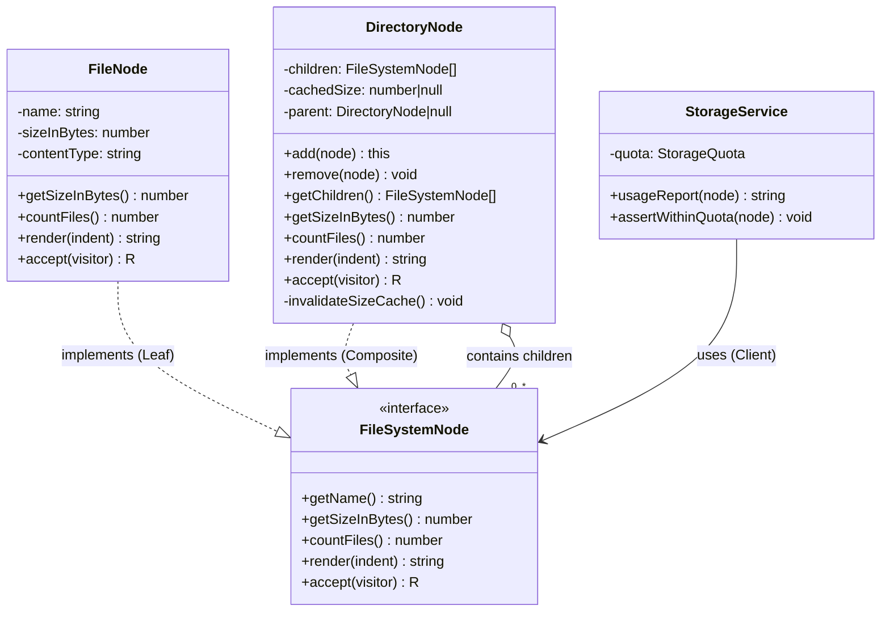

# Composite Pattern — Class Diagram

Shows the four participants. Both `FileNode` (Leaf) and `DirectoryNode` (Composite)
implement the same `FileSystemNode` (Component) interface, so the `StorageService`
(Client) can treat them identically. The Composite *contains* children typed as the
Component interface — which is exactly what lets a directory hold any mix of files
and other directories.

**How to read it**
- `..|>` (dashed, hollow triangle) = *implements interface*. Both the Leaf and the Composite implement `FileSystemNode`.
- `o--` (hollow diamond) = *aggregation* — the Composite **holds** children. The `0..*` means zero-or-more children, and they are typed as the **interface**, not as concrete classes — this is the crucial detail that lets a directory contain files *and* other directories interchangeably.
- `-->` = *association / uses*. `StorageService` depends only on the `FileSystemNode` interface.
- The Client has **no arrow to `FileNode` or `DirectoryNode`** — it never names the concrete types, so it never needs an `instanceof` check. That decoupling is the whole point.
- Child-management methods (`add`, `remove`, `getChildren`) appear **only** on `DirectoryNode`, not on the interface — the *safety* variant of the pattern.
