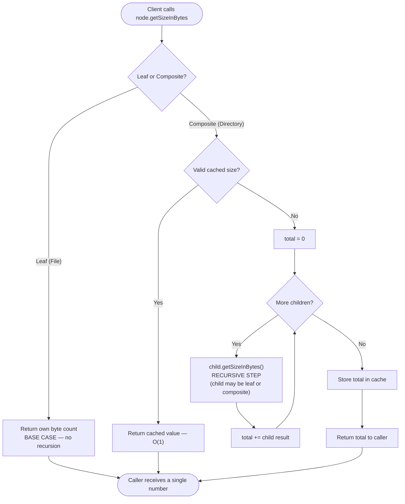

# Composite Pattern — Flow Diagram

Control flow of a single recursive aggregate call (`getSizeInBytes()`) through the
tree, including the leaf base case, the composite recursive step, and the size
cache fast-path.

**Key idea:** the composite does not care whether a child is a leaf or another
composite — it calls the **same** `getSizeInBytes()` on each and lets polymorphism
route the call. Leaves terminate the recursion; composites drive it. The cache
fast-path makes repeated reads O(1); mutations (`add`/`remove`) clear the cache up
the parent chain so the next read recomputes correctly.
