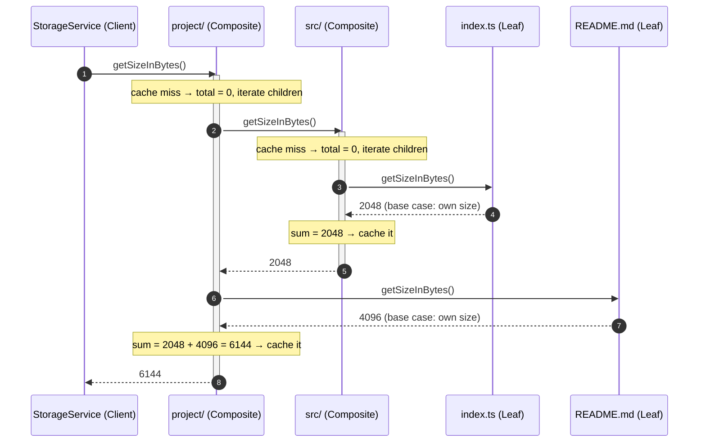

# Composite Pattern — Sequence Diagram

Runtime message exchange for one `getSizeInBytes()` call on a small tree:

```
project/            (Composite)
├── src/            (Composite)
│   └── index.ts    (Leaf, 2048 B)
└── README.md       (Leaf, 4096 B)
```

The Client calls **one** method on the root; the recursion happens entirely inside
the tree via delegation.



**How to read it**
- The Client sends exactly **one** message (`getSizeInBytes()` to the root) and receives one number. It writes no loop and no `instanceof` check.
- Each **Composite** (`project/`, `src/`) responds by delegating the *same* message to each child, then summing — the recursive step. Note it caches its subtree total before returning.
- Each **Leaf** (`index.ts`, `README.md`) responds immediately with its own size — the base case that stops the recursion.
- Activation bars show the nested recursion: `project/` is still "active" (waiting) while `src/` computes its subtree, which in turn waits on `index.ts`. Results bubble back up the tree to the Client.
