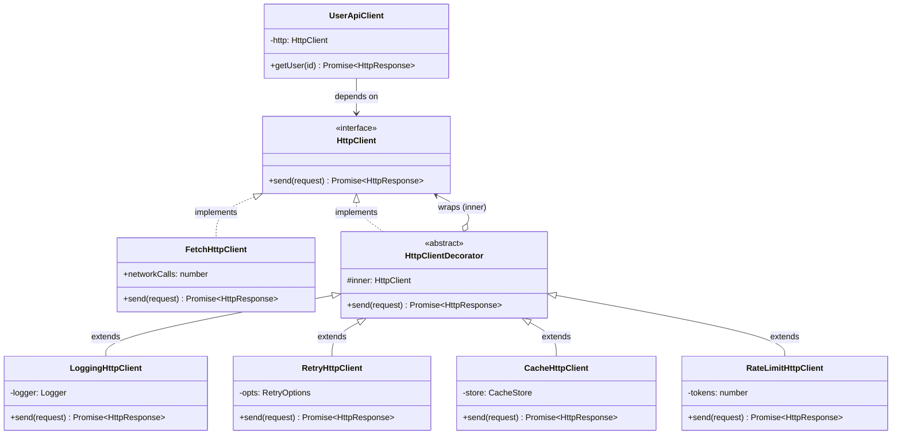
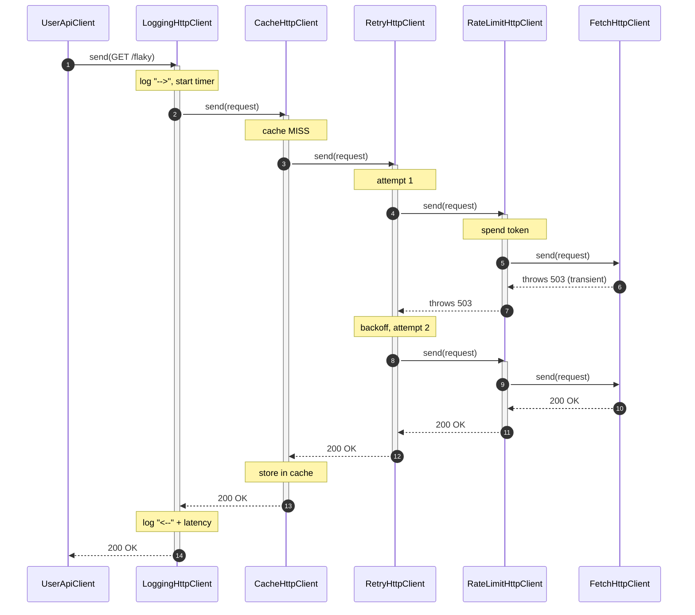
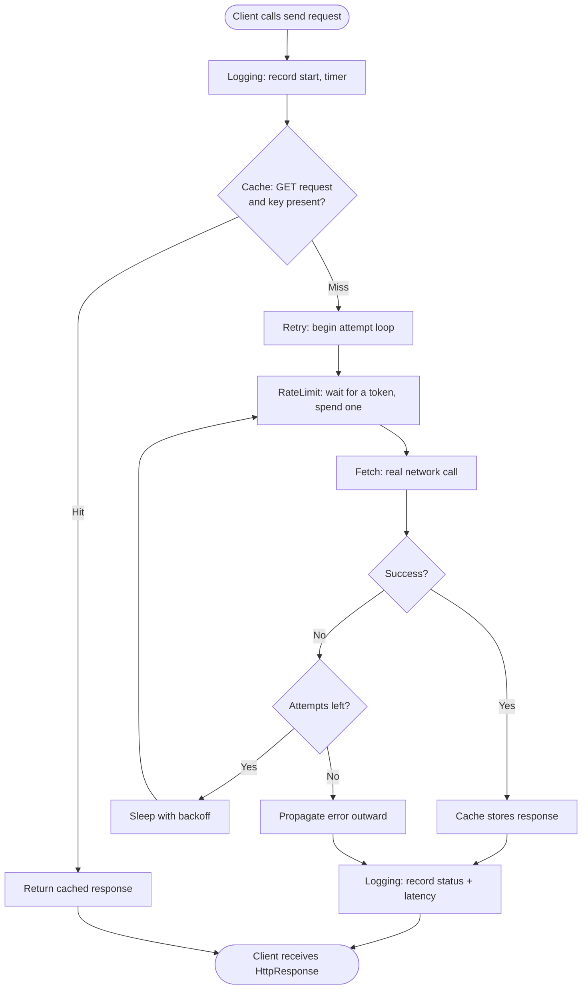

# Decorator Pattern

## Intent

Attach additional responsibilities to an object *dynamically* by wrapping it in another object that shares the **same interface**, giving you a flexible alternative to subclassing for extending behavior.

## Real Life Analogy

Think about getting dressed for cold weather. You start with your body. You put on a **t-shirt**. Over it you add a **sweater**. Over that a **rain jacket**. Each layer adds one capability — warmth, more warmth, waterproofing — without changing the layers underneath. Your body is still your body; the sweater doesn't know or care that a jacket is on top of it.

Two things about this matter for the pattern:

1. **Every layer presents the same "surface" to the world.** From the outside, whether you are wearing one layer or four, you are still "a dressed person" — you can still walk, sit, and move. Each layer wraps the previous one but exposes the same shape.
2. **Order matters.** A rain jacket over a sweater keeps you warm and dry. A sweater over a rain jacket makes the jacket useless and the sweater wet. Same pieces, different order, different outcome.

The Decorator Pattern is exactly this layered clothing, but for objects. You take a base object and wrap it in layers, each adding one responsibility, each keeping the same interface, and — crucially — the order in which you stack them changes the behavior.

## Problem

### What engineering problem exists?

In real backend systems, a single core operation almost never lives alone. Take one concrete example every backend engineer knows: **making an outbound HTTP call** to another service or a third-party API. The raw call is one line. But around it, production demands cross-cutting concerns:

- **Logging** — record the method, URL, status, and latency.
- **Retries** — transient network failures should be retried with backoff.
- **Caching** — identical GET requests should not hit the network twice.
- **Rate limiting** — you must not exceed the downstream API's quota.
- **Metrics, tracing, circuit breaking, auth-token refresh...** the list keeps growing.

> **Term: Cross-cutting concern.** A responsibility that is needed across many operations but is not the core purpose of any single one — logging, caching, security, retries. It "cuts across" your business logic.

The core call needs to be wrapped with some *combination* of these, and different call sites need *different* combinations. An internal health-check might need only logging. A call to a flaky third-party API needs logging + retries + rate limiting. A call to a read-heavy catalog service needs logging + caching.

### Why is this problem difficult?

- **You cannot bake every concern into the base class.** A `FetchHttpClient` that also logs, retries, caches, and rate-limits is a class doing five jobs. It violates the Single Responsibility Principle, becomes hard to test (you cannot test retry logic without also exercising caching), and forces every caller to pay for every feature whether they need it or not.

> **Term: Single Responsibility Principle (SRP).** The idea that a class should have one, and only one, reason to change. A class that logs *and* caches *and* retries changes for three unrelated reasons.

- **You cannot solve it with subclassing.** If you try to model each combination as a subclass, you get a **combinatorial explosion**. Four optional features give you up to sixteen combinations: `LoggingClient`, `RetryingClient`, `LoggingRetryingClient`, `LoggingRetryingCachingClient`, and so on. Add a fifth feature and it doubles again. Nobody can maintain that.

> **Term: Combinatorial explosion.** When the number of classes (or cases) you must write grows multiplicatively as you add independent options, quickly becoming unmanageable.

- **The combination is often only known at runtime.** Which features a client needs may depend on configuration, environment, or a feature flag. You cannot pick a compile-time subclass for something you only learn about when the config loads.

### What happens if we ignore it?

- **God objects.** The base client swells into a thousand-line class that everyone is afraid to touch.
- **Copy-pasted concerns.** Retry loops and cache lookups get pasted into dozens of call sites, drift apart, and develop inconsistent bugs.
- **Untestable code.** You cannot unit-test "retry backoff" in isolation because it is tangled with caching and logging.
- **Rigidity.** Turning caching off for one endpoint means editing shared code and risking every other endpoint.

## Why Not Other Solutions?

**"Put every feature in the base class and toggle with booleans/flags."**
This is the god-object trap. The class violates SRP, its methods fill with `if (this.cachingEnabled) { ... }` branches, and every new feature makes the class more fragile. You also cannot control *ordering* of the features — the code hard-codes it.

**"Use inheritance — make a subclass per feature and combination."**
This hits the combinatorial explosion described above. Worse, inheritance is *static*: the set of behaviors is fixed at compile time, so you cannot assemble a combination based on runtime config. TypeScript/JavaScript also only allow single inheritance, so you cannot even mix two feature-subclasses together.

**"Use a big pipeline/middleware array baked into one place."**
Middleware (like Express's `app.use(...)`) is actually a very close cousin of Decorator and is a fine solution — but a framework-level middleware chain is global and coupled to that framework's request lifecycle. When you want a *reusable object* that you can pass around, inject, and compose per-dependency (not per-HTTP-request), object decorators are cleaner and framework-independent.

**"Just use TypeScript's `@decorator` syntax (`@Injectable()`, `@Cacheable()`)."**
This is a common and important confusion. TypeScript/JavaScript **method and class decorators** (the `@` annotations) are a *language feature* for metadata and modifying declarations at definition time. They are related in spirit but are **not** the GoF Decorator pattern. The GoF pattern is about **composing objects at runtime by wrapping**, not annotating a class at definition time. We will return to this distinction — getting it right is a mark of a senior engineer.

**Tradeoff summary:** every alternative either couples all concerns into one unit, freezes the combination at compile time, or ties you to a framework's request cycle. The Decorator lets each concern be a small, independently testable object, and lets you compose them — in any order — at runtime.

## Solution

The core idea: **wrap the object in another object that implements the same interface, adds a little behavior, and delegates the rest inward.**

You define one **Component interface** that describes the operation (e.g. `HttpClient` with a `send()` method). You write one **Concrete Component** that does the real work (the actual network call). Then, for each cross-cutting concern, you write a **decorator**: a class that also implements the Component interface, *holds a reference to another Component*, does its extra work before and/or after, and calls the held component to do everything else.

Because a decorator both **implements** the interface and **holds** something of the same interface, decorators can wrap concrete components *or other decorators*. This is what lets them **stack recursively**: `Logging(Cache(Retry(RateLimit(Fetch))))`. Each layer sees the same `send(request)` shape; each layer can act before delegating inward and after control returns.

The thinking behind it:

1. **One responsibility per object.** Retry logic lives only in the retry decorator. Caching lives only in the cache decorator. Each is small and independently testable.
2. **Composition over inheritance.** Instead of freezing behavior in a class hierarchy, you *build* behavior by assembling objects at runtime.
3. **Open/Closed.** To add a new concern (say, a circuit breaker), you write a new decorator. You do not touch the base client or the existing decorators.
4. **The interface is sacred.** Because every layer keeps the *same* interface, the client that ultimately calls `send()` has no idea whether it is talking to a bare client or a four-layer stack. That transparency is the whole point.

You do **not** modify the base component. You do **not** modify the client. You add wrapper layers between them.

## Architecture

There are four participants:

1. **Component (interface):** The shared contract that both the real object and all decorators implement, e.g. `HttpClient` with `send(request): Promise<HttpResponse>`. It defines the "shape" that must stay constant through every layer.

2. **Concrete Component:** The base object that does the real work — e.g. `FetchHttpClient`, which actually performs the network call. It has no knowledge of any decorator. It does exactly one thing.

3. **Decorator (abstract base):** A class that **implements the Component interface** and **holds a reference to a Component** (called the *wrapped* or *inner* component). Its default behavior is pure delegation — it forwards every call to the inner component unchanged. It exists so concrete decorators don't have to re-implement the boilerplate of holding and delegating.

4. **Concrete Decorators:** Subclasses of the Decorator that override the interface methods to add behavior **before**, **after**, or **around** the delegation to the inner component. Each adds exactly one responsibility: `LoggingHttpClient`, `RetryHttpClient`, `CacheHttpClient`, `RateLimitHttpClient`.

Responsibilities in one line each:
- **Component:** defines the shared interface every layer must honor.
- **Concrete Component:** performs the core operation.
- **Decorator (abstract):** holds an inner component and delegates by default.
- **Concrete Decorator:** adds one responsibility around the delegated call.

There is also a **Client** (e.g. `UserApiClient`) that depends only on the Component interface and cannot tell how many layers it is talking to, and a **Composition Root** where the layers are actually stacked.

## Execution Flow

Consider the stack `Logging(Cache(Retry(RateLimit(Fetch))))` handling a `send(request)` call:

1. At startup (composition root), you create the **Concrete Component** (`FetchHttpClient`).
2. You wrap it in `RateLimitHttpClient`, passing the fetch client into its constructor.
3. You wrap *that* in `RetryHttpClient`, then in `CacheHttpClient`, then in `LoggingHttpClient`. The outermost object is what you inject into the client.
4. The client calls `send(request)` on the outermost decorator (`LoggingHttpClient`), not knowing it is a decorator at all.
5. **Logging** records "request started", notes the start time, then calls `inner.send(request)` — its inner is the cache decorator.
6. **Cache** checks its store. On a **hit**, it returns the cached response immediately, and steps 7–10 never happen (everything below is short-circuited). On a **miss**, it calls `inner.send(request)` — its inner is the retry decorator.
7. **Retry** enters its attempt loop and calls `inner.send(request)` — its inner is the rate limiter.
8. **RateLimit** waits until a token is available, spends one, then calls `inner.send(request)` — its inner is the fetch client.
9. **Fetch** performs the real network call and returns (or throws) a response.
10. Control unwinds **outward**: rate-limit returns as-is; retry either returns the success or, on failure, loops back to step 8 with backoff; cache stores the successful response and returns it; logging records status and latency and returns to the client.
11. The client receives an `HttpResponse` — identical in type to what a bare `FetchHttpClient` would have returned. It never learns how many layers were involved.

## Class Diagram

## Sequence Diagram

## Flow Diagram

## Implementation

The implementation strategy in TypeScript:

1. **Define the Component interface first.** This is `HttpClient` with a single `send()` method. Keep it minimal — every decorator must implement it, so a fat interface means fat decorators.

2. **Write the Concrete Component.** `FetchHttpClient` does the real network call and nothing else. In the example it deterministically fails the first attempt for "flaky" URLs so retries and caching are visible.

3. **Write an abstract Decorator base.** `HttpClientDecorator` implements `HttpClient`, takes an `HttpClient` in its constructor (stored as `protected readonly inner`), and provides a default `send()` that just delegates. Typing `inner` as the *interface* (never a concrete class) is what allows any decorator to wrap any other.

4. **Write one Concrete Decorator per concern.** Each overrides `send()`, does its work before/after, and calls `this.inner.send(request)` for the rest. Inject collaborators (logger, sleep function, clock, cache store) through the constructor so each decorator is unit-testable in isolation.

5. **Handle correctness rules inside the relevant decorator.** For example, the retry decorator only retries *idempotent* methods (retrying a POST could double-charge a customer). This domain-safety rule lives exactly where it belongs.

6. **Assemble the stack at the composition root.** The order of wrapping *is* the configuration. The example builds two different orders to prove that the same parts behave differently depending on arrangement.

> **Term: Idempotent.** An operation that produces the same result whether performed once or many times. `GET` and `DELETE` are idempotent; a `POST` that creates a new charge is not — so it must not be blindly retried.

We demonstrate with a realistic scenario: an outbound `HttpClient` decorated with logging, retry, caching, and rate limiting, then a `UserApiClient` that uses it without knowing the stack depth.

## Code Walkthrough

See [code.ts](code.ts) for the full runnable implementation. Here is what each part does and why it exists.

**`HttpClient` (Component interface).**
A single method, `send(request): Promise<HttpResponse>`. This is the contract every layer honors. It exists so the client and all decorators speak the same language. Its minimalism is deliberate — a small interface keeps decorators small.

**`FetchHttpClient` (Concrete Component).**
Performs the actual network call. It exposes a `networkCalls` counter so the demo can *prove* that caching and rate limiting change how many real calls happen. It fails the first attempt for "flaky" URLs to simulate transient errors. It knows nothing about logging, retries, caching, or rate limiting — it has a single responsibility.

**`HttpClientDecorator` (abstract Decorator).**
Implements `HttpClient` and holds `protected readonly inner: HttpClient`. Its default `send()` delegates straight through. It exists purely to remove boilerplate: every concrete decorator would otherwise repeat "store the inner client, delegate the parts I don't override." Because `inner` is typed as the interface, decorators compose freely.

**`LoggingHttpClient` (Concrete Decorator).**
Wraps any `HttpClient`, logs the outbound request, times the call, logs the status and latency, and — importantly — re-throws on error instead of swallowing it. A logging decorator must be *transparent* to control flow: it observes, it never alters. Its position matters: outermost, it measures total time including retries; innermost, it never sees cache hits.

**`RetryHttpClient` (Concrete Decorator).**
Wraps any `HttpClient` and re-attempts failed calls with exponential backoff (`baseDelayMs * 2^attempt`). It only retries idempotent methods (`GET`, `PUT`, `DELETE`); unsafe methods pass straight through with no retry. The `sleep` function is injected so tests run instantly and deterministically. This is where a real-world safety rule (never blindly retry a POST) lives.

**`CacheStore` + `InMemoryCacheStore` + `CacheHttpClient`.**
`CacheStore` is a pluggable backend interface (Adapter-style seam) so you can inject a Redis-backed store in production and a `Map`-based one in tests. `CacheHttpClient` caches only successful GET responses and, on a hit, **short-circuits** — it returns immediately without calling `inner.send()`, so every layer nested below it (retry, rate limit, network) is skipped. This short-circuiting is precisely why the decorator's *position* changes system behavior so dramatically.

**`RateLimitHttpClient` (Concrete Decorator).**
Implements a token-bucket limiter. It only spends a token when it actually delegates inward, so if it sits *inside* the cache, cache hits cost no tokens (the sensible arrangement). The `clock` and `sleep` seams keep it testable.

**`UserApiClient` (Client).**
Depends only on `HttpClient`. It calls `send()` and cannot tell whether it holds a bare `FetchHttpClient` or a four-deep stack. This proves the transparency of the pattern — the client is completely decoupled from which concerns are active.

**`buildRecommendedClient` vs `buildQuestionableClient` (Composition Root).**
Both build a stack from the *same four decorators*, but in different orders. The recommended order (`Logging → Cache → Retry → RateLimit → Fetch`) logs everything, short-circuits on cache hits, retries within the rate limit, and only spends tokens on real calls. The questionable order buries logging *inside* the cache, so cache hits are never logged — a real, observable bug. Running the file prints both, demonstrating that **order is behavior**.

## Advantages

- **Single Responsibility per class.** Each decorator does one thing, so each is small, focused, and easy to reason about.
- **Runtime composition.** You assemble the exact combination of behaviors you need at runtime, from configuration — no compile-time class hierarchy required.
- **Open/Closed Principle.** New behavior means a new decorator; you never modify the base component or existing decorators.
- **Avoids subclass explosion.** N independent features need N decorators, not 2^N subclasses.
- **Transparent to clients.** Because the interface is preserved, callers are oblivious to how many layers exist; you can add or remove a layer without touching client code.
- **Independent testability.** You can unit-test the retry decorator wrapping a fake component, with an injected sleep, in complete isolation from caching or logging.
- **Reusable across contexts.** A `RetryHttpClient` can wrap *any* `HttpClient` implementation, not just one specific class.

## Disadvantages

- **Many small objects.** A deep stack means many tiny wrapper instances, which can be harder to grasp at a glance and add (usually negligible) allocation overhead.
- **Order-dependence is easy to get wrong.** As shown in the code, the same decorators in the wrong order produce subtly (or seriously) wrong behavior, and the bug is invisible in any single class.
- **Debugging deep chains is painful.** A stack trace through five layers of `send()` calling `inner.send()` is repetitive and hard to read; it is not obvious from a breakpoint which layer you are in.
- **Identity and type-checks break.** After wrapping, `client instanceof FetchHttpClient` is false. Code that reaches for the concrete type, or for a method not on the shared interface, will not find it.
- **Interface must stay uniform.** If one decorator needs to expose a method the interface doesn't have, the abstraction leaks and the neat stacking breaks down.
- **Configuration complexity.** Expressing "which decorators, in which order, with which options" in config/DI can itself become non-trivial.

## Tradeoffs

**What we gain:** clean separation of cross-cutting concerns, runtime flexibility, adherence to SRP and OCP, elimination of subclass explosion, independent testing of each concern, and transparent composition that clients never see.

**What we lose:** simplicity and directness. We introduce more objects and a level of indirection at each layer. We take on the responsibility of getting the *order* right — a responsibility that has no single home in the code and is only correct by convention at the composition root. We accept harder debugging and the loss of concrete-type identity after wrapping. The pattern pays off when concerns are genuinely independent and their combinations vary; it is overkill when there is exactly one fixed behavior.

## Complexity

**Code Complexity:** Low per class (each decorator is tiny), but moderate at the system level because behavior is distributed across many objects and the composition root. Understanding "what actually happens" requires reading the stack, not one class.

**Maintenance Complexity:** Low for adding/removing a concern (new decorator, one wiring line). Higher for reasoning about interactions and order between concerns.

**Scalability:** Excellent for *feature* scalability — new concerns are additive. Runtime scalability is essentially unaffected; the wrappers add negligible overhead relative to the I/O they surround.

**Flexibility:** Very high. Any combination, any order, chosen at runtime. This is the pattern's headline strength.

**Testability:** High. Each decorator is tested in isolation against a fake inner component with injected seams (sleep, clock, logger, store). The client is tested against a fake `HttpClient`.

## Performance Considerations

**Memory:** Each decorator instance is a small object holding one reference to its inner component. A five-layer stack is five tiny objects — negligible, and typically created once at startup (singletons in a DI container), not per request.

**CPU:** Each layer adds one function call and, for its concern, a little work (a `Map` lookup for caching, a counter check for rate limiting). Against network/DB latency this is immeasurable. Only in ultra-hot in-memory loops would per-layer call overhead ever matter.

**Network:** Decorators can *reduce* network cost dramatically — the cache decorator short-circuits real calls, and the demo proves it (two `getUser("42")` calls, one network hit). Conversely, a badly ordered stack (rate limiter outside the cache) wastes capacity on calls that never reach the network.

**Database:** The same pattern wraps repositories or query executors — a caching decorator over a repository can eliminate redundant queries, while a mis-ordered one can serve stale data or cache errors. Ensure only successful, cacheable results are stored.

**Object creation:** Build the stack once at the composition root and reuse it. Do not construct a fresh decorator chain per request unless a layer must hold per-request state (it usually should not).

**Runtime:** The overhead is a small constant per layer per call. The pattern is chosen for flexibility and separation of concerns, not speed; in I/O-bound backend systems its runtime cost is effectively zero.

## Common Mistakes

- **Confusing GoF Decorator with TypeScript `@decorators`.** Beginners think `@Injectable()` or a `@Cacheable()` method decorator *is* this pattern. *Why it happens:* the name is identical. *Avoid:* remember GoF Decorator is runtime object *wrapping*; TS decorators are compile-time *annotations* on declarations. They can implement each other but are different concepts.

- **Getting the stacking order wrong.** Placing logging inside the cache (so cache hits aren't logged), or the rate limiter outside the cache (so cache hits waste tokens). *Why:* order feels arbitrary until you trace a call. *Avoid:* explicitly reason outer-to-inner about what each layer should and shouldn't see; document the intended order at the composition root.

- **A decorator that swallows or alters control flow it shouldn't.** A logging decorator that catches and does not re-throw hides failures. *Why:* over-eager error handling. *Avoid:* keep observing decorators transparent — observe, then re-throw/return unchanged.

- **Changing the interface in a decorator.** Adding a public method that isn't on the Component interface. *Why:* a concern seems to need "extra" API. *Avoid:* if you must change or narrow the interface, you want Adapter or a redesign, not Decorator — the shared interface must stay uniform.

- **Putting business logic in a decorator.** Decorators add *cross-cutting* behavior, not domain rules. *Why:* convenience. *Avoid:* keep business logic in the domain/service layer; decorators handle infrastructure concerns.

- **Constructing the inner component inside the decorator.** `new FetchHttpClient()` inside a decorator hardwires it and kills testability. *Avoid:* inject the inner component (and all collaborators) via the constructor.

- **Retrying non-idempotent operations.** A generic retry decorator that retries a `POST /charge` can double-charge. *Avoid:* gate retries on method/idempotency, as the example does.

## When To Use

- **Wrapping I/O clients with cross-cutting concerns** — HTTP clients, message-queue producers, database repositories decorated with logging, retries, caching, metrics, tracing, circuit breaking.
- **When features are independent and their combinations vary** across call sites or environments, and you want to assemble them at runtime.
- **Stream/data processing pipelines** — wrapping a data source with compression, then encryption, then buffering, where each transforms the stream while keeping the `Readable`/`Writable` interface.
- **Extending third-party or framework objects** you cannot modify, while keeping their interface intact.
- **When you would otherwise face a subclass explosion** from many optional, combinable features.
- **Adding responsibilities you may want to remove later** — a decorator is trivially removable (drop one wiring line); a subclass or inline edit is not.

## When NOT To Use

- **When there is exactly one, fixed behavior.** If every caller needs the same single wrapping forever, just put it in one class — decorators would be needless indirection.
- **When you need to *change* the interface**, not preserve it — that is the Adapter pattern.
- **When you need to *control access* (lazy load, permission check) with a single fixed wrapper**, usually not stacked — that leans toward Proxy.
- **When behavior depends on the whole chain reasoning about itself** (e.g. a step needs to decide whether *later* steps run based on complex state) — a Chain of Responsibility or an explicit pipeline may be clearer.
- **When the concerns are not truly independent** and are tangled together — forcing them into separate decorators creates fake seams and shared mutable state.
- **In ultra-hot, latency-critical inner loops** where even per-layer virtual calls matter (rare in I/O-bound backends).

## Real Production Examples

- **Node.js:** The stream ecosystem is decorator-flavored — `zlib.createGzip()`, `crypto.createCipheriv()`, and other `Transform` streams wrap a source stream, add behavior, and preserve the stream interface so you can `source.pipe(gzip).pipe(cipher)`. Each layer keeps the same `Readable`/`Writable` contract.
- **NestJS:** **Interceptors** (`NestInterceptor`) wrap a handler's execution to add logging, caching (`CacheInterceptor`), timeouts, and response transformation around the same call — conceptually decorators over the route handler. (Note: NestJS `@Injectable()`/`@Get()` are *TypeScript* decorators, a different thing.)
- **Express / Koa:** Middleware chains wrap the request handler with auth, logging, compression, and body parsing — a close relative where each layer can act before and after `next()`.
- **Java Spring:** `BufferedInputStream`/`DataInputStream` (the canonical `java.io` decorator stack), and Spring's `@Cacheable`/`@Transactional` implemented via AOP proxies that decorate the target bean's methods.
- **.NET:** `Stream` decorators like `GZipStream`, `CryptoStream`, `BufferedStream`; ASP.NET Core middleware; `HttpClient` `DelegatingHandler` chains that add retry/logging (via libraries like Polly).
- **AWS:** The AWS SDK v3 uses a **middleware stack** on every command — you add handlers that decorate the request/response for logging, retries, and signing, all preserving the command interface.
- **Azure / Google Cloud:** SDK pipeline policies (Azure Core `HttpPipeline` policies; Google API client interceptors) decorate calls with retries, telemetry, and auth.
- **React (if applicable):** Higher-Order Components (HOCs) wrap a component to add props/behavior while preserving the component interface — the React analog of Decorator.
- **Databases:** Repository decorators that add caching (read-through/write-through) or query logging over a base repository; connection pool wrappers that add instrumentation.
- **AI Systems:** LLM client wrappers that add retries, prompt/response logging, token-usage metering, caching of identical prompts, and rate limiting around a base `LLMClient.invoke()` — a textbook stack of decorators over an I/O call.

## Where I Can Use This

Five realistic ideas for your own backend projects:

1. **Decorated outbound HTTP client.** Exactly the example here — a base `HttpClient` wrapped with logging, retry, caching, and rate limiting, assembled per-integration from config in your NestJS app.
2. **Repository caching layer.** A `CachingUserRepository` that decorates your real `UserRepository`, reading through Redis and invalidating on writes, without the service layer knowing.
3. **Notification pipeline.** A `Notifier` decorated with rate limiting (don't spam a user), deduplication (don't send the same alert twice), and delivery logging.
4. **Stream processing for file uploads.** Wrap an upload stream with compression → encryption → checksum decorators before it hits S3, each a `Transform` keeping the stream interface.
5. **LLM/AI gateway.** Wrap a base model client with token-budget metering, response caching for identical prompts, retry-with-backoff on rate-limit errors, and structured logging for later evaluation.

## Similar Patterns

The patterns most often confused with Decorator all "wrap" something, but their *intent* differs sharply.

- **Adapter:** *Changes* an interface so two incompatible things fit together. Decorator *keeps the same* interface and adds behavior. Adapter is about compatibility; Decorator is about extension.
- **Proxy:** Keeps the *same* interface (like Decorator) but its intent is to **control access** — lazy loading, access control, remote stand-in. A Proxy is usually a single, fixed wrapper you don't stack for feature-adding; a Decorator is designed to stack and to add responsibilities.
- **Composite:** Builds a *tree* of many objects treated uniformly (a whole-part hierarchy). Decorator is a *linear chain* where each layer adds responsibility to one wrapped object. A Composite has many children; a Decorator has exactly one inner component.
- **Chain of Responsibility:** Passes a request along a chain until *one* handler handles it (and may stop the chain). Decorator's layers *all* participate around the same call and every layer delegates inward. CoR is about *finding a handler*; Decorator is about *augmenting one operation*.
- **Strategy:** Swaps one interchangeable algorithm behind an interface. Decorator *layers* behavior around an existing object rather than replacing its core algorithm.

| Pattern                 | Same interface? | Adds behavior?     | Intent                                   | Structure / wraps            |
|-------------------------|-----------------|--------------------|------------------------------------------|------------------------------|
| **Decorator**           | Yes             | Yes                | Add responsibilities dynamically         | Linear chain, one inner each |
| **Adapter**             | No (changes it) | No                 | Make incompatible interfaces cooperate   | One adaptee                  |
| **Proxy**               | Yes             | No (controls access)| Placeholder / access control            | One subject, usually single  |
| **Composite**           | Yes             | No                 | Treat tree of objects uniformly          | Tree, many children          |
| **Chain of Responsibility** | Yes (handler)| No (routes)        | Pass request until one handler handles   | Chain, may stop early        |
| **Strategy**            | Yes             | No (replaces)      | Swap interchangeable algorithm           | One algorithm                |

## Interview Discussion

Experienced engineers discuss Decorator less as "coffee with milk and sugar" and more as **the object-oriented foundation of middleware and cross-cutting concerns**. The productive conversation connects it to how frameworks you use every day actually work: Express/Koa middleware, NestJS interceptors, AWS SDK middleware stacks, and `java.io` streams are all decorator chains.

Common follow-up questions:
- *"How is this different from the `@decorator` syntax in TypeScript?"* GoF Decorator wraps objects at runtime; TS decorators annotate declarations at definition time. Senior candidates name this distinction immediately.
- *"Decorator vs Proxy vs Adapter?"* Same interface + adds behavior = Decorator; same interface + controls access = Proxy; different interface = Adapter.
- *"Why does the order of decorators matter, and where is that order decided?"* Because each layer acts around the next, and short-circuiting layers (cache) skip everything below them. Order lives at the composition root and is correct only by convention — a real risk worth calling out.
- *"How do you test a decorator?"* Wrap a fake inner component, inject seams (sleep, clock, store), and assert the added behavior in isolation.
- *"How does this relate to middleware?"* Middleware is Decorator applied to a request-handling pipeline; the mental model transfers directly.

Common misconceptions:
- "Decorator and Adapter are the same because both wrap." No — Adapter changes the interface; Decorator preserves it.
- "Decorator changes the object's interface." It must not; keeping the interface identical is what enables stacking and transparency.
- "TypeScript's `@` decorators are the GoF pattern." They are a related but distinct language feature.
- "You can stack decorators in any order safely." You can stack them in any order *mechanically*, but the *behavior* changes — order is a design decision.

## Summary

- The Decorator attaches additional responsibilities to an object dynamically by wrapping it in another object that shares the same interface.
- Four participants: Component (interface), Concrete Component (real object), Decorator (abstract base that holds and delegates), Concrete Decorators (add one responsibility each).
- The key mechanism: a decorator both *implements* the Component interface and *holds* a Component, so decorators stack recursively while keeping the interface uniform.
- It is a flexible, runtime alternative to subclassing and avoids the 2^N subclass explosion.
- **Order matters** — the same decorators arranged differently produce different behavior, especially when a layer (like caching) can short-circuit those below it.
- It underpins middleware, NestJS interceptors, `java.io`/Node streams, and SDK request pipelines.
- It is *not* the same as TypeScript's `@decorator` syntax.

## Key Takeaways

1. Decorator = wrap an object in a same-interface object that adds one responsibility and delegates the rest.
2. It keeps the interface identical (unlike Adapter, which changes it), so clients never know how many layers exist.
3. Prefer composition (wrapping at runtime) over subclassing; it avoids the combinatorial explosion of feature-combination classes.
4. Each decorator has a single responsibility and is independently testable with injected seams.
5. Decorators stack recursively because each both implements and holds the Component interface.
6. The *order* of the stack is a real design decision — short-circuiting layers (cache) skip everything nested below them.
7. Keep observing decorators (logging) transparent: observe, then return/re-throw unchanged.
8. Put safety rules where they belong (e.g. only retry idempotent methods) inside the relevant decorator.
9. The GoF Decorator pattern is distinct from TypeScript's `@decorator` language feature.
10. It is the conceptual basis of middleware, interceptors, stream transforms, and SDK request pipelines you already use.

---

## Further Reading

**Books**
- *Design Patterns: Elements of Reusable Object-Oriented Software* — Gamma, Helm, Johnson, Vlissides (the "Gang of Four"), the original Decorator definition and the `java.io` stream motivation.
- *Head First Design Patterns* — Freeman & Robson (the famous Starbuzz coffee Decorator chapter; the clearest introduction).
- *Refactoring* — Martin Fowler ("Move Statements into/out of Function" and wrapping techniques).
- *Dependency Injection Principles, Practices, and Patterns* — Seemann & van Deursen (decorators as a DI/cross-cutting technique).

**Open Source Projects / GitHub Repositories**
- NestJS interceptors (`CacheInterceptor`, logging interceptors) — https://github.com/nestjs/nest
- AWS SDK for JavaScript v3 middleware stack — https://github.com/aws/aws-sdk-js-v3
- Node.js `zlib`/`crypto` `Transform` streams — https://github.com/nodejs/node
- Polly (.NET resilience via decorating handlers) — https://github.com/App-vNext/Polly

**Official Documentation**
- Refactoring.Guru — Decorator — https://refactoring.guru/design-patterns/decorator
- NestJS Docs — Interceptors — https://docs.nestjs.com/interceptors
- Node.js Docs — Stream (Transform) — https://nodejs.org/api/stream.html
- TypeScript Docs — Decorators (the *language feature*, for contrast) — https://www.typescriptlang.org/docs/handbook/decorators.html

**Blog Articles**
- Refactoring.Guru — Decorator in TypeScript — https://refactoring.guru/design-patterns/decorator/typescript/example
- Mark Seemann — "Decorators" series on decorating dependencies — https://blog.ploeh.dk/2014/05/19/di-friendly-framework/
