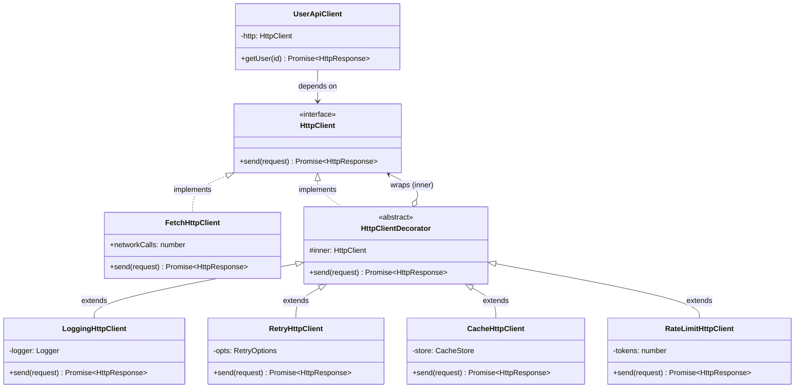

# Decorator Pattern — Class Diagram

Shows the four participants. Both the Concrete Component and the abstract Decorator
implement the **same** Component interface (`HttpClient`). The abstract Decorator also
*holds* an `HttpClient` (the `inner` field) — that combination of "implements the
interface" **and** "holds the interface" is what lets decorators wrap each other and
stack recursively. Each Concrete Decorator adds exactly one responsibility.

**How to read it**
- `<|..` (dashed, hollow triangle) = *implements interface*. Both `FetchHttpClient` and the abstract `HttpClientDecorator` implement `HttpClient`.
- `<|--` (solid, hollow triangle) = *extends class*. Each concrete decorator extends the abstract `HttpClientDecorator`.
- `o-->` (hollow diamond) = *aggregation / holds a reference*. The decorator holds an `HttpClient` as its `inner` — and because that field is typed as the **interface**, `inner` can itself be another decorator. That is the recursion that makes stacking possible.
- `UserApiClient` (the Client) has an arrow only to the `HttpClient` **interface** — never to any concrete decorator or to `FetchHttpClient`. That is why the client cannot tell how many layers exist.
