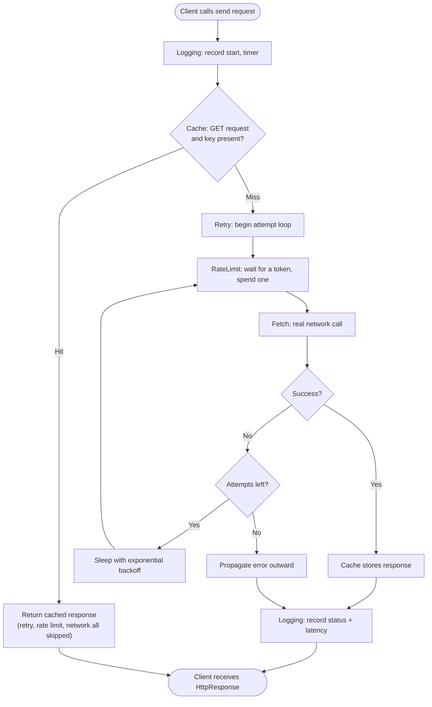

# Decorator Pattern — Flow Diagram

Control flow of a single `send()` call through the recommended stack
`Logging → Cache → Retry → RateLimit → Fetch`. Notice the two ways control can leave
early: a **cache hit** short-circuits everything below the cache, and an exhausted
**retry** loop propagates the error back outward.

**Key idea:** each box belongs to exactly one decorator, and each decorator does its
work then delegates *inward*. The position of a layer decides what it can see and what
it can skip:
- **Cache** is above Retry/RateLimit/Fetch, so a hit avoids all of them (fewer network
  calls, no tokens spent).
- **RateLimit** is inside the cache, so only real network calls spend tokens.
- **Logging** is outermost, so it measures total latency including every retry.

Reorder these boxes and the behavior changes — that is the defining lesson of the
Decorator pattern.
