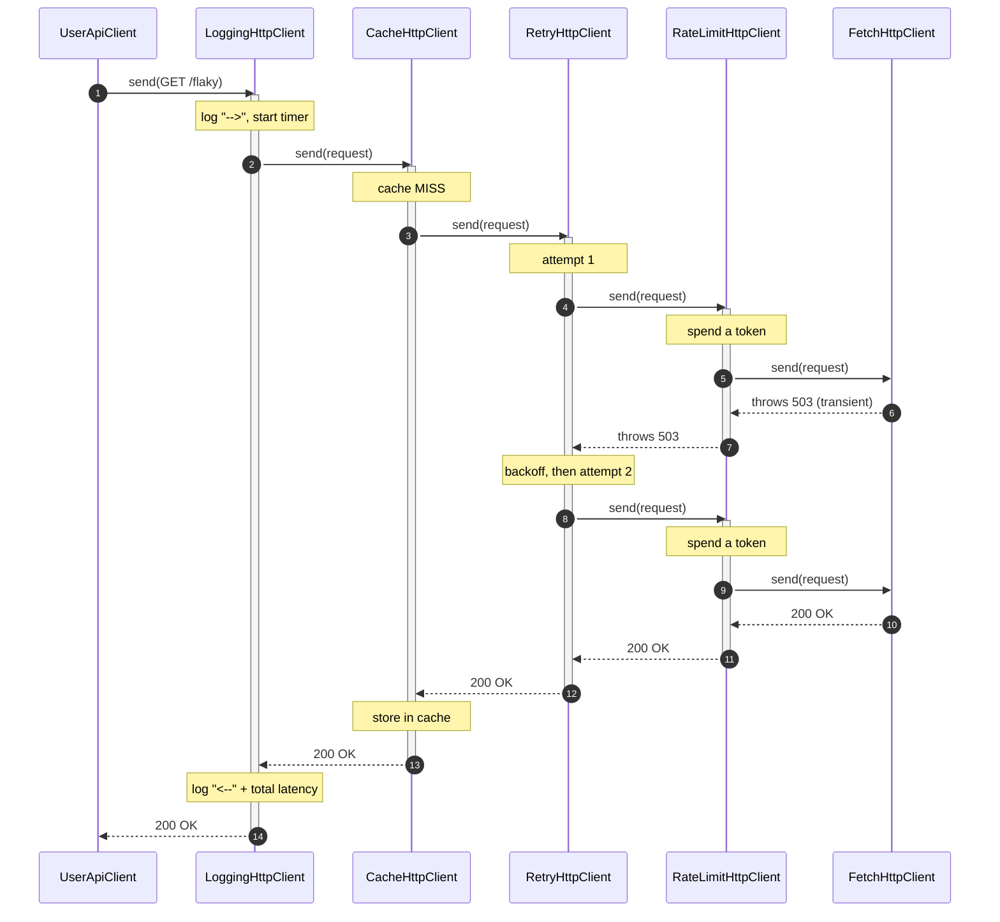

# Decorator Pattern — Sequence Diagram

Runtime message exchange for one call to a *flaky* endpoint through the recommended
stack `Logging → Cache → Retry → RateLimit → Fetch`. The first network attempt fails
transiently; the retry decorator backs off and tries again; the second attempt
succeeds; the cache stores the result; and logging reports the total latency. Every
arrow is the same `send(request)` call — that uniformity is the whole point.

**How to read it**
- Every participant exposes the identical `send(request)` method; the request travels
  *inward* (left to right in construction terms, top to bottom here) and the response
  unwinds *outward*.
- The **Retry** layer is the only one that loops: attempt 1 fails, it sleeps (backoff),
  attempt 2 succeeds. Both attempts pass through the **RateLimit** layer, so each real
  attempt spends a token — a consequence of Retry sitting *outside* RateLimit.
- The **Cache** stores the response only after a successful miss; a later identical GET
  would return at the `cache MISS` note as a hit and never reach Retry/RateLimit/Fetch.
- The **Logging** layer, being outermost, measures the latency of the entire operation
  — including the failed attempt and the backoff — which is exactly why it belongs on
  the outside.
