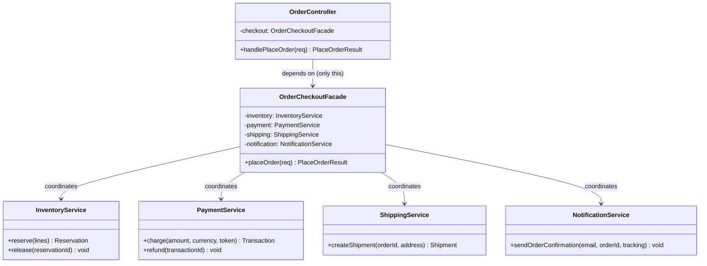
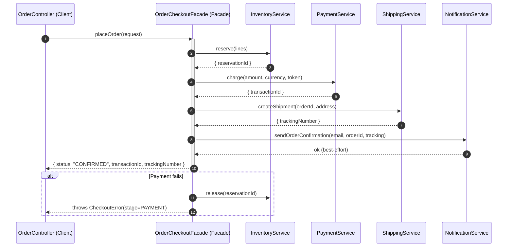
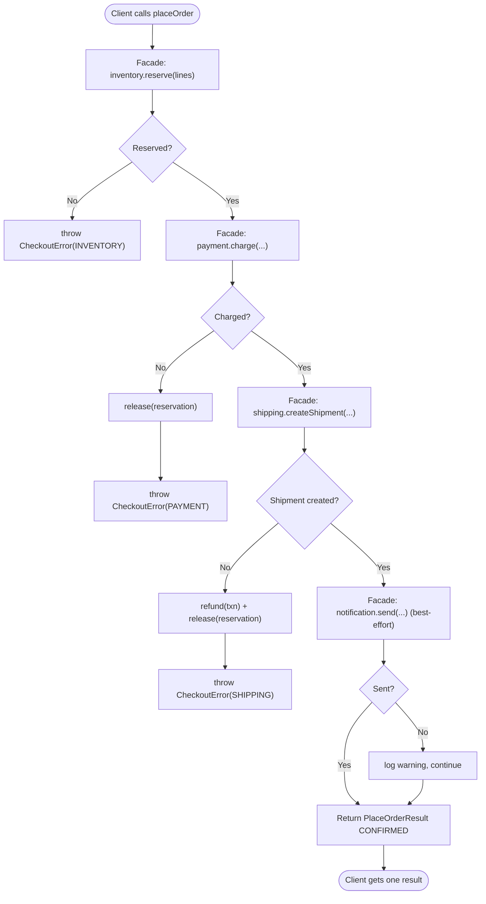

# Facade Pattern

## Intent

Provide a single, simplified, high-level interface to a set of interfaces in a complex subsystem, so clients can perform a common task through one entry point instead of orchestrating many collaborating classes themselves.

## Real Life Analogy

Think about ordering food at a restaurant. Behind the scenes there is a genuinely complex subsystem: a chef, a grill station, a salad station, a fryer, a dishwasher, an inventory pantry, a billing terminal. If you had to coordinate all of them yourself — walk into the kitchen, tell the grill cook the temperature, check the pantry for tomatoes, fire the fryer, then reconcile the bill — eating out would be exhausting and error-prone.

Instead, you talk to **one waiter**. You say "I'll have the burger meal." The waiter knows the correct sequence: send the ticket to the right stations, in the right order, collect the plates, bring them out, and later hand you one bill. The waiter does not *cook* — the waiter has no cooking skill of their own. The waiter simply **coordinates the kitchen's existing capabilities behind one friendly interface**.

The Facade Pattern is that waiter. Your complex subsystem (kitchen) stays exactly as it is. You add one class (the waiter) that offers a simple, task-oriented method ("place order") and, behind that method, calls the right subsystem classes in the right order. And crucially: if a regular customer wants to walk into the kitchen and talk to the chef directly, nothing stops them — the facade is the *easy* path, not the *only* path.

## Problem

### What engineering problem exists?

In real backend systems, a single business action almost never maps to a single technical call. Consider "place an order" in an e-commerce backend. To do it correctly you must:

- **Reserve inventory** so two customers cannot buy the last unit (Postgres row locks + Redis counters).
- **Charge the payment** through a provider (Stripe/Razorpay).
- **Create a shipment** and fetch a tracking number from a carrier API.
- **Send a confirmation** email/SMS to the customer.

These four subsystems are separate classes/services, each with its own API, its own failure modes, and — importantly — **ordering rules and rollback rules**: you must reserve stock *before* charging; if the charge fails you must release the reservation; if shipment creation fails you must both refund *and* release. The email is best-effort — a bounced email must not undo a paid, shipped order.

> **Term: Subsystem.** A group of classes/services that together implement a chunk of functionality (inventory, payment, shipping, notification). Individually each is coherent, but *using them together correctly* requires knowledge that lives outside any single one of them.

If every place that needs to place an order — the REST controller, a GraphQL resolver, an admin tool, a background retry job, a CLI script — has to know this entire dance, that knowledge gets copy-pasted and drifts.

### Why is this problem difficult?

- **The orchestration knowledge is real and non-trivial.** The correct order of calls and the compensating rollback logic is genuine domain knowledge. Getting it wrong means charging customers for out-of-stock items or double-charging.
- **Clients get coupled to many classes at once.** A controller that news up and calls four services now depends on all four constructors, all four APIs, and all four error types. Change any subsystem's signature and every client breaks.
- **The same sequence is needed in many places.** Web request, mobile API, admin panel, and a Kafka consumer might all place orders. Four copies of the sequence means four chances to forget the refund-on-failure step.

### What happens if we ignore it?

- **Duplicated orchestration.** The reserve→charge→ship→notify sequence is pasted across controllers and jobs; the copies diverge; one forgets to release stock on payment failure and you leak inventory.
- **Client bloat and tight coupling.** Controllers balloon with plumbing and become impossible to read or unit-test. Every subsystem change causes *shotgun surgery* — edits scattered across many unrelated files.
- **Leaky low-level errors.** Callers must catch `InsufficientStockError`, `CardDeclinedError`, `CarrierUnavailableError` individually. The application layer becomes a graveyard of subsystem-specific try/catch blocks.
- **Hard onboarding.** A new engineer must understand four subsystems just to add one button that places an order.

## Why Not Other Solutions?

**"Just let each client call the four services directly."**
This is the status quo the Facade fixes. It couples every caller to four subsystems, duplicates the ordering/rollback logic, and turns every subsystem change into a multi-file edit. Business logic and orchestration plumbing get tangled together.

**"Put the sequence in a shared utility function."**
A free function is a weak first step, but it has no identity, no injected dependencies, and no clear ownership. It tends to grow untyped parameters, reach for global singletons, and become impossible to unit-test because it constructs its own collaborators. A class with injected subsystems (a proper facade) is testable and discoverable.

**"Merge the four subsystems into one giant OrderService class."**
This destroys the subsystems' independence. Inventory, payment, and shipping have genuinely different responsibilities, scaling profiles, and teams. Fusing them violates the Single Responsibility Principle and creates an unmaintainable God class that cannot be reused or tested in isolation. The Facade *coordinates* the subsystems without *absorbing* them.

**"Use an Adapter."**
An Adapter changes *one* class's interface into a *different expected* interface. It does not simplify or orchestrate *many* classes. If your problem is "these four things are hard to use together," Adapter is the wrong tool — it solves "this one thing has the wrong shape."

**"Use a Mediator / event bus so subsystems coordinate themselves."**
A Mediator lets peer objects talk to each other bidirectionally to reduce their mutual coupling. That is heavier and different: the Facade is a *one-directional*, top-down simplification (client → subsystem), and the subsystems remain unaware of it. Reach for a Mediator when the objects themselves need to collaborate as peers, not when a client needs an easy front door.

**Tradeoff summary:** Every alternative either duplicates orchestration, couples clients to many classes, collapses independent subsystems into one blob, or solves a different problem. The Facade puts the orchestration in exactly one well-named, injectable, testable place while leaving the subsystems intact and directly usable.

## Solution

The core idea: **introduce one high-level class — the Facade — that exposes a small, task-oriented interface and, behind each method, calls the subsystem classes in the correct order.**

Your client depends only on the Facade. It calls `checkout.placeOrder(request)` and gets back a single result or a single domain error. Inside `placeOrder`, the Facade holds references to the subsystem services (injected via its constructor) and performs the reserve→charge→ship→notify sequence, including the compensating rollback if a later step fails.

The thinking behind it:

1. **Simplify the common path.** 90% of callers want the same thing: "place an order." Give them one method for it. Do not force them to learn the subsystem to do the common thing.
2. **Localize orchestration knowledge.** The "correct order and rollback" is real knowledge; it belongs in exactly one place so it cannot drift. The Facade is that place.
3. **Decouple clients from subsystems.** Clients depend on one small interface, not on four. Subsystem signature changes stop rippling into controllers.
4. **Do not seal the subsystem off.** The Facade adds *no new capability* and does *not* hide the subsystem. Advanced code (a refund tool, a data-migration script) can still call `PaymentService` directly. The Facade is the convenient front door, not a wall.

You do **not** merge the subsystems. You do **not** add new business logic to the Facade. You add one coordinating class in front of the existing ones.

## Architecture

There are three kinds of participants:

1. **Facade (`OrderCheckoutFacade`):** The single high-level entry point. It exposes task-oriented methods (`placeOrder`). It holds references to the subsystem classes and knows the correct sequence and rollback rules. Its responsibility is *coordination and simplification* — never new business capability.

2. **Subsystem classes (`InventoryService`, `PaymentService`, `ShippingService`, `NotificationService`):** The complex collaborators that do the real work. Each is coherent, independent, and unaware both of the Facade and of each other. They can be used directly by advanced clients.

3. **Client (`OrderController`):** Your application/entry code. It depends only on the Facade and calls one method. It knows nothing about ordering, rollback, or the individual subsystems.

Responsibilities in one line each:
- **Facade:** offers the easy method; sequences and coordinates subsystems.
- **Subsystem classes:** do the real work; independent and reusable.
- **Client:** asks the Facade to perform a task; stays thin.

> **Term: God object.** A class that accumulates too many responsibilities and knows about too much. A Facade risks becoming one if you keep piling business logic into it. The cure: the Facade must *delegate* all real work to subsystems and only *sequence* it — a "thin" facade, not a "leaky" one that reimplements subsystem logic.

## Execution Flow

1. At application startup (composition root / DI container), you create each **subsystem** instance (`InventoryService`, `PaymentService`, `ShippingService`, `NotificationService`).
2. You create the **Facade**, injecting all four subsystems into its constructor.
3. You inject the **Facade** into the **Client** (`OrderController`).
4. The Client calls one method: `checkout.placeOrder(request)`.
5. The Facade calls `inventory.reserve(lines)` **first** — never charge for stock you may not have. It stores the `reservationId`.
6. The Facade calls `payment.charge(...)`. If it throws, the Facade **releases the reservation** and throws a single `CheckoutError` tagged `PAYMENT`.
7. The Facade calls `shipping.createShipment(...)`. If it throws, the Facade **refunds the payment and releases the reservation**, then throws `CheckoutError` tagged `SHIPPING`.
8. The Facade calls `notification.sendOrderConfirmation(...)` as **best-effort**. If it throws, the Facade logs a warning and continues — a bounced email must not undo a completed order.
9. The Facade returns one `PlaceOrderResult` (`{ orderId, status: "CONFIRMED", transactionId, trackingNumber }`).
10. The Client receives one result (or one domain error) and continues — never having touched a subsystem directly.

## Class Diagram

## Sequence Diagram

## Flow Diagram

## Implementation

The implementation strategy in TypeScript:

1. **Design the Facade method around the task, not the subsystems.** The public method is `placeOrder(request)` — a business verb — not `reserveThenChargeThenShip(...)`. Callers think in tasks.

2. **Inject the subsystems via the constructor.** The Facade must not `new` its own subsystems; that hardwires configuration and destroys testability. Constructor injection lets you pass fakes in tests and lets a DI container (NestJS) wire real ones in production. This is the Dependency Inversion Principle.

3. **Keep the Facade thin.** Each subsystem call is one line of delegation. The only logic the Facade owns is *sequencing* and *compensating rollback* — the cross-cutting orchestration that has no other home. No pricing math, no tax rules, no inventory algorithms; those live in the subsystems.

4. **Translate low-level failures into one domain error.** The Facade catches each subsystem's specific error and rethrows a single `CheckoutError` tagged with the stage. The client catches one type.

5. **Distinguish fatal from best-effort steps.** Reserve/charge/ship are fatal (roll back on failure). Notify is best-effort (log and continue). Encoding this in the Facade is exactly the orchestration knowledge you are centralizing.

6. **Do not seal the subsystems.** They stay `public` and independently usable. The Facade is an addition, not a gate.

We demonstrate this with a realistic `OrderCheckoutFacade` coordinating four services, including the compensating rollback that is the hard part callers should not have to reimplement.

## Code Walkthrough

See [code.ts](code.ts) for the full runnable implementation. Here is what each part does and why it exists.

**`PlaceOrderRequest` / `PlaceOrderResult` / `CheckoutError` (shared domain types).**
These are the vocabulary of the *task*, not of any subsystem. `CheckoutError` carries a `stage` field (`INVENTORY | PAYMENT | SHIPPING | NOTIFICATION`) so the client learns *where* it failed without catching four different subsystem error classes. They exist so the Facade's surface speaks the client's language.

**`InventoryService`, `PaymentService`, `ShippingService`, `NotificationService` (subsystem classes).**
Each does real work behind a low-level API (`reserve`/`release`, `charge`/`refund`, `createShipment`, `sendOrderConfirmation`). In production these wrap Postgres, Redis, a payment SDK, a carrier API, and an email provider. They are independent, know nothing about each other, and could each be used directly. They exist to represent the genuinely complex subsystem the Facade fronts.

**`OrderCheckoutFacade` (the Facade).**
Its constructor takes all four subsystems (injected, never constructed internally). Its one public method, `placeOrder`, encodes the orchestration: reserve first, then charge (release on failure), then ship (refund + release on failure), then notify (best-effort). The private `safeRelease` and `safeRefund` helpers hold the compensating-rollback knowledge and swallow rollback errors so they never mask the original failure. This class exists to make placing an order *one call* and to be the single owner of the cross-subsystem sequence. Note it adds **no** new capability — every real action is a subsystem method.

**`OrderController` (the Client).**
Holds only an `OrderCheckoutFacade`. Its handler is essentially one line: `await this.checkout.placeOrder(req)`. It exists to prove the payoff — the caller has zero knowledge of ordering, rollback, or the four subsystems, and would not change if a fifth step (fraud check) were added inside the Facade.

**Composition root (`buildOrderController`).**
Creates the four subsystems, injects them into the Facade, injects the Facade into the Controller. In a NestJS app this is precisely what the module's `providers` array and the DI container do for you.

**Interactions.**
At runtime the Client calls one Facade method; the Facade fans that single call out to several subsystem calls in a fixed order, compensates on failure, and returns one result. To add a step (say, a fraud check before charging) you edit *only* the Facade — no client changes. To do an *unusual* thing (issue a standalone refund) you bypass the Facade and call `PaymentService` directly, which the pattern explicitly permits.

## Advantages

- **Simpler client code.** Callers perform a complex task with one method call and reason about one result and one error type.
- **Decoupling from subsystems.** Clients depend on the Facade only; subsystem signature changes stop rippling into every caller.
- **Single source of orchestration truth.** The reserve→charge→ship→notify order and its rollback live in exactly one place and cannot drift across copies.
- **Single Responsibility at the boundary.** Orchestration lives in the Facade; business rules live in the subsystems; entry concerns live in the client.
- **Better testability of clients.** A controller test can inject a fake Facade and never touch four subsystems.
- **Layering.** A Facade naturally becomes your application/service layer, giving a clean seam between transport (HTTP/GraphQL) and domain subsystems.
- **Subsystems stay reusable.** Because the Facade does not seal them off, they remain directly usable for advanced/edge cases.

## Disadvantages

- **Risk of becoming a God object.** If you keep adding responsibilities, the Facade swells into an unmaintainable class that knows about everything.
- **Can hide too much.** A poorly designed Facade obscures useful subsystem capabilities, tempting callers to work around it or forcing you to keep widening its interface.
- **Another layer to maintain.** One more class, one more thing to name and keep in sync as subsystems evolve.
- **Leaky facade risk.** If the Facade starts reimplementing subsystem logic (a "leaky" facade) rather than delegating, it duplicates and diverges from the real logic.
- **Not a security boundary.** Because subsystems remain accessible, a Facade does not *enforce* that everyone uses the easy path; it only offers it. Enforcement needs other mechanisms (module visibility, access control).

## Tradeoffs

**What we gain:** a simple task-oriented API, decoupling of clients from subsystems, one authoritative place for orchestration and rollback, a clean application/service layer, and thin, testable clients.

**What we lose:** some directness (one more hop), and we take on the ongoing discipline of keeping the Facade *thin*. The pattern's entire value depends on that discipline — a Facade that absorbs business logic becomes a God object and is worse than no facade at all. We also accept that the Facade is a convenience, not an enforced boundary: if you truly need to prevent direct subsystem access, the Facade alone will not do it.

## Complexity

**Code Complexity:** Low. The Facade is a thin coordinator; each method is a short, readable sequence of delegations plus rollback. Complexity concentrates where it belongs (the orchestration) instead of being smeared across clients.

**Maintenance Complexity:** Low to moderate. Adding/removing a step touches one class. The risk is scope creep — without discipline the Facade grows. Watch its size as a health metric.

**Scalability:** The Facade adds no runtime bottleneck; it is a coordinator, not a data path. For *organizational* scalability it shines: teams own subsystems, the Facade owns the workflow, and callers stay decoupled. In distributed systems the same idea scales up into an **API Gateway** (see Similar Patterns).

**Flexibility:** High for the common path (change the workflow in one place). Lower for unusual needs — but those can bypass the Facade and use subsystems directly, which preserves flexibility.

**Testability:** High. Inject fake subsystems to unit-test the Facade's ordering and rollback precisely; inject a fake Facade to test clients. The compensating logic is exactly the kind of thing you want covered by fast unit tests.

## Performance Considerations

**Memory:** The Facade holds a handful of references to already-existing subsystem singletons — negligible. It allocates one request/result object per call.

**CPU:** One extra function call per operation plus trivial branching for rollback. Immeasurable against the I/O the subsystems perform.

**Network:** The Facade issues no network calls itself, but it is where you *see* the fan-out: one client call becomes several subsystem calls (DB, payment API, carrier API, email). Be deliberate about which run sequentially (payment must follow reservation) versus which could run in parallel (`Promise.all`) when there is no ordering dependency. The Facade is the right place to make that call.

**Database:** Orchestration often spans multiple stores. The Facade is where you decide the consistency strategy — a database transaction when all steps share one DB, or **compensating actions** (the refund/release in this example, i.e. a Saga) when they do not. Getting this wrong leaks inventory or double-charges.

**Object creation:** Facades are created once at startup (singletons in a DI container). Do not create one per request unless it must hold per-request state.

**Runtime:** The overhead is a constant, tiny per-call cost. The Facade is chosen for maintainability and correctness of orchestration, not speed; its own runtime impact is effectively zero in I/O-bound backends.

## Common Mistakes

- **Letting the Facade become a God object.** Business rules, validation, pricing, and logging all pile in until it is thousands of lines. *Why it happens:* the Facade is a convenient dumping ground. *Avoid:* the Facade only *sequences*; every real action is a subsystem method. If a method has non-orchestration logic, push it into a subsystem.

- **A leaky facade that reimplements subsystem logic.** Instead of calling `inventory.reserve`, it does the SQL itself "to save a hop." *Why:* short-term convenience. *Avoid:* the Facade must delegate; it may never duplicate a subsystem's internals.

- **Constructing subsystems inside the Facade.** `new PaymentService()` in the constructor hardwires config and kills testability. *Why:* convenience. *Avoid:* inject subsystems via the constructor / DI container.

- **Using the Facade as a security boundary.** Assuming "everyone must go through the Facade" when subsystems are still public. *Why:* confusing "the easy path" with "the only path." *Avoid:* if you need enforcement, use module encapsulation or access control — not just a facade.

- **One mega-facade for the whole application.** A single `AppFacade` fronting every subsystem recreates the God object at application scale. *Avoid:* one facade per cohesive workflow/use-case (checkout, onboarding, refund).

- **Confusing Facade with Adapter.** Adding a facade when the real problem is one class with the wrong interface. *Why:* both "wrap." *Avoid:* ask "am I *simplifying many* classes (Facade) or *changing one* class's interface to an expected one (Adapter)?"

- **Forgetting rollback / partial-failure handling.** Wiring the happy path only, so a payment failure leaves stock reserved forever. *Avoid:* the orchestration you centralize *is* the failure handling — design it first.

## When To Use

- **A single business action spans several services** and you want callers to invoke it with one method (checkout, user onboarding, media processing, report generation).
- **You want a clean application/service layer** between your transport layer (controllers/resolvers) and your domain subsystems — the Facade is that layer.
- **You are integrating a complex library or set of libraries** and want to expose only the handful of operations your app actually uses.
- **The correct call order and rollback are non-trivial** and must not be duplicated across callers.
- **You want to decouple clients from subsystems** so subsystem changes do not ripple everywhere.
- **You are onboarding new engineers** and want an obvious, well-named front door for common tasks.

## When NOT To Use

- **The subsystem is already simple** — a single class with a clear method needs no facade; that is needless indirection.
- **Callers genuinely need fine-grained control** over each subsystem step — a facade would just get in their way (let them use subsystems directly).
- **You actually need to change one class's interface to a different expected one** — that is an **Adapter**, not a Facade.
- **You need to add behavior while keeping the same interface** — that is a **Decorator**.
- **You need to control access to one object** (lazy load, cache, permission check) with the *same* interface — that is a **Proxy**.
- **Peer objects need to coordinate bidirectionally** — that is a **Mediator**, not a top-down Facade.
- **You are tempted to build one facade for the entire app** — split by use-case instead, or you rebuild the God object.

## Real Production Examples

- **Node.js:** High-level modules front lower-level ones — `fs.promises.readFile` is a simple facade over `open`/`read`/`close` file-descriptor calls. `child_process.exec` is a facade over the lower-level `spawn` plumbing.
- **NestJS:** The **service/application layer** is the canonical facade. A `CheckoutService` (`@Injectable`) that coordinates injected `InventoryService`, `PaymentService`, and `ShippingService` is a textbook Facade, and NestJS's DI container wires the subsystems in for you.
- **Express:** A route handler that delegates to one "use-case" service which orchestrates repositories, a mailer, and a queue is acting as a facade over that workflow.
- **Java Spring:** Spring's `JdbcTemplate` is a facade over the verbose JDBC subsystem (connection, statement, result-set, exception handling). `@Service`-annotated application services routinely act as facades over repositories and other services.
- **.NET:** `HttpClient` is a facade over sockets, TLS, connection pooling, and HTTP framing. Many `IHostedService`/application services front several infrastructure services.
- **AWS:** The AWS SDK clients are facades over the underlying REST/JSON signing, retry, and pagination machinery. **AWS Step Functions** and higher-level SDK "document" clients (e.g. DynamoDB `DocumentClient`) simplify a complex subsystem. **API Gateway** is the distributed-systems cousin of Facade (one endpoint fronting many microservices).
- **Azure:** `BlobServiceClient` fronts the REST storage API; **Azure API Management** and Durable Functions orchestrators are facade-like fronts over multi-service workflows.
- **Google Cloud:** `@google-cloud/*` client libraries are facades over the raw gRPC/REST APIs; **Apigee** is the API Gateway analog.
- **React (if applicable):** A custom hook like `useCheckout()` that hides several context reads, API calls, and cache updates behind one function is a UI-side facade.
- **Databases:** An ORM (Prisma, TypeORM) is a large facade over connection pooling, SQL generation, transactions, and result mapping. A repository class is a small facade over query builders.
- **AI Systems:** A `RagPipeline.answer(question)` facade coordinating an embedder, a vector store, a retriever, a reranker, and an LLM client — one method hiding a multi-stage pipeline. LangChain "chains" are facades over multi-step LLM workflows.

## Where I Can Use This

Five realistic ideas for your own backend projects:

1. **Checkout facade (this example).** An `OrderCheckoutFacade` in your NestJS service coordinating inventory, payment, shipping, and notification, with compensating rollback — one endpoint, one call.
2. **Onboarding facade.** An `OnboardingFacade.register(dto)` that coordinates `AuthService` (create account), `BillingService` (start trial), and `EmailService` (send welcome), rolling back the account if billing setup fails.
3. **Media conversion facade.** A `MediaConversionFacade.transcode(file, target)` fronting IO (read/write), a decoder, a filter/scaler, and an encoder/muxer — callers just ask for the output format.
4. **RAG / AI facade.** A `RagFacade.answer(question)` over embedder + vector store + reranker + LLM client, so product code never wires the pipeline by hand.
5. **Reporting facade.** A `ReportFacade.monthlyRevenue(month)` coordinating several read repositories, a currency-conversion service, and a PDF/CSV renderer behind one method.

## Similar Patterns

- **Adapter:** Changes *one* class's interface into a *different expected* interface so incompatible code can plug in. Facade *invents a new, simpler* interface over *many* classes. Adapter is about compatibility; Facade is about simplification. A Facade may internally *use* adapters (e.g. its `PaymentService` might itself be an adapter over a vendor SDK).
- **Mediator:** Coordinates a set of *peer* objects that talk to it *bidirectionally* to reduce their mutual coupling; the peers know the mediator. Facade is *one-directional* (client → subsystem) and the subsystems are *unaware* of it. Mediator restructures collaboration among peers; Facade just fronts a subsystem for a client.
- **Proxy:** Provides a *placeholder with the same interface* to control access (lazy loading, caching, permissions). Facade *defines a new, simpler* interface; Proxy *preserves* the subject's interface. Proxy is about access control; Facade is about simplification.
- **Decorator:** Wraps an object to *add behavior* while keeping the *same* interface. Facade changes/simplifies the interface and adds no behavior of its own.
- **Abstract Factory:** Often used *with* a facade — the factory builds and wires the subsystems, the facade uses them. Different intent: creation vs. simplification.
- **API Gateway (distributed systems):** The Facade pattern applied across the network — a single service endpoint fronting many backend microservices, handling routing, aggregation, auth, and rate limiting. Same simplification idea, at infrastructure scale.

| Pattern         | Changes interface?      | Adds behavior? | Direction        | Intent                                   | Wraps           |
|-----------------|-------------------------|----------------|------------------|------------------------------------------|-----------------|
| Facade          | Yes (invents simpler)   | No             | Client → subsystem | Simplify a complex subsystem             | Many classes    |
| Adapter         | Yes (to an expected one)| No             | Client → adaptee | Make one incompatible interface fit      | One adaptee     |
| Mediator        | No (new hub API)        | No             | Peer ↔ peer      | Decouple peers coordinating together     | Many colleagues |
| Proxy           | No (same interface)     | Controls access| Client → subject | Placeholder / access control             | One subject     |
| Decorator       | No (same interface)     | Yes            | Client → component | Add responsibilities dynamically         | One component   |
| API Gateway     | Yes (simplifies)        | Sometimes      | Client → services | Facade across the network                | Many services   |

## Interview Discussion

Experienced engineers rarely discuss the Facade as a toy "computer startup" example. They discuss it as **the application/service layer** in a layered architecture — the seam between transport (controllers) and domain (subsystems) — and immediately raise the failure modes.

Common follow-up questions:
- *"How do you keep a facade from becoming a God object?"* Keep it thin: it only sequences; all real work is delegated to subsystems. Split facades by use-case, not one per app. Track its size.
- *"Facade vs Adapter vs Mediator?"* Facade simplifies *many* classes for a client (one-directional); Adapter changes *one* class's interface to an expected one; Mediator coordinates *peers* bidirectionally.
- *"Does a facade hide the subsystem?"* No — it offers the easy path but does not seal the subsystem off; advanced clients can still use it directly. If you need true enforcement, that is encapsulation/access control, not Facade.
- *"How do you handle partial failure across subsystems?"* Compensating actions (Saga): release stock, refund payment. Decide fatal vs best-effort per step. This *is* the orchestration you centralize.
- *"How does this scale to microservices?"* The same idea becomes an API Gateway or a Backend-for-Frontend (BFF): one endpoint fronting many services.
- *"Where does the DB transaction boundary go?"* Ideally in the facade/application layer; if steps span stores, you cannot use one transaction and must use compensations.

Common misconceptions:
- "Facade and Adapter are the same." No — simplification of many vs. interface-change of one.
- "A facade adds new functionality." It should not; it only coordinates existing capabilities.
- "A facade hides/forbids direct subsystem use." It offers convenience, not enforcement.
- "One big facade is fine." That is a God object; split by use-case.

## Summary

- The Facade provides one simplified, high-level interface over a complex subsystem so clients perform common tasks with a single call.
- Three participants: Facade (simplified entry point), Subsystem classes (the real workers), Client (uses only the Facade).
- The Facade **coordinates** existing capabilities in the correct order (and handles rollback); it adds **no new** business functionality.
- It does **not** seal the subsystem — advanced clients may still use subsystem classes directly. The Facade is the easy path, not the only path.
- In NestJS/Spring the facade is your **service/application layer**; in distributed systems it grows into an **API Gateway**.
- Keep it **thin**: sequence and delegate. A leaky or bloated facade becomes a God object and defeats the purpose.

## Key Takeaways

1. Facade = one simple front door to a complex subsystem of many classes.
2. It simplifies and coordinates; it invents a new easy interface over *many* classes (Adapter changes *one*).
3. It adds no new capability — every real action is delegated to a subsystem.
4. It does not hide the subsystem; direct access stays possible (convenience, not enforcement).
5. Inject subsystems into the facade for testability and DI; never `new` them inside.
6. Centralize the correct call order and compensating rollback in the facade so it cannot drift.
7. Keep the facade thin — a leaky or God-object facade is worse than none.
8. Split facades by use-case; avoid one mega-facade for the whole app.
9. It is your NestJS/Spring service layer, and it scales up to the API Gateway pattern.
10. Distinguish it from Adapter (change one interface), Mediator (peer coordination), Proxy (access control), and Decorator (add behavior).

---

## Further Reading

**Books**
- *Design Patterns: Elements of Reusable Object-Oriented Software* — Gamma, Helm, Johnson, Vlissides (the "Gang of Four"), the original Facade definition.
- *Head First Design Patterns* — Freeman & Robson (approachable Facade chapter with the home-theater example).
- *Patterns of Enterprise Application Architecture* — Martin Fowler (Service Layer, which is Facade in practice).
- *Domain-Driven Design* — Eric Evans (application services as facades over the domain).
- *Microservices Patterns* — Chris Richardson (API Gateway and Saga / compensating transactions — the distributed cousins of Facade).

**Open Source Projects / GitHub Repositories**
- NestJS — service-layer providers as facades over injected subsystems — https://github.com/nestjs/nest
- Prisma — a large facade over connection pooling, SQL generation, and mapping — https://github.com/prisma/prisma
- Spring Framework — `JdbcTemplate` as a facade over JDBC — https://github.com/spring-projects/spring-framework

**Official Documentation**
- Refactoring.Guru — Facade — https://refactoring.guru/design-patterns/facade
- NestJS Docs — Providers & Dependency Injection — https://docs.nestjs.com/providers
- Microsoft — API Gateway pattern — https://learn.microsoft.com/azure/architecture/microservices/design/gateway

**Blog Articles**
- Martin Fowler — "PresentationDomainDataLayering" and "Service Layer" — https://martinfowler.com/
- Refactoring.Guru — Facade in TypeScript — https://refactoring.guru/design-patterns/facade/typescript/example
- Chris Richardson — "Pattern: API Gateway / Backends for Frontends" — https://microservices.io/patterns/apigateway.html

**Research / Foundational**
- Hector Garcia-Molina & Kenneth Salem — "Sagas" (1987) — the foundation of compensating transactions used in the facade's rollback logic.
