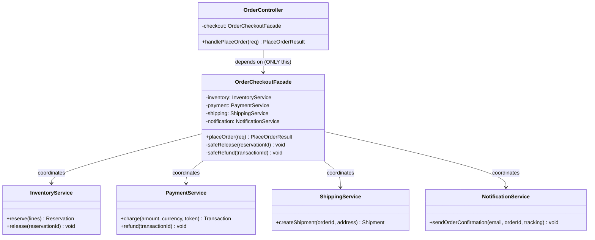

# Facade Pattern — Class Diagram

Shows the three kinds of participants. The Client depends only on the Facade.
The Facade holds references to (coordinates) the four independent subsystem
classes. Notice there is **no arrow from Client to any subsystem** — that is the
whole point: the client is decoupled from the subsystem.

**How to read it**
- `-->` = *association / holds a reference*. The Facade holds all four subsystems (injected via its constructor); the Client holds only the Facade.
- The Facade's public surface is tiny (`placeOrder`); the private `safeRelease` / `safeRefund` are its compensating-rollback helpers — orchestration knowledge that lives here and nowhere else.
- The subsystems have **no arrows to each other** — they are independent and unaware both of one another and of the Facade.
- Because there is no `Client → subsystem` arrow, swapping or changing a subsystem's signature ripples only into the Facade, never into callers.
