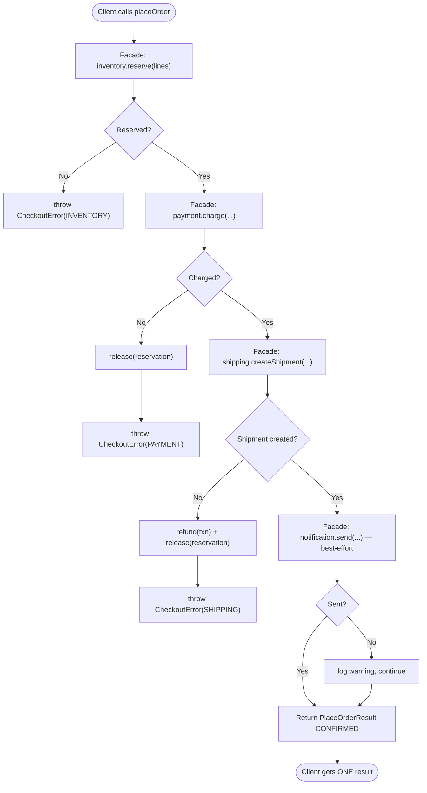

# Facade Pattern — Flow Diagram

Step-by-step control flow of one `placeOrder()` call through the facade, including
the compensating-rollback branches (release stock / refund) on partial failure and
the best-effort notification step.

**Key idea:** every green-path box is a single *delegation* to a subsystem — the
facade does no real work itself. The value the facade adds is the **ordering** (reserve
before charge, charge before ship) and the **compensating rollback** on failure. Note
the asymmetry: reserve/charge/ship are *fatal* (roll back and throw), while notify is
*best-effort* (log and continue) — you never undo a paid, shipped order because an
email bounced. That fatal-vs-best-effort decision is exactly the orchestration
knowledge the facade centralizes so it cannot be duplicated or forgotten by callers.
