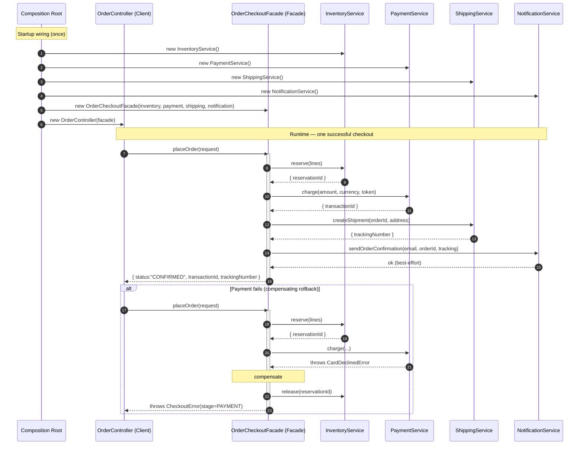

# Facade Pattern — Sequence Diagram

Shows the runtime message exchange for one checkout, including the composition-root
wiring, the happy-path fan-out to four subsystems, and the compensating-rollback
path when payment fails.

**How to read it**
- The **Composition Root** creates the four subsystems, injects them into the **Facade**, and injects the Facade into the **Client** — done once at startup (in NestJS this is the DI container).
- At runtime the Client sends exactly **one** message (`placeOrder`); the Facade fans it out into several ordered subsystem calls. One client call → many subsystem calls is the visible signature of a Facade.
- The Facade is the only participant that knows the *order* of calls and the *rollback* rules. The subsystems never message each other.
- The `alt` block shows the compensating action: when payment throws, the Facade releases the earlier reservation and surfaces a single `CheckoutError` (tagged with the stage) — the client never sees the subsystem-specific `CardDeclinedError`.
