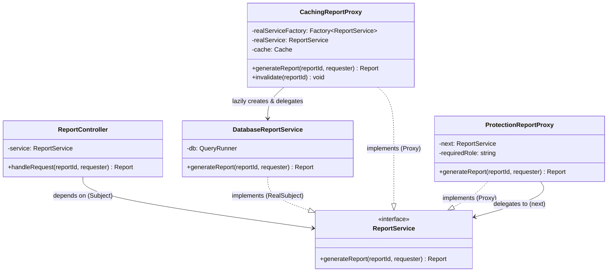
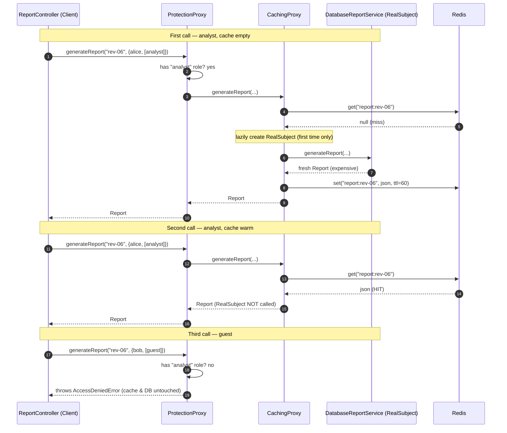
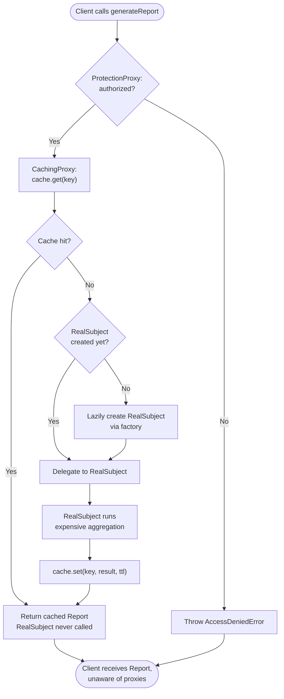

# Proxy Pattern

## Intent

Provide a surrogate or placeholder object that exposes the **same interface** as a real object, so it can stand in for that object and **control access to it** — adding things like lazy creation, caching, access control, or logging without the client ever knowing.

## Real Life Analogy

Think of a **celebrity's personal assistant**. If you want to book the celebrity for an event, you do not call the celebrity directly — you call the assistant. The assistant exposes the *same* "service" from your point of view: you make a request, you get an answer. But the assistant sits in the middle and *controls access*:

- They check whether you are allowed to talk to the celebrity at all (**access control**).
- They only wake the celebrity up when a request is genuinely worth it (**lazy activation**).
- If ten reporters ask "what is the tour date?", the assistant answers from memory instead of bothering the celebrity ten times (**caching**).
- They write down who called and when (**logging**).

From your side, you cannot tell whether you reached the celebrity or the assistant — the interface is identical. That is exactly a proxy: a stand-in that looks like the real thing but quietly manages *how and when* you actually reach it.

## Problem

### What engineering problem exists?

In backend systems you constantly work with objects that are **expensive, sensitive, or remote**, and you want to add cross-cutting control around them *without touching the object itself or the code that calls it*:

- A **report/analytics service** runs a multi-second SQL aggregation over millions of rows. Fifty users open the same dashboard and you recompute the identical result fifty times, crushing PostgreSQL.
- A **document service** returns confidential files, and only certain roles may read them — but the service itself has no idea about your auth rules.
- A large object (say a parsed 200 MB machine-learning model, or a PDF renderer) is **costly to construct**, yet most requests never actually need it.
- A dependency lives in **another process or another machine** (a gRPC service, a third-party HTTP API), and your code would like to call it as if it were a local object.

In every case, the *real work* is fine as-is. What you need is a controlled **layer of indirection** in front of it.

> **Term: Layer of indirection.** Instead of the client holding a direct reference to the real object, it holds a reference to a stand-in. That stand-in decides what to do before (and after) forwarding the call. "Any problem in software can be solved by adding a level of indirection" — the proxy is one disciplined way to do it.

### Why is this problem difficult?

- **You should not modify the real object.** The `DatabaseReportService` should do one thing: compute reports correctly (Single Responsibility Principle). Bolting caching, auth, and logging into it turns one clean class into a tangled mess and makes it impossible to reuse without those concerns.
- **You should not modify the client either.** The controllers, jobs, and services that call the report code already work. Sprinkling `if (cache.has(...))` and `if (user.role === 'analyst')` into every call site is duplication that drifts out of sync.
- **The control logic is cross-cutting.** Caching and authorization are not "part of computing a report"; they are policies that wrap it. They belong somewhere *between* caller and real object.

### What happens if we ignore it?

- **Wasted, duplicated work.** The same expensive query runs again and again; your database becomes the bottleneck under load.
- **God objects.** The real service accumulates caching code, auth checks, retry logic, and logging until nobody dares touch it.
- **Scattered policy.** Access-control checks copy-pasted across dozens of call sites — miss one and you have a security hole.
- **Eager cost you never needed.** Constructing heavy objects at startup that most requests never use, wasting memory and slowing boot.

## Why Not Other Solutions?

**"Just put the caching / auth code inside the real service."**
This violates the Single Responsibility Principle: the class now has several reasons to change (query logic changes, cache policy changes, auth rules change). It also makes the "pure" service impossible to use when you *don't* want caching (e.g. an admin tool that must always read fresh data). You have welded a policy onto a mechanism.

**"Add the checks at every call site in the client."**
This is duplication and it is fragile. Every new caller must remember to check the cache and the role. One forgotten check is a stale read or a security breach. Business code gets polluted with infrastructure concerns.

**"Use inheritance — subclass the real service and override methods to add caching/auth."**
Subclassing binds you to one concrete class and to single inheritance. You cannot combine "caching subclass" and "auth subclass" cleanly (you would need a caching-auth subclass, then a logging-caching-auth subclass — a combinatorial explosion). It also breaks when the real subject is created by a factory you do not control.

**"Use a Decorator."**
Very close — a Decorator also shares the interface and wraps the object. But a Decorator's intent is to **add new behavior/responsibilities** to an object it is *handed*. A Proxy's intent is to **control access to** an object whose *creation and lifecycle it usually manages itself* (e.g. it decides whether to create the real object at all, or whether the call is even allowed through). The mechanics rhyme; the intent differs. (Full comparison in [Similar Patterns](#similar-patterns).)

**"Use Aspect-Oriented Programming / interceptors."**
Frameworks like NestJS interceptors and Spring AOP are, under the hood, *generated proxies*. If your framework offers them, use them — but understanding the Proxy pattern is what lets you understand *what those interceptors actually are*.

**Tradeoff summary:** Every alternative either overloads the real object, duplicates policy across callers, or locks you into inheritance. The Proxy isolates the access-control concern into one class that shares the real object's interface, so the client and the real object both stay clean and unaware.

## Solution

The core idea: **introduce a stand-in object that implements the exact same interface as the real object, holds a reference to (or knows how to create) the real object, and controls access to it.**

The client is given something typed as the **Subject** interface. It calls methods on it exactly as if it were the real thing. Behind that interface sits a **Proxy** that decides, on each call, what to do:

- forward the call as-is,
- return a cached answer instead of forwarding,
- refuse the call (authorization failed),
- create the real object first if it does not exist yet (lazy loading),
- log/measure the call and then forward it.

The thinking behind it:

1. **Same interface = transparency.** Because `Proxy` and `RealSubject` both implement `Subject`, the client cannot tell them apart. You can insert, remove, or stack proxies without changing a line of client code (Liskov Substitution Principle).
2. **Separation of concerns.** The real object keeps doing exactly one thing. The policy (cache, auth, lazy init) lives in the proxy. Each has a single reason to change.
3. **The proxy manages the lifecycle.** Unlike a decorator that is handed a ready object, a proxy often controls *whether and when* the real object even comes into existence.

There are four classic **kinds** of proxy, all the same shape, differing only in what "control access" means:

- **Virtual proxy** — delays creating an expensive real object until it is actually needed (lazy initialization).
- **Protection proxy** — checks permissions and only lets authorized calls through (access control).
- **Remote proxy** — a local stand-in for an object that lives in another process/machine; it hides the networking (this is what an RPC/gRPC client stub is).
- **Caching / smart proxy** — stores results, does reference counting, logs, or adds other "smart" behavior around access.

The native JavaScript **`Proxy`** object is a language-level realization of the same idea: it wraps a target and intercepts operations (property reads, method calls) through "traps".

You do **not** modify the client. You do **not** modify the real subject. You add a stand-in between them.

## Architecture

There are four participants:

1. **Subject (interface):** The common contract that both the real object and the proxy implement, e.g. `ReportService` with `generateReport(id, requester)`. This shared interface is what makes the proxy transparent to the client.

2. **RealSubject:** The real object that does the actual work — `DatabaseReportService`. It is intentionally focused: it knows how to compute a report and nothing about caching or auth. The proxy ultimately delegates to it.

3. **Proxy:** The stand-in. It **implements the Subject interface** (so the client accepts it) and **holds a reference to — or a factory for — the RealSubject** (so it can delegate). On each call it performs its access-control job (cache, authorize, lazy-create, log) and then decides whether/how to delegate to the RealSubject.

4. **Client:** Your application code. It holds a reference typed as the **Subject** and calls Subject methods. It has *no idea* whether it is talking to the RealSubject directly or through one or more proxies.

Responsibilities in one line each:
- **Subject:** defines the shared interface.
- **RealSubject:** does the real work, one responsibility.
- **Proxy:** controls access to the RealSubject, same interface.
- **Client:** uses the Subject, unaware of the proxy.

Because the proxy *is* a Subject, proxies can be **stacked**: `ProtectionProxy → CachingProxy → RealSubject`. Each layer sees only "a Subject" beneath it.

## Execution Flow

Using the caching + protection example from [code.ts](code.ts):

1. At startup (composition root), you build the `RealSubject` (or a factory for it), wrap it in a `CachingReportProxy`, then wrap that in a `ProtectionReportProxy`. The outermost proxy is injected into the client, typed as `ReportService`.
2. The client calls `service.generateReport("revenue-2026-06", requester)` — believing it is a plain `ReportService`.
3. The **ProtectionProxy** receives the call first. It checks whether `requester` has the `analyst` role.
4. If **not authorized**, it throws `AccessDeniedError` immediately — the cache and database are never touched.
5. If authorized, it **delegates** the call to the next Subject beneath it (the CachingProxy).
6. The **CachingProxy** builds a cache key and asks the cache (Redis) for it.
7. On a **cache hit**, it parses and returns the stored report. The RealSubject is never called — the expensive query is skipped entirely.
8. On a **cache miss**, the CachingProxy **lazily creates** the `RealSubject` (only the first time, via its factory) and delegates the call to it.
9. The `RealSubject` runs the heavy aggregation and returns a fresh `Report`.
10. The CachingProxy **stores** the result in the cache with a TTL, then returns it.
11. The result bubbles back up through the ProtectionProxy to the client, which cannot tell how many layers were involved or whether the answer was fresh or cached.

## Class Diagram

## Sequence Diagram

## Flow Diagram

## Implementation

The implementation strategy in TypeScript:

1. **Define the Subject interface first.** Both the real object and every proxy will implement it. Design it around the client's needs. In our example this is `ReportService`.

2. **Write the RealSubject to do exactly one thing.** `DatabaseReportService` computes reports. It accepts a `QueryRunner` via constructor injection so it is testable and knows nothing about caching or auth.

3. **Write each Proxy as a class that `implements` the Subject and holds a reference to the "next" Subject** (which may be the real object or another proxy). Inject that reference — do not `new` the real object inside the proxy, or you lose testability and the ability to stack.

4. **For a virtual proxy, inject a *factory* rather than the instance**, so the proxy controls *when* the real object is created. We pass `() => new DatabaseReportService(db)` and only call it on the first cache miss.

5. **Keep the proxy's own concern pure.** The caching proxy only caches (and owns invalidation); the protection proxy only authorizes. Neither computes reports.

6. **Wire everything at the composition root**, stacking proxies from the inside out, and hand the outermost one to the client typed as the Subject.

We demonstrate this with a realistic scenario: an analytics endpoint where a **caching (smart + virtual) proxy** shields an expensive database report service, and a **protection proxy** enforces role-based access — stacked together, transparent to the controller. We also show the **native JavaScript `Proxy`** as a language-level realization.

## Code Walkthrough

See [code.ts](code.ts) for the full runnable implementation. Here is what each part does and why it exists.

**`ReportService` (Subject interface).**
The single contract everyone speaks: `generateReport(reportId, requester)`. It exists so the client can depend on an abstraction while the real object and every proxy remain interchangeable behind it. This shared interface is the entire reason a proxy is transparent.

**`DatabaseReportService` (RealSubject).**
Implements `ReportService` and runs the expensive aggregation via an injected `QueryRunner`. It deliberately knows nothing about caching or authorization — it has one reason to change (how reports are computed). This is the object every proxy ultimately protects or optimizes.

**`Cache` and `InMemoryCache`.**
A small port modelled on Redis (`get`/`set`/`del` with TTL) plus an in-memory implementation for local runs and tests. Injecting the cache keeps the caching proxy testable without a running Redis — the same dependency-injection discipline you would use in NestJS.

**`CachingReportProxy` (smart + virtual proxy).**
Implements `ReportService`. On each call it checks the cache first; on a hit it returns immediately and the RealSubject is never touched. On a miss it **lazily constructs** the RealSubject via the injected factory (so if every call is a hit, the expensive object is never even built — the *virtual* aspect), delegates, stores the result with a TTL, and returns it. It also owns `invalidate()`, because cache-key management is the proxy's concern, not the client's.

**`ProtectionReportProxy` (protection proxy).**
Implements `ReportService`, holds a reference to the *next* Subject (which may be the caching proxy or the real service). It checks the requester's role and either throws `AccessDeniedError` or delegates. It does no business work — it only decides whether the call is allowed through. Because it wraps "a Subject", it neither knows nor cares that caching sits beneath it.

**`ReportController` (Client).**
Holds a `ReportService` injected via its constructor and calls `generateReport(...)`. It never mentions caching, roles, or the database. This class exists to prove the point: stacking, removing, or reordering proxies requires *zero* changes here.

**`withAccessLogging` (native JS `Proxy`).**
Demonstrates the language-level realization: `new Proxy(target, handler)` with a `get` trap that wraps every method call with a log line, transparently, without subclassing the target. This is the same mechanism NestJS and TypeORM use to build interceptors and lazy-loading entities.

**Interactions.**
The composition root builds `RealSubject → CachingProxy → ProtectionProxy` and injects the outermost proxy. At runtime a call flows down the stack (authorize → cache lookup → maybe delegate to the real object) and the result bubbles back up. To add logging you would insert another proxy; to disable caching you would remove one line at the root — the controller never moves.

## Advantages

- **Controls access without touching either side.** You add caching, auth, lazy loading, or logging without modifying the RealSubject or the client.
- **Single Responsibility Principle.** The real object stays focused on real work; each proxy owns exactly one policy.
- **Open/Closed Principle.** You add new access control (a new proxy) without editing existing classes.
- **Transparency / substitutability.** Same interface means proxies can be inserted, removed, or stacked freely (Liskov Substitution Principle).
- **Lazy cost.** A virtual proxy defers or entirely avoids the cost of building expensive objects.
- **Performance under load.** A caching proxy can turn repeated expensive operations into cheap memory/Redis reads.
- **Location transparency.** A remote proxy lets you call a remote object as if it were local, hiding the networking.

## Disadvantages

- **Extra layer of indirection.** One more class per concern; a stack of proxies can make the call path harder to follow when debugging.
- **Latency on the miss path.** For a caching proxy, a cache miss is *slower* than calling the real object directly (you pay the cache lookup plus the real call).
- **Cache invalidation is hard.** A caching proxy introduces the classic problem: when the underlying data changes, stale cached results must be invalidated, or clients see wrong data.
- **Response-time surprises.** A virtual proxy hides that the first call is expensive; callers may not expect the first request to take seconds.
- **Can mask failures.** A poorly written proxy might swallow errors or hide that the real object was never reached.
- **Thread/async subtleties.** Lazy initialization and caching need care under concurrency (e.g. the "cache stampede" where many concurrent misses all trigger the expensive build at once).

## Tradeoffs

**What we gain:** clean separation of access-control concerns from real work, transparent insertion/removal/stacking of policies, deferred or avoided cost via lazy loading, and big performance wins via caching — all without changing the client or the real object.

**What we lose:** simplicity and directness. We add indirection and at least one class per concern. We take on cache-invalidation responsibility and the risk of stale data. We add a small per-call overhead and, on cache misses, a net slowdown. The pattern pays off when the controlled resource is genuinely expensive, sensitive, or remote; for a cheap local object it is over-engineering.

## Complexity

**Code Complexity:** Low to moderate. Each proxy is a small class that implements one interface and delegates. Complexity rises only when a single proxy tries to do several jobs — keep them single-purpose and stack instead.

**Maintenance Complexity:** Low. Policies are isolated. Changing the cache TTL touches only the caching proxy; changing auth rules touches only the protection proxy. The real object and client are untouched.

**Scalability:** Excellent when the proxy is a caching or remote proxy — caching offloads an expensive backend and a remote proxy is the foundation of distributed calls. Be mindful of distributed cache coherence and invalidation across nodes.

**Flexibility:** High. Proxies are composable; you reorder or add layers behind the interface. This is how framework interceptor pipelines are built.

**Testability:** High. The Subject interface is trivial to mock. Inject a fake `Cache` or a fake `next` Subject to unit-test a proxy in isolation; inject a fake `ReportService` to test the client with no proxies at all.

## Performance Considerations

**Memory:** A caching proxy trades memory for speed — cached results occupy RAM (or Redis). Bound it with TTLs and eviction (LRU) or the cache grows unbounded. A virtual proxy *saves* memory by not building objects you never use.

**CPU:** A protection/logging proxy adds a trivial constant cost per call. A caching proxy saves large amounts of CPU on hits by skipping recomputation; on misses it adds only the cache-lookup cost.

**Network:** A remote proxy *is* the network cost — it turns a local-looking call into an RPC. A caching proxy reduces network/DB round-trips on hits. Watch for the extra hop to Redis on every lookup.

**Database:** The headline win: a caching proxy in front of an expensive aggregation can cut database load by orders of magnitude under repeated reads. The headline risk: stale reads if invalidation is wrong.

**Object creation:** Virtual proxies defer expensive construction to first use — critical for heavy objects (parsers, model loaders, large connection setups). Guard against re-creating on every miss (cache the instance, as our proxy does).

**Runtime:** On the hot path, hits are cheap (memory/Redis read); misses cost the real call plus a small overhead. Beware **cache stampede**: under a burst of concurrent misses for the same key, many requests trigger the expensive build simultaneously. Mitigate with a single-flight lock or a "promise cache" so concurrent callers await one in-flight computation.

## Common Mistakes

- **Confusing Proxy with Decorator.** Both share the interface and wrap an object. *Why it happens:* the code looks identical. *Avoid:* ask about *intent* — are you *controlling access to / managing the lifecycle of* an object (Proxy), or *adding new behavior* to an object you were handed (Decorator)?

- **Letting the proxy do business work.** A caching proxy that also computes part of the report, or an auth proxy that mutates data, breaks the separation. *Why:* "while I'm here, I'll just...". *Avoid:* each proxy does one policy and delegates the real work.

- **Constructing the RealSubject inside the proxy with `new`.** This hardwires configuration and kills testability and stacking. *Why:* convenience. *Avoid:* inject the next Subject (or a factory for it) via the constructor.

- **Ignoring cache invalidation.** Caching without an invalidation strategy serves stale data forever. *Why:* caching feels "done" once hits work. *Avoid:* decide up front — TTL, event-driven `del`, or write-through — and own it in the proxy.

- **Cache stampede on cold start.** N concurrent misses all trigger the expensive build. *Why:* the naive miss path has no coordination. *Avoid:* single-flight / in-flight promise sharing.

- **Leaking the concrete proxy type to the client.** If the client is typed as `CachingReportProxy` and calls `.invalidate()`, you have coupled it to the proxy. *Avoid:* type the client as the Subject; expose management operations through a separate, explicit path.

- **Silent lazy-init cost.** Hiding that the first call is expensive can violate latency SLAs. *Avoid:* document it, or warm the cache/eager-init on startup where the SLA demands it.

## When To Use

- **Caching an expensive operation** (heavy DB aggregations, third-party API calls, rendered documents) behind the same interface the client already uses.
- **Access control / authorization** in front of a sensitive resource, keeping the resource itself auth-agnostic.
- **Lazy initialization** of heavy objects (large in-memory structures, ML models, expensive connections) that most requests never need.
- **Remote access** — a local stand-in (client stub) for an object living in another process or machine (gRPC/RPC/HTTP).
- **Cross-cutting instrumentation** — logging, metrics, rate limiting, retries — applied transparently around a service (this is what framework interceptors are).
- **Reference counting / resource management** — a smart proxy that tracks usage and releases the real resource when no longer needed.

## When NOT To Use

- **When the real object is cheap, local, and unguarded.** Adding a proxy is needless indirection (YAGNI).
- **When you need to *add behavior/features* rather than *control access*** — that is a Decorator.
- **When you need to *change* the interface** to make incompatible things work — that is an Adapter.
- **When you need to *simplify a complex subsystem*** behind an easier interface — that is a Facade.
- **When your framework already provides interceptors/middleware/AOP** for the concern — use those (they are proxies) instead of hand-rolling one.
- **On ultra-hot paths where even one extra call/allocation matters** and the proxy adds no value (rare in I/O-bound backends).
- **When caching would serve dangerously stale data** and you have no reliable invalidation strategy.

## Real Production Examples

- **Node.js:** The built-in **`Proxy`** object with traps (`get`, `set`, `apply`, `has`) is a native proxy — used by reactivity libraries (Vue 3, MobX, Valtio) to intercept property access transparently.
- **NestJS:** **Guards, Interceptors, and lazy providers** are proxy-based. `@Injectable()` interceptors wrap handlers to add caching (`CacheInterceptor`), logging, and timeouts without touching controller code — textbook protection/smart proxies generated by the framework.
- **Express:** `http-proxy` / `http-proxy-middleware` are literal **remote proxies** forwarding requests to upstream services; auth middleware acts as a protection proxy in front of route handlers.
- **Java Spring:** `@Transactional`, `@Cacheable`, and `@PreAuthorize` are implemented via **dynamic proxies** (JDK dynamic proxies or CGLIB) that Spring generates around your beans. **Hibernate lazy loading** returns virtual proxies for `@ManyToOne`/`@OneToMany` associations that load from the DB only on first access.
- **.NET:** Entity Framework generates **lazy-loading proxies** for navigation properties; `DispatchProxy` and Castle DynamicProxy power interception/AOP; WCF/gRPC generate **remote proxy** client stubs.
- **AWS:** **API Gateway** and **CloudFront** are remote/caching proxies in front of your services; the **RDS Proxy** is a connection-pooling proxy in front of your database.
- **Azure:** **API Management** and **Front Door** act as caching/protection proxies; EF Core proxies apply as above.
- **Google Cloud:** **Cloud CDN** and **Apigee** are caching/remote proxies; gRPC stubs are remote proxies.
- **React (if applicable):** State libraries (Vue/MobX/Valtio) use the native `Proxy` to track reads and trigger re-renders; RTK Query/Apollo caches act as caching proxies over network calls.
- **Databases:** **PgBouncer** and **ProxySQL** are connection/query proxies; ORM lazy-loading proxies (Hibernate, EF, TypeORM relations) defer loading related rows until accessed.
- **AI Systems:** Gateways like **LiteLLM** / an "LLM proxy" cache identical prompts, enforce rate limits and API-key auth, and route to providers — a caching + protection + remote proxy in front of model APIs.

## Where I Can Use This

Five realistic ideas for your own backend projects:

1. **Redis caching proxy** in front of a slow NestJS report/analytics service, with TTL-based and event-driven invalidation, so repeated dashboard loads hit memory instead of PostgreSQL.
2. **Authorization proxy** in front of a `DocumentService`, enforcing role/tenant checks in one place so the document service stays auth-agnostic.
3. **Rate-limiting / retry proxy** around a flaky third-party API client, transparently adding exponential backoff and a token-bucket limit behind the same interface.
4. **Lazy-loading proxy** for a heavy resource (a large geo-index, a parsed ML model, a PDF renderer) that only builds on first use, cutting cold-start memory.
5. **Metrics/logging proxy** (or a native JS `Proxy`) that times every method call on a repository and emits Prometheus histograms without editing the repository.

## Similar Patterns

- **Decorator:** Same interface, wraps an object — but its intent is to **add responsibilities/behavior**. A Proxy **controls access** and usually **manages the real object's creation/lifecycle** (it may decide never to create it, or to refuse the call). A decorator is handed an already-built component; a proxy often owns the component.
- **Adapter:** **Changes** the interface so incompatible things fit together. A Proxy **keeps** the interface identical. Opposite goals.
- **Facade:** Provides a **new, simpler** interface over a **complex subsystem of many classes**. A Proxy exposes the **same** interface as **one** subject. Facade simplifies; Proxy controls access.
- **Bridge:** Separates an abstraction from its implementation *by design, up front*, so both vary independently. A Proxy is applied around an *existing* object to control access.
- **Strategy:** Swaps interchangeable *algorithms* behind an interface; intent is choosing behavior, not controlling access.

| Pattern    | Same interface? | Adds behavior? | Intent                                    | Wraps          |
|------------|-----------------|----------------|-------------------------------------------|----------------|
| **Proxy**  | Yes             | No (controls)  | Control access / manage lifecycle         | One subject    |
| Decorator  | Yes             | Yes            | Add responsibilities dynamically          | One component  |
| Adapter    | No (changes)    | No             | Make incompatible interfaces work         | One adaptee    |
| Facade     | No (simplifies) | No             | Simplify a complex subsystem              | Many classes   |
| Bridge     | No (by design)  | No             | Decouple abstraction from implementation  | Implementation |
| Strategy   | Yes             | No             | Swap interchangeable algorithms           | An algorithm   |

## Interview Discussion

Experienced engineers rarely discuss the Proxy as a toy. They discuss it as the **mechanism behind almost every framework's "magic"** — Spring's `@Transactional`/`@Cacheable`, NestJS interceptors, Hibernate/EF lazy loading, Vue/MobX reactivity, and RPC client stubs are *all* proxies. Being able to say "that decorator/annotation is a generated proxy around your bean" signals real depth.

Common follow-up questions:
- *"Proxy vs Decorator — what's the real difference?"* Same shape, different intent: Proxy controls access and typically manages the real object's lifecycle (may not create it, may deny the call); Decorator adds behavior to an object it is given. Say this crisply.
- *"How do you handle cache invalidation in a caching proxy?"* TTL, event-driven `del` on writes, or write-through; discuss the stale-data tradeoff and cache stampede (single-flight).
- *"What is a virtual proxy and when is it worth it?"* Lazy init of expensive objects; worth it when most requests don't need the object or construction is costly. ORM lazy loading is the canonical example — and the classic **N+1 query** problem is a lazy-proxy footgun.
- *"How is a gRPC client stub a proxy?"* It's a remote proxy: local object, same interface, hides marshalling and the network.
- *"How would you make lazy init thread/async safe?"* Cache the in-flight promise so concurrent misses share one computation.

Common misconceptions:
- "Proxy and Decorator are the same." Mechanically similar, intentionally different.
- "A proxy always holds the real object." A virtual proxy may not have created it yet — it may hold a factory.
- "Adding a caching proxy is free." Misses are slower, and invalidation is a real, ongoing cost.

## Summary

- A Proxy is a stand-in that exposes the **same interface** as a real object and **controls access to it**.
- Four participants: **Subject** (shared interface), **RealSubject** (does the work), **Proxy** (controls access, same interface), **Client** (unaware).
- Four classic kinds: **virtual** (lazy init), **protection** (access control), **remote** (local stand-in for a remote object), **caching/smart** (cache, log, count).
- The shared interface makes proxies **transparent, substitutable, and stackable**.
- Keep proxies **single-purpose**; inject the next Subject (or a factory) — never `new` the real object inside.
- It underpins framework interceptors, ORM lazy loading, RPC stubs, and reactivity systems.
- The main risks are **cache invalidation**, **stale data**, and **cache stampede**.

## Key Takeaways

1. Proxy = a same-interface stand-in that controls *how and when* you reach the real object.
2. It separates access-control policy (cache, auth, lazy, log) from the real work.
3. Same interface ⇒ the client can't tell, and proxies can be stacked freely.
4. Virtual = lazy init; Protection = auth; Remote = network stand-in; Smart/Caching = cache/log/count.
5. Inject the next Subject or a factory; never construct the real object inside the proxy.
6. Keep each proxy single-purpose and delegate the real work.
7. Caching proxies win big on repeated expensive reads — but you own invalidation and stampede.
8. Distinguish it from Decorator (adds behavior), Adapter (changes interface), Facade (simplifies).
9. Most framework "magic" (interceptors, `@Transactional`, lazy loading, RPC stubs) is a proxy.
10. Use it when the resource is expensive, sensitive, or remote — not for cheap local objects.

---

## Further Reading

**Books**
- *Design Patterns: Elements of Reusable Object-Oriented Software* — Gamma, Helm, Johnson, Vlissides (the "Gang of Four"), the original Proxy definition.
- *Head First Design Patterns* — Freeman & Robson (approachable Proxy chapter covering virtual, protection, and remote proxies).
- *Patterns of Enterprise Application Architecture* — Martin Fowler (Lazy Load, Remote Facade, and proxy-related patterns).
- *Java Concurrency in Practice* — Goetz et al. (safe lazy initialization, relevant to virtual proxies).

**Open Source Projects / GitHub Repositories**
- NestJS interceptors & `CacheInterceptor` — https://github.com/nestjs/nest
- `http-proxy-middleware` (remote proxy) — https://github.com/chimurai/http-proxy-middleware
- Valtio / MobX (native `Proxy`-based reactivity) — https://github.com/pmndrs/valtio , https://github.com/mobxjs/mobx
- LiteLLM (caching/protection/remote proxy for LLM APIs) — https://github.com/BerriAI/litellm

**Official Documentation**
- Refactoring.Guru — Proxy — https://refactoring.guru/design-patterns/proxy
- MDN — `Proxy` object and traps — https://developer.mozilla.org/en-US/docs/Web/JavaScript/Reference/Global_Objects/Proxy
- NestJS Docs — Interceptors & Caching — https://docs.nestjs.com/interceptors , https://docs.nestjs.com/techniques/caching
- Hibernate ORM — Lazy loading & proxies — https://docs.jboss.org/hibernate/orm/current/userguide/html_single/Hibernate_User_Guide.html

**Blog Articles**
- Refactoring.Guru — Proxy in TypeScript — https://refactoring.guru/design-patterns/proxy/typescript/example
- Martin Fowler — "Lazy Load" (P of EAA catalog) — https://martinfowler.com/eaaCatalog/lazyLoad.html
- Baeldung — "Dynamic Proxies in Java" — https://www.baeldung.com/java-dynamic-proxies
