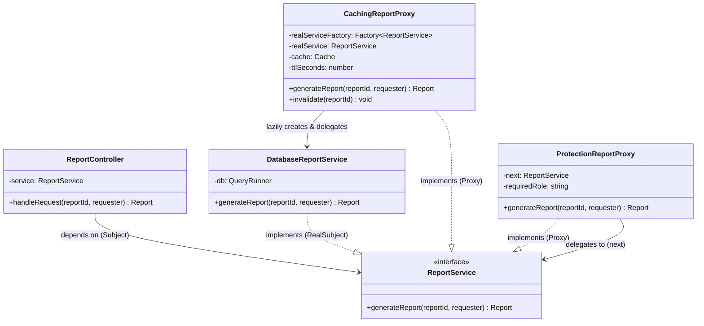

# Proxy Pattern — Class Diagram

Shows the four participants. The Client depends only on the `ReportService` **Subject**
interface. Both the **RealSubject** and every **Proxy** implement that same interface, which
is what lets proxies stand in for — and stack in front of — the real object transparently.

**How to read it**
- `..|>` (dashed, hollow triangle) = *implements interface*. The RealSubject **and** both proxies all implement `ReportService` — same face.
- `-->` = *association / holds a reference*. The `ProtectionReportProxy` holds a `next: ReportService` (which is the caching proxy at runtime); the `CachingReportProxy` holds a factory for the RealSubject.
- The Client (`ReportController`) has **no arrow to `DatabaseReportService`** — it never references the real object. That decoupling is the whole point.
- Because each proxy's `next` is typed as the Subject, proxies **stack**: `ProtectionReportProxy → CachingReportProxy → DatabaseReportService`, each seeing only "a Subject" beneath it.
