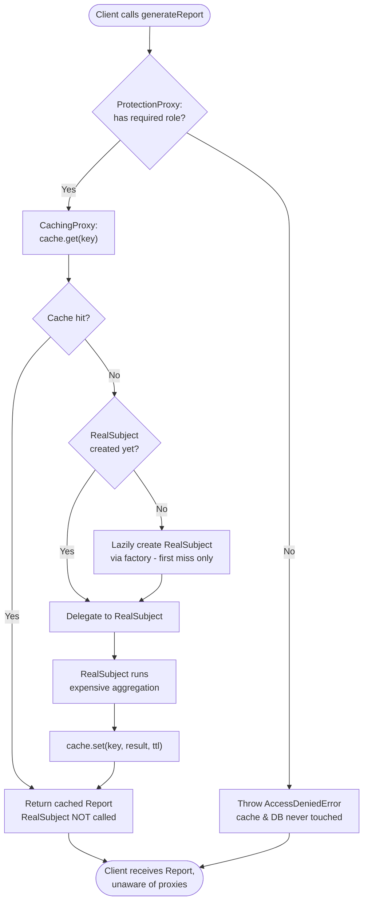

# Proxy Pattern — Flow Diagram

Step-by-step control flow of a single `generateReport()` call through the stacked
proxies: authorization first, then cache lookup, then lazy creation and delegation
to the RealSubject only when truly needed.

**Key idea:** every decision box before "Delegate to RealSubject" is *access control*,
not business work. Authorization short-circuits before any expensive resource is touched;
a cache hit skips the RealSubject entirely; a virtual proxy builds the RealSubject only on
the first genuine miss. Swapping, removing, or reordering these boxes changes the policy
without changing the client or the RealSubject.
