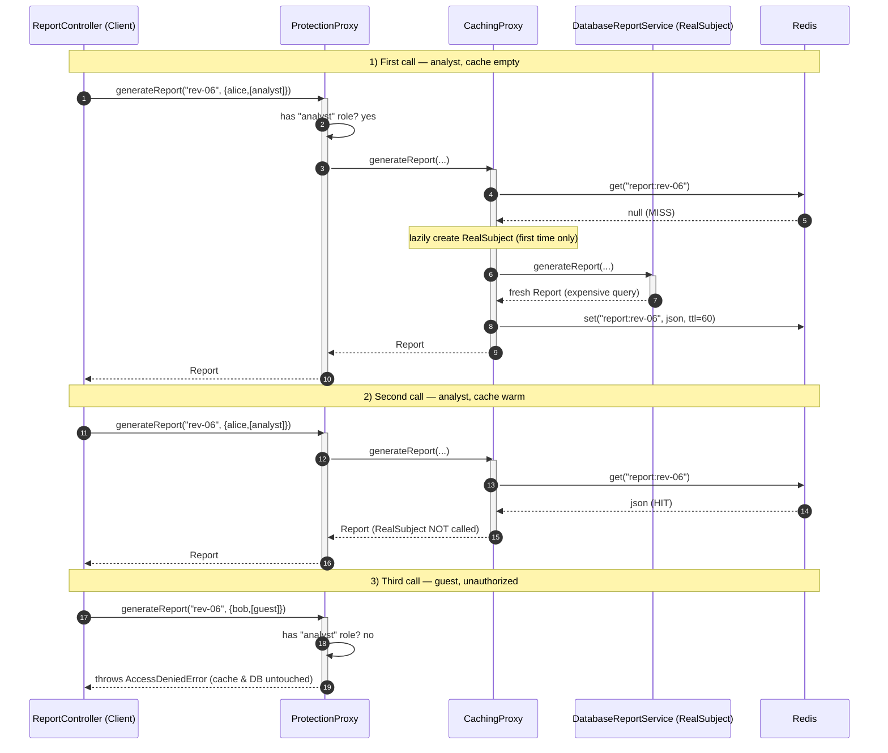

# Proxy Pattern — Sequence Diagram

Shows the runtime message exchange across the stacked proxies for three calls:
a cold-cache analyst request (miss + lazy build), a warm-cache analyst request
(hit, RealSubject skipped), and an unauthorized guest request (denied early).

**How to read it**
- The **Composition Root** (not shown) stacks the proxies once at startup: `Protection → Caching → Real`, then injects the outermost into the Client typed as `ReportService`.
- At runtime the Client only ever talks to the **outermost proxy**; it never references the cache or the RealSubject.
- Call 1 shows the *virtual* aspect: the RealSubject is lazily created on the first miss and the result is cached.
- Call 2 shows the *smart/caching* aspect: a hit returns immediately and the expensive RealSubject is skipped entirely.
- Call 3 shows the *protection* aspect: authorization short-circuits the whole chain before the cache or database is touched.
