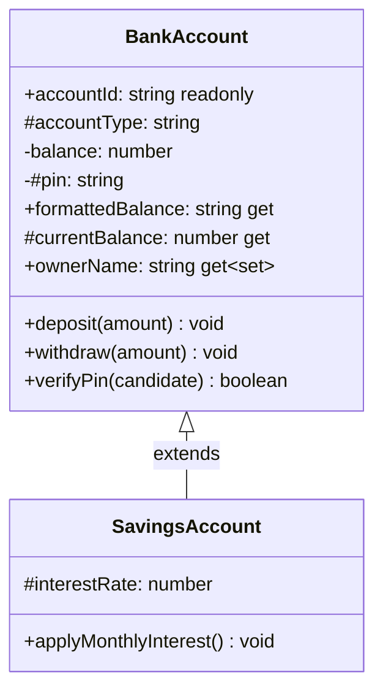
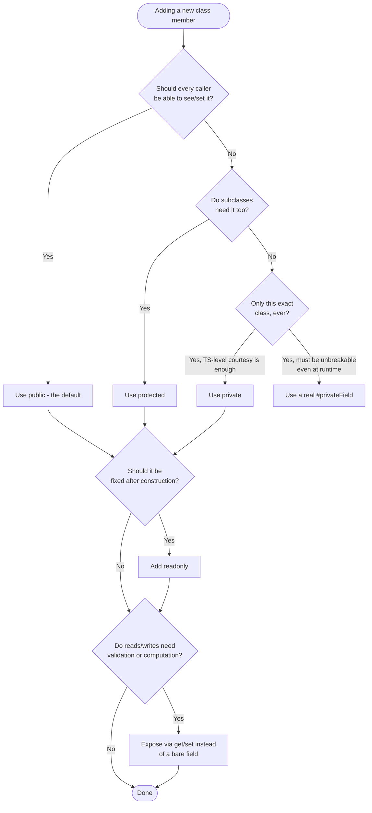

# Access Modifiers

## Intent

Control *who* is allowed to read or write a class member — a field, a method, an accessor — so that a class can expose a clean public surface while hiding, protecting, or guarding the details of how it works internally.

## Real Life Analogy

Think of a bank branch. The **balance display** at the counter is something any customer can look at — that's **public**. The **internal audit ledger** is something only bank employees and authorized branch staff (and staff at sister branches under the same policy) may see — that's **protected**: visible within "the family," invisible to the public. The **vault combination** is known only to the manager of *that exact branch* — nobody at a sister branch, and certainly no customer, gets it — that's **private**. And the **account number stamped into your passbook** on the day you opened the account never changes again — that's **readonly**: fixed at creation, fixed forever.

Now here's the twist that trips people up: the "Employees Only" sign on the audit room door (TypeScript's `private`/`protected`) is a *policy*, enforced by whoever is following the rulebook (the TypeScript compiler). Someone who ignores the rulebook entirely — walks straight past the sign because they were never trained to read it — can still open that door; nothing physically stops them. A **vault with a physical combination lock** (a real JavaScript `#privateField`) is different: it doesn't matter whether you read the rulebook or not, the door mechanically will not open without the key. That is the difference between a compile-time convention and real runtime enforcement.

## Problem

### What engineering problem exists?

Every non-trivial class has internal state that should not be poked at directly from outside:

- A `BankAccount`'s `balance` should only ever change through validated `deposit()`/`withdraw()` calls — never through direct assignment that skips validation.
- A base class often needs to share some internal detail (like an `accountType` discriminator) with its subclasses, without handing that same detail to every caller in the entire codebase.
- Some fields (like an `accountId`) should be readable forever but writable exactly once, at creation time.
- Some fields (like a PIN) should never be readable by *anyone* outside the class, not even in a debugger, not even by a subclass.

Without a way to express these rules, every field on every class is just a public, mutable, freely-inspectable slot — and any code anywhere in the program can reach in and set it to a nonsensical value.

> **Term: Encapsulation.** The practice of bundling an object's internal state together with the methods that operate on it, and restricting direct access to that state from outside the object. The goal is that the *only* way to change internal state is through methods that can validate the change.

### Why is this problem difficult?

- **JavaScript objects are, by default, wide open.** Every property you assign in a constructor is readable and writable by anyone holding a reference to the object. There is historically no built-in concept of "this field is off-limits."
- **You need different levels of restriction for different audiences.** "Only this exact class" (private) is a different, stricter promise than "this class and anything that extends it" (protected). Getting the boundary wrong either locks out legitimate subclasses or leaks internals to the whole codebase.
- **"Assignable once" is not the same as "never assignable."** A `readonly` field is not a constant — it needs to be *set* during construction, then frozen. That's a narrower rule than either "always mutable" or "never settable," and easy to get subtly wrong by hand.
- **TypeScript's checks disappear the moment the code runs as JavaScript.** TypeScript's `private`/`protected`/`readonly` exist only while the compiler is looking at your source; the emitted `.js` has no idea any of these keywords ever existed. Anyone who assumed "private" meant "secure" is in for a surprise the first time they open devtools on the compiled bundle.

### What happens if we ignore it?

- **Invariant violations.** If `balance` is a plain public field, any part of the codebase can set `account.balance = -500`, silently corrupting the mental model that balances can never go negative.
- **Fragile subclassing.** Without `protected`, a base class either hides everything from subclasses (forcing them to duplicate logic) or makes everything `public` (forcing every unrelated caller to see internals meant only for subclasses).
- **Accidental mutation of "constants."** Without `readonly`, an `accountId` or a database primary key can be reassigned by a typo somewhere far from where it was created, and the bug surfaces nowhere near its cause.
- **False sense of security.** If a team believes TypeScript's `private` gives real runtime protection, they may put something sensitive (like a token or a PIN) behind it and be genuinely surprised when a bracket-notation access, a `JSON.stringify`, or a look at the compiled `.js` reveals it in plain sight.

## Why Not Other Solutions?

**"Just document which fields shouldn't be touched, with a comment."**
Comments are not enforced by anything. Nothing stops a teammate — or your own future self, six months later — from ignoring the comment and assigning to the field directly. The compiler needs to catch it, not a code review that might not happen.

**"Prefix private fields with an underscore, like `_balance`."**
This is a convention some codebases used before real access modifiers existed. It signals intent to a careful reader, but `_balance` is still a perfectly ordinary public property — TypeScript will let you read and write it from anywhere with zero complaint. It's a hint, not a rule.

**"Just use `private` everywhere and call it a day — it's private, so it's safe."**
This is the trap this topic exists to correct. TypeScript's `private` is a **compile-time-only** check. It stops *other TypeScript code, going through the type-checker*, from writing `account.balance`. It does nothing at runtime: the emitted JavaScript has a completely ordinary, freely-readable/writable property. If you need something that is *actually* inaccessible from outside — even at runtime, even via bracket notation, even from plain JavaScript that never saw a type-checker — you need a real `#privateField`, not the `private` keyword.

**"Freeze the whole object with `Object.freeze()` instead of using `readonly`."**
`Object.freeze()` is a real runtime mechanism, but it freezes *everything*, all at once, and only works one level deep. You lose the ability to have some fields mutable (like `balance`, which legitimately changes via `deposit`/`withdraw`) and others fixed (like `accountId`) on the same object. `readonly` gives you that per-field granularity; `Object.freeze()` does not.

**Tradeoff summary:** Comments and naming conventions rely on discipline, not enforcement. `private`/`protected`/`readonly` give the compiler something concrete to check, which catches entire categories of mistakes before the code ever runs — but you must remember they are a *TypeScript-authors-only* safety net, not a runtime lock. When you need a runtime lock, reach for `#privateFields` or a getter/setter that validates every access.

## Solution

The core idea: **attach a modifier to each field or method that states exactly which callers are allowed to touch it, and let the compiler reject any code that violates that rule.**

TypeScript gives you four keywords plus one native-JavaScript mechanism:

1. **`public` (the default).** No keyword needed — omitting a modifier means public. Anyone with a reference to the object can read and write it.
2. **`protected`.** Accessible inside the declaring class **and any subclass**, but invisible to code outside that class hierarchy.
3. **`private`.** Accessible **only inside the exact class that declares it** — not even subclasses may touch it directly. This is a TypeScript-only, compile-time check; it is erased in the emitted JavaScript.
4. **`readonly`.** Can be assigned only at its declaration or inside the constructor of the declaring class. After that, any further assignment is a compile error. Combine it with `public`/`private`/`protected` freely (e.g. `public readonly accountId`).
5. **`#privateField` (real JavaScript private fields).** Not a TypeScript feature at all — native ECMAScript syntax. Enforced by the JavaScript engine itself, at runtime, in every environment, regardless of whether the caller went through a type-checker.

On top of these, TypeScript gives you two ergonomic tools that work *with* the modifiers:

- **Parameter properties.** Writing an access modifier directly on a constructor parameter (e.g. `constructor(private balance: number)`) tells TypeScript to both declare the field **and** assign `this.balance = balance` for you — eliminating the boilerplate of declaring the field above the constructor and writing the assignment inside it.
- **Getters and setters (`get`/`set`).** A pair of accessor methods that *look* like a plain property from the outside (`account.formattedBalance`, `account.ownerName = "..."`) but let you compute a derived value, or validate an incoming value, on every access — the controlled middle ground between "fully public field" and "no access at all."

You do **not** need to reach for every tool on every field. The thinking is: default to `public` for anything genuinely open, use `protected` for anything a subclass legitimately needs, use `private` for pure internal bookkeeping, add `readonly` to anything that should be fixed after construction, and reach for a real `#field` only when you need protection that must survive contact with plain JavaScript or a determined caller.

## Architecture

There are five participants:

1. **`public` members:** The class's open contract — anyone holding a reference to an instance can read and write these. This is the default; you get it by simply omitting a modifier.

2. **`protected` members:** The "family only" contract — the declaring class and every subclass down the inheritance chain can read and write these, but code outside that hierarchy cannot. This is how a base class shares internal detail with the subclasses that need it, without exposing that detail publicly.

3. **`private` members:** The "this class only" contract — not even a subclass may touch these directly. This is TypeScript's strictest access rule, but it is a **compile-time-only** rule: it disappears entirely once the `.ts` is emitted as `.js`.

4. **`readonly` members:** The "assignable once" contract — settable at declaration or inside the constructor, frozen after that. Orthogonal to the other three: you can have a `public readonly`, `protected readonly`, or `private readonly` field.

5. **`#privateField` members:** The "genuinely inaccessible from outside" contract — real, engine-enforced privacy. The one modifier on this list that is not erased at compile time, because it isn't a TypeScript construct in the first place; it's JavaScript itself.

Responsibilities in one line each:
- **`public`:** the open door, anyone may enter.
- **`protected`:** the family door, only the class and its descendants may enter.
- **`private` (TS):** the "staff only" sign — respected by the type-checker, ignored by the runtime.
- **`readonly`:** the one-time lock — set once, then the compiler refuses further writes.
- **`#field`:** the physical lock — no amount of ignoring the sign gets you through it.

## Execution Flow

1. You write a class and annotate each member with the modifier that matches who should touch it.
2. **At compile time**, `tsc` (or your editor's language service) walks every place your code reads or writes a member. For each access, it checks: is the calling code inside the declaring class (`private`), inside the class or a subclass (`protected`), or is `readonly` being violated by an assignment outside the constructor?
3. If any access violates its member's modifier, `tsc` reports a compile error (e.g. `TS2341: Property 'balance' is private...`) and — in a normal build — refuses to emit output until you fix it.
4. Once the code type-checks, `tsc` **emits plain JavaScript** with every `public`/`protected`/`private`/`readonly` keyword stripped away. The emitted class has ordinary, fully mutable, fully readable properties — the modifiers leave no runtime trace whatsoever.
5. Any `#privateField`, by contrast, is compiled into a mechanism the JS engine itself understands (historically via an internal slot/WeakMap-like structure, natively in modern engines) — this protection **does** survive into the emitted code and **is** checked every time the field is touched, at runtime, forever.
6. A getter/setter pair is compiled into real JavaScript accessor properties (`Object.defineProperty` with `get`/`set`) — unlike the modifiers, accessors **do** survive compilation, because the validation/computation logic they run is genuine runtime behavior, not a type-checker convenience.

## Class Diagram



*(UML convention: `+` public, `#` protected, `-` private. The `#pin` real private field is doubly restricted — even UML's `-` private doesn't capture that it's enforced at runtime.)*

## Sequence Diagram

```mermaid
sequenceDiagram
    participant Out as Outside code (main)
    participant TC as TypeScript compiler
    participant Acc as BankAccount instance
    participant JS as Emitted JavaScript (runtime)

    Out->>TC: account.balance = 999999
    TC-->>Out: Compile Error TS2341 (private) — build stops here
    Note over Out,TC: Never reaches runtime at all.

    Out->>TC: account["balance"] (bracket notation)
    TC-->>Out: Compiles fine (index access isn't modifier-checked)
    Out->>JS: account["balance"]
    JS-->>Out: 6300 (plain property — fully readable)
    Note over JS: private/protected are erased; nothing stops this.

    Out->>TC: account["#pin"]
    TC-->>Out: Compiles (no TS error for the bracket form)
    Out->>JS: account["#pin"]
    JS-->>Out: undefined
    Note over JS: #pin is a real private field — no bracket-notation route in.
```

## Flow Diagram



## Implementation

The implementation strategy in TypeScript:

1. **Start every field as `private` (or a real `#field` if it must be unbreakable) and widen only when you have a concrete reason.** It is far easier to loosen a restriction later than to discover, after the fact, that half the codebase now depends on direct field access you can no longer safely remove.

2. **Reach for `protected` only when a subclass genuinely needs the value or the behavior.** If nothing extends the class yet, `private` is the safer default — you can widen to `protected` the day a subclass actually needs it.

3. **Add `readonly` to anything that is conceptually an identity or a fixed fact set at creation** — IDs, creation timestamps, configuration captured at construction. This documents intent and lets the compiler catch accidental reassignment.

4. **Use constructor parameter properties to remove boilerplate**, but only when the field needs no extra logic beyond "store what was passed in." The moment a field needs validation or transformation before being stored, drop back to a plain parameter plus an explicit assignment (or a setter).

5. **Use a getter for anything computed from other state** (like a formatted string derived from a raw number) so callers never have to remember to reformat it themselves, and use a setter for anything that needs validation before being stored.

6. **Reserve real `#privateFields` for the rare case where TypeScript's compile-time courtesy genuinely is not enough** — secrets, tokens, anything where "a caller ignored the type-checker" must not be a viable way to reach the value.

We will demonstrate this with a realistic scenario: a `BankAccount` class with a `private` balance, a `protected` accountType shared with a `SavingsAccount` subclass, a `readonly` accountId, a real `#pin` private field, and a validated `ownerName` getter/setter.

## Code Walkthrough

See [code.ts](code.ts) for the full runnable implementation. Here is what each part does and why it exists.

**`BankAccount.accountId` (`public readonly`, parameter property).**
Declared as `public readonly accountId: string` directly in the constructor parameter list. TypeScript auto-generates the field and the assignment. Because it's `readonly`, any attempt to reassign it later — anywhere, including inside `BankAccount`'s own methods after the constructor has run — is a compile error.

**`BankAccount.accountType` (`protected`, parameter property).**
Visible to `BankAccount` and to `SavingsAccount` (or any future subclass), but invisible to `main()`. This exists so a subclass like `SavingsAccount` can log or branch on the account type without that detail being part of the class's public API.

**`BankAccount.balance` (`private`, parameter property).**
The whole point of the example. It can be read and written only inside `BankAccount` itself — not by `SavingsAccount`, not by `main()`. The only sanctioned way to move it is through `deposit()`/`withdraw()`, which validate every change. This field also carries the crucial gotcha: because `private` is compile-time-only, `main()` demonstrates reading it anyway via bracket notation (`account["balance"]`), which `tsc` does not flag, and which returns the real value at runtime.

**`BankAccount.#pin` (real JS private field).**
Declared with `#`, not `private`. It is assigned by hand in the constructor body (parameter properties don't support `#` fields). It exists to contrast with `balance`: `verifyPin()` is the only way to check a PIN from outside, and unlike `balance`, there is no bracket-notation trick that reveals it — `account["#pin"]` returns `undefined`, because `#pin` is not an ordinary string-keyed property at all.

**`BankAccount.formattedBalance` (public getter).**
A computed, read-only view of `balance`, formatted as currency. Callers never see the raw number through this API, so the internal representation could change later (e.g. to a `Decimal` type) without breaking anyone.

**`BankAccount.currentBalance` (protected getter).**
Exists purely so `SavingsAccount` can read the numeric balance for its interest calculation, without exposing that number publicly. This shows that accessors can carry their own modifier, just like fields.

**`BankAccount.ownerName` (getter + setter pair).**
Backed by a private `_ownerName` field. The setter trims whitespace and rejects an empty name before ever writing to storage — validation a plain public field could never provide. The getter simply returns the stored value. From the caller's side, `account.ownerName = "..."` and `account.ownerName` look exactly like reading/writing an ordinary property.

**`SavingsAccount` (subclass).**
Adds its own `protected interestRate` (also a parameter property) and an `applyMonthlyInterest()` method. It reads `accountType` and `currentBalance` (both `protected` in the parent) directly, but it cannot read `balance` (`private` in the parent) — it must call the inherited public `deposit()` to change it. This is the concrete demonstration of the difference between `protected` and `private`.

**`main()` (demo).**
Shows everything that compiles and runs cleanly, then — in comments, since these genuinely would not compile — shows exactly what TypeScript rejects (assigning to `balance`, reading `accountType` from outside, reassigning `accountId`, reading `#pin` from outside). It finishes by showing the two real bypasses that *do* compile despite the modifiers: bracket-notation access to `balance`, and `Object.assign` overwriting the "readonly" `accountId` — both proving the modifiers are erased at runtime, immediately followed by the one thing that truly cannot be bypassed, `#pin`.

## Advantages

- **Encapsulation by convention, enforced by the compiler.** Mistakes like `account.balance = -1` are caught before the code ever runs.
- **Clear, self-documenting contracts.** Reading a class definition tells you exactly who is meant to touch each member, without needing a comment.
- **Safe subclassing via `protected`.** Base classes can share internal detail with subclasses without exposing it to the whole codebase.
- **Prevents accidental reassignment via `readonly`.** IDs, timestamps, and other "set once" values cannot drift from a stray assignment elsewhere in the code.
- **Getters/setters give you a controlled seam.** You can add validation, logging, or computed derivation later without changing how callers use the property.
- **Parameter properties remove boilerplate.** One line in the constructor signature replaces a field declaration plus an assignment statement.

## Disadvantages

- **`private`/`protected`/`readonly` are not real security.** They are erased at compile time; anyone willing to use bracket notation, `Object.assign`, or read the compiled `.js` directly can bypass them. Relying on them to protect a secret (a token, a password, a PIN) is a mistake.
- **Real `#privateFields` are more rigid.** They cannot be accessed via bracket notation at all (even for legitimate metaprogramming), cannot easily be mocked/spied on in tests the way a `private` TS field sometimes can, and are less flexible with some reflection-based tooling.
- **Over-restricting can hurt testability.** Making everything `private` can force tests to go through awkward public APIs just to set up state; some teams intentionally use `protected` or dependency injection to keep classes testable.
- **Parameter properties can obscure the field list.** When a constructor has many parameter properties, some readers find it harder to see "what fields does this class have" at a glance compared to a dedicated block of field declarations.
- **Getters/setters that hide expensive work can surprise callers.** `account.formattedBalance` looks like free property access; if a getter secretly does heavy computation or I/O, that's a hidden cost callers don't expect.

## Tradeoffs

**What we gain:** compiler-enforced contracts about who may touch what, safer subclassing, protection against accidental (not malicious) misuse, and — when we actually need it — genuine runtime privacy via `#fields`.

**What we lose:** a small amount of directness (an extra keyword, an extra accessor method) and, crucially, any illusion that TypeScript's modifiers alone constitute security. The pattern's value depends on knowing which tool gives which guarantee: `private`/`protected`/`readonly` guard against *accidents* from other TypeScript code; `#privateField` guards against *any* access, accidental or deliberate, from any JavaScript caller.

## Complexity

**Code Complexity:** Low. Each modifier is a single keyword; parameter properties actively reduce code. Complexity only grows if you overuse getters/setters for logic that would be clearer as an explicit method.

**Maintenance Complexity:** Low. Access rules are checked automatically by the compiler on every build; there is no manual bookkeeping.

**Scalability:** Excellent. As a class grows more fields and more subclasses, modifiers keep the "who can touch what" boundary explicit and machine-checked rather than relying on team memory.

**Flexibility:** High. You can widen a `private` field to `protected`, or wrap a plain field in a getter/setter, without changing anything about *how* it's called from most existing code (as long as you were already going through methods, not the raw field).

**Testability:** Generally high, though `private`/`#private` fields do mean unit tests exercise behavior only through public methods — which is usually a testing *strength* (you test the contract, not the implementation), not a weakness.

## Performance Considerations

**Memory:** No meaningful difference between `public`, `protected`, and `private` — they compile to identical plain properties. Real `#privateFields` may use a slightly different internal representation depending on the JS engine, but the difference is negligible for ordinary object counts.

**CPU:** Getter/setter calls are a function call rather than a raw property read — modern JS engines optimize this heavily, and the cost is immeasurable outside extremely hot loops.

**Network:** Not applicable — access modifiers are a pure language/compile-time concept.

**Database:** Not applicable directly, though `readonly` is a natural fit for fields that mirror an immutable database primary key or creation timestamp.

**Object creation:** Parameter properties do not add overhead — they compile to exactly the same assignment a hand-written constructor would perform.

**Runtime:** `private`/`protected`/`readonly` add **zero** runtime cost, because they add zero runtime code — they are erased entirely. `#privateFields` and accessors have a small, constant, essentially unmeasurable cost compared to plain property access.

## Common Mistakes

- **Believing `private` is a security boundary.** Beginners assume `account.balance` being `private` means the value is hidden from a determined caller or from anyone reading the compiled output. *Why it happens:* the word "private" sounds absolute. *Avoid:* use `#privateField` for anything that must never be reachable outside its class, and treat TS `private` as a linting aid for your own team, not a lock against the outside world.

- **Confusing `protected` with `private`.** Developers sometimes reach for `private` on a field a subclass will obviously need, then are surprised when the subclass fails to compile. *Why it happens:* the two look similar and the difference only matters once you introduce inheritance. *Avoid:* ask "will any subclass ever legitimately need this?" before picking one over the other.

- **Adding `readonly` to something that legitimately needs to change after construction.** This forces awkward workarounds (like recreating the whole object) for a field that should have just stayed mutable. *Avoid:* reserve `readonly` for identity/fixed-at-creation data, not for anything that represents evolving state.

- **Writing a getter that does expensive work and calling it constantly, assuming it's "just a property read."** *Why it happens:* getter syntax hides the fact that a function is running. *Avoid:* keep getters cheap and pure, or rename them as methods (`getFormattedBalance()`) if they do real work, so the cost is visible at the call site.

- **Overusing parameter properties for fields that need validation.** Writing `constructor(private balance: number)` looks clean, but if `balance` must be validated (e.g. rejected if negative) before being stored, the shorthand hides that requirement. *Avoid:* drop to an explicit parameter and constructor-body assignment (or a setter) the moment validation logic is needed.

- **Assuming `Object.freeze()` and `readonly` are equivalent.** `readonly` is a compile-time-only TypeScript check with zero runtime effect; `Object.freeze()` is a real runtime lock but applies to the whole object at once. *Avoid:* pick based on whether you need a compile-time hint (`readonly`) or genuine runtime immutability (`Object.freeze`), and know they solve different problems.

## When To Use

- **Modeling any class with internal invariants** that must not be violated by direct field assignment (balances, counters, state machines).
- **Building a class hierarchy** where a base class needs to share some internal detail with subclasses (`protected`) without exposing it to unrelated callers.
- **Marking identity or creation-time data as fixed** (`readonly`) — IDs, timestamps, configuration captured once at construction.
- **Reducing constructor boilerplate** for straightforward "store what was passed in" fields via parameter properties.
- **Exposing a computed or validated view of internal state** through a getter/setter instead of a bare field.
- **Protecting a genuine secret at runtime** (tokens, PINs, keys) — reach specifically for `#privateField`, not `private`.

## When NOT To Use

- **When you actually need runtime-enforced privacy and only reach for `private`.** If the value must be unreachable even by a caller ignoring the type-checker, `private` is the wrong tool — use `#field`.
- **When a field genuinely has no invariant to protect and no subclass to consider.** Marking every trivial DTO-style field `private` with a getter/setter pair for no reason adds ceremony without benefit — a plain `public` field is fine for pure data carriers.
- **When `readonly` would fight a field's actual lifecycle.** If a value is expected to change after construction (like `balance`), forcing `readonly` on it just creates friction, not safety.
- **When parameter properties would hide necessary validation.** If storing a constructor argument requires checks or transformation, don't force it into the shorthand — write it out explicitly.
- **When you need a truly private class member available for testing/mocking via bracket notation or index access.** In that narrow situation, a plain `private` (not `#field`) is actually the more testable / mockable choice, since `#fields` have no bracket-notation escape hatch at all — this is a case where TS-only privacy is a feature, not a bug.

## Real Production Examples

- **Node.js:** Node's own built-in classes (`EventEmitter`, `Buffer` internals in newer versions) increasingly use real `#privateFields` for genuinely internal state that must not be touched by consumers.
- **NestJS:** Services and providers commonly use `private readonly` for injected dependencies (`constructor(private readonly usersService: UsersService)`), leaning heavily on parameter properties throughout the framework's idiomatic style.
- **Angular:** Component classes routinely use `private`/`protected`/`public` on fields bound to templates — `protected` deliberately used for template-only bindings that shouldn't be part of a component's public TypeScript API.
- **TypeScript's own compiler codebase and most enterprise TS codebases:** widespread use of `readonly` on class fields representing configuration captured at construction, to prevent accidental mutation deep in a large codebase.
- **Domain-Driven Design implementations:** Value Objects and Entities frequently use `private`/`#private` fields with getters, so the object's invariants can only be changed through explicit, validated domain methods (very close to this topic's `BankAccount` example).
- **Web Components / vanilla JS libraries:** Increasing adoption of real `#privateFields` (supported natively in all modern browsers) specifically because library authors want guarantees that consumers cannot reach into internal state, even by accident.

## Where I Can Use This

Five realistic ideas for your own projects:

1. **A `BankAccount`/`Wallet` domain class** (as shown here) — `private` balance, `protected` account type, `readonly` account id, `#pin`/`#secret` for anything truly sensitive.
2. **A `UserSession` class** — `private` token storage (or `#token` if it must survive contact with untrusted plugin code), `readonly` session id and creation timestamp, a getter for `isExpired`.
3. **A repository/service base class** — `protected` shared dependencies (a logger, a DB client) that concrete repositories need, `private` internal caching state that only that specific repository manages.
4. **A configuration object** — every field `readonly`, set once from environment variables at startup, guaranteeing nothing downstream can accidentally mutate shared config.
5. **A rate limiter or counter class** — `private` internal counters mutated only through `increment()`/`reset()` methods, with a public getter exposing the current count as a read-only computed value.

## Related Concepts

- **Encapsulation (OOP principle):** Access modifiers are the concrete TypeScript mechanism for implementing the broader OOP principle of encapsulation.
- **Getters/Setters (accessor properties):** A complementary tool — where modifiers control *whether* a member is reachable, accessors control *what happens* when it is reached (validation, computation, side effects).
- **Immutability (`readonly`, `Object.freeze`, `const`):** `readonly` is TypeScript's compile-time notion of immutability for a single field; `Object.freeze` and `const` are runtime/binding-level immutability tools with different scopes and guarantees.
- **Real private class fields (`#field`):** The genuine ECMAScript privacy mechanism, distinct from and stronger than TypeScript's `private` keyword.
- **Dependency Injection:** Parameter properties (`constructor(private readonly service: Service)`) are the idiomatic shorthand used throughout DI-heavy frameworks like NestJS and Angular.

| Concept | Enforced at runtime? | Scope | Reassignable after construction? |
|---|---|---|---|
| `public` | No (n/a — always accessible) | Everyone | Yes |
| `protected` | No — TS compile-time only | Declaring class + subclasses | Yes |
| `private` (TS) | No — TS compile-time only | Declaring class only | Yes |
| `readonly` | No — TS compile-time only | Wherever the base modifier allows | No (only at declaration/constructor) |
| `#field` | **Yes — real JS engine enforcement** | Declaring class only | Yes (unless combined with your own logic) |
| getter/setter | Yes (real function calls) | Whatever the accessor itself is marked as | Depends on whether a setter is defined |

## Interview Discussion

Experienced engineers rarely discuss access modifiers as a syntax trivia question. They discuss them as a **boundary-management and API-design tool** — deciding, member by member, what a class's real public contract is, and where genuine runtime protection is actually required versus merely a helpful compile-time nudge.

Common follow-up questions:
- *"Is `private` in TypeScript actually private at runtime?"* No — it is erased during compilation and exists only as a type-checker rule; the emitted JavaScript has an ordinary property, reachable via bracket notation or by inspecting the compiled output.
- *"How is a real `#field` different from TypeScript's `private`?"* `#field` is native JavaScript syntax enforced by the engine itself, at runtime, with no bracket-notation or reflection escape hatch; TypeScript's `private` is purely a static, compile-time check with zero runtime effect.
- *"What's the actual difference between `private` and `protected`?"* `private` restricts access to the exact declaring class; `protected` extends that access to subclasses as well.
- *"Why use parameter properties?"* They collapse a field declaration and a constructor assignment into a single parameter annotation, removing repetitive boilerplate for straightforward "just store it" fields.
- *"When would you choose a getter/setter over a plain public field?"* Whenever you need to compute a derived value on read, validate a value on write, or want the freedom to change the internal representation later without breaking callers.

Common misconceptions:
- "TypeScript's `private` keeps data secure." It does not — it is a development-time convenience, not a security boundary.
- "`readonly` makes a field immutable." It only prevents *TypeScript source* from reassigning it after construction; the emitted JS property remains an ordinary, freely mutable slot unless bypassed protections (like `#field` immutability patterns) are used instead.
- "Getters and setters always add overhead you should avoid." Modern engines optimize accessor calls extremely well; the real cost to consider is what logic you put *inside* them, not the fact that they're accessors.

## Summary

- **`public`** (default): accessible to everyone.
- **`protected`**: accessible in the declaring class and its subclasses only.
- **`private`** (TypeScript keyword): accessible only in the declaring class — but this check is **erased at compile time** and has **no effect at runtime**.
- **`readonly`**: assignable only at declaration or inside the constructor; also compile-time-only.
- **`#field`** (real JavaScript private field): the only one of these that is genuinely enforced by the JavaScript engine at runtime.
- **Getters/setters**: the controlled way to expose computed or validated access to internal state, whatever its underlying modifier.
- **Parameter properties** (`constructor(private readonly foo: string)`) collapse field declaration + assignment into one line, and are widely used across TS/DI-heavy frameworks.

## Key Takeaways

1. `public` is the default; you get it simply by omitting a modifier.
2. `protected` extends access to subclasses; `private` restricts it to the exact declaring class only.
3. `readonly` allows assignment only at declaration or in the constructor — never afterward.
4. Parameter properties (`constructor(private readonly foo: string)`) eliminate the boilerplate of a separate field declaration plus a constructor assignment.
5. TypeScript's `private`/`protected`/`readonly` are **compile-time-only** — they are erased in the emitted JavaScript and add zero runtime protection.
6. A determined caller can bypass `private` via bracket notation, and bypass `readonly` via `Object.assign` or similar — both compile and run without complaint.
7. Real JavaScript `#privateFields` ARE enforced at runtime by the JS engine itself, with no bracket-notation or reflection workaround.
8. Getters and setters let you expose a computed or validated view of a field while keeping the raw storage restricted.
9. Reach for `#privateField` (not `private`) whenever something must be genuinely unreachable, not just conventionally discouraged.
10. Choosing the right modifier is an API-design decision: it documents, and lets the compiler enforce, exactly who is meant to touch each piece of a class's state.

---

## Further Reading

**Books**
- *Effective TypeScript* — Dan Vanderkam (covers the compile-time-only nature of TS access modifiers in depth).
- *Programming TypeScript* — Boris Cherny (solid chapter on classes, visibility, and parameter properties).
- *You Don't Know JS: this & Object Prototypes* — Kyle Simpson (background on how JS objects and property access actually work under the hood).

**Official Documentation**
- TypeScript Handbook — Classes — https://www.typescriptlang.org/docs/handbook/2/classes.html
- TypeScript Handbook — Member Visibility — https://www.typescriptlang.org/docs/handbook/2/classes.html#member-visibility
- MDN — Private class features (`#field`) — https://developer.mozilla.org/en-US/docs/Web/JavaScript/Reference/Classes/Private_properties
- MDN — Getter (`get`) — https://developer.mozilla.org/en-US/docs/Web/JavaScript/Reference/Functions/get
- MDN — Setter (`set`) — https://developer.mozilla.org/en-US/docs/Web/JavaScript/Reference/Functions/set

**Blog Articles**
- TypeScript Deep Dive — Classes — https://basarat.gitbook.io/typescript/future-javascript/classes
- "TypeScript Private vs. JavaScript Private Fields" — various community write-ups comparing `private` erasure with `#field` enforcement (search for the exact phrase — this distinction is a very commonly written-about TypeScript gotcha).

**Research / Foundational**
- TC39 Proposal — Class Fields (the proposal that introduced `#privateFields` to the ECMAScript standard) — https://github.com/tc39/proposal-class-fields
