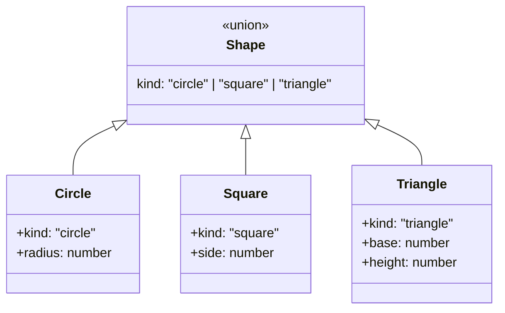
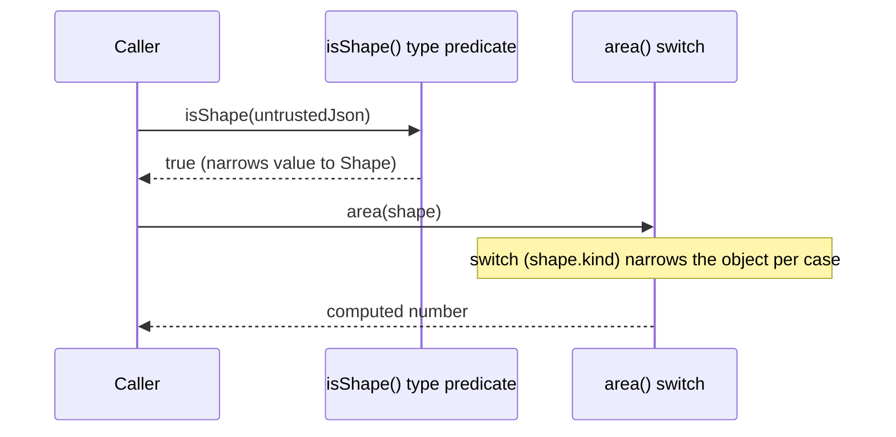
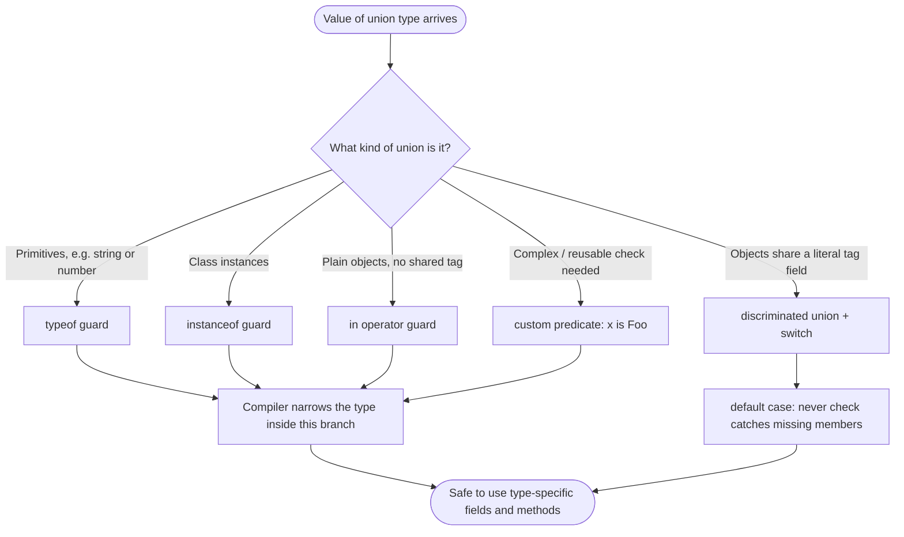

# Type Guards, Narrowing, and Discriminated Unions

## Intent

Prove to the TypeScript compiler, using code patterns it can actually follow, which specific member of a union type a value currently is — so that inside a given branch of code you can safely use the members and methods that only exist on that specific type, instead of being stuck with the lowest common denominator of the whole union.

## Real Life Analogy

Imagine a warehouse intake desk that receives boxes from many different suppliers. A worker cannot safely lift, pour, or scan a box without first knowing what is inside — a fragile glass vase needs different handling than a barrel of liquid or a stack of paper documents.

Some boxes arrive unlabeled: the worker has to guess from the material — is it rigid cardboard or a sealed metal drum? (like a `typeof` check on a primitive) — or from a manufacturer's stamp molded into the box itself (an `instanceof` check on a class of packaging), or by feeling for one specific loose flap — "does this box even have a pour spout?" (an `in` check for a property). Some boxes need a full lookup against a supplier's spec sheet before the worker trusts them at all (a custom type-predicate function).

The best boxes, though, arrive with a printed category sticker on the outside — `GLASS`, `LIQUID`, `DOCUMENTS` — and the moment the worker reads that one word, they know exactly which handling checklist applies, without inspecting the contents at all. That sticker is a discriminated union's `kind` field, and the warehouse's laminated procedures binder is the `switch` statement: one page per sticker. A good warehouse manager also keeps a strict rule — if a truck ever arrives with a sticker that is not in the procedures binder, the receiving line **stops immediately** and someone updates the binder; nobody just shrugs and treats it like glass. That stop-the-line rule is the exhaustiveness check.

## Problem

### What engineering problem exists?

Union types let one variable or parameter legitimately hold several different shapes of data — `string | number`, or a richer union of interfaces like a `Shape` that could be a `Circle`, `Square`, or `Triangle`. TypeScript correctly only allows you to use the operations that are common to *every* member of the union, until you prove which one you actually have right now.

- A parameter typed `id: string | number` cannot call `.toUpperCase()` (missing on `number`) or `.toFixed()` (missing on `string`) without a check first.
- A `shape: Shape` cannot have `.radius` read from it directly — only `Circle` has a `radius`; `Square` and `Triangle` do not.
- JSON parsed from the network or a file has type `any`/`unknown` — it could structurally be anything, valid or not, and the compiler has no way to know without help.

> **Term: Narrowing.** Narrowing is the process by which TypeScript's control-flow analysis shrinks a broad type (like a union) down to a more specific one, *within a particular branch of code*, based on runtime checks it recognizes — `typeof`, `instanceof`, `in`, equality comparisons, custom type predicates, and more.

### Why is this problem difficult?

- **The compiler cannot see the future.** At compile time, it does not know which concrete value a union-typed parameter will hold at any given call site, so it must conservatively restrict you to what is common to all members.
- **Not every runtime check narrows.** TypeScript only recognizes a specific set of patterns (`typeof`, `instanceof`, `in`, discriminant comparisons, calls to functions with a `x is Foo` return type, and a few others). A hand-rolled duck-typing check that *looks* equivalent to a human reader may not narrow at all if it is not written in one of these recognized shapes.
- **Narrowing can be lost across boundaries.** Destructuring a narrowed property into a new `let` variable, passing it into a callback, or reassigning it after an `await` can all silently widen the type back out, because TypeScript's flow analysis stops tracking it.
- **Unions grow over time.** A `Shape` union that starts with two members often grows a third, fourth, fifth — and every `switch`/`if` chain written against it needs to be revisited, or it will quietly do the wrong thing for the new member.

### What happens if we ignore it?

- **Unsafe casts creep in.** Reaching for `value as Circle` "to make the compiler happy" throws away the very safety TypeScript exists to provide, and crashes at runtime the moment the assumption is wrong.
- **Silent, wrong behavior on new union members.** Add a `Rectangle` to `Shape` and forget to update a `switch` that lacks an exhaustiveness check, and `area()` might return `0`, `NaN`, or `undefined` for it — with no compiler warning, ever.
- **Runtime type errors.** Calling `.toUpperCase()` on what turns out to be a `number`, or reading `.radius` off a `Square`, throws a `TypeError` in production instead of failing a `tsc` build in CI.
- **Copy-pasted, drifting checks.** The same "is this actually a valid shape?" logic gets rewritten ad hoc in several files, and the copies slowly disagree with each other.

## Why Not Other Solutions?

**"Just cast it with `as Circle`."**
This is a type *assertion*, not a type *guard* — it tells the compiler to trust you, with zero runtime verification. If the value is not actually a `Circle`, the program compiles cleanly and then explodes at runtime the first time `.radius` is accessed on something that does not have one.

**"Give up and type it `any`."**
This makes the "union problem" disappear by disabling type checking for that value entirely — which also disables autocomplete, refactor-safety, and every other benefit TypeScript exists to provide. You have not solved the problem; you have hidden it.

**"Duck-type every property by hand, with no shared tag."**
Checking `if ('radius' in shape) { ... } else if ('side' in shape) { ... }` works for small unions, but breaks down once shapes can structurally overlap (e.g. two variants that both happen to have a `size` field), and it gives you no compile-time signal when a new variant is added — there is no `never` to check against, because there is no finite, named set of cases to be exhaustive over.

**"Write a separate function per shape instead of a union."**
Splitting `circleArea()`, `squareArea()`, `triangleArea()` avoids narrowing entirely, but it means callers must already know which one they have — you lose the ability to store mixed shapes in one array and process them uniformly, and every new call site re-implements the same dispatch-by-type logic that a `switch` would have centralized once.

**Tradeoff summary:** every shortcut either disables the compiler's help (`as`, `any`), scales poorly and gives no compile-time safety net (untagged duck-typing), or pushes the dispatch problem back onto every caller (per-type functions). Narrowing with a recognized guard — and a discriminated union with an exhaustiveness check for the common case of "many related shapes" — is the only approach that keeps both safety and ergonomics.

## Solution

The core idea: **before touching a member that only exists on one branch of a union, write a runtime check in a form TypeScript's control-flow analyzer recognizes, so it narrows the type for you inside that branch — instead of asserting the type is what you hope it is.**

There are two families of tools:

1. **Ad hoc guards** — for one-off checks on a small union: `typeof` (primitives), `instanceof` (classes), `in` (property existence), and custom type-predicate functions (`x is Foo`) for anything more involved or reused across the codebase.
2. **Discriminated unions** — the industrial-strength version for a *family* of related object shapes. Give every member a shared field with a distinct **literal** value (conventionally named `kind` or `type`), then `switch` on that field. TypeScript narrows the *entire object* to the matching member inside each `case` — not just the tag field. Add a `default` case that assigns the (by-then narrowed) value to a `never`-typed variable, and the compiler will refuse to build if a new union member is ever added without a matching `case`.

You do **not** disable the type system with `as`/`any`. You do **not** hand-roll untagged duck-typing for a growing family of shapes. You teach the compiler what you already know, in a language it understands.

## The Building Blocks

Five techniques, each suited to a different shape of problem:

1. **`typeof` guard.** Distinguishes JavaScript primitives — `"string"`, `"number"`, `"boolean"`, `"object"`, `"function"`, `"undefined"`, `"symbol"`, `"bigint"`. Use it whenever a union is made of primitives, e.g. `string | number`.

2. **`instanceof` guard.** Distinguishes instances of different **classes**, by walking the prototype chain at runtime. Only works for classes — plain object literals typed by an `interface` leave nothing to check at runtime, so `instanceof` cannot be used on them.

3. **`in` operator guard.** Distinguishes plain objects by *which property is present on them*, using `"propertyName" in value`. Essential when a union's members have no shared discriminant field to switch on.

4. **Custom type-predicate function (`x is Foo`).** A function whose return type is `x is Foo` instead of `boolean`. Any time it is used as a condition (`if (isFoo(x))`), TypeScript narrows `x` to `Foo` in the `true` branch, wherever the function is called. Use this once a check needs more than one line, or needs to be reused in many places (a classic case: validating `unknown` JSON from `JSON.parse`).

5. **Discriminated union + `switch` + exhaustiveness check.** Give every member of a union a shared, **literal**-typed tag field (`kind: "circle"`, not `kind: string`). Switch on that field; TypeScript narrows the whole object per `case`. Add a `default` branch that assigns the shape to a variable typed `never` — if that assignment ever fails to type-check, you know a case is missing, at compile time.

## Execution Flow

1. A value arrives typed as a union — a parameter, a variable from a library, or the result of parsing untrusted input (`unknown`).
2. Before any member-specific property or method is accessed, a guard runs: a `typeof`/`instanceof`/`in` check, a call to a custom `x is Foo` predicate, or a `switch` on a discriminant field.
3. TypeScript's control-flow analyzer recognizes the shape of that check and narrows the *static type* of the value for the remainder of that branch only.
4. Inside the branch, member-specific fields and methods become safe to use — the compiler now agrees they exist.
5. If the check is a `switch` on a discriminated union's tag, every `case` narrows independently; the `default` case receives whatever is left after all named cases are excluded.
6. If a `never`-typed variable is assigned the leftover value in `default`, and every union member was truly handled above, that assignment type-checks (because "nothing is left" is exactly what `never` means). If a member was missed, the assignment fails to compile.
7. Outside the branch (after the `if`, or after the whole `switch`), the value reverts to its original, wider union type — narrowing is strictly branch-scoped.

## Class Diagram

## Sequence Diagram

## Flow Diagram

## Implementation

The implementation strategy in TypeScript:

1. **Model the union honestly first.** Decide whether the members are primitives, classes, untagged objects, or a family of related object shapes. That choice decides which guard family applies.

2. **For a family of related object shapes, add a literal-typed tag field to every member.** Name it consistently (`kind` or `type` are the conventions). It must be a literal type (`"circle"`), not a widened `string`, or narrowing will not work.

3. **Write guards in a form TypeScript recognizes.** `typeof x === "..."`, `x instanceof SomeClass`, `"prop" in x`, `x.tag === "literal"`, or a function declared to return `x is Foo`. Anything else (a helper that just returns `boolean`) will not narrow at the call site, even if its logic is correct.

4. **Prefer `switch` over long `if`/`else if` chains for discriminated unions.** It reads cleanly and pairs naturally with the exhaustiveness trick below.

5. **Always add the `never` exhaustiveness check in the `default` case.** Assign the (by then supposedly impossible) leftover value to a variable explicitly typed `never`. This single line is what turns "add a new union member and update every switch" from a manual, missable chore into a compiler error you cannot ignore.

6. **Use a custom type predicate at the boundary of untrusted data.** Anywhere `unknown`/`any` enters the system (parsed JSON, `fetch` responses, user input), validate it with an `x is Foo` function before treating it as your domain type anywhere else.

We demonstrate this with a `Shape` discriminated union (`Circle | Square | Triangle`) computing area, alongside the four other guard techniques applied to related, realistic inputs the same domain would actually receive.

## Code Walkthrough

See [code.ts](code.ts) for the full runnable implementation. Here is what each part does and why it exists.

**`Shape` (discriminated union).**
`Circle`, `Square`, and `Triangle` each carry a `kind` field typed as a specific string literal (`"circle"`, `"square"`, `"triangle"`), not `string`. This is what lets a `switch (shape.kind)` narrow the whole object, not just the tag.

**`LegacyCircle` (class, for the `instanceof` guard).**
Represents a part of the codebase we are not rewriting, which still hands us class instances instead of tagged objects. `toModernCircle()` uses `instanceof` to detect it and convert it into a modern, tagged `Circle`.

**`normalizeDimension()` (the `typeof` guard).**
Accepts `string | number` — a dimension that might have arrived as raw text from a form field, or already as a number. The `typeof value === "string"` check narrows the parameter inside that branch; the `else` branch is narrowed to `number` purely by elimination, with no second `typeof` check needed.

**`tagRawShape()` (the `in` guard).**
`RawCircle` and `RawSquare` represent untagged JSON that predates our `kind` convention — they share no discriminant field at all. `"radius" in raw` is the only way to tell them apart, and it narrows `raw` to `RawCircle` inside the `if` and to `RawSquare` in the `else`.

**`isShape()` (the custom type predicate).**
Declared to return `x is Shape`, not `boolean`. It exists to validate `unknown` data — the output of `JSON.parse()` — before anything else in the codebase is allowed to treat it as a trusted `Shape`. Every caller that guards on `isShape(x)` gets `x` narrowed to `Shape` automatically, without repeating the validation logic.

**`area()` (the discriminated union `switch` with exhaustiveness check).**
Switches on `shape.kind`. Each `case` narrows `shape` to the matching interface, so `.radius`, `.side`, `.base`/`.height` are all safe to read in their respective branches. The `default` case assigns `shape` to a variable explicitly typed `never` — if a fourth shape were ever added to the union without a new `case` here, that assignment stops compiling, catching the gap before it ships.

**`main()`.**
Exercises every guard against the same `Shape` domain: normalizing a dimension that arrived as a string, adapting a `LegacyCircle` instance, tagging untagged raw JSON, validating untrusted parsed JSON, and computing areas across a mixed array of shapes via the exhaustive `switch`.

## Advantages

- **Compile-time safety instead of runtime surprises.** Mistakes that would otherwise be `TypeError`s in production become red squiggles in the editor and failed builds in CI.
- **Self-documenting branches.** Once narrowed, the code inside a branch reads exactly like code written for a single, concrete type — no defensive checks, no optional chaining needed for fields that guaranteed to exist.
- **The exhaustiveness check makes unions safe to extend.** Adding a new member to a discriminated union turns every un-updated `switch` into a compile error, not a silent bug.
- **Reusable validation via type predicates.** A single `isFoo()` function centralizes a check that would otherwise be copy-pasted at every boundary where untrusted data enters.
- **Zero runtime cost for the type-level guarantees.** Narrowing itself is a compile-time-only concept; the guards you write (`typeof`, `instanceof`, `in`, the tag comparison) are the same cheap runtime checks you would need to write anyway.

## Disadvantages

- **Requires discipline to add the tag field consistently.** A discriminated union only works if every member actually has the literal tag; forgetting it on one variant breaks the whole scheme.
- **Boilerplate for very small unions.** For a two-member union with an obvious, permanent shape, a full tag-and-switch setup can feel heavier than a single `if`.
- **Narrowing is easy to lose accidentally.** Destructuring a narrowed field into a new variable, passing a narrowed value into a closure, or reassigning it after an `await` can silently widen the type back out, and the compiler will not warn you why a later access failed to narrow.
- **Custom type predicates are unchecked promises.** TypeScript trusts the `x is Foo` return type completely — if the function's logic is wrong, the predicate lies to the compiler with no warning, which can be worse than no predicate at all.
- **`instanceof` cannot narrow interfaces or object literals.** It is only useful when the union genuinely contains class instances.

## Tradeoffs

**What we gain:** compile-time proof that every union member is handled, self-documenting narrowed branches, and a single reusable place (a type predicate) for validating untrusted data.

**What we lose:** a small amount of upfront ceremony — choosing and consistently applying a tag field, writing the guard functions, and remembering the `never` exhaustiveness idiom. We also take on the responsibility of writing checks in the specific forms TypeScript's control-flow analysis actually recognizes, rather than however feels natural.

## Complexity

**Code Complexity:** Low. Each guard is a few lines; the exhaustiveness check is one extra line per `switch`. Complexity grows only if a union has many members with overlapping shapes that are hard to distinguish structurally.

**Maintenance Complexity:** Low with a discriminated union (the compiler tells you what to update); higher with untagged duck-typing (nothing tells you what to update).

**Scalability:** Excellent. Discriminated unions are the standard way large TypeScript codebases model growing families of related shapes (Redux actions, AST nodes, API response variants) precisely because the compiler scales the "did you handle the new case?" check automatically.

**Flexibility:** High. New union members are just new interfaces plus new `case`s; the exhaustiveness check guides every required update.

**Testability:** High. Guard functions and type predicates are pure functions, trivially unit-tested with a range of valid and invalid inputs.

## Performance Considerations

**Memory:** None of these techniques allocate anything beyond what the checks themselves need (e.g. a `Record<string, unknown>` cast is a type-level operation, not a runtime copy).

**CPU:** `typeof`, `instanceof`, `in`, and a `switch` on a string are all cheap, constant-time operations. A custom type predicate costs whatever its body costs — usually a handful of comparisons.

**Compile time:** Narrowing analysis is part of normal type-checking; it does not meaningfully add to `tsc` build times except in pathological, extremely large unions.

**Runtime:** Zero cost from the *type system* itself — narrowing exists only during compilation. The only runtime cost is the guard's own logic, which you would need to write in some form regardless (checking a tag, a `typeof`, etc.).

**Object creation:** Building tagged objects (`{ kind: "circle", radius }`) is exactly as cheap as building any other plain object literal.

## Common Mistakes

- **Declaring the tag field as `string` instead of a literal type.** `kind: string` on every member defeats narrowing entirely, because TypeScript can no longer distinguish `"circle"` from `"square"` at the type level. *Avoid:* let TypeScript infer literal types (via `as const` or an explicit literal union) or declare each interface's `kind` as its specific literal.

- **Using `as Foo` instead of a real guard.** A type assertion adds no runtime check at all — it just silences the compiler. *Avoid:* reach for `typeof`/`instanceof`/`in`/a type predicate/a discriminant comparison, not `as`.

- **Writing a validation function that returns `boolean` instead of `x is Foo`.** The logic can be perfectly correct and still not narrow anything at the call site, because TypeScript only treats functions with an explicit `x is Foo` return annotation as type predicates. *Avoid:* always annotate the return type explicitly when the function is meant to guard.

- **Omitting the `never` exhaustiveness check.** A plain `default: return 0;` silently swallows any future, unhandled union member. *Avoid:* always assign the leftover value to a `never`-typed variable in `default`, so an unhandled case is a compile error.

- **Losing narrowing across a reassignment or an `await`.** Narrowing a `let` variable and then calling an `async` function before using it can cause TypeScript to widen the type back, since it cannot prove nothing else mutated it in between. *Avoid:* narrow into a fresh `const` right before use, or re-check immediately before use.

- **Confusing a type predicate with a runtime validator like Zod/io-ts.** A hand-written `isShape()` is only as correct as its own logic; it gives no schema, no error messages, and no composability. For complex or externally-facing validation, a schema library is often a better long-term choice — hand-written predicates are best for small, internal checks.

## When To Use

- A parameter or return value can legitimately be one of a few primitive types (`string | number`), and different logic applies to each.
- Multiple related class instances or plain-object shapes need different handling — API success/error responses, Redux-style actions, parser AST nodes, UI component variants.
- Untrusted `unknown`/`any` data (parsed JSON, a `fetch` response, CLI input) needs to be validated before being trusted as a domain type.
- A union of related shapes is expected to **grow** over time, and you want the compiler to force every switch statement to be updated when it does.

## When NOT To Use

- **The union has no natural discriminant and forcing one in feels artificial.** If two shapes are structurally identical except for one optional field, a single interface with an optional property is often simpler than a forced tag.
- **The set of shapes is genuinely fixed and tiny (two members, permanent).** A single `if`/`else` with a `typeof`/`instanceof` check may be all the ceremony that is warranted.
- **You need rich, externally-facing validation with error messages, defaults, and composability.** That is the job of a schema/validation library (Zod, io-ts, Yup); hand-rolled type predicates are better suited to small, internal checks.
- **The values never actually need type-specific behavior.** If every branch of the union is always processed identically, there is nothing to narrow.

## Real Production Examples

- **TypeScript's own compiler.** Every node in the TypeScript AST (`ts.Node`) carries a `kind: SyntaxKind` field — the exact discriminated-union pattern described here, at the scale of an entire language's abstract syntax tree.
- **Redux / Redux Toolkit.** Actions are discriminated unions tagged by a `type` string; reducers `switch` on `action.type`, and the community-standard advice is to add an exhaustiveness check for `never` so a new action type cannot be forgotten in a reducer.
- **Express / Fastify request handling.** `req.query` values are typed `string | string[] | undefined` — `typeof`/`Array.isArray` guards are required before treating a query param as a plain string.
- **GraphQL code generation.** Generated TypeScript types for GraphQL unions/interfaces use a `__typename` discriminant field, narrowed with `switch` in resolvers and React components.
- **Node.js `fs.Dirent`.** Methods like `.isFile()` and `.isDirectory()` act as custom type-guard-like predicates over a single object, letting code branch safely on filesystem entry type.
- **Zod / io-ts.** Runtime schema validators are, at their core, elaborate custom type predicates (`.safeParse()` narrows `unknown` into a precise type) — the library-grade version of `isShape()`.
- **React event handling.** DOM event unions (`MouseEvent | KeyboardEvent`, etc.) are commonly narrowed with `instanceof` or property checks before accessing event-specific fields.

## Where I Can Use This

Five realistic ideas for your own TypeScript projects:

1. **API response modeling.** `type ApiResult<T> = { status: "ok"; data: T } | { status: "error"; message: string }`, narrowed with a `switch (result.status)` everywhere a response is consumed.
2. **Reducer-style state management.** Discriminated union of actions (`{ type: "increment" } | { type: "setValue"; value: number }`), handled with an exhaustive `switch` in the reducer.
3. **Form validation results.** `type FieldResult = { valid: true } | { valid: false; errors: string[] }`, narrowed before rendering success or error UI.
4. **Config/CLI argument parsing.** Validate raw, untyped JSON from a config file or CLI flags with a custom `isConfig(x): x is Config` predicate before the rest of the app is allowed to use it.
5. **UI component prop variants.** A `Button` component whose props are a discriminated union on `variant: "primary" | "danger" | "link"`, each requiring different additional props, narrowed inside the component body.

## Related Concepts

| Technique | Narrows | Best for | Common gotcha |
|-----------|---------|----------|----------------|
| `typeof` guard | Primitives (`string`, `number`, `boolean`, ...) | Simple primitive unions | Does not work for `null` in some cases (`typeof null === "object"`) |
| `instanceof` guard | Class instances | Unions containing classes | Useless against interfaces / plain object literals |
| `in` operator guard | Object shapes by property presence | Unions with no shared tag field | Ambiguous if two members share the same property name |
| Custom type predicate (`x is Foo`) | Anything, via arbitrary logic | Reusable / complex / untrusted-input checks | The compiler trusts it blindly — a wrong predicate lies silently |
| Discriminated union + `switch` | A whole family of related object shapes | Growing sets of related variants | Tag field must be a literal type, not `string`, or narrowing breaks |

## Interview Discussion

Experienced engineers discuss narrowing as a **boundary-management tool between the untyped runtime world and the typed compile-time world** — types are erased entirely at runtime (this is "type erasure"), so every guard is really a small piece of runtime logic whose *shape* the compiler has been taught to trust.

Common follow-up questions:
- *"What is the difference between a type guard and a type assertion (`as`)?"* A guard performs a real runtime check and narrows safely; an assertion performs no check at all and can lie to the compiler.
- *"Why does the tag field need to be a literal type?"* Because narrowing on `switch (shape.kind)` relies on TypeScript comparing specific literal values (`"circle"`); a widened `string` tag carries no distinguishing information at the type level.
- *"How would you validate `unknown` JSON safely in a real production system?"* Either a hand-written type predicate for small/internal cases, or a schema library like Zod/io-ts for anything externally facing, versioned, or complex.
- *"What can silently break narrowing?"* Destructuring a narrowed value into a new variable, reassigning a narrowed `let` after an `await` or inside a closure, or accessing the value through a getter that TypeScript cannot prove is stable.
- *"Why prefer a discriminated union over optional fields on one big interface?"* A single interface with many optional fields lets you construct invalid combinations (e.g. a "circle" with a `side` field) that a discriminated union makes structurally impossible.

Common misconceptions:
- "`typeof null === "object"` means `typeof` can't be trusted." It is a well-known historical quirk of JavaScript, not of TypeScript's narrowing — just check for `null` explicitly first when it is part of a union.
- "A custom type predicate is automatically correct because it compiles." It compiles because you told the compiler to trust it — its correctness depends entirely on its own logic being right.
- "Exhaustiveness checks are only useful for large unions." Even a two-member union benefits — the `never` check is what turns "I'll remember to update this switch" into "the compiler will remind me."

## Summary

- Narrowing lets you safely use type-specific fields and methods on a value that starts out typed as part of a broader union.
- `typeof`, `instanceof`, and `in` handle primitives, classes, and untagged property checks respectively.
- Custom type-predicate functions (`x is Foo`) handle reusable or more complex checks, especially at the boundary where untrusted data enters your program.
- Discriminated unions — a shared, **literal**-typed tag field like `kind` — let a `switch` narrow an entire object family at once.
- The `never`-typed `default` case is the exhaustiveness trick: it turns "a new union member was added but a switch was not updated" into a compile error instead of a silent bug.
- Prefer real guards over `as` assertions or `any` — they are the difference between the compiler verifying your assumption and the compiler blindly trusting it.

## Key Takeaways

1. Narrowing proves to the compiler which member of a union a value currently is, inside a specific branch of code.
2. `typeof` guards primitives; `instanceof` guards class instances; `in` guards by property presence.
3. A custom type predicate (`x is Foo`) is needed for reusable or more-than-trivial checks, especially validating `unknown`.
4. Discriminated unions require every member to share a **literal**-typed tag field (`kind`/`type`) — not a widened `string`.
5. `switch (value.kind)` narrows the *whole object*, not just the tag, inside each `case`.
6. The `never`-typed `default` case gives you a compile-time guarantee that every union member is handled — forever, as the union grows.
7. `as` assertions and `any` are not guards — they disable checking instead of proving anything.
8. Narrowing is branch-scoped and can be lost across destructuring, reassignment, closures, or `await` — narrow close to where you use the value.
9. Zero runtime cost comes from the type system itself; only the guard's own logic (a `typeof`, an `in`, a tag comparison) runs at runtime.
10. For complex or externally-facing validation, a schema library (Zod, io-ts) is often a better-engineered alternative to a hand-written predicate.

---

## Further Reading

**Books**
- *Programming TypeScript* — Boris Cherny (thorough treatment of narrowing and discriminated unions).
- *Effective TypeScript* — Dan Vanderkam (Items on narrowing, tagged unions, and exhaustiveness checking).
- *TypeScript in 50 Lessons* — Stefan Baumgartner.

**Official Documentation**
- TypeScript Handbook — Narrowing — https://www.typescriptlang.org/docs/handbook/2/narrowing.html
- TypeScript Handbook — Discriminated Unions — https://www.typescriptlang.org/docs/handbook/2/narrowing.html#discriminated-unions
- TypeScript Handbook — `never` and Exhaustiveness Checking — https://www.typescriptlang.org/docs/handbook/2/narrowing.html#the-never-type

**Blog Articles**
- Marius Schulz — "Discriminated Unions in TypeScript" — https://mariusschulz.com/blog/discriminated-unions-in-typescript
- Dan Vanderkam — "Exhaustiveness Checking in TypeScript" (Effective TypeScript blog).

**Open Source Projects / Libraries**
- Zod — schema validation that produces type predicates at scale — https://github.com/colinhacks/zod
- io-ts — runtime type validation with static type inference — https://github.com/gcanti/io-ts
- Redux Toolkit — canonical real-world discriminated-union actions — https://github.com/reduxjs/redux-toolkit
