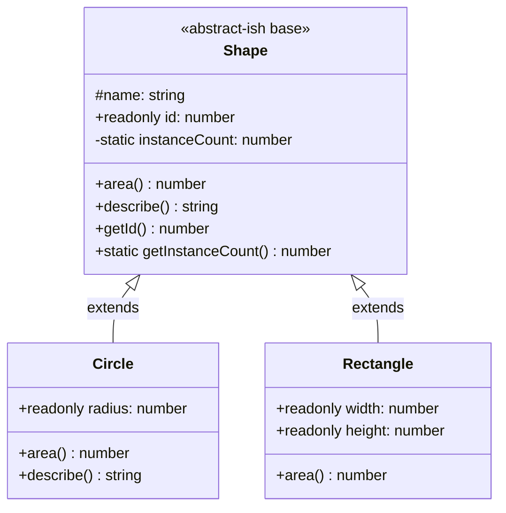
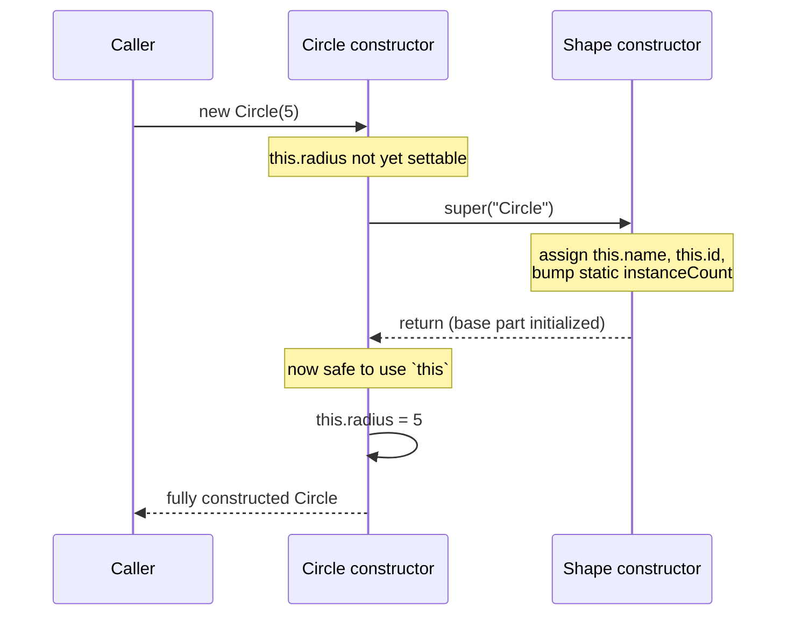
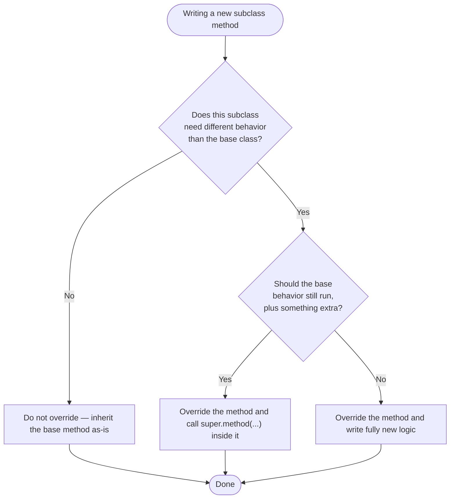

# Classes and Inheritance

## Intent

Model a family of related "things" by writing one class that holds the shared data and behavior, and one or more subclasses that reuse that shared code via `extends` while adding or specializing behavior of their own — without copy-pasting the shared logic into every variant.

## Real Life Analogy

Think about how a company designs a form for "Vehicle Registration." Every vehicle — car, motorcycle, truck — needs a registration number, an owner name, and a way to compute road tax. Instead of printing three completely separate forms from scratch, the government designs one **base form** with the common fields, and then a **car addendum**, a **motorcycle addendum**, a **truck addendum** — each addendum *inherits* everything on the base form and only adds or changes what is specific to that vehicle type (a truck addendum adds "load capacity," a motorcycle addendum has a different tax formula).

A TypeScript class hierarchy works the same way. The **base class** (`Shape`) captures what every variant has in common — an identifier, a name, a way to describe itself. Each **subclass** (`Circle`, `Rectangle`) reuses that common form via `extends` and only writes the code that makes it different — its own shape of area calculation. You never redefine "how to describe yourself" in every subclass; you inherit it, and only override the parts that truly differ.

## Problem

### What engineering problem exists?

You constantly need many types that are *variations on a theme*:

- Different shapes (`Circle`, `Rectangle`, `Triangle`) that all have an area, a name, and an id, but compute area differently.
- Different UI widgets (`Button`, `Checkbox`, `Dropdown`) that all render and handle focus, but render differently.
- Different employees (`Manager`, `Engineer`) who all have a name and salary, but compute a bonus differently.

Without a language mechanism for "reuse this, but let me change that one part," you either duplicate the shared code in every variant, or you write one giant class riddled with `if (type === "circle")` branches.

> **Term: Class.** A class is a blueprint that bundles together state (fields) and behavior (methods) into a single reusable unit. `new Shape(...)` produces an *instance* — a concrete object built from that blueprint.

> **Term: Inheritance.** A mechanism where one class (the *subclass*, written with `extends`) automatically gets all the fields and methods of another class (the *superclass* / *base class* / *parent class*), and may add new members or replace ("override") existing ones.

### Why is this problem difficult?

- **Shared logic needs exactly one home.** If `describe()` is written once in `Shape` but three shapes need it, you want one authoritative copy — not three copies that will inevitably drift apart when someone fixes a bug in only one of them.
- **Some behavior must stay identical, some must vary per type.** `Circle.area()` and `Rectangle.area()` are fundamentally different formulas, but `describe()` (which reports the name, id, and area) should behave the same way for every shape. You need a mechanism that lets *some* methods be shared as-is and *other* methods be replaced per subclass — that's exactly what overriding is for.
- **Construction has ordering constraints.** A subclass often needs to initialize the parent's part of the object *before* it can safely add its own fields. TypeScript enforces this at compile time, which is unfamiliar if you have not hit it before.
- **Some state belongs to the "type," not to any one object.** A running count of how many shapes exist, or a fixed conversion constant, does not belong to any single `Circle` instance — it belongs to the `Shape` class itself.

### What happens if we ignore it?

- **Copy-pasted logic drifts.** If every shape hand-writes its own `describe()`, a bug fix in one copy never reaches the others.
- **Giant type-checking classes.** A single `Shape` class with `if (this.kind === "circle") ... else if (this.kind === "rectangle") ...` inside every method grows unboundedly and becomes unreadable — the opposite of what an OOP language gives you for free.
- **Fragile constructors.** Without `super(...)` enforcing a clear initialization order, subclasses can end up with half-initialized parent state — fields silently `undefined` when you expected them to hold a value.
- **Accidental mutation of "shared" identity.** If per-instance state that should never change after construction (like an id) is a normal mutable field, any code anywhere can quietly reassign it, and bugs traceable to "who changed this id?" become very hard to track down.

## Why Not Other Solutions?

**"Just duplicate the method in every class."**
Works for one class, fails the moment you have three or ten. Every bug fix, every tweak to the shared formatting, has to be applied N times, and eventually one copy is missed. This is the exact problem inheritance exists to remove.

**"Use one class with a `kind` string field and branch inside every method."**
This avoids duplication but replaces it with branching. Every method grows a switch/if-chain, adding a new shape means editing every existing method (violates Open/Closed), and TypeScript cannot help you notice a missing case the way separate classes with distinct behavior naturally would.

**"Use plain functions and pass data around, no classes at all."**
Perfectly valid for simple cases, and often the right call (see "When NOT To Use" below). But once you have several *variants that share both state and behavior*, and you want the compiler to guarantee every variant has a `name`, an `id`, and an `area()`, a class hierarchy documents and enforces that shape far more directly than a bag of loose functions passed a plain object.

**"Copy the whole parent class and modify it (no `extends` at all)."**
This is manual, error-prone duplication with extra steps. Any improvement to the "parent" logic must be hand-applied to every copy. `extends` exists specifically so you write the shared logic exactly once.

**Tradeoff summary:** Duplication and giant switch-classes both trade a small amount of "structure" now for maintenance pain later. Inheritance costs you a small amount of upfront design (deciding what belongs in the base vs. the subclass) in exchange for one authoritative copy of shared logic and a compiler that enforces correct construction order.

## Solution

The core idea: **write the shared shape once in a base class, and let each variant `extend` it, calling `super(...)` to initialize the inherited part and overriding only the methods that must behave differently.**

- The **base class** (`Shape`) declares the fields and methods every variant needs: an `id`, a `name`, a default `area()`, and a `describe()` that uses whatever `area()` returns — without knowing or caring which subclass is actually running.
- Each **subclass** (`Circle`, `Rectangle`) uses `extends Shape` to inherit all of that for free, then:
  - Calls `super(...)` inside its own constructor to properly initialize the inherited part of the object.
  - Adds its own fields (`radius`, or `width`/`height`).
  - **Overrides** `area()` with its own formula, because that is the one piece of behavior that genuinely differs per shape.
- Because `describe()` in the base class calls `this.area()` (not a hardcoded formula), every subclass automatically gets a correct `describe()` for free — this is **polymorphism**: the same method call (`shape.describe()`) produces behavior appropriate to whichever concrete class `shape` actually is at runtime.

The thinking behind it:

1. **Put in the base class only what is truly shared.** If two subclasses would implement a method identically, it belongs in the base class. If they would implement it differently, it belongs as an overridden method in each subclass.
2. **Let the compiler enforce initialization order.** TypeScript requires `super(...)` to run before you touch `this` in a subclass constructor, so the inherited state is always valid before your own code builds on top of it.
3. **Extend behavior, don't blindly replace it, when both matter.** When an override should still perform the parent's work and then add something extra, call `super.methodName(...)` inside the override instead of rewriting the parent's logic from scratch.

You do **not** need every subclass to override every method — only the methods that actually differ. Anything not overridden is simply inherited as-is.

## Architecture

There are four moving parts in a typical class hierarchy:

1. **Base class (superclass / parent class):** Declares the shared shape — constructor parameters, fields, and methods common to every variant. Here: `Shape`.

2. **Subclass (derived class / child class):** Declared with `extends BaseClass`. Automatically has every field and method the base class has. Here: `Circle` and `Rectangle`.

3. **`super(...)` call:** The very first statement in a subclass constructor (when the base class itself has a constructor with parameters). It runs the base class's constructor, initializing the inherited part of the object. Only after `super(...)` returns is `this` considered fully constructed enough to use.

4. **Overridden methods:** A method redeclared in a subclass with the same name and compatible signature as one in the base class. When called on a subclass instance, the subclass's version runs instead of the base class's version — this is dynamic dispatch. Inside an override, `super.methodName(...)` explicitly invokes the base class's version if you want to extend rather than fully replace it.

Static members sit slightly outside this per-instance picture: a `static` field or method belongs to the **class itself**, not to any instance, and is accessed as `ClassName.member`, never `instance.member`.

## Execution Flow

1. Code calls `new Circle(5)`.
2. The `Circle` constructor runs. Its very first line must be `super("Circle")` (or whatever arguments the base constructor needs).
3. Control jumps into the `Shape` constructor. It runs its own body: assigning `this.name`, incrementing the static instance counter, and assigning `this.id`.
4. The `Shape` constructor finishes and returns control to the `Circle` constructor, right after the `super(...)` line.
5. Only now can the `Circle` constructor safely use `this` — it assigns `this.radius = radius`.
6. `new Circle(5)` finishes; you now have a fully-initialized object whose "shape part" came from `Shape` and whose "circle part" came from `Circle`.
7. Later, code calls `circle.describe()`. TypeScript/JavaScript looks for `describe` starting on `Circle` — if `Circle` overrides it, that version runs.
8. Inside `Circle.describe()`, the override calls `super.describe()` first, which runs `Shape.describe()`'s original logic (using `this.area()` — which, thanks to dynamic dispatch, still resolves to `Circle.area()`, not `Shape.area()`).
9. `Circle.describe()` takes the string `Shape.describe()` returned and appends circle-specific detail (its radius) before returning the final string.
10. If instead you call `rectangle.describe()` and `Rectangle` never overrode `describe()`, step 7 finds no override on `Rectangle` and walks up to `Shape.describe()` directly — it runs unmodified, and `this.area()` inside it still correctly calls `Rectangle.area()`.

## Class Diagram

## Sequence Diagram

## Flow Diagram

## Implementation

The implementation strategy in TypeScript:

1. **Design the base class around what is truly shared.** Fields and methods that every variant needs (an id, a name, a `describe()` built from a common formula) go here.

2. **Give the base class a constructor if it needs setup.** Any parameters required to initialize shared state (e.g. the shape's `name`) belong to the base constructor.

3. **Declare each subclass with `extends BaseClass`.** In the subclass constructor, call `super(...)` with whatever the base constructor needs — this must happen before any reference to `this`.

4. **Add subclass-specific fields after `super(...)`.** These are the fields that only make sense for that particular variant (`radius` only exists on `Circle`).

5. **Override only the methods that genuinely differ.** Use the same method name and a compatible signature. Inside an override, call `super.methodName(...)` if the parent's version should still run as part of the new behavior.

6. **Mark per-instance identity/config that should never change after construction as `readonly`.** This lets the compiler catch accidental reassignment.

7. **Put class-wide (not per-instance) data or utilities behind `static`.** Access them via the class name, not through any instance.

We will demonstrate this with a `Shape` base class and two subclasses, `Circle` and `Rectangle`, that share an id/name/describe mechanism but compute area completely differently.

## Code Walkthrough

See [code.ts](code.ts) for the full runnable implementation. Here is what each part does and why it exists.

**`Shape` (base class).**
Declares a `protected name` field (readable inside subclasses, hidden from outside code), a `readonly id` assigned once in the constructor from a `private static instanceCount`, a default `area()` meant to be overridden, and a `describe()` that calls `this.area()` — never a hardcoded formula, so every subclass automatically gets a correct description. It exists to hold everything that is identical across all shapes.

**`Circle` (subclass, full override).**
`extends Shape`. Its constructor calls `super("Circle")` before touching `this`, then assigns its own `readonly radius`. It overrides `area()` with the circle formula, and overrides `describe()` too — but instead of rewriting the whole string, it calls `super.describe()` and appends radius-specific detail. This exists to show both a "replace" override (`area()`) and an "extend" override (`describe()`) in the same class.

**`Rectangle` (subclass, partial override).**
`extends Shape`. Its constructor calls `super("Rectangle")`, then assigns `readonly width` and `readonly height`. It overrides `area()` (width × height) but **does not** override `describe()` at all. This exists to prove that a subclass never has to override every inherited method — `Rectangle` still gets a correct `describe()` from `Shape`, and thanks to dynamic dispatch, `Shape.describe()`'s call to `this.area()` still resolves to `Rectangle.area()`.

**Static members (`Shape.instanceCount` / `Shape.getInstanceCount()`).**
A private static counter tracks how many `Shape` instances (of any subclass) have ever been created. It is incremented once per construction and read through a `static` method called on the class itself (`Shape.getInstanceCount()`), never through an instance (`someCircle.getInstanceCount()` would not even compile) — because this count belongs to the *type*, not to any one shape.

**Interactions.**
`main()` constructs a `Circle` and a `Rectangle`, calls `describe()` on both through a common `Shape[]` array (polymorphism — the same call resolves differently per instance), reads `Shape.getInstanceCount()` afterward, and includes a commented-out line showing the compiler error you would get from reassigning a `readonly` field after construction.

## Advantages

- **Write shared logic once.** `describe()`, `getId()`, and the id-generation mechanism exist in exactly one place.
- **Polymorphism for free.** Code that only knows about `Shape` (e.g. a function that loops over `Shape[]` and calls `describe()`) automatically works correctly for every current and future subclass.
- **Compiler-enforced construction order.** You cannot accidentally use `this` in a subclass constructor before the inherited part of the object is valid — TypeScript raises the "must call super before accessing this" error at compile time.
- **Clear extension point.** `super.methodName(...)` gives a precise, explicit way to add behavior on top of the parent's, instead of duplicating it.
- **Class-wide state has a natural home.** `static` members avoid awkwardly bolting shared counters or constants onto every instance.
- **Immutability where it matters.** `readonly` documents and enforces "this never changes after construction" for ids and fixed configuration.

## Disadvantages / Gotchas

- **Deep hierarchies get hard to follow.** If `D extends C extends B extends A`, understanding what a method on `D` actually does may require reading four classes.
- **Tight coupling between base and subclass.** A subclass depends on the exact shape and behavior of its base class; changing the base class can silently break every subclass (the classic "fragile base class" problem).
- **Overriding without calling `super` can silently drop behavior.** If a subclass overrides `describe()` and forgets `super.describe()`, whatever the base class did (e.g. logging, formatting) is simply gone — with no compiler warning.
- **`this` cannot be touched before `super()` in a subclass constructor.** This trips up beginners who are used to languages without this restriction; TypeScript enforces it because the inherited fields do not exist yet.
- **Single inheritance only.** A class can `extends` only one other class in TypeScript/JavaScript — you cannot inherit from two base classes at once (composition or interfaces are used instead).
- **Static members are easy to misuse as global mutable state.** A `static` counter shared across all instances can become a hidden dependency that makes unit tests interfere with each other if not reset.

## Tradeoffs

**What we gain:** one authoritative copy of shared logic, compiler-enforced initialization order, natural polymorphism, and a clear place (`static`) for class-wide data.

**What we lose:** some flexibility — a class can extend only one base class, subclasses are coupled to their base class's shape, and deep hierarchies can become hard to reason about. Favor a shallow hierarchy (one level of inheritance, as in `Shape → Circle`) and reach for composition or interfaces when you need to mix in behavior from multiple unrelated sources.

## Complexity

**Code Complexity:** Low for a shallow hierarchy like `Shape → Circle`/`Rectangle`. Rises quickly with hierarchy depth or with many overridden methods calling `super` in different orders.

**Maintenance Complexity:** Low as long as the base class is stable. A change to the base class's public shape (renaming a method, changing a constructor's parameters) requires updating every subclass.

**Scalability:** Adding a new variant (`Triangle`) is cheap — one new subclass, no changes to `Shape` or to existing subclasses, as long as the new variant fits the same shared contract.

**Flexibility:** Moderate. Great for "is-a" relationships that are genuinely stable (`Circle` is-a `Shape` and always will be). Poor fit for behavior that needs to be mixed and matched at runtime — that calls for composition instead.

**Testability:** High. Each subclass can be instantiated and tested independently; the base class's shared logic (`describe()`) only needs to be tested once, typically through any one concrete subclass.

## Common Mistakes

- **Trying to use `this` before calling `super()`.** In a subclass constructor, TypeScript will not let you read or write `this.anything` — or even call a method — until `super(...)` has run. *Why it happens:* JavaScript/TypeScript builds the base class's part of the object first; until `super()` runs, that part does not exist yet, so `this` is not yet safe to use. *Avoid:* always make `super(...)` the very first statement in a subclass constructor.

- **Forgetting `super(...)` entirely when the base class has a constructor with parameters.** *Why:* easy to overlook when a subclass constructor only seems to need its own new fields. *Avoid:* if the base class defines a constructor, TypeScript will refuse to compile a subclass constructor that never calls `super(...)` — treat that error as a reminder, not an obstacle.

- **Assuming every subclass must override every base method.** *Why it happens:* it feels "incomplete" to leave a method un-overridden. *Reality:* a subclass only overrides what genuinely differs; `Rectangle` in this file never overrides `describe()` and that is completely correct — it simply inherits `Shape.describe()`.

- **Overriding a method and forgetting to call `super.method()` when the parent behavior was still needed.** *Why:* it is easy to fully rewrite a method instead of asking "should the old behavior still run, plus something extra?" *Avoid:* before overriding, decide whether you are *replacing* or *extending* behavior; if extending, call `super.method(...)`.

- **Confusing `protected` with `private` or "encapsulated forever."** *Why:* both restrict access from *outside* the class. *Reality:* `protected` means "this class and its subclasses can use this field directly," which is why `Circle` and `Rectangle` can read `this.name` even though it is not `public`. It says nothing else about visibility beyond that boundary — the full spectrum of access modifiers (`public`/`protected`/`private`) is its own topic.

- **Reaching for a `static` member via an instance.** Writing `someCircle.getInstanceCount()` will not compile — `static` members belong to the class, not the instance. *Avoid:* always call them as `Shape.getInstanceCount()`.

- **Marking a field `readonly` but still expecting to reassign it in a method other than the constructor.** *Reality:* `readonly` fields may be assigned only inside the constructor (or at declaration); any later reassignment anywhere else is a compile error.

## When To Use

- You have several types that share both **state and behavior**, and only a focused part of that behavior actually differs (`Shape` → `Circle`/`Rectangle`).
- You want the compiler to **guarantee** every variant has a certain constructor shape and a certain set of methods.
- You want **polymorphism**: code written against the base type should keep working, unmodified, as new subclasses are added.
- You have genuinely class-wide data or behavior (a shared counter, a factory method, a constant) that belongs to the **type itself**, not to any one instance — `static` is the right tool.
- You have per-instance identity or fixed configuration that should be **impossible to reassign** after construction — `readonly` is the right tool.

## When NOT To Use

- **When the "shared behavior" is really just shared data with no meaningful common methods.** A plain object type or interface is simpler and avoids the ceremony of a class.
- **When you need to mix in behavior from more than one unrelated source.** Single inheritance cannot express "is-a Shape AND is-a Serializable AND is-a Loggable" cleanly — composition, interfaces, or mixins fit better.
- **When the hierarchy would be deep and speculative** ("just in case we need it later"). Shallow, concrete hierarchies driven by real current needs age far better than deep, anticipatory ones.
- **When subclasses would end up overriding almost everything anyway.** If `Circle` and `Rectangle` shared almost nothing, forcing them under one base class only adds indirection without the payoff of reuse — separate, unrelated classes (or composition) are more honest.
- **When you only need to swap one algorithm behind a stable interface, not share state.** That is closer to the Strategy pattern (favor composition) than to inheritance.

## Real World Examples

- **JavaScript/TypeScript built-ins:** `TypeError`, `RangeError`, and `SyntaxError` all `extend Error`, inheriting `message`/`stack` handling while adding their own `name`.
- **DOM:** `HTMLButtonElement`, `HTMLInputElement`, etc. all extend `HTMLElement`, which extends `Node`, which extends `EventTarget` — a real multi-level inheritance chain used by every browser.
- **React (class components, legacy API):** Every class component `extends React.Component`, inheriting lifecycle plumbing and `setState`, while overriding `render()` with its own JSX.
- **NestJS:** Custom exception classes commonly `extend HttpException`, calling `super(message, statusCode)` and adding domain-specific fields.
- **Node.js:** `Buffer` historically extended `Uint8Array`; many stream classes (`Transform`) extend `Duplex`, overriding a handful of methods while inheriting the rest of the stream machinery.
- **Testing frameworks:** Custom assertion/error classes in test runners routinely `extend Error` so `instanceof Error` still works while adding structured diagnostic fields.
- **Game/UI engines:** Entity hierarchies (`Enemy extends Character extends Entity`) are one of the most common real-world uses of multi-level inheritance with method overriding.

## Where I Can Use This

Five realistic ideas for your own TypeScript projects:

1. **Domain error hierarchy.** A `AppError extends Error` base class with `readonly code` and `NotFoundError`/`ValidationError` subclasses that call `super(message)` and set their own status code.
2. **Notification channels.** A `Notification` base class with `subject`/`body`, and `EmailNotification`/`SmsNotification` subclasses overriding a `render()` method for channel-specific formatting.
3. **Geometry/graphics.** Exactly the `Shape` → `Circle`/`Rectangle` hierarchy here, extended with `Triangle`, each overriding `area()` and optionally `perimeter()`.
4. **UI widget base class.** A `Widget` base class handling common lifecycle (`mount()`, `id` generation via a `static` counter) with `Button`/`Checkbox` subclasses overriding `render()`.
5. **Report generators.** A `Report` base class with shared `readonly generatedAt` and a `static reportCount`, and `PdfReport`/`CsvReport` subclasses overriding a `format()` method.

## Related Topics

- **Interfaces & Abstract Classes:** An interface declares a shape with no implementation at all; an abstract class (a stricter relative of what `Shape` could become) can declare methods with *no* body that subclasses are *forced* to implement, alongside methods that are already implemented and simply inherited.
- **Composition over Inheritance:** Instead of `extends`, give a class a field that holds another object and delegate to it. Prefer this when you need to combine unrelated behaviors rather than model a strict "is-a" relationship.
- **Access Modifiers (`public`/`protected`/`private`):** Controls exactly which code can read or write a field/method. This file uses `protected` only to the extent needed for inheritance to work — the full rules live in their own topic.
- **Polymorphism:** The general principle, demonstrated here by `describe()`, that the same method call on a base-typed variable runs different code depending on the actual runtime subclass.
- **Static members:** Class-level (not instance-level) fields and methods, covered here just enough to contrast with instance members — `Shape.getInstanceCount()` vs. `circle.describe()`.

| Concept | Belongs to | Shared how | Example here |
|---|---|---|---|
| Instance field/method | Each object | Copied conceptually per instance | `this.radius`, `area()` |
| Static field/method | The class itself | One copy, shared by all instances | `Shape.getInstanceCount()` |
| `readonly` field | Each object | Assignable only at construction | `this.id`, `this.radius` |
| `protected` field | Each object | Visible to class + subclasses only | `this.name` |
| Overridden method | Each subclass | Replaces or extends the base version | `Circle.area()`, `Circle.describe()` |
| Inherited (non-overridden) method | Shared from base | Used as-is by subclasses that don't override it | `Rectangle.describe()` |

## Interview Discussion

Experienced engineers rarely treat "classes and inheritance" as a toy topic — they discuss it as a **modeling decision**: is this relationship genuinely "is-a" and stable, or would composition age better?

Common follow-up questions:
- *"Why must `super()` run before you touch `this` in a subclass constructor?"* Because the inherited fields do not exist until the base constructor has run; touching `this` earlier would read/write memory that is not yet initialized.
- *"Does a subclass have to override every base method?"* No — it overrides only what genuinely differs; everything else is inherited unchanged, as `Rectangle.describe()` shows.
- *"When do you call `super.method()` inside an override, versus not?"* Call it when the parent's behavior should still run as part of the new behavior (extend); skip it when the override is a full replacement.
- *"What's the difference between overriding and overloading?"* Overriding replaces/extends a method's implementation in a subclass with the *same* name and a compatible signature; overloading (a separate TS feature) declares *multiple call signatures* for the *same* method name within one class/declaration, resolved by argument shape at compile time, not by which class the instance is.
- *"When would you reach for composition instead of inheritance?"* When you need to combine behaviors from multiple unrelated sources, or when the hierarchy would only be shallow-in-name (subclasses overriding nearly everything).

Common misconceptions:
- "A subclass must override every parent method." False — see `Rectangle.describe()`.
- "`protected` means private." False — `protected` is visible to the class and its subclasses, `private` is visible only within the declaring class.
- "`static` members are inherited like instance members and work the same way." They are inherited, but they are still accessed through the class, not an instance, and there is exactly one shared copy across all instances.

## Summary

- A `class` bundles state and behavior; `extends` lets a subclass reuse a base class's fields and methods.
- `super(...)` must run first in a subclass constructor — it initializes the inherited part of the object before you can safely use `this`.
- Overriding replaces (or, with `super.method()`, extends) a base method's behavior in a subclass; a subclass never has to override every method.
- `static` members belong to the class itself and are accessed via the class name, not an instance.
- `readonly` fields can only be assigned inside the constructor (or at declaration) and are protected from later reassignment by the compiler.
- `protected` lets subclasses reach into inherited state directly; it is not the same as `private`.

## Key Takeaways

1. A class is a blueprint; `extends` lets a subclass inherit a base class's fields and methods.
2. `super(...)` must be the first statement in a subclass constructor whenever the base class has its own constructor — `this` cannot be used before it runs.
3. Overriding gives a subclass its own version of an inherited method with the same name; calling `super.method()` inside an override extends rather than replaces the parent's behavior.
4. A subclass only overrides what actually differs — everything else is inherited as-is.
5. Overriding (same name, runtime dispatch by subclass) is different from overloading (multiple call signatures for one method, resolved at compile time by argument shape).
6. `static` members belong to the class, accessed as `ClassName.member`, and exist as one shared copy, not per instance.
7. `readonly` fields can be assigned only inside the constructor (or at declaration); later reassignment anywhere else is a compile error.
8. `protected` fields/methods are visible to the declaring class and its subclasses, but not to outside code — a lightweight preview of the full access-modifier topic.
9. Prefer shallow hierarchies driven by real needs over deep, speculative ones.
10. Reach for composition or interfaces instead of inheritance when you need to combine unrelated behaviors rather than model a genuine "is-a" relationship.

---

## Further Reading

**Books**
- *Programming TypeScript* — Boris Cherny (clear treatment of classes, inheritance, and static members).
- *Effective TypeScript* — Dan Vanderkam (idiomatic guidance on when to model with classes vs. plain objects).
- *Design Patterns: Elements of Reusable Object-Oriented Software* — Gamma, Helm, Johnson, Vlissides ("favor composition over inheritance" originates here).
- *Effective Java* — Joshua Bloch (Item: "Favor composition over inheritance" — language-agnostic reasoning that applies directly to TS/JS).

**Official Documentation**
- TypeScript Handbook — Classes — https://www.typescriptlang.org/docs/handbook/2/classes.html
- MDN — Classes (`extends`, `super`) — https://developer.mozilla.org/en-US/docs/Web/JavaScript/Reference/Classes
- MDN — `super` — https://developer.mozilla.org/en-US/docs/Web/JavaScript/Reference/Operators/super

**Blog Articles**
- TypeScript Deep Dive — Classes — https://basarat.gitbook.io/typescript/future-javascript/classes
- Refactoring.Guru — "Composition over Inheritance" — https://refactoring.guru/design-patterns/composition-over-inheritance

**Research / Foundational**
- Liskov, B. — "A Behavioral Notion of Subtyping" (the theoretical basis for what makes an `extends` relationship sound — the Liskov Substitution Principle).
