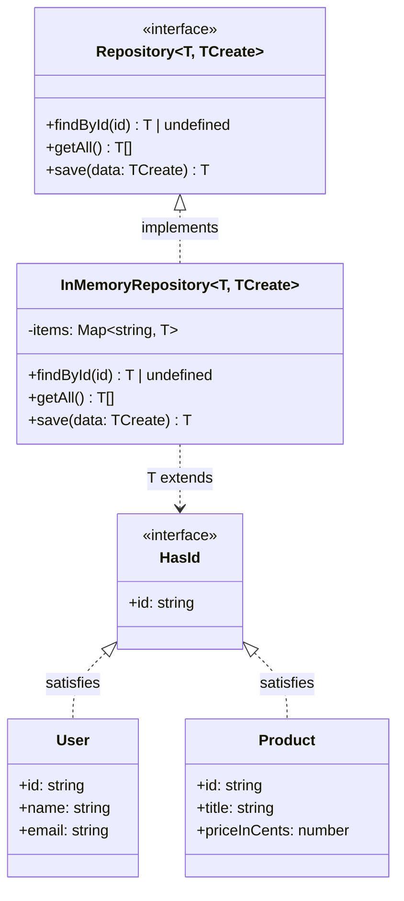
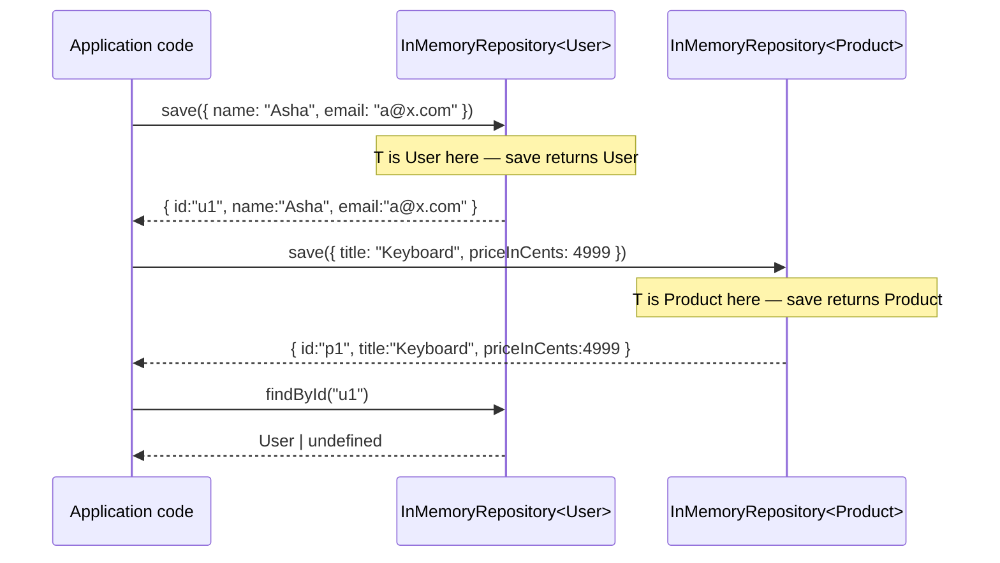
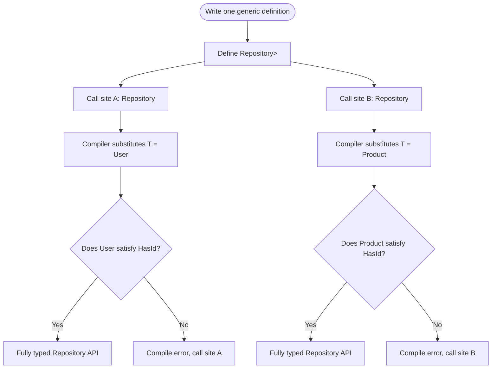

# Generics

## Intent

Write a single function, interface, or class that works correctly with many different types **without** giving up type safety and **without** writing a near-identical copy for every type. A type parameter (conventionally `T`) acts as a placeholder for "some type, to be decided later," and the compiler fills it in — and checks it — at every call site or instantiation.

## Real Life Analogy

Imagine a self-storage company that rents out lockers. Every locker has the exact same rules: it has a fixed size, a lock, and a label on the door. What goes *inside* the locker is not the storage company's business — one customer stores furniture, another stores documents, another stores winter clothes. The locker itself is generic over its contents.

Crucially, once a customer labels their locker "Winter Clothes," the storage company will not let a neighbour dump a motorcycle engine in it — the *label* fixes what that particular locker holds, even though the locker *design* was written to hold anything. That is exactly a generic type: `Locker<T>` is one design; `Locker<WinterClothes>` and `Locker<Documents>` are two specific, type-safe uses of it.

> **Term: Type Parameter.** A placeholder for a type, written in angle brackets after a name, e.g. `T` in `Repository<T>`. It behaves like a *parameter* for the type checker, the same way a function parameter is a placeholder for a value. It is filled in — either explicitly or by inference — with a concrete type at the point of use.

## Problem

### What engineering problem exists?

Real applications are full of code that is *structurally* identical across many unrelated types:

- A data-access class that needs `findById`, `save`, and `getAll` for `User`, `Product`, `Order`, and a dozen other entities.
- A `Stack`/`Queue`/`Cache` that must hold numbers in one place and strings or objects in another, with the exact same push/pop/peek logic.
- A utility function like "give me the first item of this array or a fallback" that makes sense for arrays of any element type.
- API client wrappers where the HTTP plumbing is identical but the response shape differs per endpoint.

You are stuck between two bad options: **write the logic once and type it as `any`** (compiles for everything, but tells the type checker nothing — no autocomplete, no compile-time error when you misuse the result), or **write the logic once per type** (`UserRepository`, `ProductRepository`, …) which is exact duplication of behaviour that must be kept in sync forever.

> **Term: Type Erasure of `any`.** Marking something `any` does not mean "works with all types safely" — it means "the compiler stops checking this value entirely." Every property access, method call, and assignment involving an `any` is silently accepted, even ones that will crash at runtime.

### Why is this problem difficult?

- **The logic is identical, but the types are not.** A `Repository<User>.save` and a `Repository<Product>.save` execute the same lines of code, yet must report different, correct parameter and return types to callers.
- **You often need to preserve a *relationship* between types**, not just accept "anything." `getIds(items: T[]): string[]` must guarantee that whatever `T` turns out to be, the function returns strings extracted from that same `T` — a plain `any[]` parameter cannot express that relationship.
- **Sometimes "any type" is too permissive.** A function that reads `.length` needs *some* guarantee the argument has a `length` property; it cannot accept a bare `number`. You need a way to say "any type, but only ones with at least this shape" — full genericity minus full permissiveness.
- **Inference vs explicit annotation is a constant judgment call.** Most of the time TypeScript infers `T` from the arguments you pass; occasionally (e.g. constructing an empty collection) there is nothing to infer from, and you must supply the type argument explicitly.

### What happens if we ignore it?

- **`any` spreads silently.** Once one signature returns `any`, every value derived from it is also effectively untyped, and the unsafety propagates through the whole call chain — this is sometimes called "the `any` plague."
- **Copy-pasted per-type classes drift apart.** A bug fix or a new validation rule gets added to `ProductRepository.save` but the author forgets `UserRepository.save` exists — now behaviour is inconsistent for no reason.
- **Refactors become dangerous.** Renaming a field on `User` should be a compiler-checked, one-place change; with `any` in the mix, TypeScript cannot tell you which call sites broke, and mistakes surface at runtime instead of compile time.
- **Constraints get enforced by convention, not by the compiler** — someone eventually calls the "requires a `.length`" function with a plain number, and it fails in production instead of failing to compile.

## Why Not Other Solutions?

**"Just type it `any` and move on."**
It "works" in the sense that it compiles for every input, but you have opted the value out of the type system entirely. You lose autocomplete, you lose compile-time detection of typos and wrong argument types, and `any` contaminates everything downstream of it.

**"Write one class/function per concrete type."**
This is honestly type-safe, but it is pure duplication. `UserRepository`, `ProductRepository`, `OrderRepository` end up with identical bodies and only the type names differ. Every future change to the shared logic must be applied N times, and it will eventually be applied inconsistently.

**"Use a union type instead, e.g. `User | Product`."**
Unions describe "one of a fixed, closed set of types known up front." They do not scale — every new entity means editing the union everywhere it appears — and they do not express "the same T in, the same T out" relationship a generic gives you for free. A union also collapses information: `(User | Product)[]` cannot promise you get back the *same* type you put in.

**"Use `unknown` and cast it back with `as` wherever needed."**
`unknown` is safer than `any` at the boundary because it forces a check before use, but sprinkling `as SomeType` throughout the codebase reintroduces exactly the unchecked assumptions generics are meant to eliminate — you are manually asserting what the compiler could have verified for you.

**Tradeoff summary:** every non-generic alternative forces a choice between duplicating code, discarding type safety, or manually re-asserting types the compiler could check automatically. Generics let one definition serve many types while the compiler verifies every instantiation independently.

## Solution

The core idea: **parameterize the definition by type, and let the compiler substitute the real type at each point of use.**

You write a function, interface, or class exactly once, using a placeholder type parameter (`T`, or `TCreate`, `K`, `V` for more of them) wherever a concrete type would normally appear. TypeScript treats that placeholder as an unknown-but-consistent type throughout the definition. When code *uses* the generic — calls the function, implements the interface, instantiates the class — it supplies (or lets inference determine) the real type, and the compiler checks the entire definition again as if `T` had been replaced by that real type everywhere it appears.

The thinking behind it:

1. **Write behaviour once, types many.** The `InMemoryRepository<T>` class contains one implementation of `save`/`findById`/`getAll`; TypeScript, not you, produces the correctly-typed version for `InMemoryRepository<User>` and `InMemoryRepository<Product>`.
2. **Constrain only what you actually need.** `<T extends HasId>` says "I do not care what `T` is, as long as it has an `id: string`." This keeps the function as reusable as possible while still letting the compiler check the one property you rely on.
3. **Give sensible defaults where most callers agree.** A default type parameter, `<T, TCreate = Partial<T>>`, means callers who are happy with the common case can write `Repository<User>` and get `TCreate` filled in automatically, while callers with unusual needs can still override it explicitly.

You do **not** duplicate the class per entity. You do **not** downgrade to `any`. You write the shape once, parameterized, and let each call site instantiate it with full type checking.

## Architecture

There are four participants:

1. **Type Parameter (`T`):** The placeholder introduced in angle brackets, e.g. `Repository<T>`. It stands in for "the concrete type this particular use case cares about." It exists only for the type checker — it produces no runtime object.

2. **Constraint (`extends`):** An optional upper bound on what `T` is allowed to be, e.g. `<T extends HasId>`. It exists so the generic definition can safely use the members it relies on (`item.id`) without collapsing back to "any type is fine."

3. **Concrete Type (e.g. `User`, `Product`):** The real, specific type supplied at a call site or instantiation, e.g. `Repository<User>`. It exists as the actual payload the generic definition is asked to work with this time.

4. **Generic Definition (function/interface/class):** The reusable template itself — `identity`, `Repository<T>`, `InMemoryRepository<T>`. It exists to hold the one shared implementation or contract that every instantiation reuses unchanged.

Responsibilities in one line each:
- **Type Parameter:** names the unknown type the definition is written against.
- **Constraint:** limits that unknown type to ones the definition can safely use.
- **Concrete Type:** the real type plugged in at a specific use.
- **Generic Definition:** the one reusable implementation or contract, instantiated many times.

## Execution Flow

1. You author a generic definition once — e.g. `interface Repository<T extends HasId, TCreate = Partial<T>>` and `class InMemoryRepository<T extends HasId, TCreate = Partial<T>> implements Repository<T, TCreate>`.
2. Call-site code instantiates it with a concrete type: `new InMemoryRepository<User>()` or, via inference, `getIds(users)` where `users: User[]`.
3. The TypeScript compiler substitutes `T` with `User` (and, thanks to the default, `TCreate` with `Partial<User>`) for **that specific instantiation only**.
4. Every method on that instance is now checked and displayed with `User` in place of `T` — `save(user: User): void`, `findById(id: string): User | undefined`.
5. A second instantiation, `new InMemoryRepository<Product>()`, repeats the same substitution independently with `Product`. The two instances share the exact same compiled logic but report entirely different, correct types to their respective callers.
6. Because this substitution happens at compile time only, there is **no runtime representation of `T`** — generics affect what the type checker allows, not what JavaScript executes.
7. If a constraint is violated — e.g. calling `getIds` with an array of plain numbers when `T extends HasId` is required — the compiler rejects the call before it ever runs.

## Class Diagram

## Sequence Diagram

## Flow Diagram

## Implementation

The implementation strategy in TypeScript:

1. **Identify what actually varies.** Look at the near-duplicate functions/classes and find the one thing that changes between them — usually a single entity type. That is your `T`.

2. **Write the constraint first, if you need one.** If the generic body needs to read a property (`.id`, `.length`) or call a method, define a small interface (`HasId`) and write `<T extends HasId>` — this is the minimum permission the definition needs, no more.

3. **Introduce a default type parameter for the common case.** If most callers want the same secondary type derived from `T` (e.g. "the shape used to create a new one is just a partial `T`"), write `<T, TCreate = Partial<T>>` so ordinary callers can omit it.

4. **Implement the generic class against the interface.** `InMemoryRepository<T extends HasId, TCreate = Partial<T>> implements Repository<T, TCreate>` reuses the interface's shape and adds the concrete storage (a `Map<string, T>`, in our case).

5. **Instantiate with two unrelated concrete types** to prove genuine reuse — one instantiation is not proof the definition generalizes; two different, unrelated shapes (`User`, `Product`) are.

We will demonstrate this with a realistic scenario: a generic `Repository<T>` data-access abstraction, backed by an in-memory implementation, used identically for a `User` entity and a `Product` entity. We also show a small generic constraint function (`getIds`) and a couple of standalone generic functions to reinforce the pattern.

## Code Walkthrough

See [code.ts](code.ts) for the full runnable implementation. Here is what each part does and why it exists.

**`identity<T>` (plain generic function).**
The simplest possible generic: takes a `T`, returns the same `T`. It exists purely to show the placeholder mechanic with nothing else going on — no constraint, no class, just "the input type and the output type are the same, whatever that type is."

**`firstOrDefault<T>` (generic function over arrays).**
Takes a `T[]` and a fallback `T`, returns a `T`. It exists to show a generic function doing something slightly more useful while still requiring no constraint — arrays of *any* type support indexing and length checks.

**`HasId` (constraint interface).**
A minimal interface with just `id: string`. It exists so that generic code can safely assume "whatever `T` is, it has an `id`," without needing to know anything else about `T`.

**`getIds<T extends HasId>` (constrained generic function).**
Takes `T[]`, returns `string[]`, but only accepts `T`s that satisfy `HasId`. It exists to demonstrate that a constraint lets you *use* a property inside the generic body while still accepting any type that happens to have that property — `User[]` and `Product[]` both work, a plain `number[]` is rejected at compile time.

**`Repository<T, TCreate>` (generic interface with a default type parameter).**
Declares `findById`, `getAll`, and `save` in terms of `T` and `TCreate`, where `TCreate` defaults to `Partial<T>`. It exists as the vendor-neutral (in this case, storage-neutral) contract that any concrete repository implementation must honor, mirroring how a real data-access layer is designed around the application's needs first.

**`InMemoryRepository<T extends HasId, TCreate = Partial<T>>` (generic class).**
Implements `Repository<T, TCreate>` using a `Map<string, T>` for storage. It exists to prove the "write once, use for many types" payoff: the exact same class, instantiated as `InMemoryRepository<User>` and `InMemoryRepository<Product>`, gives two fully and independently type-checked repositories with zero duplicated logic.

**`User` and `Product` (concrete domain types).**
Two intentionally unrelated shapes, both satisfying `HasId`. They exist to prove the generic definitions above are not secretly specialized to one entity — swapping the type parameter is the only thing that changes.

**Interactions.**
The demo constructs `InMemoryRepository<User>` and `InMemoryRepository<Product>`, saves and retrieves entities through each, and calls `getIds` against both collections. No repository logic is duplicated; only the type argument differs.

## Advantages

- **Reuse without losing type safety.** One implementation serves every concrete type, and each instantiation is checked independently — unlike `any`, misuse is still caught at compile time.
- **Expresses relationships between types.** `T[] -> T` or `T -> T` guarantees the compiler enforces a connection between input and output that a plain `any`/`unknown` signature cannot express.
- **Constraints stay minimal.** `<T extends HasId>` grants exactly the permission the generic body needs, keeping the function as broadly reusable as possible.
- **Defaults reduce boilerplate for the common case.** `<T, TCreate = Partial<T>>` lets most callers write `Repository<User>` while still allowing an override when needed.
- **Autocomplete and refactoring stay intact.** Renaming a field on `User` immediately surfaces every affected generic-instantiated call site as a compile error.
- **Zero runtime cost.** Type parameters exist only during type checking; they are erased from the compiled JavaScript entirely.

## Disadvantages

- **Extra cognitive load.** Reading `<T extends HasId, TCreate = Partial<T>>` requires more upfront understanding than a concrete, non-generic signature.
- **Constraint and default syntax can get dense.** Multiple type parameters with constraints and defaults (`<T, K extends keyof T, V = T[K]>`) become hard to read quickly.
- **Inference is not always what you expect.** TypeScript sometimes infers a wider or narrower type than intended, requiring an explicit type argument to correct it.
- **Overgeneralization is tempting.** It is easy to make something generic "just in case" when only one concrete type will ever be used, adding indirection for no real payoff.
- **Error messages can be long.** A failed constraint check on a deeply generic type can produce a verbose compiler error that takes practice to read.

## Tradeoffs

**What we gain:** one reusable, fully type-checked definition instead of N duplicated ones or one unsafe `any` version; compiler-enforced relationships between input and output types; minimal, explicit permissions via constraints; sensible defaults that reduce boilerplate for the common case.

**What we lose:** some readability for engineers unfamiliar with generic syntax, and the temptation to over-parameterize things that do not actually need to vary. The pattern's value depends on there being genuine, multiple, real call sites — a generic written for a single concrete type is speculative generality.

## Complexity

**Code Complexity:** Low to moderate. A single type parameter with no constraint (`identity<T>`) is trivial; multiple parameters with constraints and defaults raise the bar but are still local to the one definition.

**Maintenance Complexity:** Low. Behaviour lives in one place; adding support for a new concrete type (a new entity) requires zero changes to the generic definition — just a new instantiation.

**Scalability:** Excellent. Adding `OrderRepository`-equivalent support is `new InMemoryRepository<Order>()` — no new class, no new file, no new logic.

**Flexibility:** High. The same generic definition instantiates for any type satisfying its constraint, including types written long after the generic itself.

**Testability:** High. You can test the generic definition once against a small test-only type satisfying the constraint, and trust it behaves identically for real domain types.

## Performance Considerations

**Memory:** Type parameters have no runtime representation — there is no extra object or wrapper per instantiation; `InMemoryRepository<User>` and `InMemoryRepository<Product>` compile to the same class shape.

**CPU:** Zero. Generics are a compile-time-only construct; the emitted JavaScript for a generic function is identical to a non-generic one with the type annotations stripped.

**Bundle size:** No impact — type parameters are erased entirely during compilation (`tsc`/`babel`), leaving no trace in the output JS.

**Compile time:** Very complex generic constraints (deeply nested conditional types, many type parameters) can slow down the type checker on very large codebases, but ordinary constraints like `<T extends HasId>` are effectively free.

**Runtime:** No impact whatsoever. If you need runtime information about `T` (e.g. to construct a `new T()`), you must pass that information explicitly (a class reference or factory function) — generics alone do not provide it, because `T` does not exist at runtime.

## Common Mistakes

- **Reaching for `any` instead of a type parameter.** Beginners see "this needs to work for multiple types" and type it `any`. *Why it happens:* `any` compiles immediately with no thought required. *Avoid:* introduce `<T>` and let inference or an explicit type argument fill it in.

- **Over-constraining or under-constraining.** Adding `extends object` "just in case" when nothing is used, or forgetting a constraint and then reaching for unsafe casts inside the generic body. *Avoid:* add the smallest constraint that lets the body compile.

- **Making something generic with only one real use.** A `Box<T>` used only ever as `Box<string>` is speculative generality — a plain, concrete type would be simpler. *Avoid:* generalize once at least two genuinely different types need the same behaviour.

- **Confusing type parameters with runtime values.** Trying to do `if (T === User)` or `new T()` inside a generic function — `T` is erased at runtime and does not exist as a value. *Avoid:* pass a factory function or class reference explicitly if you need runtime type information.

- **Forgetting defaults exist.** Writing `Repository<User, Partial<User>>` everywhere instead of defining `<T, TCreate = Partial<T>>` once and writing just `Repository<User>`. *Avoid:* give a type parameter a default whenever most callers would derive it the same way.

- **Losing the connection between input and output.** Writing `function wrap(x: any): any` instead of `function wrap<T>(x: T): { value: T }` throws away the exact type relationship generics exist to preserve.

## When To Use

- Building a **data-access/repository layer** shared across many entity types (`User`, `Product`, `Order`) with identical CRUD behaviour.
- Writing **container types** — `Stack<T>`, `Queue<T>`, `Cache<K, V>` — where the storage and control-flow logic never depends on what is stored.
- Writing **utility functions** that operate the same way regardless of element type (`firstOrDefault`, `chunk`, `groupBy`) but must preserve the element type in and out.
- Designing **constrained helpers** that need one specific property/method to exist on an otherwise-arbitrary type (`getIds<T extends HasId>`).
- Wrapping **API clients or event emitters** where the transport logic is identical but the payload/response type varies per call.

## When NOT To Use

- **When only one concrete type will ever be used.** A `UserBox` you will never instantiate for anything else does not need to become `Box<T>` — that is speculative generality.
- **When the types involved share no real structural relationship.** If the function's *behaviour*, not just its signature, must differ per type, you need separate functions or a discriminated union, not a shared generic.
- **When you need runtime type information.** Generics are erased at compile time; if you must branch on the actual runtime type, generics alone cannot help — you need explicit runtime tags or `instanceof` checks on real values.
- **When a simple union type already captures the whole domain.** A closed, small, fixed set of types (`"draft" | "published" | "archived"`) is better modeled as a union or enum than as a type parameter.
- **When it would only serve to look more "advanced".** Adding `<T>` to a function that only ever receives `string` adds ceremony without any reuse payoff.

## Real Production Examples

- **TypeScript / JavaScript standard library:** `Array<T>`, `Promise<T>`, `Map<K, V>`, `Set<T>`, `ReadonlyArray<T>` are all generics you use daily without writing them yourself.
- **React:** `useState<T>()`, `useRef<T>()`, and `React.FC<Props>` all rely on generics to give hooks and components the correct type for whatever state or props you pass.
- **NestJS:** Generic repository/service base classes (`abstract class BaseService<T>`) are a common pattern for sharing CRUD logic across modules.
- **TypeORM / Prisma:** `Repository<Entity>` in TypeORM is close to a production version of this README's example — one repository implementation, instantiated per entity.
- **RxJS:** `Observable<T>`, `Subject<T>`, and operators like `map<T, R>` are generic over the value flowing through the stream.
- **Express / NestJS request typing:** `Request<Params, ResBody, ReqBody, Query>` uses multiple, defaulted type parameters to type route handlers precisely.
- **Redux / RTK:** `createSlice<State, Reducers>` and typed `Action<T>` payloads rely heavily on generics and inference.
- **Zod / validation libraries:** `z.infer<typeof schema>` and generic `Schema<T>` types tie runtime validators to compile-time types.

## Where I Can Use This

Five realistic ideas for your own TypeScript projects:

1. **Generic repository layer.** One `Repository<T extends HasId>` interface with an `InMemoryRepository<T>` for tests and a `SqlRepository<T>` for production, reused for every entity in the app.
2. **Generic API response wrapper.** `interface ApiResponse<T> { data: T; error?: string }` used identically for every endpoint's differently-shaped payload.
3. **Generic cache.** `class Cache<K, V> { get(key: K): V | undefined; set(key: K, value: V): void }` reused for caching users by ID, sessions by token, or config by key.
4. **Generic form state hook.** `useForm<TValues>()` that manages values, errors, and touched state generically across every form in an app.
5. **Generic event emitter.** `class TypedEmitter<TEvents extends Record<string, unknown>>` giving compile-time-checked event names and payloads instead of stringly-typed, untyped event buses.

## Related TypeScript Features

- **`any`:** Opts a value out of type checking entirely. Generics preserve type checking across the whole call; `any` discards it. Use generics whenever the relationship between types must still be verified.
- **`unknown`:** Safer than `any` for values whose type you truly do not know yet, but requires a narrowing check before use. Generics are for values whose type *is* known at each call site, just not fixed across all call sites.
- **Union types:** Best for a small, closed, fixed set of alternatives known in advance. Generics are best when the set of possible types is open-ended and the *same* type must flow through input and output.
- **Function overloads:** Let you give several fixed, unrelated signatures to one function name. Generics give one signature that flexes over a family of related types — prefer generics when the logic, not just the signature, is shared.
- **Abstract classes / interfaces alone:** Define a shared shape but do not, by themselves, let you carry a *specific* type through every member. Combine them with a type parameter (`abstract class Repository<T>`) when the shared shape must remain tied to one concrete type per subclass.

| Feature | Preserves exact type? | Reuses logic? | Best for |
|---|---|---|---|
| Generics (`<T>`) | Yes | Yes | Same logic, many related types, type relationship matters |
| `any` | No | Yes | Never, by design — opts out of checking |
| `unknown` | Only after narrowing | Yes | Values of truly unknown origin (JSON, user input) |
| Union types | Yes (per member) | Partial | Small, fixed, closed set of alternatives |
| Function overloads | Yes | No (separate signatures) | A few genuinely distinct call shapes for one name |

## Interview Discussion

Experienced engineers rarely discuss generics as an abstract syntax feature. They discuss them as the mechanism that lets a codebase **scale the number of types it handles without scaling the amount of logic it maintains** — this connects directly to how libraries like the TypeScript standard collections, RxJS, and ORMs are built.

Common follow-up questions:
- *"Why not just use `any` everywhere generics would go?"* Because `any` disables checking entirely; generics check every instantiation independently while still allowing full reuse.
- *"What is a generic constraint and why would you add one?"* `<T extends X>` lets the generic body safely use members of `X` without collapsing to `any`; it grants the minimum permission needed.
- *"When would you give a type parameter a default?"* When most callers would derive a second type parameter from the first the same way every time (`TCreate = Partial<T>`), reducing boilerplate for the common case while still allowing an override.
- *"Do generics exist at runtime?"* No — they are fully erased during compilation; if you need runtime type info you must pass it explicitly (a class reference, a tag, a factory).
- *"How do generics interact with inference?"* TypeScript infers `T` from the arguments passed wherever possible; you only supply an explicit type argument when there is nothing to infer from, or when inference picks the wrong type.

Common misconceptions:
- "Generics are just TypeScript's version of `any` but fancier." They are the opposite — generics preserve and check type information; `any` discards it.
- "A generic function is slower at runtime." It compiles to identical JavaScript as the non-generic equivalent; there is no runtime cost.
- "You need a constraint on every type parameter." Many useful generics (`identity<T>`, `firstOrDefault<T>`) have no constraint at all — add one only when the body needs to use a specific member of `T`.

## Summary

- Generics let one function, interface, or class work correctly across many types, without `any` and without per-type duplication.
- A type parameter (`T`) is a placeholder filled in — by inference or explicitly — at each call site or instantiation.
- Constraints (`<T extends HasId>`) grant a generic body the minimum permission it needs, without sacrificing reuse.
- Default type parameters (`<T, TCreate = Partial<T>>`) reduce boilerplate for the common case while still allowing overrides.
- Generics are a **compile-time-only** construct: zero runtime cost, fully erased in the emitted JavaScript.
- The payoff is proven by using the same generic definition (`Repository<T>`, `getIds<T>`) with at least two genuinely different concrete types.

## Key Takeaways

1. Generics = a placeholder type, filled in per call site, checked independently each time.
2. They solve the tension between `any` (unsafe) and per-type duplication (unmaintainable).
3. Constraints (`extends`) let a generic body use specific members of `T` safely.
4. Default type parameters (`= Partial<T>`) remove boilerplate for the common case.
5. Type parameters are erased at compile time — zero runtime cost, no `instanceof T`.
6. Prefer inference; supply an explicit type argument only when there is nothing to infer from.
7. Generalize only when at least two real, unrelated types genuinely need the same logic.
8. A generic interface plus a generic class implementing it mirrors "design the contract from your needs first."
9. Do not confuse generics with union types (closed alternatives) or overloads (distinct signatures).
10. The proof a generic is correctly designed: it works, unmodified, for a brand-new type written long after the generic itself.

---

## Further Reading

**Books**
- *Programming TypeScript* — Boris Cherny (excellent chapter on generics and constraints).
- *Effective TypeScript* — Dan Vanderkam (items on generics, inference, and avoiding `any`).
- *TypeScript in 50 Lessons* — Stefan Baumgartner.

**Official Documentation**
- TypeScript Handbook — Generics — https://www.typescriptlang.org/docs/handbook/2/generics.html
- TypeScript Handbook — Type Constraints — https://www.typescriptlang.org/docs/handbook/2/generics.html#generic-constraints
- TypeScript Handbook — Generic Default Parameters — https://www.typescriptlang.org/docs/handbook/2/generics.html#generic-default-parameters

**Blog Articles**
- Marius Schulz — "The Basics of TypeScript Generics" — https://mariusschulz.com/blog/the-basics-of-typescript-generics
- Total TypeScript — "Generics" series — https://www.totaltypescript.com/

**Open Source Projects / GitHub Repositories**
- TypeORM `Repository<Entity>` — https://github.com/typeorm/typeorm
- RxJS `Observable<T>` — https://github.com/ReactiveX/rxjs
