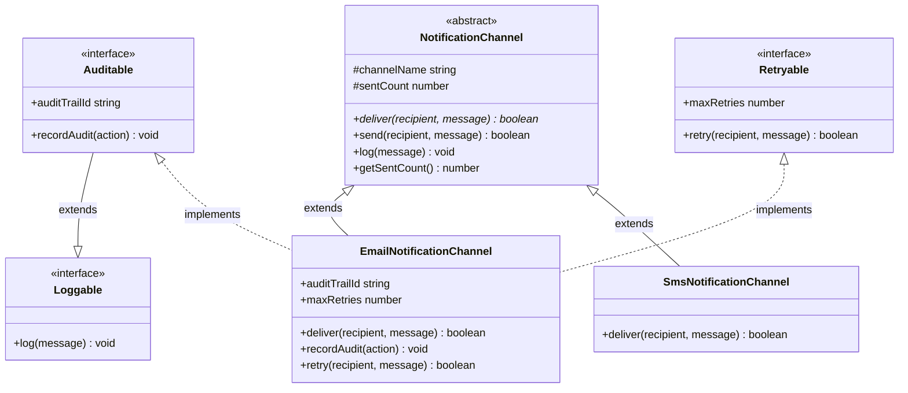
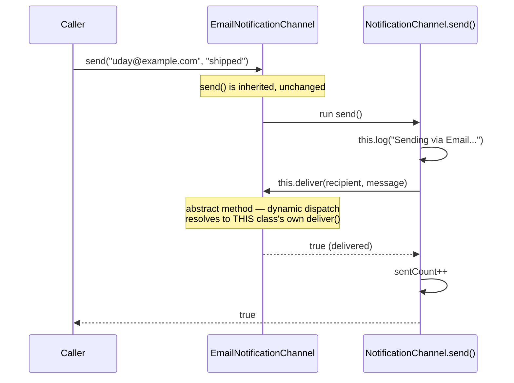
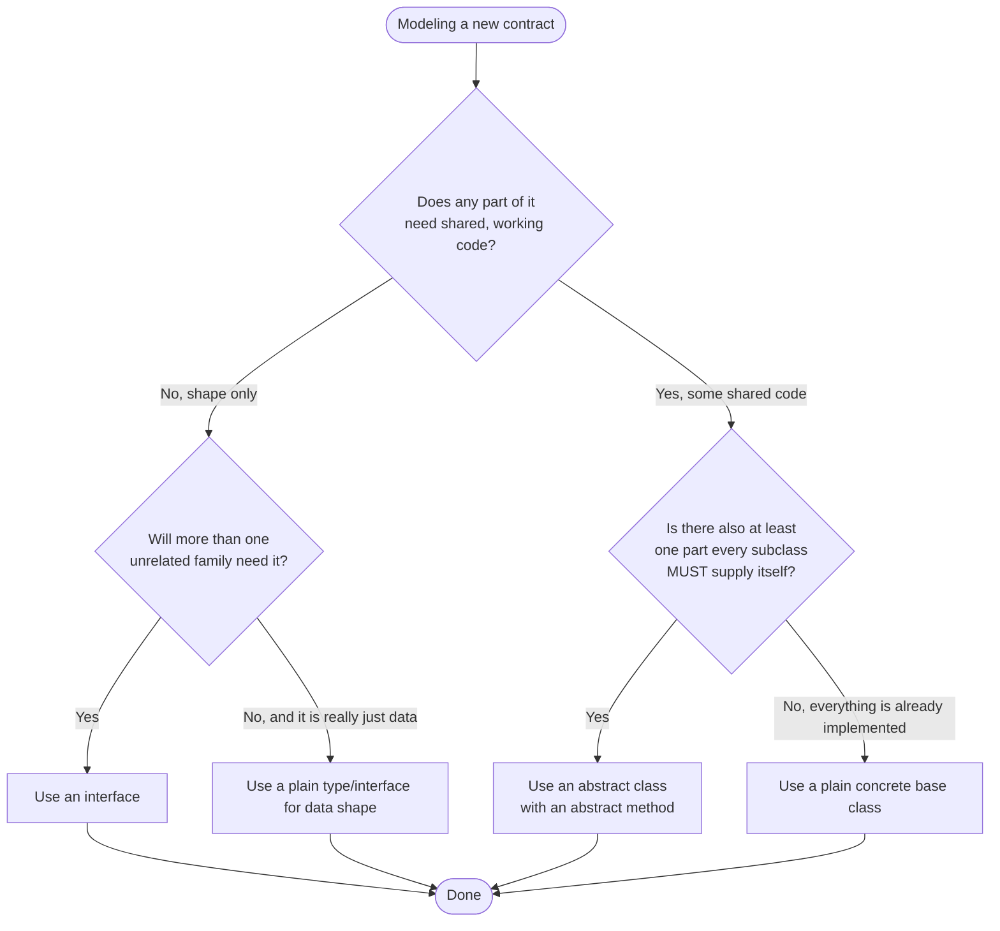

# Interfaces and Abstract Classes

## Intent

Give every "kind of thing" in your program a name for its contract, and choose the right tool for stating that contract: an `interface` when you only need to describe a **shape** with zero implementation, and an `abstract class` when a whole family of related types should also **share real, working code** while still being forced to supply the one or two pieces that genuinely differ.

## Real Life Analogy

Imagine a company that needs many different "Notification Channels" — email, SMS, push — and wants to describe what qualifies something as one, in two different ways.

**Method A: a job posting.** HR writes a one-page job description: *"Must be able to `send(recipient, message)` and report success or failure."* That's the entire posting — no desk, no equipment, no salary, just a list of duties. The posting itself never does any work; it isn't even a real thing once someone qualified is doing the job. Anyone who can perform those duties is qualified — an email server, a courier pigeon, a smoke-signal operator — the posting does not care *how* the job gets done, only *that* it gets done. This piece of paper is an **interface**.

**Method B: a half-built department.** Instead of just a job posting, the company builds an actual "Notification Department" office: desks, phone lines, and a shared logging ledger that is already wired up and working, plus a standard procedure ("log the attempt, then send it, then record whether it worked") that every notification already follows. But the office deliberately leaves one desk empty with a sign: *"Whoever sits here must personally decide HOW the message physically leaves the building — that part is not decided yet."* You cannot rent out this half-finished office as-is; nobody can "be" the office itself. Only a specific specialist — an Email Clerk, an SMS Operator — who sits at that one empty desk and supplies their own way of getting the message out, can actually operate from it, while getting every other piece of the office (the ledger, the procedure) for free. This office is an **abstract class**.

A `class` in TypeScript can accept as many job postings (`implements` as many interfaces) as it likes, because a job posting carries no furniture to collide with anything else. But it can only ever move into *one* half-built office (`extends` only one abstract/base class), because two offices' worth of desks, ledgers, and procedures cannot be merged into one physical building without someone deciding which ledger wins.

## Problem

### What engineering problem exists?

You need many different classes — `EmailNotificationChannel`, `SmsNotificationChannel`, and others still to come — to all be usable interchangeably as "the same kind of thing" by the rest of your program, while:

- Some behavior (sending a message) is **genuinely different** per channel and *must* be supplied by each one individually.
- Some behavior (logging every attempt, counting how many messages were sent) is **identical** across every channel and should be written exactly once.
- Some capabilities (being loggable, being auditable, being retryable) are **independent add-ons** — a channel might need all of them, some of them, or none, and those capabilities have nothing to do with each other.

> **Term: Contract.** A contract is a promise about what members (methods/properties) a type has, independent of how they are implemented. Code that depends on a contract cares only about *what* is available, never about *how* it works underneath.

### Why is this problem difficult?

- **A contract-only description needs to cost nothing.** If the only tool you had was classes, you would have to give a pure "must be able to send a message" requirement a full class body anyway — with stub methods that throw `"not implemented"` — which is dead weight that can be instantiated by mistake and called, crashing at runtime instead of failing at compile time.
- **Shared code needs exactly one home, but only for genuinely related types.** The logging-and-counting procedure belongs in one place shared by every notification channel — but it does *not* belong in some unrelated type like a `ReportGenerator` that happens to also need logging. You need a mechanism narrow enough to share code among a real family of types, without dragging in everything else that merely wants one of the same capabilities.
- **A type may need several unrelated capabilities at once.** `EmailNotificationChannel` needs to be a notification channel *and* auditable *and* retryable. If "sharing a capability" always meant "inheriting from a base class," you would immediately hit the fact that a class can only `extends` one thing — there is no way to inherit from three unrelated base classes simultaneously.
- **The compiler needs to catch missing pieces immediately.** If a channel forgets to supply its own sending logic, you want that caught the moment the class is declared — not the first time some far-away code calls a method that silently does nothing.

### What happens if we ignore it?

- **Throwing stub classes.** Modeling pure contracts as classes with `throw new Error("not implemented")` bodies means the mistake of forgetting to override one is invisible until that exact code path runs in production.
- **Copy-pasted shared logic.** If every channel hand-writes its own "log the attempt, then send, then count" wrapper, a bug fix or a new logging field applied to one channel never reaches the others, and the copies quietly drift apart.
- **Attempted multiple inheritance.** Trying to make one class simultaneously extend a `LoggableBase`, an `AuditableBase`, and a `RetryableBase` does not compile — TypeScript classes support only single inheritance — forcing awkward workarounds like one giant base class that merges unrelated concerns together, coupling code that never needed to know about each other.
- **Silent structural drift.** If you never declare `implements SomeInterface` anywhere and rely purely on TypeScript's structural typing, a class can slowly stop matching the shape you intended, and you will not find out until the mismatch surfaces somewhere far away that actually requires that interface — instead of immediately, at the class's own declaration.

## Why Not Other Solutions?

**"Just use one big base class with everything a channel might ever need."**
This forces every channel to carry every capability whether it needs it or not (a channel that never gets audited still inherits `recordAudit()`), and you still hit the single-inheritance ceiling the moment you need a *second* unrelated "big base class" for some other family of types.

**"Just use plain object types (`type X = { ... }`) instead of `interface`, and skip `interface` entirely."**
A type alias can describe a shape too, and a class can technically satisfy it structurally. But `interface` is the idiomatic, purpose-built tool for object contracts precisely because interfaces can `extends` other interfaces cleanly (as `Auditable extends Loggable` does below) and communicate intent — "this is a named contract, not just incidental data shape" — better than a type alias in a codebase full of classes.

**"Rely purely on duck typing — never write `implements X` on the class."**
TypeScript will happily let a class satisfy an interface's shape without ever mentioning it (this is structural typing, shown later in `code.ts`). It works, but you lose the immediate, at-the-class-declaration compiler error the moment the class stops matching. You only discover the drift later, wherever some caller tries to use that instance as the interface it no longer satisfies.

**"Duplicate the shared send/log wrapper into every channel class."**
This is exactly the maintenance-drift problem inheritance was invented to remove — a fix or an added log field has to be manually re-applied to every copy, and eventually one gets missed.

**Tradeoff summary:** Modeling everything as one tool — all classes, all interfaces, or all duck-typing — always trades away either safety (silent drift, throwing stubs) or flexibility (single-inheritance ceiling, forced unrelated coupling). Using `interface` for pure shape and `abstract class` for shared partial implementation lets you pick the right cost for each concern.

## Solution

The core idea: **use `interface` to describe a shape with zero implementation and zero runtime footprint, and use `abstract class` when a family of clearly related types should share real, working code while still being forced to supply the parts that differ.**

- An **`interface`** (`Loggable`, `Auditable`, `Retryable` below) lists method/property signatures only — no bodies are allowed. It compiles away completely; nothing about it exists once the program runs.
- An **`abstract class`** (`NotificationChannel` below) is written like a normal class — it can have a constructor, fields, and fully-implemented ("concrete") methods — but it can also declare one or more `abstract` methods that have *no body at all*. TypeScript refuses to let you write `new NotificationChannel(...)` directly; only a subclass that supplies bodies for every abstract method can be instantiated.
- A **concrete class** (`EmailNotificationChannel`, `SmsNotificationChannel`) `extends` at most one abstract/base class (to inherit its shared, working code) and can `implements` as many interfaces as it needs (each one just adds more shape requirements the compiler checks it against — there is nothing to merge, so there is no limit).

The thinking behind it:

1. **If it has no shared code and no reason to be one specific family, make it an `interface`.** Being "loggable" or "retryable" is a capability, not a lineage — many unrelated classes across the codebase might be `Loggable`.
2. **If several types are genuinely the same kind of thing and should share real working code, make it an `abstract class`.** `NotificationChannel` is not just a shape — it hands every subclass a working `send()` wrapper for free.
3. **`implements` for capabilities, `extends` for lineage.** A class states its family with `extends` (at most one) and its capabilities with `implements` (as many as apply).

You do **not** need an abstract class just to force a method to exist — if there is no shared code at all, a plain `interface` is simpler and lighter.

## Architecture

There are four participants:

1. **Interface (pure contract):** `Loggable`, `Auditable`, `Retryable`. Declares members with no bodies. Exists purely at compile time — the TypeScript compiler erases every `interface` declaration; nothing about it appears in the emitted JavaScript.

2. **Interface extending another interface:** `Auditable extends Loggable`. A contract can build on another contract — anything that satisfies `Auditable` is required to also satisfy everything `Loggable` requires.

3. **Abstract class (partial contract + shared implementation):** `NotificationChannel`. Has a real constructor, a real field, fully-working concrete methods (`send()`, `log()`, `getSentCount()`), and one `abstract` method (`deliver()`) with no body — a placeholder every subclass is compiler-forced to fill in.

4. **Concrete class (the finished product):** `EmailNotificationChannel` and `SmsNotificationChannel`. Each `extends NotificationChannel` (inheriting the shared, working code) and supplies its own `deliver()`. `EmailNotificationChannel` additionally `implements Auditable, Retryable` — stacking two extra capability contracts on top of its one class lineage.

Responsibilities in one line each:
- **Interface:** describes a shape; costs nothing at runtime.
- **Interface extending interface:** layers contracts — "everything the base contract needs, plus more."
- **Abstract class:** shares real code across a family, while forcing the one differing piece to be supplied.
- **Concrete class:** inherits shared code from one abstract class, and opts into as many interface contracts as it genuinely fulfills.

## Execution Flow

1. Code calls `new EmailNotificationChannel("trail-42")`.
2. Its constructor's first statement must be `super("Email")`, running `NotificationChannel`'s constructor, which sets `this.channelName` and `this.sentCount = 0`.
3. Control returns to `EmailNotificationChannel`'s constructor, which now safely sets its own `this.auditTrailId`.
4. Later, code calls `channel.send("uday@example.com", "Your order shipped")` — a method that exists only on `NotificationChannel` and is inherited unchanged.
5. `send()` runs: it calls `this.log(...)` (also inherited, unchanged), then calls `this.deliver(...)`.
6. Because `deliver` is `abstract` on `NotificationChannel`, TypeScript resolves the call using dynamic dispatch to whatever concrete class the instance actually is — here, `EmailNotificationChannel.deliver()` runs.
7. `deliver()` does the channel-specific work (simulating an email send) and returns `true`/`false`.
8. `send()` receives that result, increments `this.sentCount` on success, and returns it to the caller.
9. If code instead tries `new NotificationChannel("X")` directly, TypeScript refuses to compile it — an abstract class can never be instantiated on its own, only through a subclass that has filled in every abstract method.
10. Separately, if code calls `emailChannel.recordAudit("shipped")`, that member comes purely from `EmailNotificationChannel` fulfilling the `Auditable` interface — no inheritance is involved, just a shape the class itself decided to satisfy.

## Class Diagram

## Sequence Diagram

## Flow Diagram

## Implementation

The implementation strategy in TypeScript:

1. **List every pure capability as its own small `interface`.** `Loggable`, `Auditable`, `Retryable` each describe exactly one independent ability, with no bodies.

2. **Let interfaces build on each other with `extends` when one capability implies another.** `Auditable extends Loggable` because anything worth auditing should also be loggable — any class satisfying `Auditable` is required to satisfy `Loggable` too.

3. **Write the shared family as one `abstract class`.** `NotificationChannel` holds the constructor, the shared fields, and every method whose logic is identical across the whole family (`send()`, `log()`, `getSentCount()`).

4. **Mark the one piece that must differ per subclass as `abstract`.** `deliver()` has no body in `NotificationChannel` — every concrete subclass is compiler-forced to supply its own.

5. **In each concrete class, `extends` the one abstract class and `implements` every interface it actually fulfills.** `EmailNotificationChannel extends NotificationChannel implements Auditable, Retryable`; `SmsNotificationChannel extends NotificationChannel` alone, with no extra interfaces, because it needs no extra capabilities.

6. **Never rely on `implements` for runtime behavior — it is a compile-time-only promise.** The real behavior always comes from the methods you actually write in the class.

We will demonstrate this with a `NotificationChannel` abstract base and two subclasses, `EmailNotificationChannel` and `SmsNotificationChannel`, plus a small structural-typing example proving a class can satisfy `Loggable` without ever writing `implements Loggable`.

## Code Walkthrough

See [code.ts](code.ts) for the full runnable implementation. Here is what each part does and why it exists.

**`Loggable` (interface).**
Declares a single `log(message: string): void`. No implementation, no runtime trace once compiled. It exists so that *anything* capable of logging — not just notification channels — can be referred to by this one small name.

**`Auditable` (interface extending an interface).**
`extends Loggable` and adds `auditTrailId` and `recordAudit(action)`. This exists to show that a contract can be built on top of another contract: anything claiming to be `Auditable` is automatically required to also provide everything `Loggable` needs.

**`Retryable` (interface).**
Adds `maxRetries` and `retry(recipient, message)`, completely unrelated to logging or auditing. It exists to show a capability that a class can mix in independently, alongside any others.

**`NotificationChannel` (abstract class).**
Has a constructor taking `channelName`, a protected `sentCount` field, a fully-working `send()` that logs then calls `deliver()`, a fully-working `log()`, a fully-working `getSentCount()`, and one `abstract deliver(recipient, message): Promise<boolean>` with no body at all. It exists to hold every piece of behavior that is identical across the whole family of channels, while forcing each concrete channel to supply the one piece that cannot be — how the message actually leaves the building.

**`EmailNotificationChannel` (concrete class, extends + implements two interfaces).**
`extends NotificationChannel` (inheriting `send()`, `log()`, `getSentCount()` for free) and `implements Auditable, Retryable`. Its constructor calls `super("Email")` before touching `this`. It supplies `deliver()` (its one required override), plus `recordAudit()` and `retry()` to fulfill the two extra interfaces. Notice it never has to write its own `log()` — `Auditable` requires one, but `NotificationChannel` already supplies a working `log()`, satisfying that part of the contract through inheritance.

**`SmsNotificationChannel` (concrete class, extends only).**
`extends NotificationChannel` and supplies only `deliver()`. It implements no extra interfaces at all — proof that a concrete class never has to opt into every available capability, only the ones it genuinely has.

**`ConsoleTracer` and `announce()` (structural typing demonstration).**
`ConsoleTracer` has a `log(message: string): void` method but never writes `implements Loggable` anywhere. The function `announce(target: Loggable)` still accepts a `ConsoleTracer` instance without complaint, because TypeScript compares *shapes*, not declared labels — this is structural typing (a.k.a. duck typing) in action.

**Interactions.**
`main()` constructs both channels, calls `send()` on each (dispatching to each one's own `deliver()`), calls `recordAudit()` and `retry()` on the email channel only, reads `getSentCount()`, and calls `announce()` with a plain `ConsoleTracer` to prove the structural-typing point. A commented-out line shows the compiler error you get from `new NotificationChannel("X")` directly.

## Advantages

- **Zero-cost pure contracts.** Interfaces vanish entirely at compile time — describing a capability never adds a single byte to the emitted JavaScript.
- **Shared code has exactly one authoritative home.** `send()`, `log()`, and `getSentCount()` are written once, in `NotificationChannel`, and every subclass gets a correct, consistent version.
- **Unlimited capability stacking.** A class can `implements` as many interfaces as it genuinely fulfills — `EmailNotificationChannel` picks up `Auditable` and `Retryable` at no structural cost.
- **Compiler-enforced completeness.** Forgetting to implement an abstract method, or forgetting a member an interface requires, is a compile-time error — never a runtime surprise.
- **Structural typing offers flexibility when you want it.** A class can satisfy a contract without ever coupling itself to that contract's name, useful for consuming truly external code you do not own.
- **Interfaces compose cleanly.** `Auditable extends Loggable` lets you build a small vocabulary of capabilities instead of one giant contract.

## Disadvantages / Gotchas

- **Interfaces have no runtime representation at all.** You cannot do `value instanceof Loggable` — there is nothing left at runtime to check against; `instanceof` only works with real classes (like `NotificationChannel`).
- **`abstract` is a compile-time-only guard.** TypeScript refuses `new NotificationChannel(...)` at compile time, but the *emitted* JavaScript class has no special runtime protection — if that guard is bypassed (hand-edited output, or a transpile-only tool that skips type-checking), nothing stops the class from being instantiated at runtime.
- **`implements` never changes runtime behavior.** Writing `implements Loggable` does not generate any code — the only thing that matters at runtime is whether the class's actual methods exist and work; `implements` is purely a compile-time promise checked once, at the class declaration.
- **Silent structural drift without `implements`.** If you rely purely on duck typing, a class can stop matching an interface's shape without any error at its own declaration — the mismatch only surfaces later, at whatever call site tries to use it as that interface.
- **Single inheritance still applies to the abstract class itself.** `EmailNotificationChannel` can `extends` only `NotificationChannel` — if two unrelated families both needed to share code via abstract classes, you cannot inherit from both; you would need composition instead.
- **Overusing abstract classes for things that are really just interfaces.** If an "abstract class" ends up with no shared implementation at all — every method is `abstract` — it should almost always be a plain `interface` instead; you gain nothing from the class machinery and lose the ability to `implements` many of them.

## Tradeoffs

**What we gain:** cheap, composable, compiler-checked capability contracts (`interface`), plus a single authoritative home for shared code within one genuine family of types (`abstract class`), and the option of true structural typing when a hard dependency on a name is undesirable.

**What we lose:** a small amount of upfront design thinking — deciding whether a given requirement belongs in an interface, an abstract class, or a plain concrete class — and the fact that abstract classes, unlike interfaces, still cost real emitted JavaScript and still cap you at one class lineage. Getting this split right is a judgment call, not a mechanical rule, and a codebase with a large family of near-identical "abstract classes" that share no real code is a sign the split needs revisiting.

## Complexity

**Code Complexity:** Low. A handful of interfaces plus one abstract class is easy to read in full; complexity only grows if the abstract class accumulates many abstract methods or the interface graph becomes deep.

**Maintenance Complexity:** Low as long as `NotificationChannel`'s shared shape stays stable. Changing its constructor or a concrete method's signature ripples into every subclass, the same "fragile base class" risk that applies to any inheritance.

**Scalability:** Adding a new channel (`PushNotificationChannel`) costs one new subclass and zero changes to existing code, as long as it fits the same abstract contract. Adding a brand-new *capability* costs one new interface, with no impact on classes that do not opt into it.

**Flexibility:** High. Interfaces can be implemented by any class anywhere, related or not; the abstract class stays reserved for the one family that truly shares code.

**Testability:** High. Interfaces are trivial to mock (a plain object literal satisfies them structurally); the abstract class's shared logic (`send()`) only needs to be exercised once, through any one concrete subclass.

## Common Mistakes

- **Trying `value instanceof SomeInterface`.** *Why it happens:* it looks just like checking against a class. *Reality:* interfaces leave no runtime trace, so this is always a compile error. *Avoid:* use `instanceof` only with real classes; for interfaces, either trust the type checker or write your own shape-checking function if you truly need a runtime guard.

- **Assuming `abstract` protects you at runtime.** *Why it happens:* the compile-time error feels absolute. *Reality:* `abstract` is erased along with the rest of TypeScript's type syntax; the emitted class has no runtime instantiation guard of its own. *Avoid:* do not rely on `abstract` as a runtime safety mechanism — it is a compile-time contract with your future self and teammates, not a production runtime check.

- **Writing `implements X` and expecting it to add behavior.** *Why it happens:* it looks like `extends`. *Reality:* `implements` adds zero code — it only tells the compiler "check that this class's shape matches `X`." *Avoid:* if you need shared behavior, that has to come from an `extends`-ed class, never from `implements`.

- **Putting a method body inside an interface.** *Why it happens:* wanting to share a default implementation. *Reality:* interfaces cannot have bodies at all — that need is exactly what an abstract class is for. *Avoid:* the moment an "interface" needs a body, it should become (or move its shared logic into) an abstract class.

- **Trying to `extends` two abstract classes.** *Why it happens:* wanting to reuse two unrelated pieces of shared code at once. *Reality:* TypeScript classes support only single inheritance. *Avoid:* pick the one true lineage for `extends`, and express the rest as `implements`-able interfaces or as composed-in helper objects.

- **Forgetting that duck typing means "no `implements` needed."** *Why it happens:* coming from languages that require explicit contract declarations. *Reality:* `ConsoleTracer` in `code.ts` satisfies `Loggable` with no `implements` clause at all — TypeScript checks shape, not declared labels. *Avoid:* still write `implements` on your own classes when you intend to satisfy a contract — it gives you an immediate compile error if the class ever drifts out of shape, instead of a silent one discovered elsewhere.

## When To Use

- **Interfaces:** describing a capability that many unrelated classes might have (`Loggable`, `Auditable`, `Retryable`), designing function parameters/return types around shapes rather than concrete classes, or building a small vocabulary of contracts that interfaces can `extends` each other to compose.
- **Abstract classes:** a genuine family of related types needs to share real, working code (`send()`, `log()`), while still forcing each member to supply the one or two pieces that must differ (`deliver()`).
- **Both together:** a family member (like `EmailNotificationChannel`) needs shared code from one lineage *and* several independent capabilities at once.

## When NOT To Use

- **When there is no shared implementation at all.** If an "abstract class" would have every method marked `abstract` with no real code, it should be a plain `interface` — you gain nothing from the class machinery and lose the ability for a class to adopt many of them at once.
- **When you need to combine shared code from more than one unrelated family.** Single inheritance means you can only `extends` one abstract class — reach for composition (holding another object as a field and delegating to it) instead.
- **When a plain, fully-implemented class would do.** If every method already has a sensible default and nothing truly needs to be forced per-subclass, you likely just need an ordinary concrete class, possibly extended normally — no `abstract` keyword needed.
- **When you are tempted to add `implements X` purely for documentation on a class that will never be passed anywhere as `X`.** It costs nothing at runtime, but if no caller ever needs the class typed as `X`, it may be unnecessary noise — though it is rarely harmful to be explicit.
- **When you need runtime type inspection of a pure contract.** Interfaces cannot be checked with `instanceof`; if you truly need a runtime tag, that requirement calls for a real class (possibly abstract) or a manually written shape-checking function, not a plain interface.

## Real World Examples

- **TypeScript's own standard library:** `Array<T>`, `Promise<T>`, and `Map<K, V>` are all declared as `interface`s in `lib.d.ts` — pure shape descriptions with no bodies, compiled away entirely.
- **NestJS:** `CanActivate`, `PipeTransform`, and `ExceptionFilter` are interfaces; guards, pipes, and filters `implements` them, and NestJS's dependency injection accepts anything matching the shape.
- **Angular:** lifecycle contracts like `OnInit`/`OnDestroy` are interfaces used mostly for documentation and IDE hints — Angular itself detects and calls `ngOnInit`/`ngOnDestroy` via structural duck-typing (checking if the method exists), not via `instanceof`, a real production example of structural typing in action.
- **Node.js streams:** `Duplex`/`Transform` behave like abstract classes in spirit — they ship a fully-working read/write pipeline and expect subclasses to supply `_read`/`_write`/`_transform`, the parts that genuinely differ per stream.
- **RxJS:** anything with a `subscribe` method can be treated as Observable-like in many contexts — another real-world instance of "the shape is what matters, not the declared name."
- **TypeORM / class-validator style repositories:** an abstract `BaseRepository` commonly ships shared CRUD logic while leaving one abstract "map row to entity" method for each concrete repository to supply.
- **Java/C# (for interview parity):** both languages have the identical interface-vs-abstract-class split — many interfaces, one abstract/base class — because it solves the exact same single-inheritance-vs-multiple-capabilities tension that TypeScript faces.

## Where I Can Use This

Five realistic ideas for your own TypeScript projects:

1. **Notification channels (this file).** `NotificationChannel` abstract base with `EmailNotificationChannel`/`SmsNotificationChannel`/`PushNotificationChannel` subclasses, mixing in `Auditable`/`Retryable` only where needed.
2. **Repository pattern.** An abstract `BaseRepository<T>` with shared CRUD plumbing (an abstract `mapRowToEntity()`), while a `Paginated`/`Sortable` pair of interfaces gets mixed into whichever repositories actually support them.
3. **Domain model capabilities.** `Serializable`/`Comparable` interfaces implemented by many otherwise-unrelated model classes across the codebase, with no shared class lineage required.
4. **UI widget base.** An abstract `Widget` class sharing lifecycle/mount logic, with `Focusable`/`Draggable` interfaces mixed into only the widgets that actually need them.
5. **Plugin system.** A minimal `Plugin` interface (`name`, `activate()`) that any independent plugin can satisfy with zero shared code, alongside an optional abstract `BasePlugin` offering shared logging for plugins that want it.

## Related Topics

- **Classes & Inheritance:** Covers `extends`, `super()`, and overriding in depth — the mechanism an abstract class relies on to hand its subclasses working code.
- **Composition over Inheritance:** The alternative to reaching for a second `extends` you cannot have — hold another object as a field and delegate to it instead of inheriting from it.
- **Generics:** Interfaces and abstract classes are frequently generic (`Repository<T>`, `Comparable<T>`), letting one contract describe a whole family of related shapes.
- **Structural Typing / Duck Typing:** The rule that makes `implements` optional for compatibility — TypeScript checks shape, not declared labels, as `ConsoleTracer` demonstrates.
- **Access Modifiers (`public`/`protected`/`private`):** Controls exactly which code can reach into `NotificationChannel`'s inherited fields — used here only enough to make inheritance work.
- **Polymorphism:** The general principle, demonstrated by `send()` calling `this.deliver()`, that the same method call resolves to different code depending on the actual runtime subclass.

| Concept | Can have a method body? | Can a class have more than one? | Exists at runtime? |
|---|---|---|---|
| `interface` | No | Yes (`implements` many) | No — fully erased |
| `abstract class` | Yes (concrete methods) + abstract methods with no body | No — `extends` only one | Yes — a real class |
| Plain `class` | Yes, always | No — `extends` only one | Yes — a real class |

## Interview Discussion

Experienced engineers rarely treat this as trivia — they discuss it as a **modeling decision** about where a requirement truly belongs: a shape anyone might satisfy, or a lineage that shares real code.

Common follow-up questions:
- *"What gets erased at compile time — interfaces, abstract classes, or both?"* Interfaces are erased entirely — nothing about them exists in the emitted JavaScript. Abstract classes are not: the `abstract` keyword and the compile-time instantiation check disappear, but the class itself remains a real, working JavaScript class.
- *"Why can a class `implements` many interfaces but `extends` only one class?"* Interfaces carry no implementation, so stacking many of them creates no ambiguity about whose code should run. Classes carry real implementation; allowing a class to `extends` two bases would reintroduce the classic diamond-inheritance ambiguity (whose version of a shared method wins?), which TypeScript avoids by design, just as Java and C# do.
- *"Do you need `implements` for the compiler to accept a value as satisfying an interface?"* No — TypeScript is structurally typed. `implements` is only a self-check on the class's own declaration; it changes nothing about whether other code can already treat an unrelated class as satisfying that shape.
- *"Can an abstract class implement an interface but leave part of it unfinished?"* Yes — an abstract class can provide some of an interface's members concretely and leave the rest `abstract`, forcing subclasses to complete exactly the missing pieces, which is exactly how `NotificationChannel` supplies `log()` for `Loggable` while leaving `deliver()` to its subclasses.
- *"When would you reach for structural typing instead of `implements`?"* When consuming a type you do not own and should not couple your class's declaration to (e.g. a third-party callback shape), or when the contract is trivial enough that formal opt-in adds no value.

Common misconceptions:
- "Interfaces exist at runtime like classes do." False — they are fully erased; `instanceof` cannot check against them.
- "`abstract` stops a class from ever being instantiated, even in the compiled output." False — it is a compile-time-only check; the emitted JavaScript class has no such guard on its own.
- "A class can only satisfy an interface if it explicitly writes `implements`." False — TypeScript structural typing accepts any class (or object) with a matching shape, `implements` or not.

## Summary

- An `interface` describes a shape only — no implementation, no runtime footprint, and a class can `implements` as many as it needs.
- An `abstract class` can hold real, working fields/constructors/concrete methods, plus one or more `abstract` methods with no body that subclasses are compiler-forced to supply — but a class can `extends` only one.
- Interfaces can `extends` other interfaces, layering contracts (`Auditable extends Loggable`).
- TypeScript is structurally typed — a class can satisfy an interface's shape without ever writing `implements`, though writing it catches drift immediately at the class's own declaration.
- Reach for `interface` when the requirement is pure shape; reach for `abstract class` when a real family of types should share genuine code.

## Key Takeaways

1. `interface` = pure contract, zero implementation, zero runtime footprint — fully erased at compile time.
2. `abstract class` = can have a real constructor, fields, and concrete methods, plus `abstract` methods with no body that force subclasses to fill them in.
3. A class can `implements` many interfaces (no shared code to conflict) but `extends` only one class (avoids diamond-inheritance ambiguity).
4. Interfaces can `extends` other interfaces, letting one contract require everything another contract requires, plus more.
5. `implements` is a compile-time-only self-check on a class — it adds no runtime behavior.
6. TypeScript uses structural typing: a class can satisfy an interface's shape without ever declaring `implements` it.
7. `abstract`'s "cannot instantiate directly" rule is enforced by the compiler only — it leaves no trace in emitted JavaScript.
8. An abstract class can concretely implement part of an interface and leave the rest `abstract` for subclasses to complete.
9. If an "abstract class" has no shared implementation at all, it should almost always be a plain `interface` instead.
10. Reach for composition when you need to combine shared code from more than one unrelated family — `extends` only ever gives you one lineage.

---

## Further Reading

**Books**
- *Programming TypeScript* — Boris Cherny (clear treatment of interfaces, abstract classes, and structural typing).
- *Effective TypeScript* — Dan Vanderkam (idiomatic guidance on structural typing and when to prefer interfaces over classes).
- *Design Patterns: Elements of Reusable Object-Oriented Software* — Gamma, Helm, Johnson, Vlissides ("program to an interface, not an implementation" originates here).

**Official Documentation**
- TypeScript Handbook — Interfaces — https://www.typescriptlang.org/docs/handbook/2/objects.html
- TypeScript Handbook — Classes (abstract classes, `implements`) — https://www.typescriptlang.org/docs/handbook/2/classes.html
- TypeScript Handbook — Type Compatibility (structural typing) — https://www.typescriptlang.org/docs/handbook/type-compatibility.html

**Blog Articles**
- TypeScript Deep Dive — Interfaces — https://basarat.gitbook.io/typescript/type-system/interfaces
- Refactoring.Guru — "Program to an Interface, not an Implementation" — https://refactoring.guru/design-patterns/interfaces-vs-abstract-classes

**Research / Foundational**
- Liskov, B. — "A Behavioral Notion of Subtyping" (the theoretical basis for why substituting a subclass for its abstract base must remain safe — the Liskov Substitution Principle applies equally to interface implementers).
