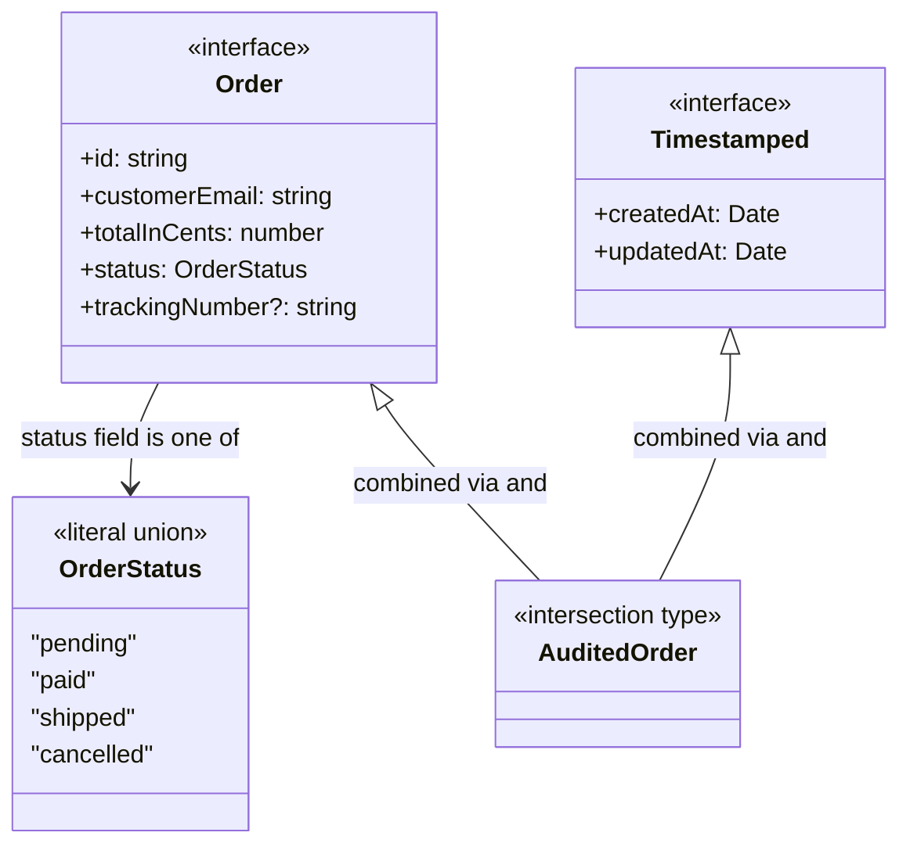
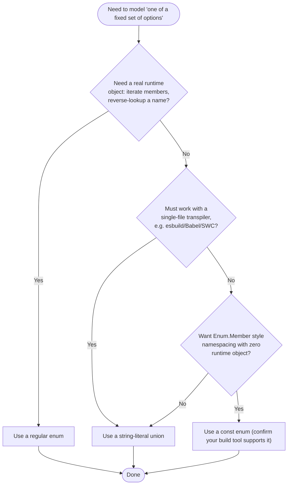

# Types and Inference

## Intent

Give TypeScript the smallest, most precise vocabulary needed to describe the exact shape and legal values of your data — using `type` aliases and `interface`s to name shapes, unions and intersections to combine them, literal types and enums to restrict a value to one of a fixed set of options, and inference so you write annotations only where the compiler genuinely cannot work it out on its own.

## Real Life Analogy

Think about a courier company's package tracking sticker. It does not have a blank line for "status" where any courier could scribble anything ("out for delivery-ish," "prolly today"). It has a small set of pre-printed rubber stamps — PENDING, PAID, SHIPPED, CANCELLED — and the courier can only stamp one of those exact words, in that exact spelling, onto the sticker. Anyone reading the sticker later, in any warehouse in the country, knows immediately and unambiguously what it means, because there are only four possible stamps.

A TypeScript literal-type union works exactly like that rubber-stamp set: `"pending" | "paid" | "shipped" | "cancelled"` are the only stamps that exist for `OrderStatus`. A plain `string` field would be the blank line — technically it can hold `"delivered"`, `"Shipped!"`, or a typo, and nothing stops it. The rest of the sticker's printed layout — the order id, the customer, the total — is the fixed shape every sticker has, regardless of which stamp ends up on it. That printed layout is what `interface`/`type` describe.

## Problem

### What engineering problem exists?

- You need to describe the *shape* of your data: an `Order` has an id, a customer, a total, a status — every part of the codebase needs to agree on this shape without re-describing it in every function signature.
- Some values are not "any string" — they are one of a small, fixed set: an order status, a shipping priority, an HTTP method. Left as `string`, nothing stops a typo or an invalid value from compiling cleanly and blowing up at runtime, or worse, in stored production data.
- You need to describe values that are one of several different possible *shapes* (a `created` event carries an `order`; a `cancelled` event carries a `reason`) — not just one shape with some optional fields.
- You need to combine shapes that come from different places (an `Order` plus separately-tracked `Timestamped` audit fields) into one type, without copy-pasting fields into a third, redundant type.
- Writing an explicit type annotation on every single variable is exhausting and, worse, often redundant — the compiler can already see exactly what `const x = 5` must be.

> **Term: Structural typing.** TypeScript decides whether two types are compatible by comparing their *shape* — which properties exist, with which types — not by name or explicit inheritance, unlike Java/C#'s nominal typing. If a value has the right properties, it fits, whatever it is called.

> **Term: Type inference.** The compiler's ability to determine a value's type on its own, using the assigned value or the surrounding context, without you writing an explicit annotation.

### Why is this problem difficult?

- **`type` and `interface` overlap a lot but not completely**, and picking one out of habit rather than reason can leave you stuck the moment you actually need a union or a primitive alias.
- **A `string` field cannot express "one of these four exact values"** on its own — you need a dedicated mechanism (literal types), and forgetting to use one is invisible until an unexpected string value slips through and every downstream `if (status === "shipped")` silently never matches.
- **A value that can genuinely be one of several different shapes** needs a union of object types plus a reliable way to tell them apart at runtime (a discriminant field). Get the discriminant wrong or forget it, and narrowing silently fails.
- **Combining two shapes (`&`) vs offering a choice between them (`|`) are opposite operations** that look deceptively similar syntactically (one character) but produce very different requirements on values.
- **Over-annotating drowns out the annotations that actually matter.** If every `let x: number = 5` and every one-line callback parameter is explicitly typed, the handful of annotations that truly earn their keep (function parameters, public return types) get lost in the noise.
- **`enum`, `const enum`, and string-literal unions all look like they solve the same problem**, but differ in real, sometimes tooling-breaking ways (runtime footprint, bundler compatibility) that only surface once you try to ship the code.

### What happens if we ignore it?

- **Silent typos in status-like strings.** `order.status = "Shipped"` (capitalized) or `"shiped"` (misspelled) compiles fine if the field is typed `string`, and every comparison against `"shipped"` quietly fails — a bug that surfaces in production, not at compile time.
- **Duplicated, drifting shape definitions.** Without a shared `Order` type, three different files each write their own inline `{ id: string; total: number; ... }` object type, and they slowly diverge as one gets a field the others don't.
- **Fragile `if`/`else` chains instead of exhaustive narrowing.** Without a proper discriminated union and a discriminant field, code resorts to checking several optional fields' presence (`if (event.order) ... else if (event.reason) ...`), which breaks the moment two branches could both be true or both be absent.
- **Enum-related runtime surprises.** Using `const enum` in a codebase built with a single-file transpiler (esbuild, Babel, SWC in isolated-modules mode) can produce broken output or a hard compiler error, discovered only at build time — sometimes only in CI.
- **Annotation fatigue leading to worse code, not safer code.** Excess redundant annotations drift out of sync with reality (someone changes a return value but not the stale annotation) and give false confidence, while the annotations that matter get skipped because "everything already looks typed."

## Why Not Other Solutions?

**"Just use `interface` for everything, including things that look union-y."**
You cannot — `interface OrderStatus = "pending" | "paid"` is not legal syntax; an interface can only describe an object shape (or a callable/constructable signature), never a union of primitives. The moment you need "one of these exact values," you need a `type` alias.

**"Just use `type` for everything, including public object shapes, and never use `interface`."**
Works almost all the time for plain object shapes — but you lose declaration merging (a real capability used by libraries, e.g. augmenting Express's `Request` or the global `Window`), and some teams slightly prefer `interface` for object shapes purely for consistency and clearer excess-property-check messages. Not wrong, but you give up a capability you might need later without realizing it.

**"Just type status fields as `string` and validate at runtime instead."**
Runtime validation (e.g. a schema library) is genuinely necessary at trust boundaries — parsing JSON from an external API — but it is not a substitute for literal types *inside* your own code. It only tells you when bad data arrived, not when your own code tries to assign or compare an invalid value. Use both: a runtime validator at the boundary, and literal types everywhere the value flows through your program.

**"Represent 'one of a fixed set' with a plain `enum` always, because that's what enums are for."**
`enum` is a legitimate choice, but it always emits a real JS object at runtime whether or not you need one, and numeric enums have surprising reverse-mapping behavior. For values that just need to move around as data (e.g. serialized to JSON, compared with `===`), a string-literal union usually does the same job with zero runtime cost and simpler tooling behavior.

**"Annotate every single variable explicitly, so the types are 'obvious.'"**
This looks safer but is not — it adds two sources of truth (the annotation and the actual value) that can drift apart, and it drowns out the annotations that truly matter. Trust inference for locals and simple returns; reserve explicit annotations for function parameters (never inferred) and public API boundaries, where you want the compiler to catch an accidental change at its source.

**Tradeoff summary:** Every "just always use X" strategy above trades a small amount of upfront thinking (which mechanism actually fits this specific need?) for either a compile error, a lost capability, or a class of runtime bug that a few extra characters would have caught.

## Solution

The core idea: **use the narrowest tool that expresses exactly what the data can be, and let inference fill in everything else.**

- Describe **object shapes** with `interface` (default choice for public, potentially-extended shapes) or `type` (fine for shapes too, required once a union/primitive/tuple is involved).
- Describe **"one of a fixed set of exact values"** with a **literal-type union** (`"pending" | "paid" | ...`) for maximum simplicity, or an `enum`/`const enum` when you specifically need the runtime object, reverse mapping, or `Enum.Member` namespacing.
- Describe **"one of several different shapes"** with a **union of object types plus a discriminant field**, and narrow with `switch`/`if` on that field.
- Describe **"has all of these fields, from more than one source"** with an **intersection type** (`&`).
- **Trust inference** for local variables, object literals, and simple function returns. **Annotate explicitly** at exactly two boundaries: function *parameters* (TypeScript never infers these from usage) and *public API return types* (so a change to what a function returns is caught right where it happened, not somewhere downstream).

The thinking behind it:

1. **Make illegal states unrepresentable.** If `status` can only ever be one of four values, the type system — not a runtime `if` chain — should be the thing enforcing that.
2. **Reach for `&`/`|` deliberately, not interchangeably.** `&` means "must satisfy both"; `|` means "must satisfy at least one" — confusing them produces types that are either impossibly strict or dangerously loose.
3. **Let the compiler do free work, but not silently.** Every inferred type is still a real, checked type — inference is a convenience for *you*, not a weakening of the type system.

You do **not** need to pick one style (literal union vs. enum) forever — you choose per use case, based on whether you need a runtime object, and you can migrate a string-literal union to an enum later if a genuine need appears, usually without touching call sites that only compare values.

## Architecture

Five building blocks appear throughout this topic:

1. **Type alias (`type`):** A name bound to *any* type — an object shape, a union, an intersection, a primitive, a tuple, a function signature. Here: `OrderStatus`, `AuditedOrder`, `OrderEvent`, `ShippingPriority`.

2. **Interface (`interface`):** A name bound specifically to an *object shape* (or callable/constructable signature). Can be declared more than once in the same scope — all declarations merge into one shape. Here: `Order`, `Timestamped`.

3. **Union (`A | B`):** A type whose values must satisfy *at least one* of the member types. Narrowing (via `switch`/`typeof`/`in`/discriminant checks) recovers which member you actually have.

4. **Intersection (`A & B`):** A type whose values must satisfy *all* of the member types simultaneously — every property from every member must be present.

5. **Literal type:** A type containing exactly one value (`"pending"`, `3`, `true`) rather than a whole category of values (`string`, `number`, `boolean`). Union several literal types together and you get "one of this fixed set" — the backbone of `OrderStatus` and `ShippingPriority`.

`enum`/`const enum` sit slightly outside this picture: they are a *separate* TypeScript-specific construct (not just a type-level combination of existing pieces) that pairs a set of named members with underlying values and, for a regular `enum`, an actual runtime object.

## Execution Flow

Type checking has no runtime execution order, but here is the mental sequence a developer/compiler walks through in this file:

1. `type OrderStatus = "pending" | "paid" | "shipped" | "cancelled";` — the compiler records that any value of this type must be one of exactly those four strings, and nothing else.
2. `interface Order { ...; status: OrderStatus }` — the compiler records the full object shape, referencing `OrderStatus` for the `status` field.
3. Elsewhere, `interface Order { trackingNumber?: string }` is declared again — the compiler merges it into the single `Order` shape, which now has five fields total, regardless of where in the file each declaration appears.
4. `type AuditedOrder = Order & Timestamped;` — the compiler computes a new shape requiring every field from `Order` AND every field from `Timestamped`.
5. `const order = { ... }` with no annotation — the compiler infers the object's shape directly from the literal's properties and their value types.
6. `order` is passed to `applyDiscount(order: Order, percentOff: number): Order` — the compiler structurally checks that the inferred shape of `order` satisfies everything `Order` requires.
7. `describeEvent(event)` is called where `event: OrderEvent` — inside `switch (event.type)`, the compiler narrows `event`'s type in each `case` branch to only the union member with that particular literal `type` value.
8. `shippingEtaDays("express")` is called — the compiler checks `"express"` is one of the three literals in `ShippingPriority`; a typo like `"expres"` fails to compile right there, at the call site, not at runtime.

## Class Diagram



## Sequence Diagram

```mermaid
sequenceDiagram
    participant Dev as Developer
    participant TSC as TypeScript Compiler

    Dev->>TSC: const order = { id: "1", status: "pending", ... }
    Note over TSC: Infers structural shape;<br/>status inferred as literal "pending"
    Dev->>TSC: updateStatus(order, "delivered")
    Note over TSC: Checks "delivered" against<br/>OrderStatus = "pending"|"paid"|"shipped"|"cancelled"
    TSC-->>Dev: Error - "delivered" is not assignable to OrderStatus
    Dev->>TSC: updateStatus(order, "shipped")
    Note over TSC: "shipped" IS a member of OrderStatus
    TSC-->>Dev: OK - compiles
```

## Flow Diagram



## Implementation

The implementation strategy in TypeScript:

1. **Start every "fixed set of values" with a literal-type union**, and only upgrade to `enum` if you concretely need a runtime object (iteration, reverse mapping) or team convention demands it.

2. **Default to `interface` for object shapes that represent a "thing" in your domain** (`Order`), especially anything public or potentially extended by another module. Use `type` the moment you need a union, primitive alias, tuple, or intersection.

3. **Combine shapes with `&`, offer choices with `|`.** Read `&` as "and," `|` as "or," and never use one where you mean the other.

4. **Give every union-of-shapes a discriminant field** — a literal-typed property like `type`/`kind` — so `switch`/narrowing works reliably, and add an exhaustiveness check (`const _never: never = x`) in the `default` branch so a future new member is caught at compile time.

5. **Let TypeScript infer locals, object literals, and simple returns.** Do not annotate `let x = 5` or a one-line arrow function passed to `.map()`.

6. **Always annotate function parameters** (never inferred) **and the return types of exported/public functions** (so a change is caught at its source).

We will demonstrate every one of these on a single running example: an `Order` for an e-commerce system, its `OrderStatus`, an audited variant via intersection, an `OrderEvent` discriminated union, and a `ShippingPriority` shown three different ways.

## Code Walkthrough

See [code.ts](code.ts) for the full runnable implementation. Here is what each part does and why it exists.

**`OrderStatus` (literal-type union).**
A `type` alias naming the four exact strings an order's status may hold. This exists to make invalid statuses a compile error instead of a runtime surprise — and it is a `type`, not an `interface`, because interfaces cannot name unions of literals.

**`Order` (interface, across two declarations).**
The core domain shape. Declared once with its main fields, and declared a *second* time later in the file adding an optional `trackingNumber` — TypeScript merges both declarations into one five-field shape. This exists specifically to demonstrate declaration merging, a capability `type` aliases do not have.

**`Timestamped` / `AuditedOrder` (intersection).**
`Timestamped` is a small, reusable shape for audit fields. `AuditedOrder = Order & Timestamped` combines it with `Order` — a value must have every field from both. This exists to show intersection used for its most common real purpose: composing a base shape with a cross-cutting concern (auditing) without duplicating fields.

**`OrderEvent` (discriminated union) and `describeEvent`.**
A union of three differently-shaped events, all sharing a literal-typed `type` field as the discriminant. `describeEvent`'s `switch (event.type)` narrows `event` in each branch and ends with an exhaustiveness check. This exists to show unions of *shapes*, not just unions of primitives.

**`ShippingPriorityEnum` / `ShippingPriorityConstEnum` / `ShippingPriority` (three representations).**
The exact same concept — standard/express/overnight shipping — implemented as a regular `enum`, a `const enum`, and a string-literal union, side by side. This exists so the tradeoffs (runtime footprint, bundler compatibility) can be compared directly rather than described in the abstract.

**Inference examples (`retryCount`, `maxRetries`, `draftOrder`, `orders.reduce(...)`, `centsToDisplayString`).**
A deliberately varied set of un-annotated declarations showing widening (`let` -> `number`) vs. literal narrowing (`const` -> the literal type), inference from an object literal, contextual typing of a callback parameter from an array's element type, and inference of a function's return type from its `return` statement.

**`applyDiscount` (explicit annotation at a public boundary).**
A small exported function with both its parameter types and its return type (`: Order`) written out explicitly — not because TypeScript needs the help, but because this is exactly the kind of boundary where an explicit annotation catches a future accidental change immediately.

**Interactions.**
`main()` builds an `Order`, derives an `AuditedOrder`, runs a batch of `OrderEvent`s through `describeEvent`, prints all three shipping-priority representations for the same "express" concept, and exercises the inference examples end to end.

## Advantages

- **Compile-time rejection of invalid values.** A literal-type union turns "typo in a status string" from a production bug into a red squiggly line before the code ever runs.
- **One authoritative shape per domain concept.** `Order` is defined once; every function that touches an order refers to the same shape.
- **Composable types.** Intersections and unions let you build new shapes (`AuditedOrder`, `OrderEvent`) out of smaller, reusable pieces instead of hand-writing every combination.
- **Exhaustiveness checking.** A discriminated union plus a `never`-typed `default` branch means adding a new event/status variant and forgetting to handle it somewhere is caught at compile time, not discovered in production.
- **Less code to write and read.** Inference means most local variables and simple functions need no annotation at all, while the type system stays fully checked underneath.
- **Declaration merging enables real extensibility.** Libraries — and your own code — can add fields to an existing `interface` from a different file; impossible with `type`.

## Disadvantages / Gotchas

- **`type` vs `interface` choice can feel arbitrary at first.** Until you hit a union, a primitive alias, or a merging need, the two look interchangeable, which makes "which one and why" genuinely confusing for beginners.
- **Widening surprises.** `const status = "pending"` infers the literal type `"pending"`, but the same value inside a mutable object literal property widens to `string` unless annotated — this asymmetry trips people up constantly (see section 6 in `code.ts`).
- **Forgetting the discriminant field.** A union of object types with no shared literal-typed field cannot be reliably narrowed with `switch`; you are stuck with fragile `"field" in event` checks.
- **`const enum` portability.** Some build tools (esbuild, Babel standalone, SWC in certain modes) cannot safely inline `const enum` across module boundaries and either error or silently misbehave — this only surfaces once you actually build with that tool.
- **Numeric enum reverse mapping is easy to trip on.** `Object.keys(NumericEnum)` returns *both* the names and the numeric-value-as-string keys, which surprises people who expect only the named members.
- **Over-annotation adds noise without adding safety.** Explicitly typing every trivial local variable makes diffs noisier and can drift out of sync with the actual value, for a check the compiler was already doing for free.

## Tradeoffs

**What we gain:** compile-time enforcement of "which exact values are legal," reusable and composable shape definitions, exhaustiveness guarantees for both statuses and event shapes, and much less boilerplate thanks to inference.

**What we lose:** a small amount of upfront decision-making per case (`type` or `interface`? union or intersection? enum or literal union?) and, for `enum`, a real runtime object whose cost/behavior you must understand rather than a value that simply disappears at compile time. Favor the simplest tool (literal union, inference, `type`) and only reach for the heavier one (`enum`, explicit annotation, `interface` merging) when you have a concrete reason.

## Complexity

**Code Complexity:** Low for the individual features; moderate once several are composed (a union of intersections of merged interfaces can get genuinely hard to read — keep composition shallow).

**Maintenance Complexity:** Low. Adding a new `OrderStatus` member or `OrderEvent` variant is one line, and the compiler immediately points at every `switch`/comparison that needs updating, assuming exhaustiveness checks are in place.

**Scalability:** Excellent. New domain concepts compose out of the same small vocabulary (`type`, `interface`, `|`, `&`, literals) without inventing new mechanisms.

**Flexibility:** High for `type`/union/intersection (freely composable); `interface` trades a little flexibility (object shapes only) for the specific extensibility of declaration merging.

**Testability:** High — none of these are runtime constructs except `enum`, so "testing" them mostly means letting the compiler check call sites; genuinely runtime-observable behavior (an `enum`'s object, a literal union's plain string) is trivial to assert on directly.

## Common Mistakes

- **Reaching for `interface` and hitting a wall on a union.** *Why it happens:* `interface` feels like the "proper" or more familiar choice from other languages. *Avoid:* the instant you need "one of several values or shapes," switch to `type`.

- **Expecting a `type` alias to merge like an `interface`.** Declaring `type OrderStatus = ...` twice is a compile error ("Duplicate identifier"), not a merge. *Avoid:* if you need to add to a shape from elsewhere, it must have started as an `interface`.

- **Confusing `&` and `|`.** Writing `Order | Timestamped` when you meant "has both" produces a type that only needs *one* of the two shapes — the opposite of what was intended. *Avoid:* read `&` as "and," `|` as "or," out loud, every time.

- **Building a union of object shapes with no discriminant.** *Why:* it is easy to add a second event shape without thinking about how code will tell them apart later. *Avoid:* always include a literal-typed `type`/`kind` field on every member of a shape union.

- **Skipping the exhaustiveness check.** *Why:* the `switch` already "looks" complete. *Avoid:* add a `default: { const _never: never = x; ... }` branch so a future added member fails to compile until handled.

- **Annotating every local variable "for clarity."** *Why:* it feels thorough. *Avoid:* trust inference for locals and simple returns; save explicit annotations for parameters and public return types, where they actually catch mistakes.

- **Reaching for `const enum` without checking the build toolchain.** *Why:* it looks like a strictly better `enum`. *Avoid:* confirm your bundler/transpiler fully supports `const enum` inlining before adopting it project-wide; when in doubt, use a string-literal union instead.

## When To Use

- **Literal-type unions:** any field that can only be one of a small, known set of exact values — statuses, priorities, roles, HTTP methods.
- **`interface`:** describing an object's shape, especially a domain "thing" (`Order`, `User`) that is public, exported, or might need fields added later from another file.
- **`type` aliases:** unions, intersections, primitive aliases (`type UserId = string`), tuples, or any shape you are certain will never need declaration merging.
- **Intersections:** composing a base domain shape with a cross-cutting concern (timestamps, audit info, pagination metadata) without duplicating fields.
- **Discriminated unions:** modeling events, results, or states where different "cases" genuinely carry different extra data, not just one shape with lots of optional fields.
- **`enum`:** you need to iterate all members at runtime, need reverse mapping (numeric enums), or the team's convention already uses enums consistently.
- **Explicit annotations:** always on function parameters; on the return type of anything exported/public; anywhere inference produces a wider type than you actually want.

## When NOT To Use

- **Don't use `interface` for a union or primitive alias** — it cannot express either; reach for `type`.
- **Don't use `type` where declaration merging is genuinely needed** — e.g. augmenting a third-party library's types or Express's `Request` — that requires `interface`.
- **Don't use a plain `string`/`number` for a field that is really "one of a fixed set."** You lose all compile-time protection against invalid values for no benefit.
- **Don't reach for `enum` by default** when a string-literal union would do the same job with no runtime object — especially for values that just travel through JSON.
- **Don't annotate function-local variables whose type is already obvious from their initializer** — it adds noise without adding safety.
- **Don't build a union of object shapes without a discriminant "just to save a field."** You will lose reliable narrowing and end up with fragile presence checks instead.

## Real World Examples

- **Node.js / `fs` module types:** Overloaded function signatures and literal-typed options (`"utf8" | "base64" | ...` for encodings) restrict callers to exactly the supported values.
- **Express:** `@types/express` augments its own `Request`/`Response` interfaces via declaration merging, and countless middleware packages (e.g. `express-session`, Passport) merge additional properties (`req.session`, `req.user`) onto `Request` the same way.
- **Redux / Redux Toolkit:** Actions are the textbook discriminated union — every action has a literal `type` field, and reducers `switch` on it.
- **React:** Component prop types are commonly `type` aliases combining a base props shape (`&`) with variant-specific literal unions (e.g. `size: "small" | "medium" | "large"`).
- **NestJS:** DTOs are typically classes or interfaces (object shape, extensible), while HTTP methods, roles, and similar fixed sets are commonly literal unions or enums.
- **TypeScript's own standard library:** `PropertyDescriptor`, `ResponseInit`, and dozens of others are `interface`s specifically so other `.d.ts` files can merge additional properties onto them.
- **GraphQL code generators:** Generated TypeScript typically emits string-literal unions for GraphQL enums, because the wire format is just a string and a literal union maps to it with zero runtime cost.

## Where I Can Use This

Five realistic ideas for your own TypeScript projects:

1. **API response modeling.** A discriminated union `type ApiResult<T> = { ok: true; data: T } | { ok: false; error: string }` so callers must check `ok` before touching `data`.
2. **Domain status fields.** Any entity with a lifecycle (`Order`, `Invoice`, `Ticket`) gets a literal-type union for its status instead of a raw `string`, exactly like `OrderStatus` here.
3. **Augmenting a library's types.** Use declaration merging to add a custom property (e.g. `req.user: AuthUser`) onto an imported `interface` from Express or another library.
4. **Composable request/response shapes.** Intersections to combine a base entity shape with pagination or audit metadata, reused across many endpoints.
5. **Config/feature-flag values.** A string-literal union (`"development" | "staging" | "production"`) for environment names instead of a bare `string`, catching typos in `process.env` handling at compile time, after a runtime check/cast at the boundary.

## Related Topics

- **Generics:** Often paired with the types here — e.g. `ApiResult<T>` above is a discriminated union *and* a generic. Generics parametrize a type; this topic is about naming and combining concrete types.
- **Utility Types (`Partial`, `Pick`, `Omit`, `Record`, ...):** Built on top of `type` aliases and structural typing — e.g. `Partial<Order>` is itself a derived `type`.
- **Interfaces & Abstract Classes:** This topic's `interface` is the "no implementation, just shape" contract; abstract classes add enforced implementation on top.
- **Classes and Inheritance:** Classes can `implement` an `interface`, connecting this topic's shapes to runtime object behavior.
- **Access Modifiers:** Controls visibility of class members; unrelated to `type`/`interface` shape declarations but often used alongside them in the same class.

| Mechanism | Names | Merges? | Runtime footprint |
|---|---|---|---|
| `type` alias | Anything (object, union, intersection, primitive, tuple) | No | None (erased) |
| `interface` | Object shapes / call signatures only | Yes | None (erased) |
| `enum` | A fixed set of named members | No | Yes — a real JS object |
| `const enum` | A fixed set of named members | No | None (inlined at usage) |
| string-literal union | A fixed set of exact string values | No | None (erased) |

## Interview Discussion

Experienced engineers discuss this topic as **"how much can the compiler prove for you before the code runs,"** not as trivia about syntax.

Common follow-up questions:
- *"When would you pick `type` over `interface`, concretely?"* The moment you need a union, an intersection, a primitive alias, or a tuple — interfaces cannot express any of those.
- *"When would you pick `interface` over `type`?"* When the shape is a public, potentially-extended object contract — you get declaration merging, and many teams find the error messages/IDE experience marginally nicer for object shapes.
- *"How does narrowing actually work?"* TypeScript's control-flow analysis tracks, statement by statement, which members of a union remain possible given the checks (`typeof`, `in`, equality on a discriminant, custom type guards) performed so far.
- *"Why prefer a string-literal union over an `enum` in a lot of modern code?"* Zero runtime footprint, trivial JSON serialization, and no cross-module `const enum` portability issues — while still getting full compile-time checking.
- *"What's the gotcha with intersecting incompatible property types?"* Intersecting two types with an incompatible property of the same name (e.g. one requires `status: string`, another `status: number`) collapses that property to `never`, making the type practically unconstructable — a classic gotcha worth knowing.

Common misconceptions:
- "`interface` and `type` are basically the same, so it never matters which you pick." False for unions, primitives, and merging — see above.
- "TypeScript enums are just like enums in other languages, with no runtime cost." False — a regular `enum` compiles to a real object; only `const enum` (with caveats) avoids that.
- "Inference means the code is 'less typed.'" False — inferred types are exactly as checked as annotated ones; inference only decides who writes the annotation down, not whether the compiler checks it.

## Summary

- `type` aliases can name anything (unions, intersections, primitives, object shapes); `interface` only names object shapes but supports declaration merging.
- Use `type` when you need a union, intersection, or primitive alias; use `interface` for public/extensible object shapes.
- `A | B` (union) means "at least one"; `A & B` (intersection) means "all of both" — do not confuse them.
- Literal types restrict a value to one exact value; union several together to model "one of a fixed set."
- TypeScript infers types from initializers and context; annotate explicitly at function parameters and public return types regardless.
- `enum`, `const enum`, and string-literal unions all model "a fixed set of options" with different runtime/tooling tradeoffs — default to a string-literal union unless you have a concrete reason for an enum.

## Key Takeaways

1. `type` aliases can describe unions, intersections, primitives, and tuples — `interface` can only describe object/callable shapes.
2. `interface` supports declaration merging (redeclaring adds fields); `type` does not (redeclaring is a compile error).
3. `A & B` requires all fields of both; `A | B` requires satisfying at least one — read them as "and"/"or," not as interchangeable.
4. A literal type pins a value to one exact value; a union of literal types models "one of a fixed set."
5. Discriminated unions need a shared, literal-typed field (`type`/`kind`) to narrow reliably with `switch`.
6. Add a `never`-typed `default` branch to catch missing cases at compile time when a new union member is added later.
7. TypeScript infers types from initializers (`const x = 5`) and context (callback parameters from array element types) — trust it for locals and simple returns.
8. Always annotate function parameters explicitly (never inferred) and the return types of exported/public functions (catches accidental changes at the source).
9. `enum` emits a real runtime object; `const enum` inlines and erases (watch bundler compatibility); a string-literal union has zero runtime footprint and is usually the simplest choice.
10. Structural typing means shape is what matters for compatibility — not names or explicit inheritance.

---

## Further Reading

**Books**
- *Programming TypeScript* — Boris Cherny (thorough treatment of type aliases, interfaces, unions, and inference).
- *Effective TypeScript* — Dan Vanderkam (items on preferring interfaces for public APIs, avoiding overused enums, and inference boundaries).
- *TypeScript Deep Dive* — Basarat Ali Syed (free online book, strong chapters on type inference and literal types).

**Official Documentation**
- TypeScript Handbook — Everyday Types — https://www.typescriptlang.org/docs/handbook/2/everyday-types.html
- TypeScript Handbook — Narrowing — https://www.typescriptlang.org/docs/handbook/2/narrowing.html
- TypeScript Handbook — Enums — https://www.typescriptlang.org/docs/handbook/enums.html
- TypeScript Handbook — Type Inference — https://www.typescriptlang.org/docs/handbook/type-inference.html
- TypeScript FAQ — "Type Aliases vs Interfaces" — https://github.com/microsoft/TypeScript/wiki/FAQ#type-aliases-vs-interfaces

**Blog Articles**
- Effective TypeScript blog — "Prefer Unions of Interfaces to Interfaces of Unions" — https://effectivetypescript.com/
- Marius Schulz — "String Literal Types in TypeScript" — https://mariusschulz.com/blog/string-literal-types-in-typescript

**Research / Foundational**
- Cardelli, L. & Wegner, P. — "On Understanding Types, Data Abstraction, and Polymorphism" (foundational reasoning behind structural typing and subtyping that underlies TypeScript's model).
